+++
title = '浮动与定位'
date = 2024-07-24T07:42:21+08:00
draft = true
categories = [ "CSS3" ]
tags = [ "css" ]
+++

##  浮

### 基本概念

一、基本概念

1.1 介绍

浮动最本质的功就是实现并排。

要想让三个盒子并排，只需要给三个盒子`都`设置 `float: left;` 属性。

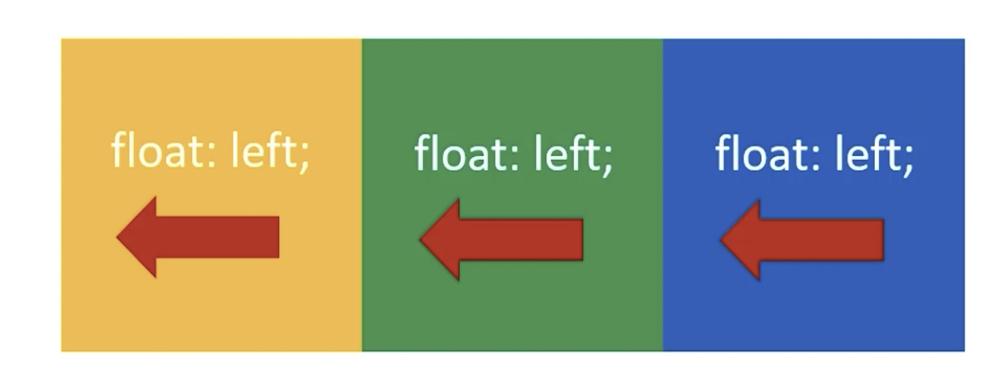

1.2 使用

1. 要浮动，并排的盒子`都要`设置浮动。
2. `父盒子要有足够的宽度`，否则子盒子会掉下去。

举例：
```html
<!DOCTYPE html>
<html lang="en">
  <head>
    <meta charset="UTF-8" />
    <meta name="viewport" content="width=device-width, initial-scale=1.0" />
    <title>Document</title>
    <style>
      .box {
        width: 600px;
        height: 200px;
        border: 1px solid #000;
      }
      .box .c1 {
        width: 200px;
        height: 200px;
        background-color: orange;
      }
      .box .c2 {
        width: 200px;
        height: 200px;
        background-color: green;
      }
      .box .c3 {
        width: 200px;
        height: 200px;
        background-color: blue;
      }
    </style>
  </head>
  <body>
    <div class="box">
      <div class="c1"></div>
      <div class="c2"></div>
      <div class="c3"></div>
    </div>
  </body>
</html>
```

在没有设置浮动前，三个盒子会竖直显式，因为div属于块级元素，块级元素天生竖直排列。

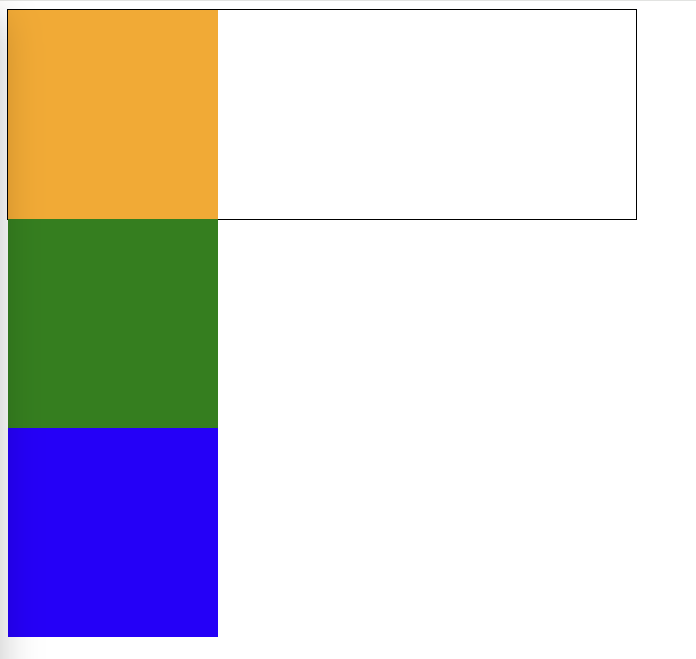


现在为三个div设置浮动属性，这样三个盒子就实现了并排显示：
```css
<style>
    .box {
    width: 600px;
    height: 200px;
    border: 1px solid #000;
    }
    .box .c1 {
    width: 200px;
    height: 200px;
    background-color: orange;
    float: left;
    }
    .box .c2 {
    width: 200px;
    height: 200px;
    background-color: green;
    float: left;
    }
    .box .c3 {
    width: 200px;
    height: 200px;
    background-color: blue;
    float: left;
    }
</style>
```
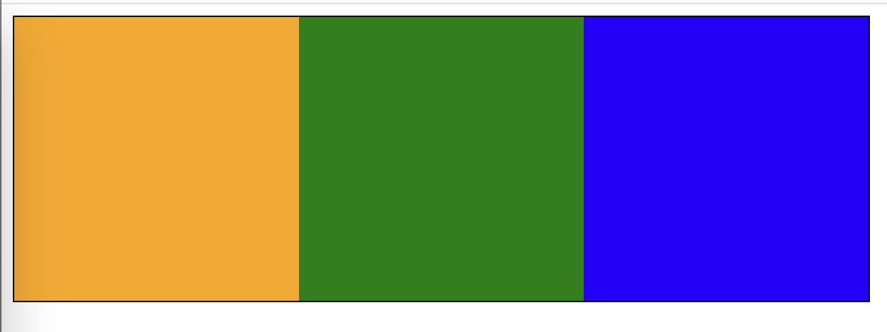

根据使用浮动使用的两个要点。如果并没有全部设置，比如只设置第一个，第二、三没有设置，就会出现类似下面现象：
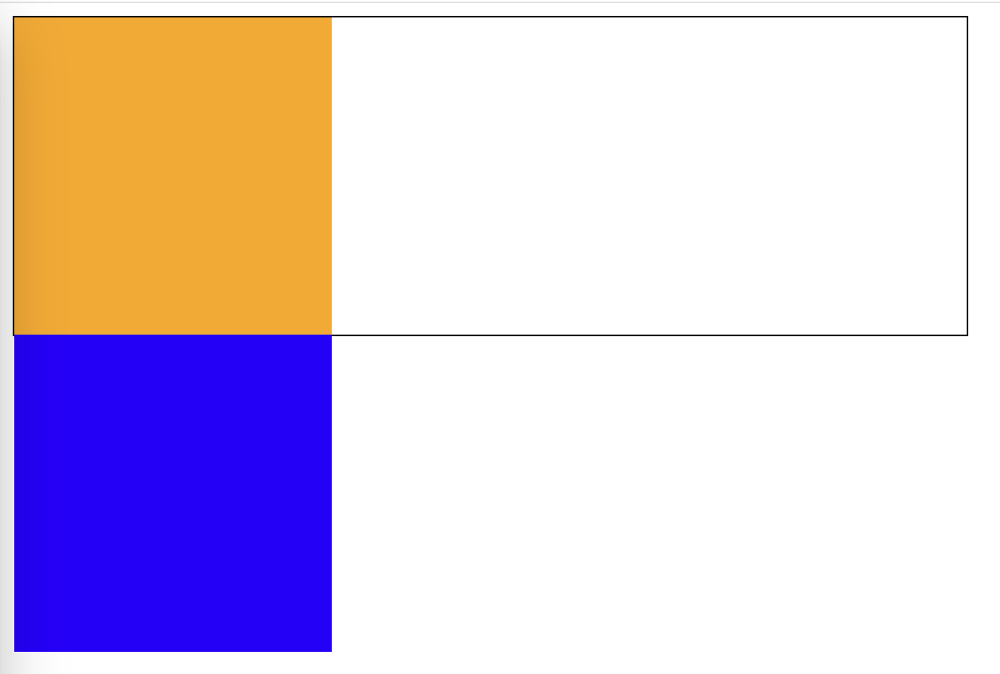

如果父盒子没有足够宽度，比如将.box的width改为599px，就会看到下面一个盒子掉下去的现象：
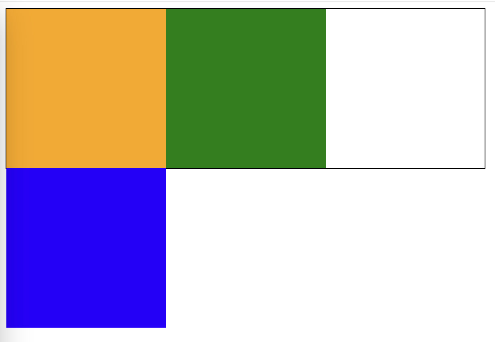

大一点没有关系，现象如下：
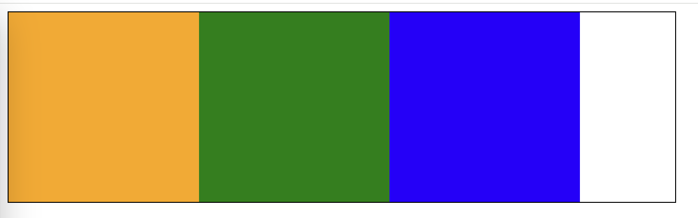


1.3 顺序贴靠特性

**子盒子会按顺序进行贴靠，如果没有足够空间，则会寻找在前一个兄弟元素。**

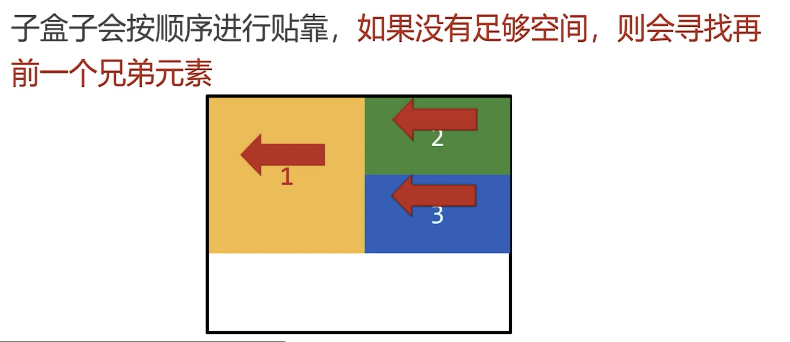

```html
<!DOCTYPE html>
<html lang="en">
  <head>
    <meta charset="UTF-8" />
    <meta name="viewport" content="width=device-width, initial-scale=1.0" />
    <title>Document</title>
    <style>
      .box {
        width: 250px;
        height: 100px;
        border: 1px solid #000;
      }
      .box .c1 {
        width: 150px;
        height: 100px;
        background-color: orange;
        float: left;
      }
      .box .c2 {
        width: 100px;;
        height: 50px;
        background-color: green;
        float: left;
      }
      .box .c3 {
        width: 100px;
        height: 50px;
        background-color: blue;
        float: left;
      }
    </style>
  </head>
  <body>
    <div class="box">
      <div class="c1"></div>
      <div class="c2"></div>
      <div class="c3"></div>
    </div>
  </body>
</html>

```

**浮动的元素一定能设置宽高**

浮动的元素不再区分块级元素、行内元素，已经脱离了标准文档流，一律能够设置宽高，即使它是 span 或 a 标签等元素。

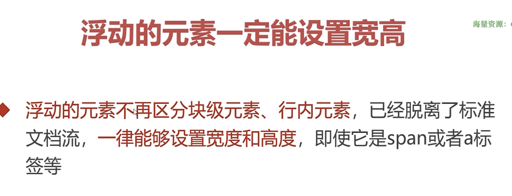

```html
<!DOCTYPE html>
<html lang="en">
  <head>
    <meta charset="UTF-8" />
    <meta name="viewport" content="width=device-width, initial-scale=1.0" />
    <title>Document</title>
    <style>
      span {
        float: left;
        width: 100px;
        height: 30px;
        background-color: orange;
        margin-right: 10px;
      }
    </style>
  </head>
  <body>
    <span>1</span>
    <span>2</span>
    <span>3</span>
    <span>4</span>
  </body>
</html>
```
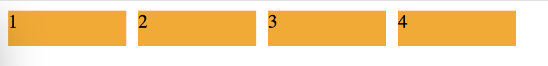

**右浮动**
float: right; 即可设置右浮动。
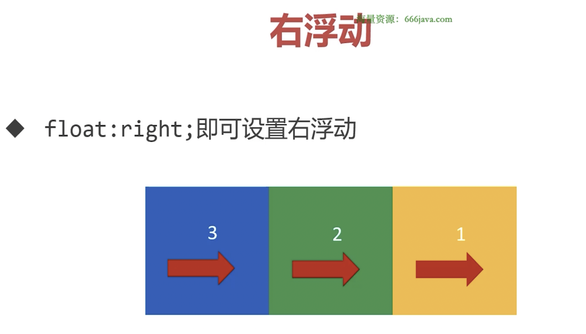
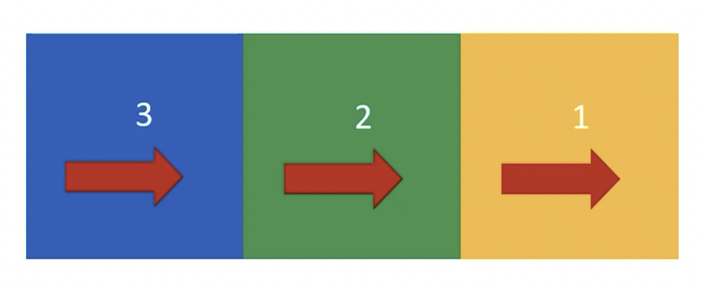

## 使用浮动实现网页布局

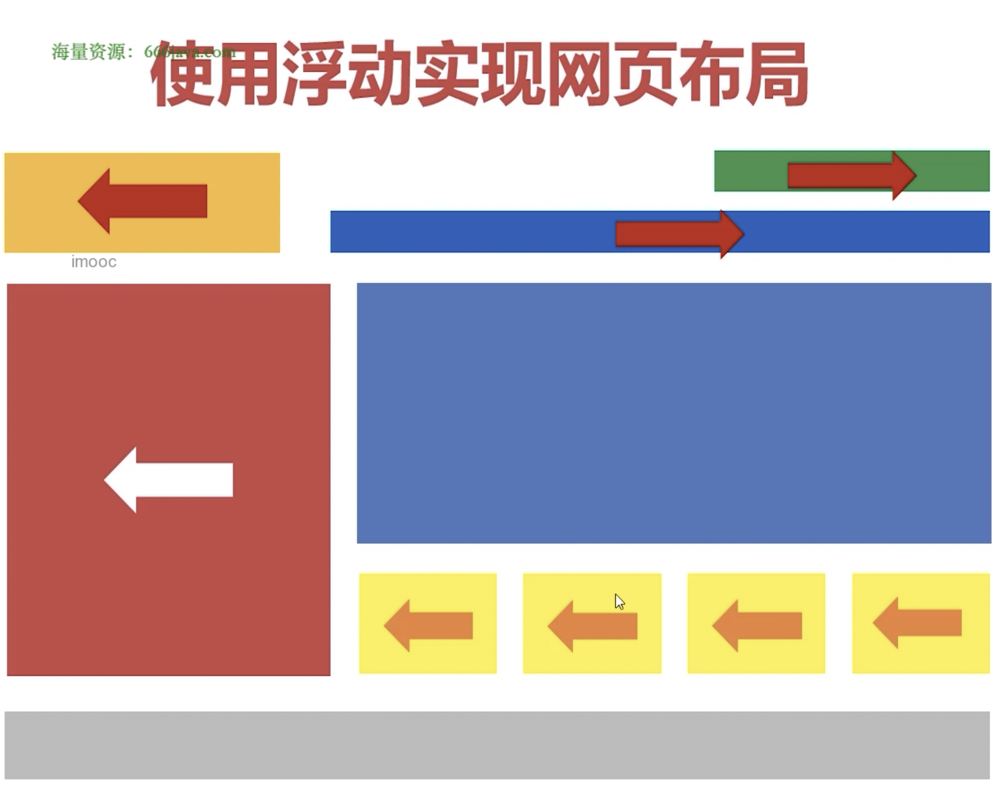

**注意**

垂直显式的盒子不要设置浮动，只有并排显示的盒子菜肴设置浮动。

“大盒子带着小盒子跑”，一个大盒子职工，又有一个小天地，内部可以继续使用浮动。

超市塑料袋3毛一个，div确是免费的，不要节约盒子。