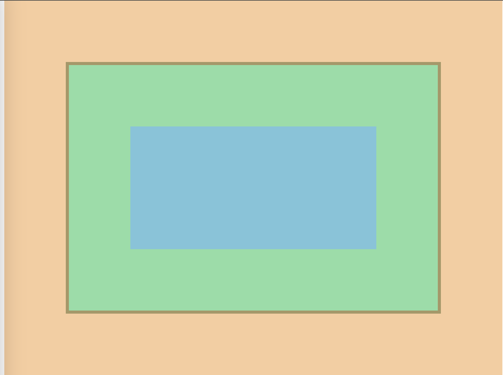

+++
title = '盒模型'
date = 2024-07-24T07:42:21+08:00
draft = true
categories = [ "Hugo" ]
tags = [ "hugo" ]
+++

## 是什么？

想象刚买的电脑包装盒，包装的是我们使用的电脑，在电脑和包装盒之间还塞了一些泡沫。

在HTML中，所有的标签都可以看成一个矩形的盒子，它由 width、height、padding、border 构成，这就成为“盒模型”。

盒子模型由以下几部分构成：

* Content box: 内容区域，如下图蓝色区域。
* Padding box: 内边距，内容区域的外围区域，如下图绿色区域。
* Border box: 边框，包裹内容和内边距，如下图黄色区域。
* Margin box: 外边距，是盒子和其他元素之间的空白区域，如下图橙色部分。

// TODO 插图图片


## 标准盒模型

标准盒模型就是：当我们设置 width 和 height 时，实际上设置的只是 content box 的宽高。而整个盒子的宽/高 = content + padding + border。margin不计入实际大小（margin只是影响盒子的外部空间，盒子的真实范围是到边框为止的）

```html
<!DOCTYPE html>
<html lang="en">
<head>
    <meta charset="UTF-8">
    <title>Title</title>
    <style>
        #container {
            height: 200px;
            width: 400px;
            padding: 100px;
            margin: 100px;
            border: 5px solid;
            background-color: aquamarine;
        }
    </style>
</head>
<body>
<div id="container"></div>
</body>
</html>
```




将 “container” 所在 “div” 看做一个盒子，如中蓝色区域，表示的盒子模型中的“Content”，它的长宽为 400 * 200。

padding 为内边距，即途中的绿色部分，它的上下左右内边距都是100px。

绿色外围有一圈棕色边框就是 border 部分。

border 外围一圈肉色部分就是外边距。

盒子宽度：400 + 100*2（左右padding）+ 5*2（左右border） = 610

盒子高度：200 + 100*2（上下padding） + 5*2（上下border）= 410

background-color 作用范围：content + padding + border

当border设置了颜色是，则以border设置的颜色为准，若 border 没有设置颜色，则background-color将会填充border。

padding 表示内边距，也就是 border 与 content 之间的边距。

margin 表示外边距，也就是 border 以外的边距，可以理解为盒子与其他盒子元素的边距。

## 盒模型计算

**盒模型计算的本质上就是空间分配。网页设计就是盒模型的计算，盒子越套越小。**


## box-sizing

将盒子添加了 `box-sizing: border-box;` 之后，盒子的 width、height 数字就表示盒子实际占有的宽高（不含margin）了，即`padding、border 变为“内缩”的，不再“外扩”`。

```css
.box {
    box-sizing: border-box;
    width: 200px;
    height: 200px;
    border: 1px solice #000;
    padding: 10px;
}
```

在未添加box-sizing之前，盒子的实际宽高为240px，但是在添加了 box-sizing 属性之后盒子内容实际宽高将变为160px。


box-sizing 属性大量应用于移动网络中，因为它结合百分比布局，弹性布局等非常好用，在PC页面开发中使用较少。

## display 属性


## 元素的隐藏

使用 `display: none;` 可以将元素隐藏，元素将彻底放弃位置，如同没有写他的标签一样。

使用 `visibility: hidden;` 也可以将元素隐藏，但是元素不放弃自己的位置。