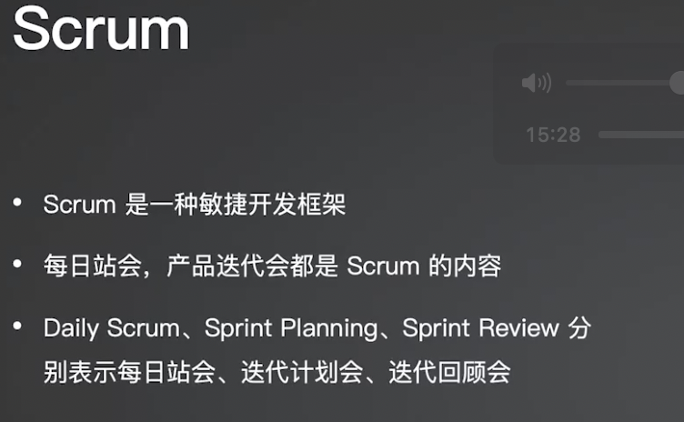

+++
title = '云原生基础'
date = 2024-10-13T09:59:17+08:00
draft = true
+++

# 软件工程发展历史

## 精益（LEAN）

现代的工艺已经发展了几百年了，之所以能购买到标砖的工艺化产品，其背后离不开“精益”的知道思想。

**关键词**

戴明、组织管理、14条基本原则、工业生产、指导思想

**联想**

**整理归纳**

有位叫戴明的博士，他是精益的关键奠基人，他提出了组织管理的14条基本原则，并最早应用于工业生产领域，比如著名的摩托罗拉、丰田等大公司均有使用，它的指导思想就是用最少的时间和资源消耗生产出高质量的产品。

**关联**

以生产汽车为例，汽车的作用就是为用户提供价值。接下来就是利用精益思想来管理价值流

具体到软件工程，其实和汽车这一工业化产品生产过程类似。也是在强调使用最少的时间的时间和资源消耗生产出高质量的产品。围绕这一目标去设计整个工作流。这是制造业为软件工程带来的启发。

## 早期的软件工程

尝试自己设计指导思想来知道软件生产过程。在较早很长一段时间里主要是采用瀑布模式来开发软件。

## 敏捷开发模式

## 瀑布模式 VS 敏捷模式

## 敏捷项目管理

真实案例：

# 什么是AIOps
# 大模型和AIOps
# 云原生和AIOps
# AIOps算法和应用案例
