+++
title = '操作系统概述'
date = 2024-08-15T08:07:56+08:00
draft = true
categories = [ "OS" ]
tags = [ "OS" ]
+++

## 身边的操作系统

对于手头有点闲钱的人可能会选择苹果的设备，苹果的电脑使用的是MacOS，苹果的手机用户使用的系统就是iOS
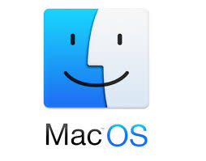

对于大多数人可能还是选择“巨硬”家的 Windows 系统。
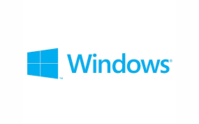

另外还有一些专业的人士，可能会使用 Linux 操作系统
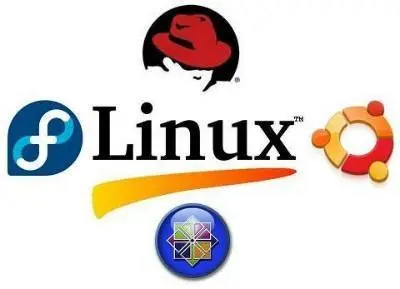

还有一些“爱国”人士比较热衷于鸿蒙操作系统

可能还有一些野人在使用塞班系统。

在学习操作系统之前其实操作系统已经充满了我们的日常。所以在接下来的学习中可以借助平时我们使用的操作系统来帮忙我们深入了解操作系统。

## 操作系统概念、功能和目标

* 操作系统的概念（定义）主要是回答“什么是操作系统”这一问题
* 操作系统的功能和目标主要是回答“操作系统要做什么”这一问题

### 概念（定义）

在给出定义之前先结合生活经验了解下操作系统在计算机体系中所处的位置和角色。

> 用自己的语言描述我们手上的电脑是如何一步一步演变成现在使用的样子的。

1. 厂家组装裸机，这一阶段首先商家会将主机、内存、CPU、硬盘等硬件进行组装成裸机，裸机是指只包含硬件不包含操作系统的机器。
2. 出售之前安装操作系统；
3. 用户安装应用程序（eg: 英雄联盟）；
4. 用户使用应用程序（eg: 无兄弟不联盟）。

结合生活经验以及上面图片，可以大概了解到计算机的层次结构，最底层的就是硬件（裸机），在裸机之上会安装操作系统，然后在操作系统之上再安装一系列应用软件，用户处于最上面一层。

注意：上图中用户和操作系统会有一些相连的部分，应用程序和操作系统也有一些相连的部分。

大概了解到操作系统的位置之后接着看给出的操作系统定义。

定义：

`操作系统`（Operating System， OS）是指控制和 `管理` 整个计算机系统的 `硬件和软件` 资源，并合理地组织调度计算机的工作和资源的分配；以 `提供给用户和其他软件方便的接口和环境`；它是计算机系统中最基本的 `系统软件`。

从定义可以我们可以得到以下几个信息：

1. 操作系统是系统资源的管理者
2. 向上层提供方便易用的服务
3. 最接近硬件的一层软件

#### 操作系统是系统资源的管理者

如果是 Windows 操作系统，可以打开 “任务管理器”，（快捷键：Ctrl + Alt + Del）。

如果是 Mac 操作系统，可以打开 “Monitor”，我这里以 MacOS 操作系统为例：

在 Monitor 页面中，我们可以看到系统中当前正在运行的进程有哪些：
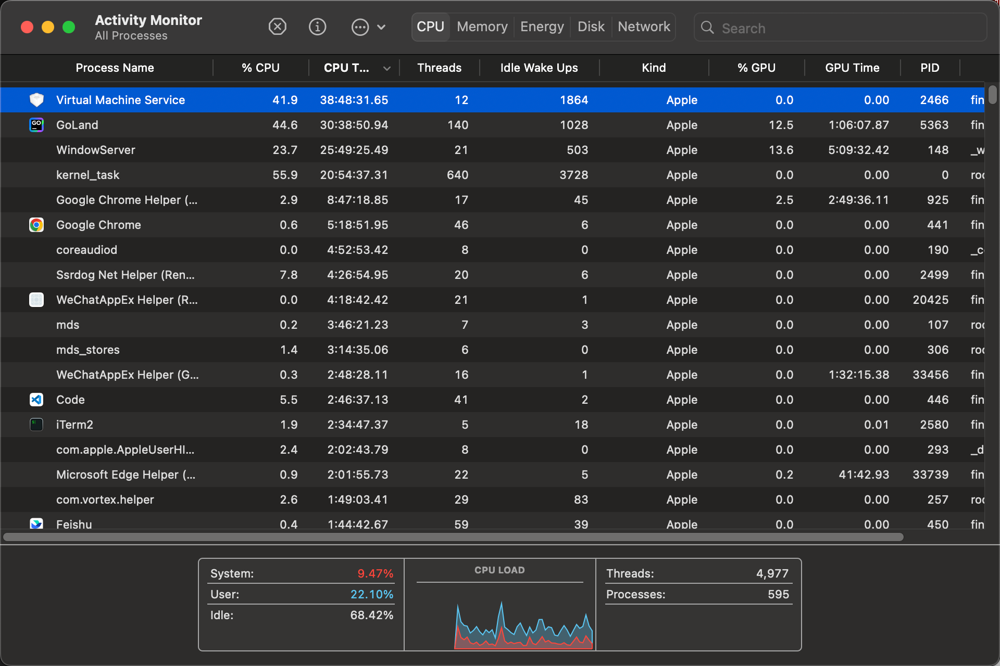

可以看到第一列“Process Name” 表示的当前系统中的进程，它对应的就是一个个应用程序软件，比如 Chrome 浏览器、QQ等软件。由此可见操作系统肯定是在对这些应用程序软件进行管理。

再看顶部，可以看到有 CPU、Memory、Disk 等一些硬件资源的使用情况，比如QQ目前使用了126.6MB字节的内存空间。由此可见操作系统也在管理者各类硬件资源。

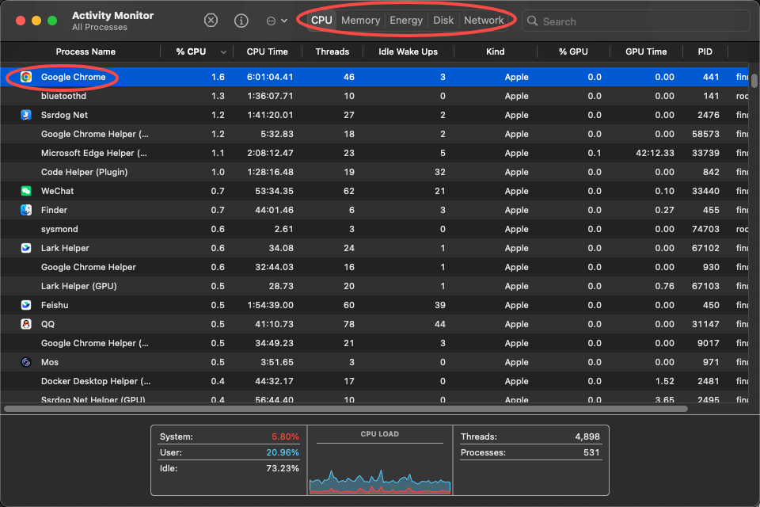
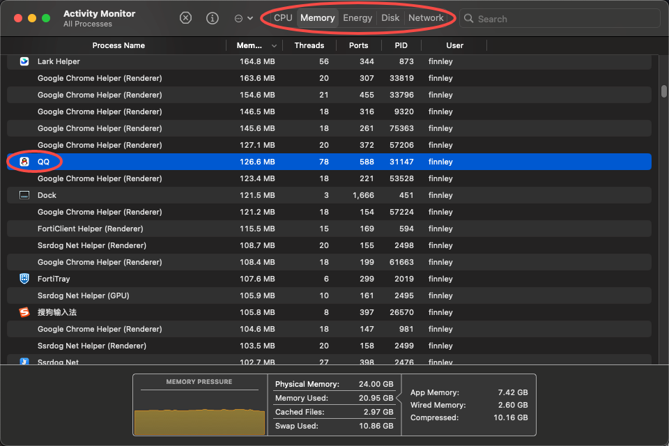

因这个例子可以看出，操作系统作为硬件和软件的中间层次，它是系统资源的管理者，既管理了硬件资源，也管理软件资源。

接着再看一个例子：使用音乐软件听音乐的过程

1. 找到应用程序所在目录
2. 打开应用程序
3. 应用程序运行
4. 播放音乐

首先在各个文件夹中找到 网易云音乐 的安装位置，如“Machintosh HD > Applications > NetEaseMusic.app > Contents > MacOS > NeteaseMusic”

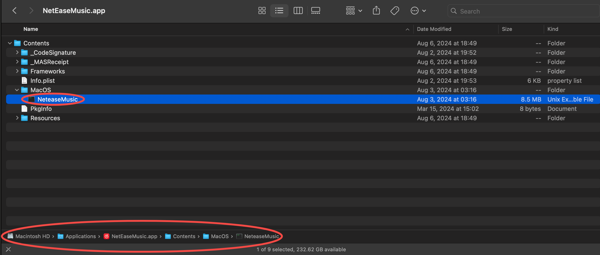

在这一步中会通过一层一层文件夹找到应用程序的位置，除了网易云音乐这个应用程序外，系统中还有其他各种各样的应用程序，如QQ，Chrome等。
这些文件的组织和管理其实就是操作系统在帮我们完成。所以这里操作系统作为系统资源管理者所提供的功能之一—— 文件管理

当我们点击打开应用程序之后，程序就会正常运行，这里补充一个知识，就是在执行一个程序前需要将程序和数据放到内存中，才会被CPU处理，这里在打开网易云这个软件的时候，其背后操作系统帮我们做了一个很重要的事情，就是将该软件和数据从磁盘加载到内存中，并且程序和数据会放在内存中的什么位置，这些都是由操作系统完成的。所以这里就是操作系统提供的第二个功能——存储器管理

网易云运行过程中，其对应的进程是会被处理机（CPU）来处理的，而什么时候给网易云音乐这一软件分配CPU处理机资源，这一操作也是操作系统替我们完成的。这也是操作系统的提供的功能之一——处理机管理 

我们通过网易云软件来播放音乐，在播放音乐的过程中会将声音的输出音频设备分配给网易云软件，由操作系统来决定分配哪个设备给哪个软件使用，因此想音频设备这类资源也是由操作系统来进行管理。这也是操作提供的又一功能——设备管理

#### 向上层提供方便易用的服务

操作系统的上层是谁？上层是指应用程序和用户

到这里应该都了解了计算机的最底层其实就是纯硬件，而这些底层的硬件只能理解二进制指令，如：010101111011101010101011101，也就是说硬件对外暴露了“丑陋”、不友好的交互接口

如果在硬件之上如果安装了操作系统，就会向它的上层提供更美丽、友好的交互接口

安装了操作系统之后，用户和应用程序就不需要直接和操作系统打交道，只需要告诉操作系统我们需要的服务即可，操作系统会将用户的命令需求翻译成二进制来告诉硬件由硬件来执行我们想要的操作。

这其实是个很典型的封装思想

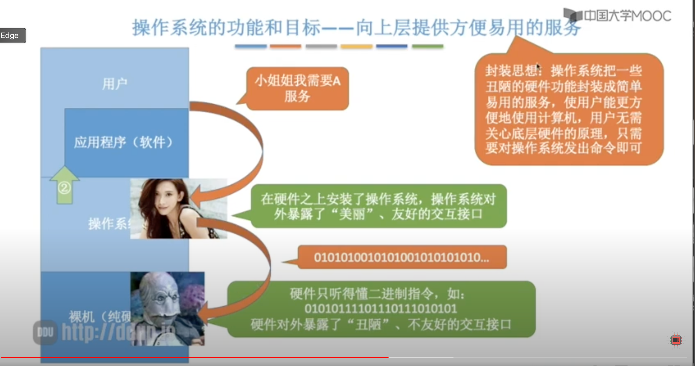
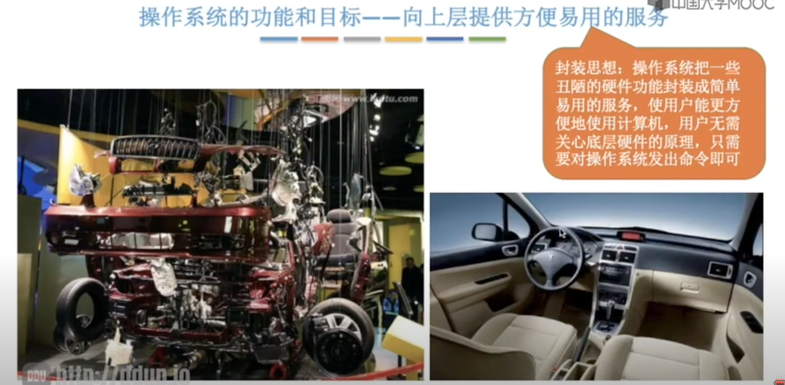

类似汽车里面包含了很多很复杂的构建，但是汽车工程师将底层复杂的构件进行了隐藏，最终展示给用户就是我们看到的汽车，比如对用户则是暴露出了方向盘，刹车，油门等简单易用的接口，用户不需要理解底层是如何加速、减速这些功能的。

接着看操作系统屏蔽了底层硬件细节之后，它又提供了哪些方便易用的服务呢？
1. GUI：图形化用户接口（Graphical User Interface）
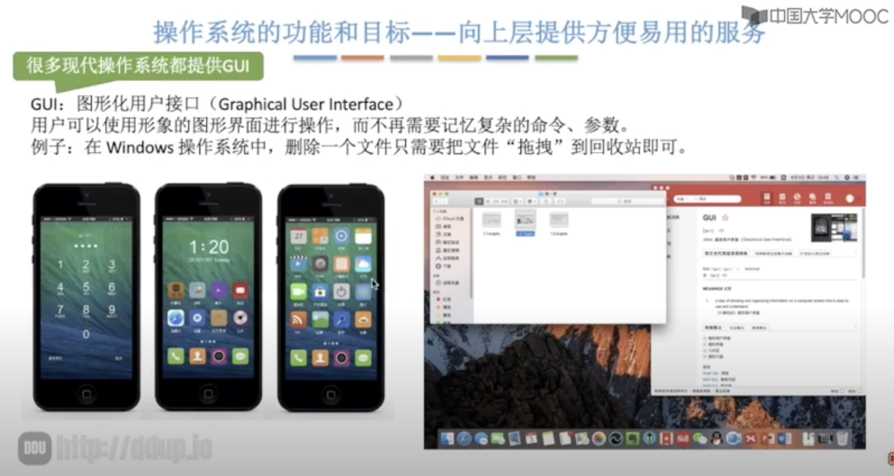

比如用户要删除文件，只需要将文件拖至垃圾篓中

2. 联机命令接口

联机命令接口 = 交互式命令接口

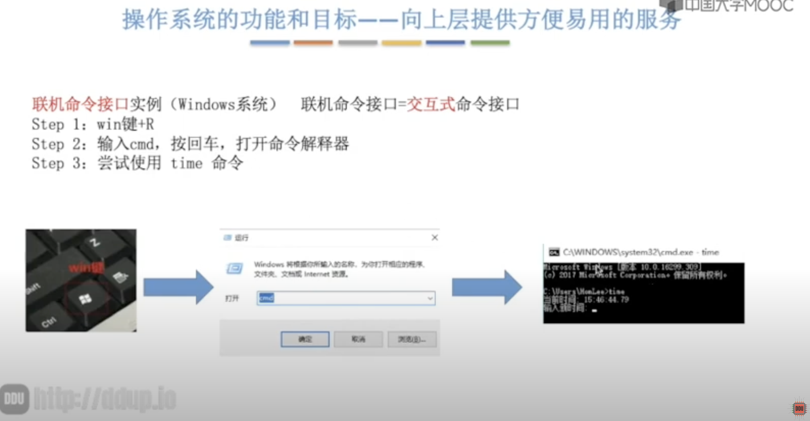
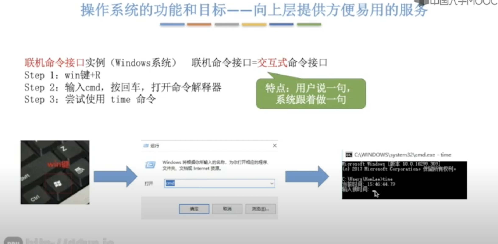

3. 脱机命令接口

脱机命令接口 = 批处理命令接口

比如 shell 脚本

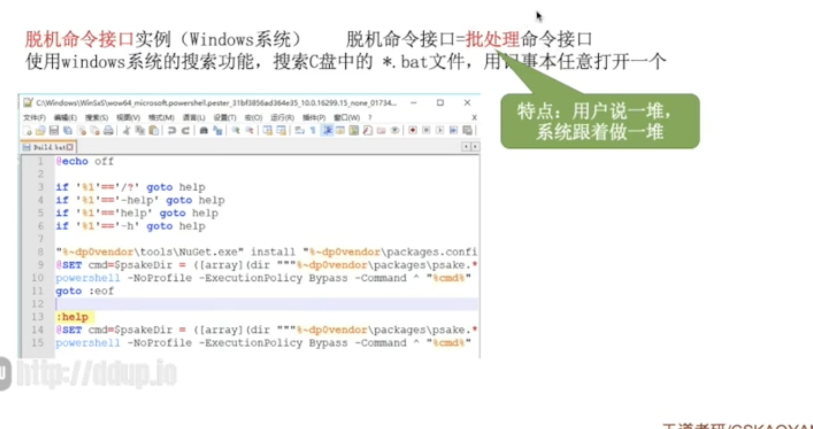

4. 程序接口：可以在程序中进行系统调用来使用程序接口，普通用户不能直接使用程序接口，只能通过程序代码间接使用

如：
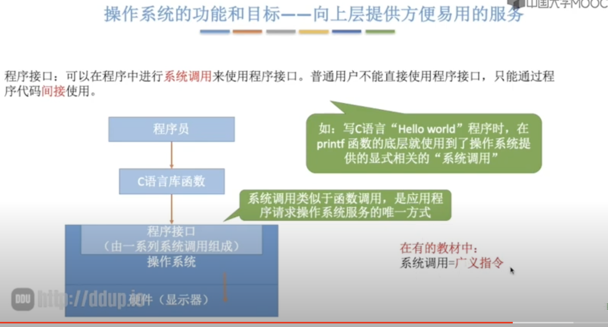

> 总结
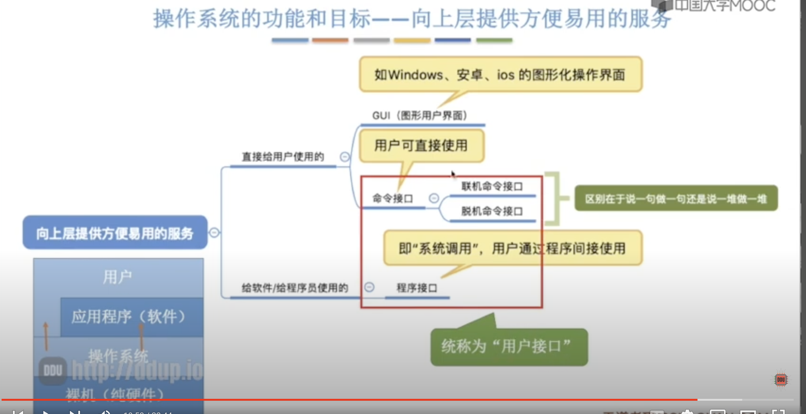

#### 最接近硬件的一层软件

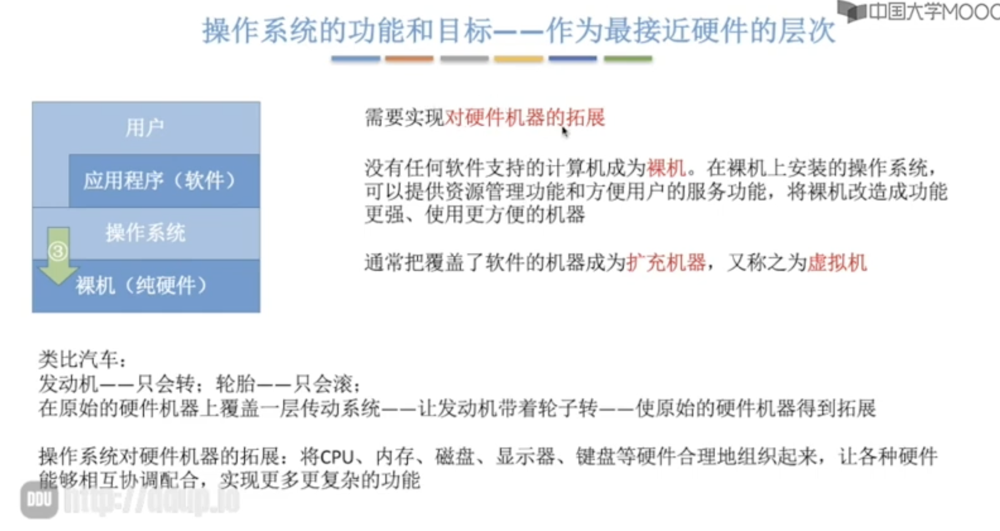

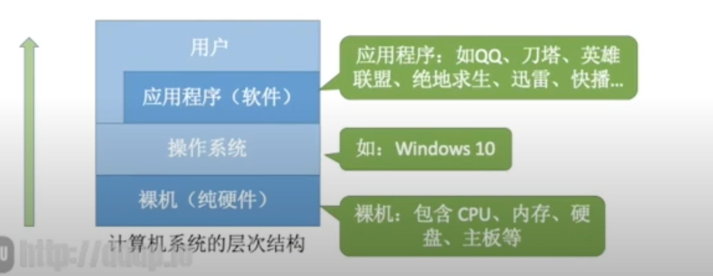

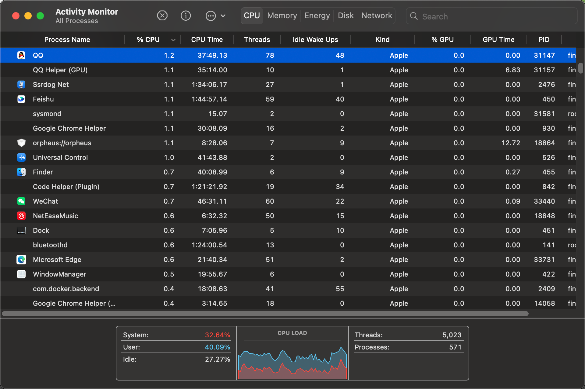

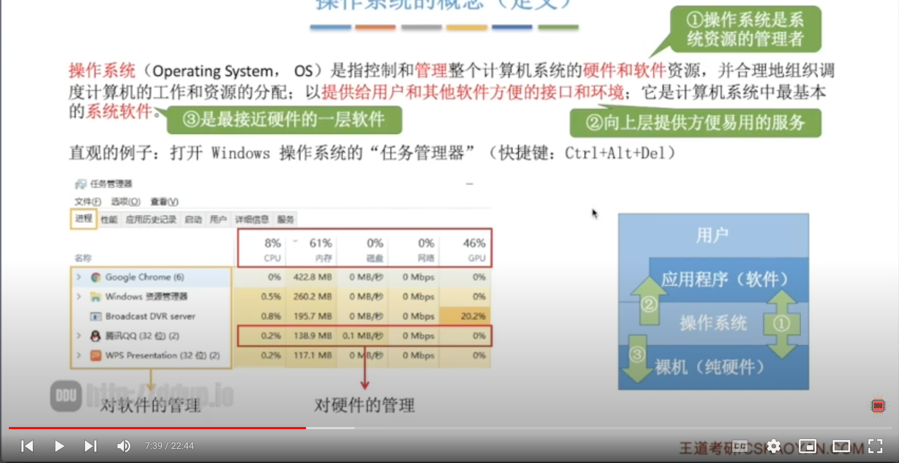

### 总结
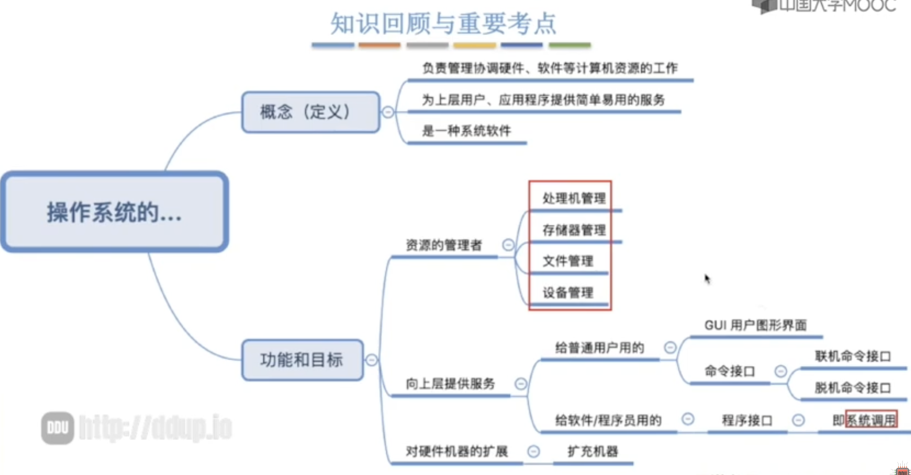

