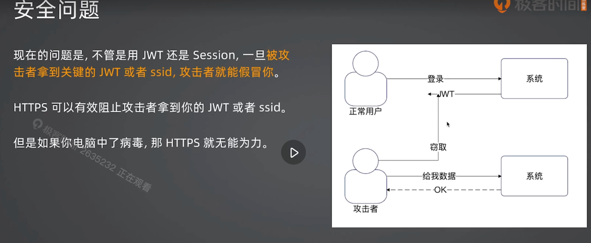
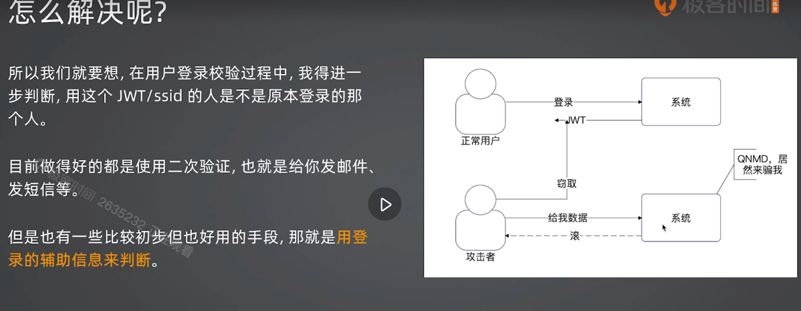
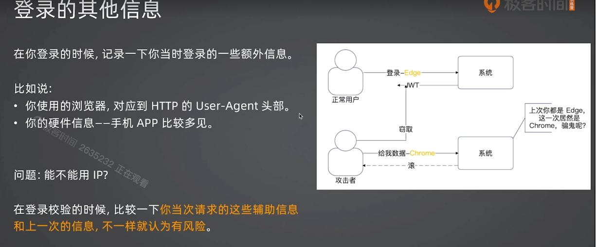
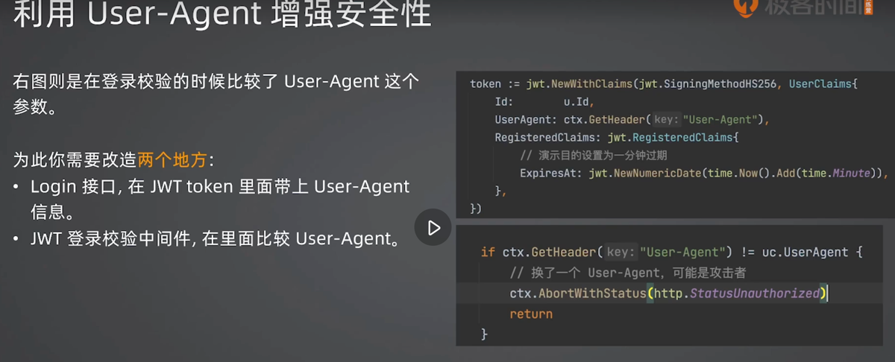

+++
title = '增强系统登录安全'
date = 2025-08-22T16:55:42+08:00
draft = false
categories = [ "System Design" ]
tags = [ "System Design" ]
+++

## 安全问题

## 如何解决

如何解决呢？首先需要想到的当攻击者拿着JWT来访问的时候，系统能否识别出来，如果能识别出来就可以有效的避免。

一种方法就是二次验证，当攻击者拿着token来访问的时候，如果系统怀疑token不是你的，可以要求发送邮件或短信之类的验证。正常使用中，一些比较高危或敏感的操作都会要求做二次验证。

对于简单的小型应用，可以使用登录的辅助信息来判断。

比如当时使用的 Edge 浏览器登录的，之后用户携的token又跑到Chrome浏览器登录了，此时系统就认为token可能泄露了。 

在浏览中可以使用 User-Agent 来判断，在手机App上可以根据硬件信息来判断。

那是否可以根据IP来判断呢，如果IP变了，就要求用户重新登录？
不能，因为IP会变，特别是移动网络。

