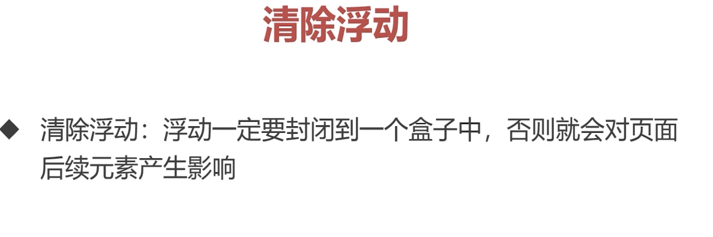
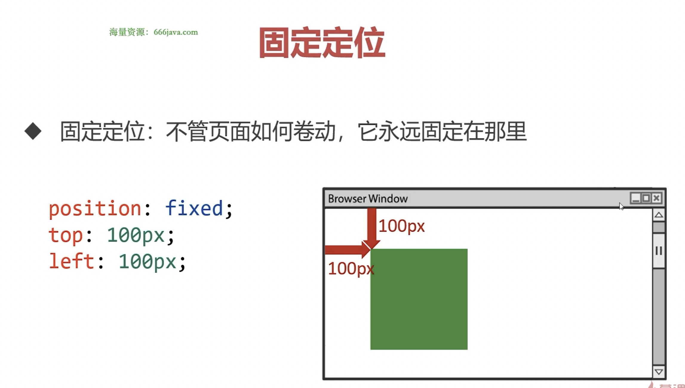
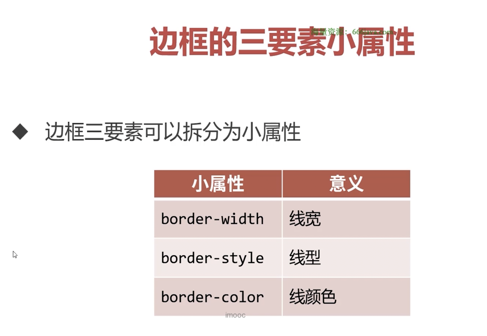

+++
title = 'CSS3浮动与定位'
date = 2024-11-25T19:02:29+08:00
draft = true
categories = [ "CSS" ]
tags = [ "css" ]
+++

## 浮动

### 浮动的基本概念


 


### 使用浮动实现网页布局


### BFC规范和浏览器差异


代码：
```html
<!DOCTYPE html>
<html lang="en">
<head>
    <meta charset="UTF-8">
    <meta name="viewport" content="width=device-width, initial-scale=1.0">
    <title>Document</title>
    <style>
        .box{
            width: 400px;
            /* 注意这里没有设置 height，再给两个子盒子设置浮动之后，父盒子变形了 */
            border: 10px solid #000;
        }

        .box .c1 {
            width: 200px;
            height: 200px;
            background-color: orange;
            float: left;
        }

        .box .c2 {
            width: 200px;
            height: 200px;
            background-color: blue;
            float: left;
        }
    </style>
</head>
<body>
    <div class="box">
        <div class="c1"></div>
        <div class="c2"></div>
    </div>
</body>
</html>
```

预览：


原因是父盒子没有形成BFC。


### 清除浮动



代码：
```html
<!DOCTYPE html>
<html lang="en">
<head>
    <meta charset="UTF-8">
    <meta name="viewport" content="width=device-width, initial-scale=1.0">
    <title>Document</title>
    <style>
        p{
            float:left;
            width: 100px;
            height: 100px;
            margin-right: 20px;
            background-color: orange;
        }
    </style>
</head>
<body>
    <div>
        <p></p>
        <p></p>
    </div>
    <div>
        <p></p>
        <p></p>
    </div>
</body>
</html>
```

预览：


实际效果显示在了一行上，原因是div没有设置任何的宽度和高度，没有形成BFC，也就没有出现预期的两行，所以后面的div也堆上去了。

这也就是没有清除浮动。

一种方式是给div设置高度，但有可能盒子的高度是动态的，我们不确定盒子有多高，比如用户的帖子，留言等，所以这时为盒子设置高度并不是很好的方式。


## 定位

### 相对定位


用途


### 绝对定位


**绝对定位的盒子垂直居中**


**堆叠顺序 z-index 属性**


**绝对定位的元素可以设置宽度和高度**


### 固定定位




## 边框

### 边框的三要素

**border**





### 四个方向的边框


## 圆角


## 盒子阴影


