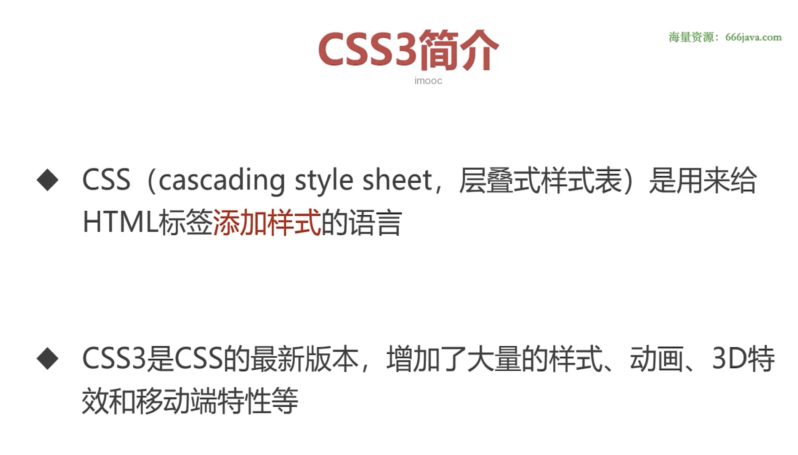
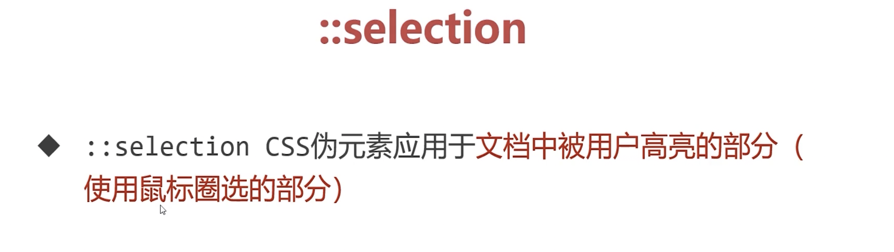

+++
title = 'CSS基础与盒模型'
date = 2024-11-25T11:49:06+08:00
draft = true
categories = [ "CSS" ]
tags = [ "css" ]
+++

## CSS 简介




### CSS3书写位置


### CSS3基本语法


## 选择器

### 标签选择器


### id选择器

**id属性**


### class选择器


**原子类**


### 复合选择器


**后代选择器**


**交集选择器**


**并集选择器**


### 伪类


### 元素关系选择器


### 序号选择器


**:first-child**


**:last-child**


**:nth-child(?)**


**:nth-of-type(?)**


这里没有任何一个p被选中，它是失效的。

想要被选中需要使用下面用法：


### 属性选择器


### CSS3新增伪类


### 伪元素





### 层叠性和选择器权重计算


## 文本与字体属性 

### 常用文本样式属性

**color**


**font-size**


**font-weight**


**font-style**


**text-decoration**


### 字体属性


### 段落和行属性


**单行文本垂直居中**


**font合写属性**


 
### 继承性


## 盒模型

### 盒模型基本概念

**认识盒模型**


整个网页就可以看成是很多盒模型构成的


代码:
```html
<!DOCTYPE html>
<html lang="en">
<head>
    <meta charset="UTF-8">
    <meta name="viewport" content="width=device-width, initial-scale=1.0">
    <title>Document</title>
    <style>
        .box1 {
            /* 宽度，快捷键 w200 */
            width: 200px;
            /* 高度，快捷键 h200 */
            height: 200px;
            /* 背景颜色，快捷键 bgc */
            background-color: gold;
            /* 边框，快捷键 bd */
            border: 10px solid red;
            /* 内边距 */
            padding: 10px;
        }
    </style>
</head>
<body>
    <div class="box1">
        文字文字文字文字文字文字文字文字文字文字文字文字文字文字文字文字文字文字文字文字文字文字文字文字文字文字文字文
    </div>                             
</body>
</html>
```
预览：


**width和height属性**


**padding**


**margin**


**盒模型计算**


**box-sizing**


### 行内元素和块级元素

**display**


**行内元素和块级元素的相互转换**


**元素的隐藏**


