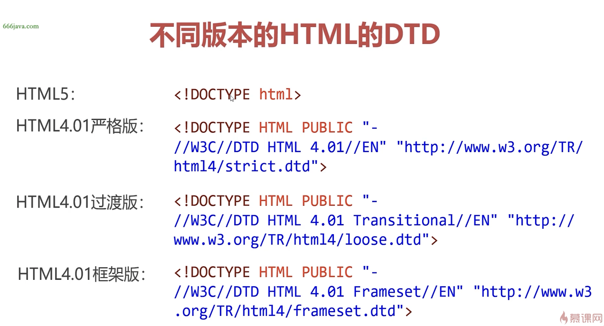
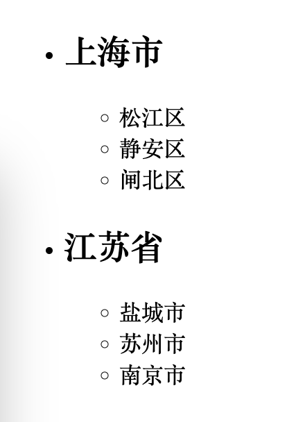
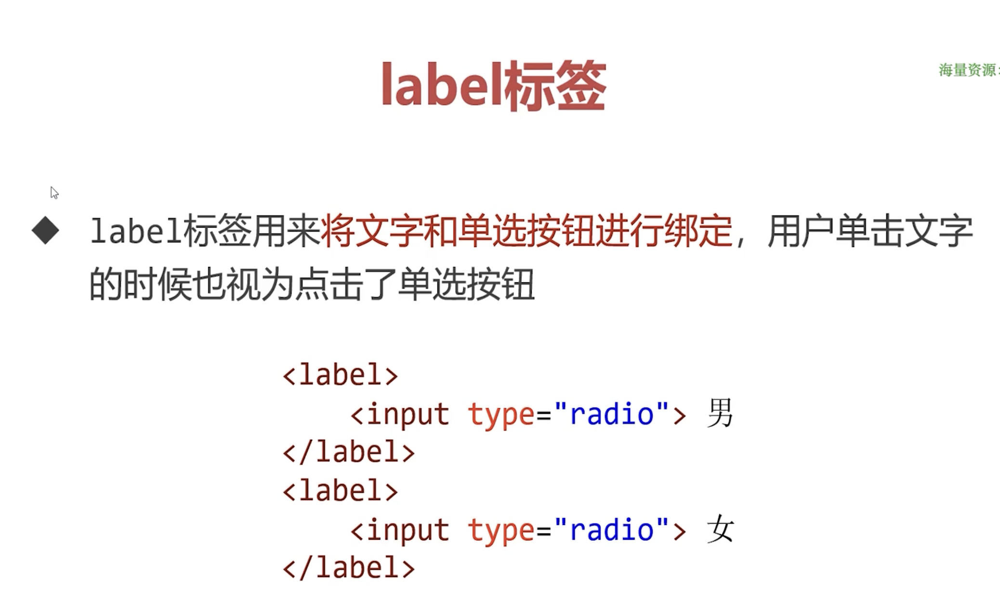
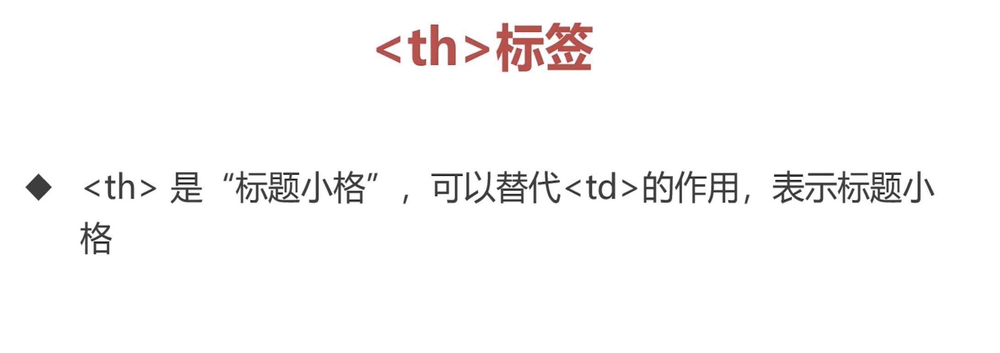

+++
title = 'HTML5语法与基础标签'
date = 2024-11-23T15:56:41+08:00
draft = true
categories = [ "HTML" ]
tags = [ "html" ]
+++

## 前置知识

### 互联网基本原理

- 在本地开发，在服务器共享


### HTTP协议


### 什么是前端、后端？

## HTML5基础入门

### 创建第一个网页


### 浏览网页的方法


### 认识HTML骨架





### 字符集


### title、关键词及页面描述


### 认识标签


## HTML5基本标签

### 标题和段落标签


### div标签


## HTML5特性


## 开发流程


## 列表标签


### 无序列表


### 有序列表


**无序列表的type属性**

> 说明：HTML5中被废弃，但是学习时可以作为了解。

* 无序列表有 type 属性，可以定义前导符号的样式，HTML5中被废弃，建议使用CSS替代

值                  | 描述               
-------             | ---
disc                | 默认值，实心圆
circle              | 空心圆
square              | 实心方块

代码1：
```html
<h1>购买商品</h1>
<ul type="circle">
    <li>牛奶</li>
    <li>面包</li>
    <li>咖啡</li>
</ul>
```
   
预览：


代码2：
```html
<h1>购买商品</h1>
<ul type="disc">
    <li>牛奶</li>
    <li>面包</li>
    <li>咖啡</li>
</ul>
```
   
预览：


代码3：
```html
<h1>购买商品</h1>
<ul type="square">
    <li>牛奶</li>
    <li>面包</li>
    <li>咖啡</li>
</ul>
```
   
预览：


### 定义列表
  


### 列表嵌套

**是什么？**
`<li></li>`标签内可以防止其他标签，包括放置 `<li></li>` 标签，这就形成了列表的嵌套。


**示例**

代码：
```html
<ul>
    <li>
        <h2>上海市</h2>
        <ul>
            <li>松江区</li>
            <li>静安区</li>
            <li>闸北区</li>
        </ul>
    </li>
    <li>
        <h2>江苏省</h2>
        <ul>
            <li>盐城市</li>
            <li>苏州市</li>
            <li>南京市</li>
        </ul>
    </li>
</ul>
```

预览：


## 多媒体与语义化标签

### 图片标签

1、使用 `` 标签在网页职工插入图片

例：

- `img` 是 image（图片）的缩写。 
- `src` 是 source（来源）的缩写
- `images/gugong.jpg` 是图片的存储目录和完整文件名。

**注意**

- 图片必须存在于项目文件夹中，一般将图片保存在项目中的 `images` 子文件夹中。
- 图片路径必须正确。
- 图片并非真正插入到网页中，只是被引入到了网页中。所以将来上传服务器时，一定要将图片一起上传到服务器。故需要将图片放在项目目录下一起整体上传。

代码：
```html
<h1>北京景点</h1>
<p></p>
<p></p>
```

预览：


2、 标签 `alt` 属性

alt 属性是 alternate “替代品”的缩写，它是对图像的文本的描述，非强制选项。其作用是当由于某种原因导致无法加载图像，页面上会显示alt属性中的描述内容。另一个作用就是供视力不方便的人在使用网页朗读器是朗读alt中的描述内容。

例：

代码：
```html
<h1>北京景点</h1>
<p></p>
<p></p>
```

预览：


3、 标签 width、height 属性

width、height 可分别设置图片的宽度和高度，单位为像素，可省略。

例：

- 这里只设置width属性，没有设置 height 属性，如果省略了其中一个，则会按原始比例缩放图片。

4、网页支持的图片格式


5、相对路径和绝对路径


### 超链接 


使用 <a> 标签制作超级链接

例：<a href="2.html">去第二个网页</a>

- a 是 anchor（锚）的首字母。
- href 是 hypertext reference 超文本引用


1、href属性支持相对路径和绝对路径


2、


3、


4、


### 页面内锚点


代码：
```bash
<h1>旅游经历</h1>
<h2>北京</h2>
<p></p>
<p></p>
<p></p>
<p></p>
<!-- 在这里添加一个id为wuxi的锚点 -->
<h2 id="wuxi">无锡</h2>
<p></p>
<p></p>
<p></p>
<p></p>
```

然后浏览想直接跳转到无锡的锚点，只需要在url后面携带上“#wuxi”即可。

还有个特殊的锚点 “#top”，可以直接回到顶部。


### 音频


### 视频


## 语义化标签


### 区块标签


### 语义化标签


## 表单标签


 
### 表单的创建


### 基本控件

**单行文本框**


**单选按钮**





**复选框**


**密码框**


**下拉菜单**


**多行文本框**


**三种按钮**


**小结**


### HTML5新增表单控件


## 表格标签

### 认识表格


### 表格标签





### 单元格合并


### 表格其他特性 


