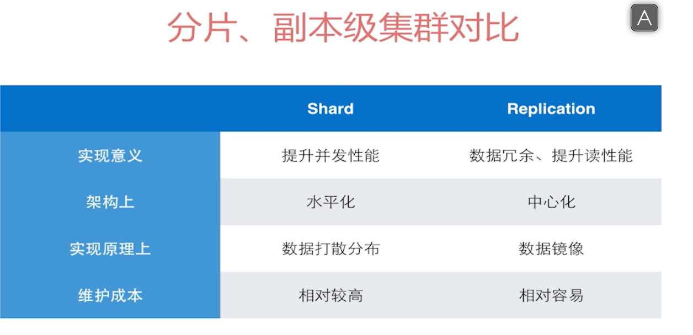
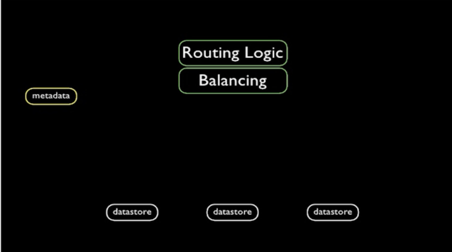
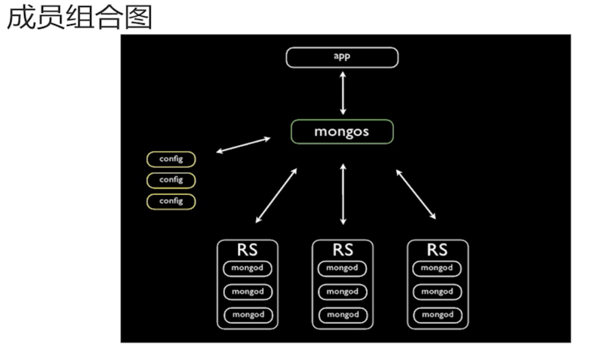

+++
title = 'MongoDB分片'
date = 2024-05-23T17:02:39+08:00
draft = true
categories = [ "MongoDB" ]
tags = [ "mongodb" ]
+++

## 分片

### 什么是分片

就是将数据拆分，水平分散到不同的服务器上。


简单点讲就是把整个数据库中的数据分成一个一个子集，把每个子集存储在一个分片上，这个过程就叫分片（动词），每个子集也叫分片（名词），所有的分片合在一起就构成了分片集群，所有这些分片上的数据加载一起才是数据库完整的数据。

每个数据库分片是可以跑在独立的服务器上的，也就是可以把原本只能存储在同一个服务器上的数据分布式的存储在多台服务器上，然后多台服务器构成完整的数据库服务。

### 为什么要分片

* 架构上：读写均衡，去中心化，避免过度依赖主节点进行写入
* 结构上：12节点（version<=2.6）
* 硬件上：内存、硬盘容量存在限制

todo: 这一块需要重新整理


### 使用场景

* 硬件、部署瓶颈

比如遇到单机硬盘、内存容量存在限制

* MongoDB 性能瓶颈

比如 page faults 较大，lock 锁表情况严重


### 分片目的

为了可以改善单台机器数据的存储以及数据吞吐性能，提高在大量数据下的随机访问性能。

### 分片 VS 副本集

MongoDB 有以下结构：
主从（master/slave）
副本集（基于主从演变而来，加入了仲裁选举机制）
分片集群



## 构成

### 成员节点以及作用

#### Shard 节点

存储数据的节点（单个 mongod 进程或者一个副本集）。

#### Config Server

config server(配置服务器)，存储元数据的节点，为 mongos 提供服务，将数据路由到 Shard。

#### Mongos

接收前端请求，对应前端请求消息进行消息路由，最终走向shard节点。


### 节点关系





首先 app 通过连接 mongos，mongos 连接 config server 获取元数据，然后将消息路由到RS，RS 就是 shard 节点，RS 里面不熟的副本集。


### 成员节点启动参数

#### Shard 节点：

mongod --shardsvr

mongod --shardsvr --repelSet 副本集

#### Config Server

mongod --configsvr

#### mongos

mongos --configdb <configdb server>


## 搭建

准备三台机器
233. 232

先启动shard节点：
```bash
mongod --shardsvr --logpath=/opt/data/logs/shard.log --
```

====

类似路由的概念，既然每个分片上保存的整个数据库数据的子集，当用户读取数据的时候，用户怎么知道数据是保存在哪个分片上呢？此时不好将用户请求发送到某一个分片上，就会要求用户将请求发送至 mongos 上，然后mongos 向配置服务器获取整个分片的元数据信息，从而知道各个分片上存储了哪些数据，在知道这些信息之后mongos就会将请求发送到相关分片上。

分片也会和配置服务器通信，分片的文档不是一成不变的，文档有时候可能出现从某个分片迁移到另一个分片。 

mongos 作为用户请求的路由，通常会部署在应用服务器上，但这种并不是必须得。


#### 分片

既然是分片集群，那么至少会有两个分片


配置服务器上通常保存的分片集群的元数据以及相关配置信息。

元数据比如保存在分片上的数据是哪些，即每个分片上保存数据的范围；或者整个集群中有多少个分片。


MongoDB 数据库分片技术解决的 dMongoDB 的另一个问题 ———— 数据的可扩展性。

数据库服务器会收到外部用户发来的各种请求（读写），当这些请求越来越多时，数据库服务器本身就会受到很大压力。当数据请求急剧增多时，比如数据库的CPU都会收到很大压力；当数据库中存储的数据越来越多时，数据库服务器I/O也会收到很大压力。

当请求越来越多时，为了不影响请求的响应程度以及服务本身的可靠性，我们通常会想到扩展服务。


常见的扩展方式分为纵向扩展和横向扩展

### 纵向扩展

* 增加单一服务器性能，比如增加CPU、内存等
* 简单架构和运维模型
 
这种扩展优点通常不会增加架构的复杂程度。缺陷就是单一服务器的性能仍然存在上限。

### 横向扩展

* 增加提供服务的服务器数量
* 更高的可扩展性

只要经济能够负担，基本没有上限。缺点就是增加了系统架构和运维复杂度。

MongoDB 解决数据库服务的扩展问题使用的横向扩展方法。它的解决方案就是数据库分片。


### 主分片

每个分片保存的数据库中的一部分数据，在mongodb中并不会强制要求每一个集合全部都采用分片的架构，仍然允许数据库中某些集合，它们可能么有扩展的要求，是不需要使用分片的。

所以对于mongodb中每一个数据库都存在一个被称为主分片的东西，主分片有些特殊，它保存的是数据库中所有的不使用分片的集合，这样就可以在 mongodb 中混合使用分片数据库和不分片数据库


### 分片片键
 
每个分片保存的数据库中的一部分数据，那么如何决定数据库中的每个文档应该被分配到哪个分片上呢？ 

比如集合中有如下文档：

```json
{x: 7, y: "abc", z: true}
```

可以选择某个单一的字段或者复合字段作为这个分片的片键。
假如使用x字段作为分片片键，就可以以x的取值范围来所有集合文档做分类， 将x的大范围划分为一些小范围，如：
x:min ~ x:10 => 数据库1
x:10 ~ x:20 => 数据段2
x:20 ~ x:30 => 数据段3
x:30 ~ x:40 => 数据段4
x:40 ~ x:max => 数据段5

x 字段的不同的取值会落到不同的数据段中，比如有两个不同的分片，第一个分片可以关联来个数据段，第二个分片可以关联三个数据段，那么久可以将上面不同的数据段分配到不同的分片上，并不能保证相连的数据库会分配到同一个分片上。

除了以字段的值来划分，还可以以字段的hash值来分配

#### 片键选择

* 片键值范围要足够广（可使用复合片键扩大范围）
* 片键值的分部更平衡（可使用复合片键平衡分部）
* 片键值不要单向增大/减小（可使用哈希片键）


### 总结

* 每个分片存储一部分数据，可以部署为复制集

也就是说每个分片可以储存一个数据库的子集，每个分片既可以运行一个单一的mongod进程，也可以将每个分片部署为复制集，这样既可以通过复制集来提高系统的高可用性以及提升安全性。

* 分片集群中 mongos 路由可以将客户请求发送至相关分片
* 配置服务器保存集群配置和元数据，也可以部署为复制集
* 集群中每个数据库都会选择一个分片作为主分片
* 猪粪片负责存储所有不需要分片的集合
* 创建新数据库时，数据最少的分片会被选为主分片
* 分片片键值被用来讲集合中的文档划分为数据段
* 片键必须对应一个索引或索引前缀（单键或复合键）
* 可以使用片键值的哈希值来生成哈希片键