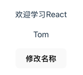
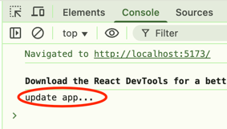

+++
title = 'React Hook介绍'
date = 2025-08-23T10:20:11+08:00
draft = true
categories = [ "React" ]
tags = [ "react" ]
+++

## 什么是钩子

`Hook` 就是“钩子”的意思。什么又是钩子呢？为什么叫钩子呢？我来一个生动的比喻。

想象一下一个自动工作的机器或流水线。它有固定的工作流程，从头到尾按序就班地一步一步执行。
现在呢，你希望在流水线的某个时间点或特定位置（时间、空间），加入一些你自己的、额外的操作，但又不想改变整个流水线。

你会怎么做呢？最直观的方法就是在这条流水线上预留一些“挂钩”的位置。当流水线运转到这个点位时，你可以把自己的工具、零件或者操作流程“挂”上去。这样，你的代码就能在不侵入主体流程的情况，“注入”到预设的指定点中，完成你想要的功能。

“钩子”这个名字就非常形象。

- 它就是那个由主程序或框架预留出来的、用于“挂载”自定义功能的点。
- 挂载，就是你编写自定义函数，并将其注册到那个“钩子”上的过程。

核心思想：它是一种“非侵入式”的编程模式，允许你在不修改核心代码的情况下，扩展或改变一些系统或框架的行为。

## “钩子”在编程中的作用

在不同的编程语言和框架中，虽然具体实现不同，但“钩子”的根本作用是一致的：**提供一个切入点 (A Point of Interception)，让开发者可以在程序执行的特定生命周期阶段执行自己的代码。**

常见的例子有：

- **操作系统钩子 (System Hooks)**：比如在 Windows 中，你可以设置一个键盘钩子，用来在用户按下任何按键时，提前拦截这个事件，进行记录、修改或屏蔽。这就是典型的在系统核心流程中“挂上”自己的逻辑。
- **Git 钩子 (Git Hooks)**：你可以在 `git commit`（提交代码）这个动作发生**之前**，设置一个 `pre-commit` 钩子。在这个钩子函数里，你可以运行代码格式化工具（如 Prettier）或者代码质量检查工具（如 ESLint）。如果检查不通过，你甚至可以阻止这次提交。这就是在 Git 的工作流中增加了自定义的校验环节。
- **WordPress 钩子**：WordPress 作为一套内容管理系统，有大量的钩子。比如，当它准备好要显示一篇文章时，你可以通过一个叫 `the_content` 的钩子，在文章内容输出到屏幕前，对内容进行修改（比如自动给某些关键词加上链接）。
- **Web框架的中间件 (Middleware)**：在很多Web框架（如 Express, Koa）中，中间件的概念和钩子非常相似。每个请求都会流经一个处理管道，你可以在管道的不同位置“挂上”自己的函数（中间件），来处理身份验证、日志记录、数据解析等。


## React Hooks：把“钩子”思想带给函数组件

- Hoot 是 React16.8 新增特性
- Hoos 可以在不用 class 组件的情况下使用 React 特性
- 解决 class 组件过于负责的问题
- 提供了一系列的 Hook API

现在我们来看 React。在 React Hooks（于 React 16.8 版本发布）出现之前，存在一个很重要的问题：

- **类组件 (Class Components)**：功能强大，拥有自己的状态（`this.state`）、生命周期方法（如 `componentDidMount`）等。但它写法笨重、`this` 指向容易混淆，且逻辑难以复用。
- **函数组件 (Functional Components)**：非常轻量，只是一个接收 `props` 并返回 UI 的纯函数。但它**没有自己的状态，也没有生命周期**。一旦需要管理数据或执行副作用（比如请求API），就必须把它重写成一个类组件。

**React Hooks 的诞生，就是为了解决这个问题。** 它的核心思想是：**让函数组件也能“钩入”React 的核心功能，比如状态管理和生命周期。**

> "Hooks are functions that let you 'hook into' React state and lifecycle features from function components."
>
> —— React 官方文档
>
> （Hooks 是一些函数，可以让你在函数组件里“钩入” React 的 state 及生命周期等特性。）
>

**React Hooks 的作用：**

1. **为函数组件提供状态 (`useState`)**：`useState` 这个 Hook 让你可以在函数组件内部“挂上”一个状态。React 会在组件的多次渲染之间保持这个状态。你不再需要 `this.state`。

    ```jsx
    import { useState } from 'react';

    function Counter() {
    // 使用 useState 这个“钩子”，为组件引入了 count 这个状态
    const [count, setCount] = useState(0);

    return <button onClick={() => setCount(count + 1)}>Count: {count}</button>;
    }
    ```

2. **为函数组件提供生命周期能力 (`useEffect`)**：`useEffect` 这个 Hook 可以让你“钩入”到组件**渲染完成之后**的那个时间点，去执行一些“副作用”（Side Effects），比如操作 DOM、请求数据、设置定时器等。它巧妙地统一了 `componentDidMount`、`componentDidUpdate` 和 `componentWillUnmount` 这三个生命周期方法的功能。

    ```jsx
    import { useState, useEffect } from 'react';

    function UserData({ userId }) {
    const [user, setUser] = useState(null);

    // 使用 useEffect 这个“钩子”，在组件首次渲染或 userId 变化后执行
    useEffect(() => {
        // 这个函数会在组件渲染到屏幕后执行
        fetch(`https://api.example.com/users/${userId}`)
        .then(res => res.json())
        .then(data => setUser(data));

        // useEffect 还可以返回一个清理函数，相当于 componentWillUnmount
        return () => {
        console.log('Cleaning up previous effect.');
        };
    }, [userId]); // [userId] 表示只有当 userId 变化时才重新执行

    if (!user) return <div>Loading...</div>;
    return <div>{user.name}</div>;
    }
    ```

3. **逻辑复用 (`自定义 Hooks`)**：Hooks 最大的魅力在于可以把包含状态和副作用的逻辑封装成可复用的自定义 Hook。比如，你可以创建一个 `useUserData` 的自定义 Hook，任何组件想获取用户数据，只需要调用这个 Hook 即可，无需关心内部如何请求、如何管理加载状态。

总结

- **为什么叫钩子？** 因为它是一种**非侵入式**的编程模式，允许你在一个已有的流程中**预留的特定点**，“挂上”你的自定义功能。
- **什么作用？** 它的通用作用是**在不修改核心代码的前提下，扩展或改变一个系统的行为**。
- **在 React 中**，Hooks 的作用是让轻量的**函数组件**也能**“钩入”** React 的核心功能，如**状态管理 (state)** 和**生命周期 (lifecycle)**，从而让函数组件也能变得和类组件一样强大，同时保持了简洁和易于复用的优点。

## useState

### 语法

```jsx
const [state, dispatch] = useState(initData)
```

- state: 定义的数据，可是做一个函数组件内部的变量，但只是在首次渲染是被创建
- dispatch: 改变state的函数。dispatch有两种情况，非函数和函数。
- initData: state的初始值，initData有两种情况，非函数和函数。

### 示例

**定义变量**

 ```jsx
 const [count, setCount] = useState(60)
 ```
   
1、定义的App.tsx内容如下：

```jsx
import {useState} from 'react'
import './App.css'

function App() {
   const [name, setName] = useState('Tom')
   const handleClick = () => {
   setName('Jack')
}

    return (
        <>
            <div className='App'>
                <p>欢迎学习React</p>
                <p>{name}</p>
                <p>
                    <button onClick={handleClick}>修改名称</button>
                </p>
            </div>
        </>
    )
}

export default App
```
   
2、打开页面点击按钮，会看到原来展示的 Tom 会被修改 Jack。

它内部是如何触发的呢？就是去调用 setName 触发React的更新机制，重新去执行App方法将组件执行一遍。

在上面代码中添加一条打印语句，然后打开调试工具，刷新页面点击按钮并观察输出：
```jsx
...
console.log('update app...')
const [name, setName] = useState('Tom')
...
```

观察发现刷新页面时会打印一次：




接着点击按钮，Tom 更新为 Jack，又会看到打印了一次，说明组件又重新渲染了一遍。之后再次点击按钮，会看到不会再打印了。只有在发生变化才会去更新重新一遍函数。
   
**定义对象**

```jsx
const [user, setUser] = useState({name: 'Tom', age: 30})
```


1、定义的App.tsx内容如下：

```jsx
import {useState} from 'react'
import './App.css'

function App() {
    const [user, setUser] = useState({name: "Tom", age: 30})
    const handleClick = () => {
        setUser({name: "Jack", age: 50})
    }


    return (
        <>
            <div className='App'>
                <p>欢迎学习React</p>
                <p>名称：{user.name}</p>
                <p>年龄：{user.age}</p>
                <p>
                    <button onClick={handleClick}>修改用户</button>
                </p>
            </div>
        </>
    )
}

export default App

```

点击按钮会看到名称由Tom更新为Jack，年龄从30更新为50。这里更新了对象的所有属性，但在实际使用中并不会更新所有字段，而是更新个别字段，我们可以使用下面的方法现将对象结构，然后更新指定的字段，比如：
```jsx
...
setUser({...user, age: 50})
...
```


   
**定义数组**

```jsx
const [list, setList] = useState(['Tom', 'Jack'])
```

1、App.tsx 内容如下：
```jsx
import {useState} from 'react'
import './App.css'

function App() {
   const [list, setList] = useState(['Tom', 'Jack'])

   function handleClick() {
      setList([...list, 'Lily'])
   }

   return (
           <>
              <div className='App'>
                 <p>欢迎学习React</p>
                 <p>
                    {
                       list.map((item) => {
                          return <span key={item} style={{marginRight: 10}}>{item}</span>
                       })
                    }</p>
                 <p>
                    <button onClick={handleClick}>修改用户</button>
                 </p>
              </div>
           </>
   )
}

export default App

```

2、添加数组元素时，先对数组进行结构，然后往里面添加一个元素。

**异步执行**

```jsx
const [count, setCount] = useState(0)

// 点击按钮，执行3次
setCount(count + 1)
setCount(count + 1)
setCount(count + 1)

// 点击按钮，异步执行
setTimeout(() => {
    setCount(count + 1)
}) 
```

1、App.tsx 代码如下：
```jsx
import {useState} from 'react'
import './App.css'

function App() {
    const [count, setCount] = useState(0)

    function handleClick() {
        setCount(count + 1)
    }

    return (
        <>
            <div className='App'>
                <p>欢迎学习React</p>
                <p>count: {count}</p>
                <p>
                    <button onClick={handleClick}>修改用户</button>
                </p>
            </div>
        </>
    )
}

export default App

```
运行时点击按钮会看到count的值不断的加1，但如果协程下面这样再不断的点击，会一直加一吗？
```jsx
function handleClick() {
        setCount(count + 1)
        setCount(count + 1)
        setCount(count + 1)
    }

```
会发现点击一次，会全部更新为1，而不是3，这是因为更新是异步的。会将很多操作合并在一起，虽然3个更新语句，执行了3次，但不会立即执行更新DOM,它会将3条语句的更新合并一起，发现就更新了一次。

再换成下面写法：
```jsx
setTimeout(() => {
            setCount(count + 1)
            setCount(count + 1)
            setCount(count + 1)
        })
```

会发现效果一样。

**定义函数**
initData 也可以是个函数

```jsx
count number = 1
const [count, setCount] = useState(() => {
    if (number > 0) {
        return ...
    } else {
        return ...
    }
})
```

dispatch 的值也可以是个函数：
```jsx
const [count, setCount] = useState(0)
setCount(count => count + 1)
```


## useEffect

### 语法

```jsx
useEffect(effectFn, deps)
```

- 用于模拟渲染后、更新后、销毁3个动作

### 示例

**渲染后更新标题**

```jsx
useEffect(() => {
    document.title = 'Hello, World!'
}, [])
```

**渲染后更新Count值**

```jsx
count [count, setCount] = useState(0)

useEffect(() => {
    setCount(count + 1)
}, [])
```

**点击按钮，更新name**

```jsx
count [total, setTotal] = useState(0)
count [count, setCount] = useState(0)
useEffect(() => {
    setTotal(count * 5)
}, [count])
```

**销毁定时器**

```jsx
count [count, setCount] = useState(0)

useEffect(() => {
    const T = setInterval(() => {
        setCount(count => count + 1)
    }, 3000)
    return () => {
        clearInterval(T)
    }
}, [])
```


## useMemo、useCallback

## useContext、useReducer

## useRef

## useLayoutEffect、useTransition、useImperativeHandle
