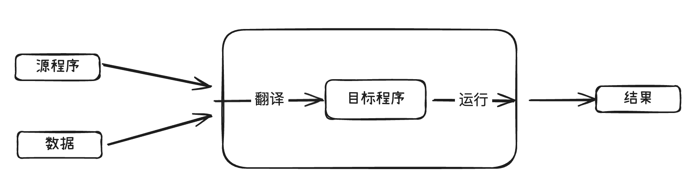
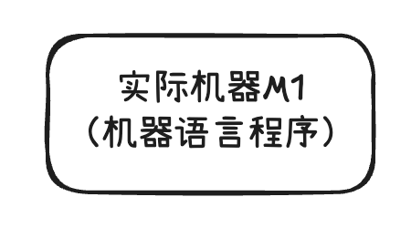

+++
title = '计算机系统概述'
date = 2025-08-27T22:18:58+08:00
draft = true
categories = [ "COA" ]
tags = [ "COA"]
+++

## 零 关于概述

你有没有这种经历：你准备去看一部期待已久的超级英雄电影，结果一开场，导演花了整整20分钟，用PPT加旁白的方式，把这个英雄的爷爷的爸爸怎么来的、他们星球的经济结构、政治体系、邻里关系……全都给你讲了一遍。

你当时的心情是不是：“大哥，我知道这些背景很重要，但能不能先让我看看打架？看看特效？随便来点啥都行啊！”

**没错，所有教材的第一章“概述”，就是那个让你抓狂的“电影开场PPT”！**

它很无聊，很枯燥，让你感觉自己不是来学一门技术的，而是来上历史课的。但你信我，写书的这些大佬们真不是故意的。他们这么做，其实是在帮你，只不过方式有点“爹味儿”……

### 为什么非要有这个“无聊的概述”？

想象一下，你是个顶级大厨，要教一个小白（比如我）做一道超级复杂的“佛跳墙”。

你总不能上来就说：“来，把那块鲍鱼给我切成0.5毫米的薄片，火候掌握在87.5度。”

我肯定当场就把鲍鱼丢你脸上了。我连鲍鱼和海参都分不清，你跟我讲火候？

所以，一个负责任的大厨会怎么做？他会先把所有食材和工具都摆在你面前，告诉你：
* “你看，这个叫鲍鱼，那个叫海参，这是炒菜用的锅，那是炖汤的锅。” （**这就是计算机的“基本组成”：CPU、内存、硬盘**）
* “咱们这道菜的最终目标，是做出一锅闻起来香、吃起来更香的汤。所有步骤都是为了这个目标。” （**这就是计算机的“基本工作原理”：执行程序，处理数据**）
* “鲍鱼要先处理，然后才能跟鸡汤一起炖，顺序不能乱。” （**这就是“冯·诺依曼结构”：告诉你各个部件是怎么搭在一起干活的**）

你看，在你真正开始切菜、开火之前，大厨必须先给你画一张“蓝图”，在你脑子里建立一个厨房的全景地图。

**第一章“概述”，就是这张地图。**

它存在的唯一目的，就是防止你在后面的章节里彻底迷路。

* 当你在学到“中央处理器CPU”的时候，你脑子里会有一个声音：“哦！就是那个厨房里最核心的大厨！”
* 当你在学到“总线”的时候，你脑子里会想：“啊哈！这就是厨房里传菜的那个通道！”
* 当你在学到“指令系统”的时候，你会恍然大悟：“原来这就是大厨能看懂的菜谱啊！”

如果没有第一章给你打下的这些模糊的、你记不住的印象，后面每一章对你来说都是一个全新的、孤立的世界，学起来会更痛苦，就像在一个没有地图的迷宫里瞎撞。

### 记不住怎么办？三个字：不用记！

说真的，第一章的概念，现阶段你**根本不需要**记住。

正确的打开方式是“**快速浏览，有个印象**”。

1.  **当小说看**：你就当是在看一个关于“计算机”这个国家建立的野史。哦，原来有个叫冯·诺依曼的家伙这么牛。哦，原来计算机是这么一代一代变过来的。哦，原来它由这么几个大部门组成。看完了，合上书，忘了就忘了，没关系！
2.  **抓住关键词**：你只需要对几个词有“眼缘”就行。比如“CPU”、“内存”、“输入输出设备”、“二进制”、“指令”。你不需要懂它们是啥，但要做到当它们在后面的章节里再次出现时，你不会觉得“这货是谁？”
3.  **把疑问留给未来**：看到不懂的地方，不要死磕。你的大脑会自动产生疑问：“指令到底是个啥玩意儿？” 太好了！把这个疑问带到后面的指令系统章节去，那时候你的学习动力会暴增。

**总结一下：**

第一章不是用来“学习”的，而是用来“导航”的。它的作用是给你画一张藏宝图，虽然现在图上的标记你一个也看不懂，但等你真正上路（学习后面章节）的时候，你会无比感激手里有这张图。

所以，放过自己吧！快速翻完它，知道计算机大概是“那麽个玩意儿”，然后勇敢地跳到第二章。等你把整本书都啃完再回来看第一章，你会热泪盈眶的，感觉就像通关了游戏之后再回来看新手村的剧情介绍，一切都是那么的清晰和理所当然。

## 一 计算机系统简介

### 1.1 计算机的软硬件

计算机系统由软件和硬件组成。

- 硬件：指计算机的实体部分，它由看得见摸得着的各种电子元器件，各类光、电、机设备的实物组成，如主机、外部设备等。
- 软件：它看不见摸不着，由人们事先编制的具有各类特殊功能的程序组成。通常把这些程序寄寓于各类媒体（如RAM、ROM、磁带、磁盘、光盘、纸带等），它们通常存放在计算机的主存或辅存内。

> 主存可以指我们平时说的内存，辅存可以指我们平时说的硬盘。

硬件就像我们人体各个看得见的器官，比如手脚、眼睛耳朵、内脏器官、血液等。软件就像我们大脑中的各种想法，为了方便记忆，我们可能会对想法做一些笔记，将这些笔记写在书本中，或录制到视频中等。

计算机性能的好坏取决于软、硬件功能的总和。

**计算机的软件分类**

- 系统软件
- 应用软件

### 计算机系统的层次结构

**现代计算机的解题过程**

这里介绍下几个基本的概念：

- 高级语言：通常指我们人类可以阅读理解的编程语言
- 源程序：用户使用高级语言编写的程序
- 目标程序：计算机能识别的机器语言程序（0和1组成的二进制代码）

将源程序和数据放入计算机内，在计算机内部，会有专门的程序将其翻译成目标程序，机器运行目标程序并计算结果输出。

**实际机器**

直接执行机器语言的机器成为实际机器M1

