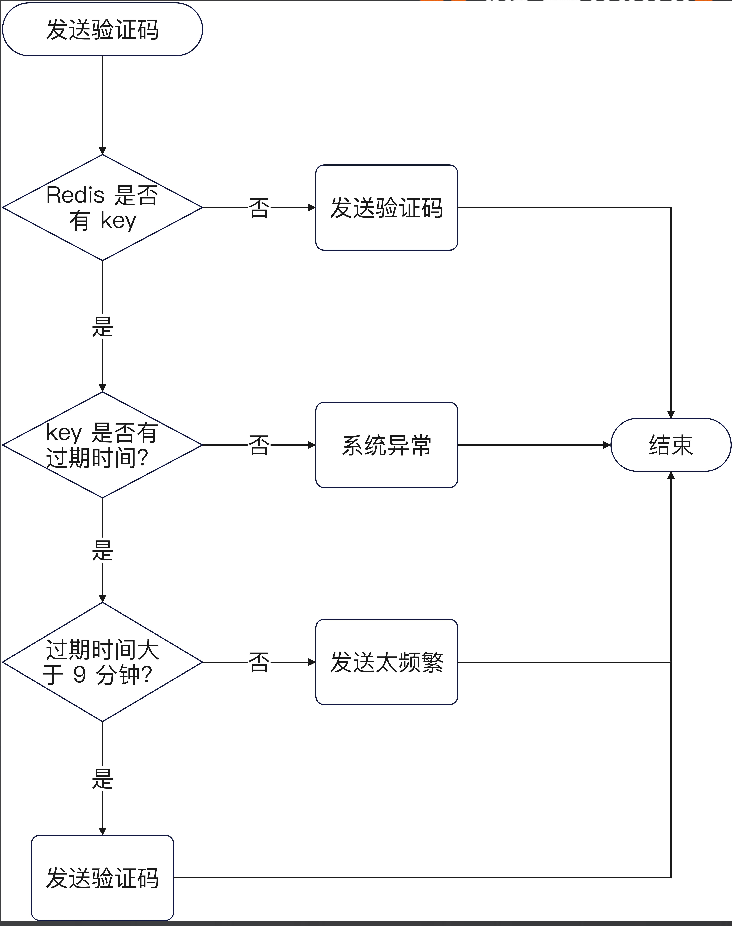
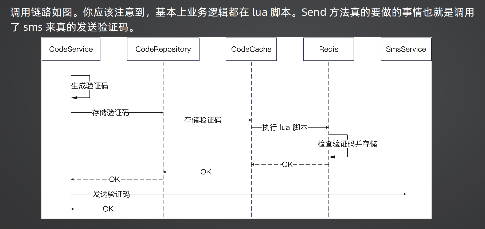
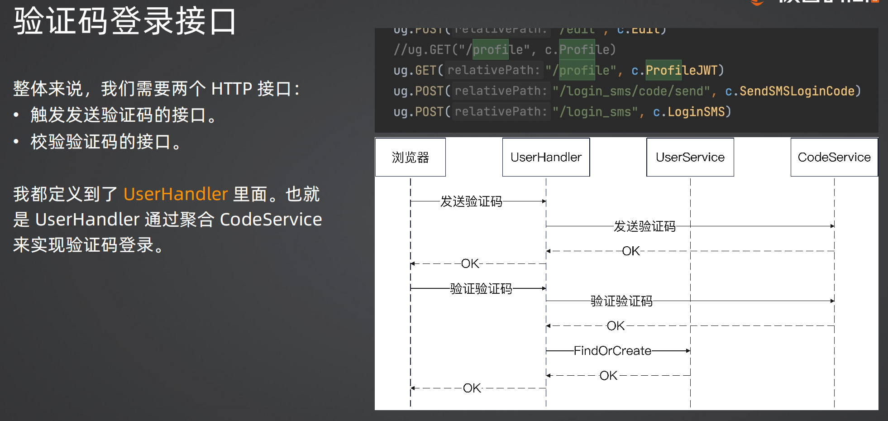

+++
title = '短信验证码登录'
date = 2025-08-27T11:16:28+08:00
draft = true
categories = [ "功能分析与设计" ]
+++

## 深入分析验证码的安全问题

验证码一般都是 6 位数字，那么要深入考虑两个安全问题：

1、控制验证码发送频率，避免一下子发送几百万条。

- 同一个手机号码，一分钟以内只能发送一次。
- 验证码有效期十分钟。
- 本身整个系统也有限流，也可以保护住系统。

2、验证码不能被攻击者暴力破解，因为验证码只有 6 位，也就是只有十万种可能，所以不能让用户频繁输入验证码来暴力破解。
- 一个验证码，如果已经验证通过了，那么就不能再用。
- 一个验证码，如果已经三次验证失败，那么这个验证码就不再可用。在这种情况下，只会告诉用户输入的验证码不对，但是不会提示验证码过于频繁失败问题。

注意：这个是业务复杂度，不是技术复杂度，理论上这些规则都是产品经理要告诉你的。你不需要仔细琢磨这些规则，因为你出去工作，换一个业务场景，这些全部用不上

## 验证码服务接口抽象

验证码你很容易想到，它就只有两个接口：

- 发送：根据业务、手机号码，发送验证码。在这个接口里面，要控制住发送频率。
- 验证：验证验证码，在这个接口你要保证验证码不会被暴力破解。

所以这时候我们会在 service 包里面放一个 CodeService，里面定义两个方法。

## 发送验证码

验证码是一个有有效期的东西，所以最适合的存储就是 Redis，并且设置过期时间十分钟。

可以将 Redis 的 key 设置为 phone_code:$biz:$phone 的形态。为了进一步避免恶意发送短信，我们需要控制住发短信的频率。

因此整个思路是：
- 如果 Redis 中没有这个 key，那么就直接发送；
- 如果 Redis 中有这个 key，但是没有过期时间，说明系统异常；
- 如果 key 有过期时间，但是过期时间还有 9 分钟，发送太频发，拒绝；
- 否则，重新发送一个验证码

## SendCode 实现流程

## 验证码登录接口

