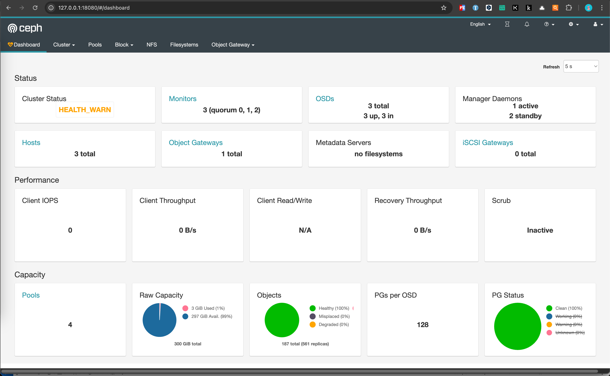

+++
title = 'Ceph集群搭建'
date = 2024-08-10T12:43:35+08:00
draft = true
categories = [ "Ceph" ]
+++

## Ceph 是什么

## 特点

* 部署简单
* 可靠性好
* 性能高
* 分布式，可扩展性强
* 客户端支持多语言
* 开源

## 基础组件

OSD: 用于集群中所有数据与对象的存储的守护进程。起到/复制/平衡/恢复数据等作用

Monitor: 监控集群装填，维护 cluster MAP 表，保证集群数据一致性。

MDS：元数据服务，保存文件系统服务的元数据（OBJ/Block不需要该服务）

GW：提供与Amazon S3和Swift兼容的RESTful API的gateway服务

## AWS S3基本概念

Region: 存储数据所在的地理区域

Endpoint: 终端节点，存储服务入口，Web服务入口点的URL

Bucket: 存储桶是S3中用于存储对象的容器

Object: 对象是S3中存储的基本实体，又对象数据和元数据组成

Key： 键是存储桶中对象的唯一标识符，桶内的每个对象都只能有一个key


## 环境准备

3台网络互通的 CentOS7 主机。

|    主机名称       | 主机IP        | 角色          | 说明 |
| ----------      | ---           | ---          |      
| chaos-1         |  172.20.30.1  |  ceph-admin  |  osd、mon、mds、mgr、rgw |
| chaos-2         |  172.20.30.2  |  ceph-1      |  osd、mon |
| chaos-3         |  172.20.30.3  |  ceph-2      |  osd、mon |

## 拉取镜像

* x86_64 架构

```bash
docker pull ceph/daemon:master-4d96298-nautilus-centos-7-x86_64
docker image tag ceph/daemon:master-4d96298-nautilus-centos-7-x86_64 ceph/daemon:latest
```

* arm64 架构

```bash
docker pull ceph/daemon:master-4d96298-nautilus-centos-7-aarch64
docker image tag ceph/daemon:master-4d96298-nautilus-centos-7-aarch64 ceph/daemon:latest
```

## 初始化ceph挂载目录(每个节点都执行)

```bash
rm -rf /etc/ceph /var/lib/ceph /var/log/ceph
mkdir -p /etc/ceph /var/lib/ceph /var/log/ceph
```

## 启动monitor节点

1、启动第一个Monitor节点(在 172.20.30.1 上执行)

```bash
docker run -d --net=host --restart always -v /etc/ceph:/etc/ceph -v /var/lib/ceph/:/var/lib/ceph/ -v /var/log/ceph/:/var/log/ceph/ -e MON_IP=172.20.30.1 -e CEPH_PUBLIC_NETWORK=172.20.30.0/24 --name="ceph-mon" ceph/daemon:latest mon
```

2、然后将 `/etc/ceph` 目录拷到其他两个节点（172.20.30.2、172.20.30.3）, 如用scp命令远程拷贝:

```bash
scp -r /etc/ceph root@172.20.30.2:/etc/
scp -r /etc/ceph root@172.20.30.3:/etc/
```

3、启动第二个monitor节点(在 172.20.30.2 上执行)

```bash
docker run -d --net=host --restart always -v /etc/ceph:/etc/ceph -v /var/lib/ceph/:/var/lib/ceph/ -v /var/log/ceph/:/var/log/ceph/ -e MON_IP=172.20.30.2 -e CEPH_PUBLIC_NETWORK=172.20.30.0/24 --name="ceph-mon" ceph/daemon:latest mon
```

4、启动第三个monitor节点(在 172.20.30.3 上执行)

```bash
docker run -d --net=host --restart always -v /etc/ceph:/etc/ceph -v /var/lib/ceph/:/var/lib/ceph/ -v /var/log/ceph/:/var/log/ceph/ -e MON_IP=172.20.30.3 -e CEPH_PUBLIC_NETWORK=172.20.30.0/24 --name="ceph-mon" ceph/daemon:latest mon
```

5、查看ceph集群状态

```bash
[root@chaos-1 opt]# docker exec ceph-mon ceph -s
  cluster:
    id:     525883ec-c1db-4bc5-bb3d-441669f6e32f
    health: HEALTH_WARN
            mon is allowing insecure global_id reclaim

  services:
    mon: 3 daemons, quorum chaos-1,chaos-2,chaos-3 (age 1.44229s)
    mgr: no daemons active
    osd: 0 osds: 0 up, 0 in

  data:
    pools:   0 pools, 0 pgs
    objects: 0 objects, 0 B
    usage:   0 B used, 0 B / 0 B avail
    pgs:

[root@chaos-1 opt]#
```

## 启动mgr节点(每个节点执行同样的run命令)

1、mgr模块用于分担monitor部分扩展功能，减轻monitor负担

```bash
docker run -d --net=host --privileged=true --pid=host --name="ceph-mgr" --restart=always -v /etc/ceph:/etc/ceph -v /var/lib/ceph/:/var/lib/ceph/ ceph/daemon:latest mgr
```

2、查看集群状态

```bash
[root@chaos-1 opt]# docker exec ceph-mon ceph -s
  cluster:
    id:     525883ec-c1db-4bc5-bb3d-441669f6e32f
    health: HEALTH_WARN
            mons are allowing insecure global_id reclaim

  services:
    mon: 3 daemons, quorum chaos-1,chaos-2,chaos-3 (age 28s)
    mgr: chaos-1(active, since 5s), standbys: chaos-2, chaos-3
    osd: 0 osds: 0 up, 0 in

  data:
    pools:   0 pools, 0 pgs
    objects: 0 objects, 0 B
    usage:   0 B used, 0 B / 0 B avail
    pgs:

[root@chaos-1 opt]#
```

## 启动OSD节点(每个节点执行)

```bash
cat >> /etc/ceph/ceph.conf <<EOF
osd max object name len = 256
osd max object namespace len = 64
EOF
```

2、导出osd用于连ceph集群的keyring

```bash
docker exec ceph-mon ceph auth get client.bootstrap-osd -o /var/lib/ceph/bootstrap-osd/ceph.keyring
```

3、创建osd的存储目录

```bash
mkdir -p /data/ceph/osd/vdb
```

4、启动osd

```bash
docker run -d --privileged=true --name=ceph-osdvdb --net=host -v /etc/ceph:/etc/ceph -v /var/lib/ceph/:/var/lib/ceph/ -v /data/ceph/osd/vdb:/var/lib/ceph/osd -e OSD_TYPE=directory -v /etc/localtime:/etc/localtime:ro ceph/daemon:latest osd
```

6、查看集群状态

```bash
[root@chaos-1 opt]# docker exec ceph-mon ceph -s
  cluster:
    id:     525883ec-c1db-4bc5-bb3d-441669f6e32f
    health: HEALTH_WARN
            mons are allowing insecure global_id reclaim

  services:
    mon: 3 daemons, quorum chaos-1,chaos-2,chaos-3 (age 117s)
    mgr: chaos-1(active, since 94s), standbys: chaos-2, chaos-3
    osd: 3 osds: 3 up (since 0.606376s), 3 in (since 0.606376s)

  task status:

  data:
    pools:   0 pools, 0 pgs
    objects: 0 objects, 0 B
    usage:   2.0 GiB used, 198 GiB / 200 GiB avail
    pgs:

[root@chaos-1 opt]#
```

## 启动gateway节点

1、导出rgw用于连接集群的keyring

```bash
docker exec ceph-mon ceph auth get client.bootstrap-rgw -o /var/lib/ceph/bootstrap-rgw/ceph.keyring
```

2、运行rgw节点, 可以启动一个或多个

```bash
docker run -d --net=host --privileged=true --name=ceph-rgw -v /var/lib/ceph/:/var/lib/ceph/ -v /etc/ceph:/etc/ceph -v /etc/localtime:/etc/localtime:ro -e RGW_NAME=rgw0 ceph/daemon:latest rgw
```

3、查看集群状态

```bash
[root@chaos-1 opt]# docker exec ceph-mon ceph -s
  cluster:
    id:     525883ec-c1db-4bc5-bb3d-441669f6e32f
    health: HEALTH_WARN
            mons are allowing insecure global_id reclaim

  services:
    mon: 3 daemons, quorum chaos-1,chaos-2,chaos-3 (age 2m)
    mgr: chaos-1(active, since 2m), standbys: chaos-2, chaos-3
    osd: 3 osds: 3 up (since 54s), 3 in (since 54s)

  task status:

  data:
    pools:   2 pools, 64 pgs
    objects: 3 objects, 440 B
    usage:   3.0 GiB used, 297 GiB / 300 GiB avail
    pgs:     25.000% pgs unknown
             37.500% pgs not active
             24 active+clean
             24 creating+peering
             16 unknown

[root@chaos-1 opt]#
```

## 启动dashboard可视化管理页面

1、开启dashboard模块并禁用ssl(也可以用ssl, 需额外配置ssl证书)

```bash
docker exec ceph-rgw ceph mgr module enable dashboard
docker exec ceph-rgw ceph config set mgr mgr/dashboard/ssl false
docker exec ceph-rgw ceph mgr module disable dashboard
docker exec ceph-rgw ceph mgr module enable dashboard
```


2、设置UI管理的host:port, 登录名及密码

我的虚拟主机也是容器环境，为了能在宿主机访问，我这里设置的IP为 `0.0.0.0`
```bash
docker exec ceph-rgw ceph config set mgr mgr/dashboard/server_addr 172.20.30.1
或者
docker exec ceph-rgw ceph config set mgr mgr/dashboard/server_addr 0.0.0.0
docker exec ceph-rgw ceph config set mgr mgr/dashboard/server_port 18080
docker exec ceph-rgw ceph dashboard ac-user-create <自定义user> <自定义pwd> administrator
```

设置密码时我遇到下面错误：

```bash
[root@chaos-1 opt]# docker exec ceph-rgw ceph dashboard ac-user-create cephuser cephpassword administrator
Error EINVAL: Please specify the file containing the password/secret with "-i" option.
[root@chaos-1 opt]#
```

最新的ceph dashboard不支持直接在命令行里面创建用户的密码，需要先创建一个包含用户密码的文件.

进入到 `ceph-rgw` 容器执行：

```bash
echo "cephpassword" > ~/password.txt
```

退出容器重新执行：

```bash
[root@chaos-1 opt]# docker exec ceph-rgw ceph dashboard ac-user-create cephuser -i ~/password.txt administrator
{"username": "cephuser", "lastUpdate": 1725266345, "name": null, "roles": ["administrator"], "password": "$2b$12$6t7T4J/OvUDAvAstZN9gKedg9.4jxRjN2In/QK27ipTruKldqy/Dm", "email": null}
[root@chaos-1 opt]#
```

3、登录并进入UI首页(http://<server_addr>:18080)




## 创建一个user, 用于管理存储对象

```bash
# docker exec ceph-rgw radosgw-admin user create --uid=test_user --display-name=test_user --system
{
    "user_id": "test_user",
    "display_name": "test_user",
    "email": "",
    "suspended": 0,
    "max_buckets": 1000,
    "subusers": [],
    "keys": [
        {
            "user": "test_user",
            "access_key": "OJ6RZTOU84R1YEQJX8D7",
            "secret_key": "i5eqpA6rox21nkQSlAz98SqQFQ6DIjwnvDSMyTSQ"
        }
    ],
    "swift_keys": [],
    "caps": [],
    "op_mask": "read, write, delete",
    "system": "true",
    "default_placement": "",
    "default_storage_class": "",
    "placement_tags": [],
    "bucket_quota": {
        "enabled": false,
        "check_on_raw": false,
        "max_size": -1,
        "max_size_kb": 0,
        "max_objects": -1
    },
    "user_quota": {
        "enabled": false,
        "check_on_raw": false,
        "max_size": -1,
        "max_size_kb": 0,
        "max_objects": -1
    },
    "temp_url_keys": [],
    "type": "rgw",
    "mfa_ids": []
}

[root@chaos-1 opt]#
```

