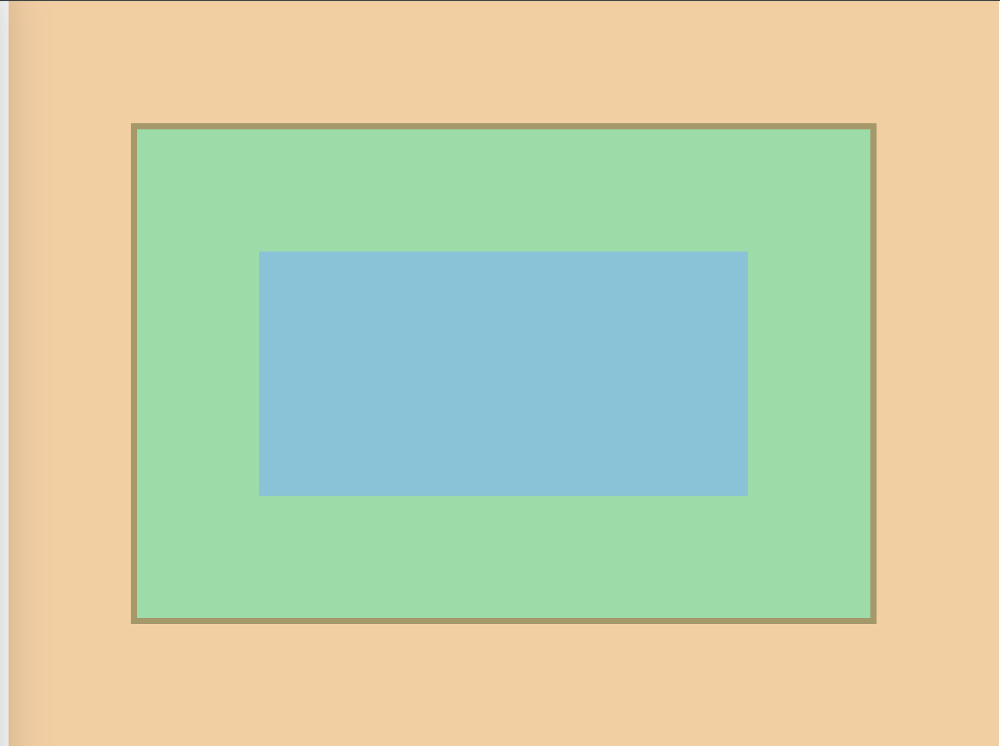
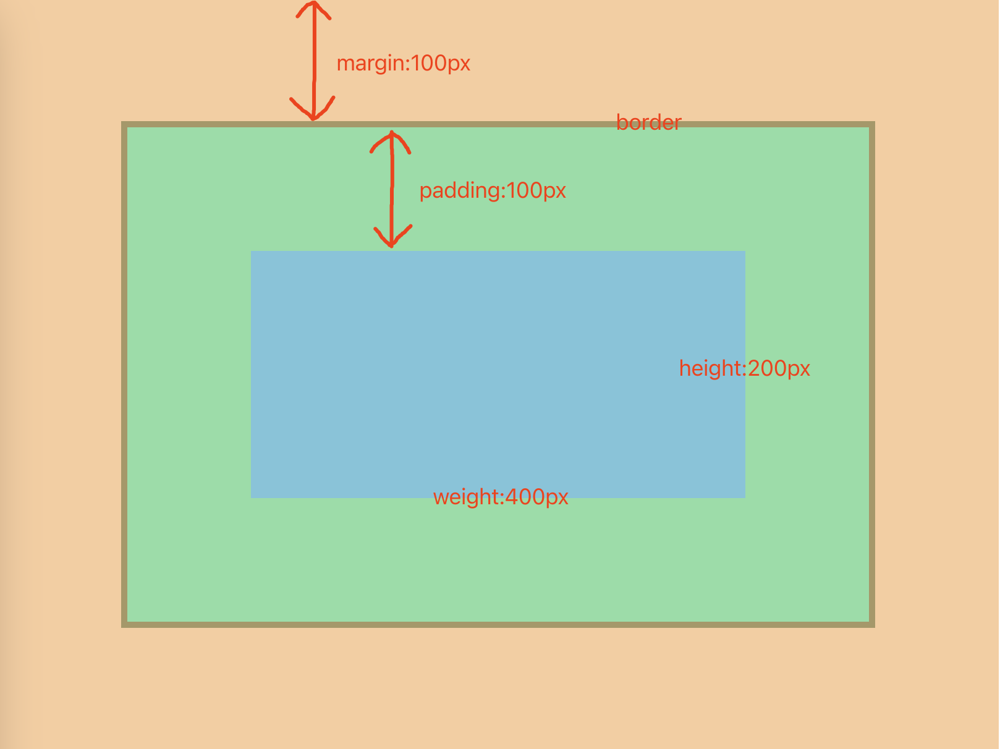

+++
title = '盒子模型'
date = 2024-07-24T07:42:21+08:00
draft = true
categories = [ "Hugo" ]
tags = [ "hugo" ]
+++

## 什么是盒子模型

想象刚买的电脑包装盒，主题内容是电脑，在外包装盒电脑之间还塞了一些泡沫

盒子模型由以下几部分构成：

* Content box: 内容区域，如下图蓝色区域。
* Padding box: 内边距，内容区域的外围区域，如下图绿色区域。
* Border box: 边框，包裹内容和内边距，如下图黄色区域。
* Margin box: 外边距，是盒子和其他元素之间的空白区域，如下图橙色部分。

## 标准盒模型

标准盒模型就是：当我们设置 width 和 height 时，实际上设置的只是 content box 的宽高。而整个盒子的宽/高 = content + padding + border。margin不计入实际大小（margin只是影响盒子的外部空间，盒子的真实范围是到边框为止的）

```html
<!DOCTYPE html>
<html lang="en">
<head>
    <meta charset="UTF-8">
    <title>Title</title>
    <style>
        #container {
            height: 200px;
            width: 400px;
            padding: 100px;
            margin: 100px;
            border: 5px solid;
            background-color: aquamarine;
        }
    </style>
</head>
<body>
<div id="container"></div>
</body>
</html>
```





将 “container” 所在 “div” 看做一个盒子，如中蓝色区域，表示的盒子模型中的“Content”，它的长宽为 400 * 200。

padding 为内边距，即途中的绿色部分，它的上下左右内边距都是100px。

绿色外围有一圈棕色边框就是 border 部分。

border 外围一圈肉色部分就是外边距。

盒子宽度：400 + 100*2（左右padding）+ 5*2（左右border） = 610

盒子高度：200 + 100*2（上下padding） + 5*2（上下border）= 410

background-color 作用范围：content + padding + border

当border设置了颜色是，则以border设置的颜色为准，若 border 没有设置颜色，则background-color将会填充border。

padding 表示内边距，也就是 border 与 content 之间的边距。

margin 表示外边距，也就是 border 以外的边距，可以理解为盒子与其他盒子元素的边距。


