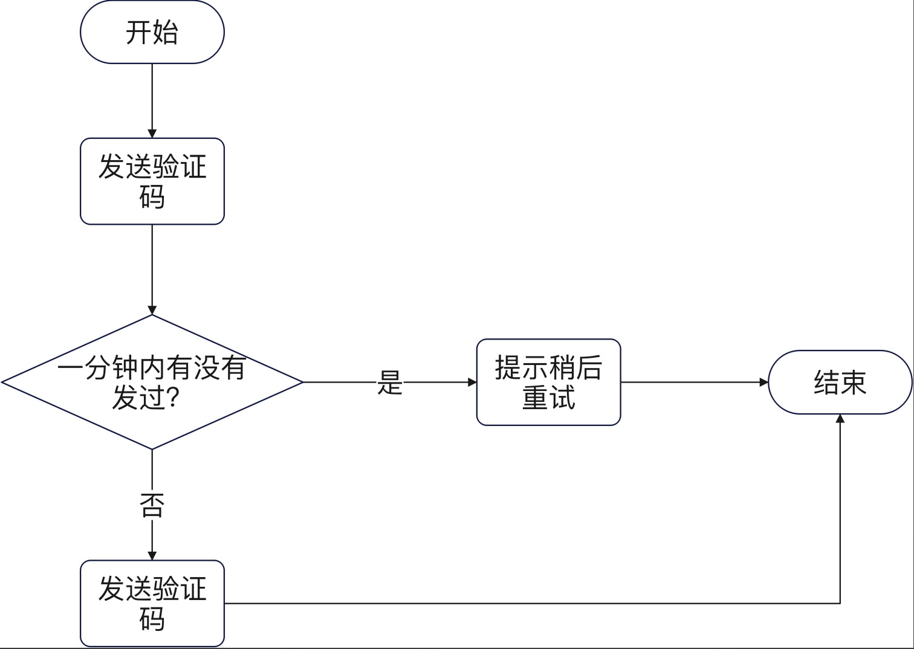
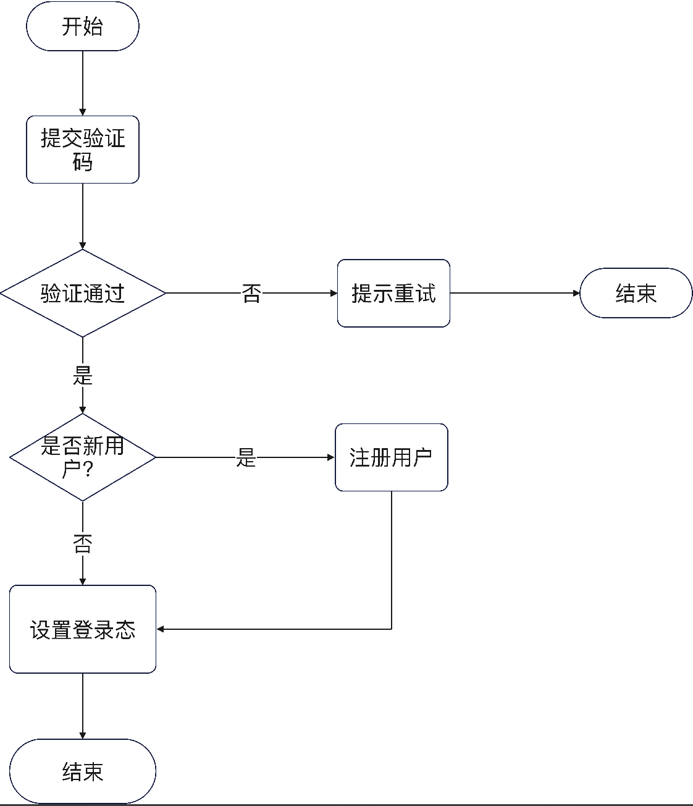
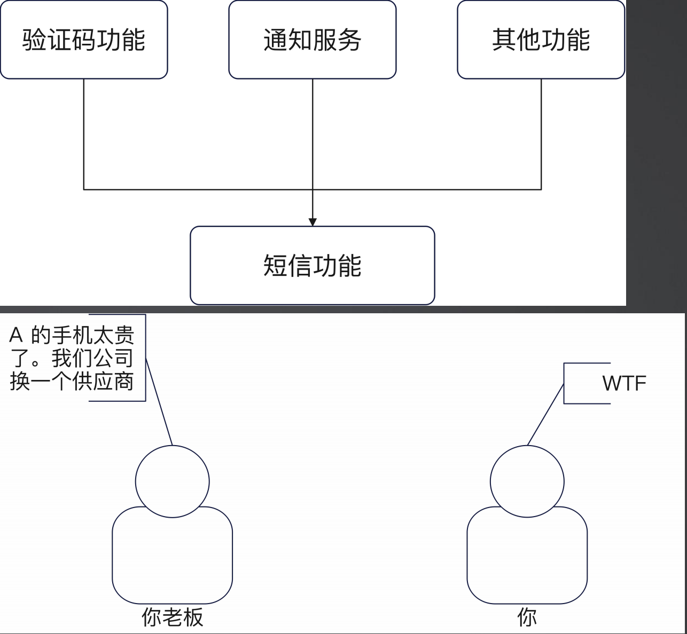
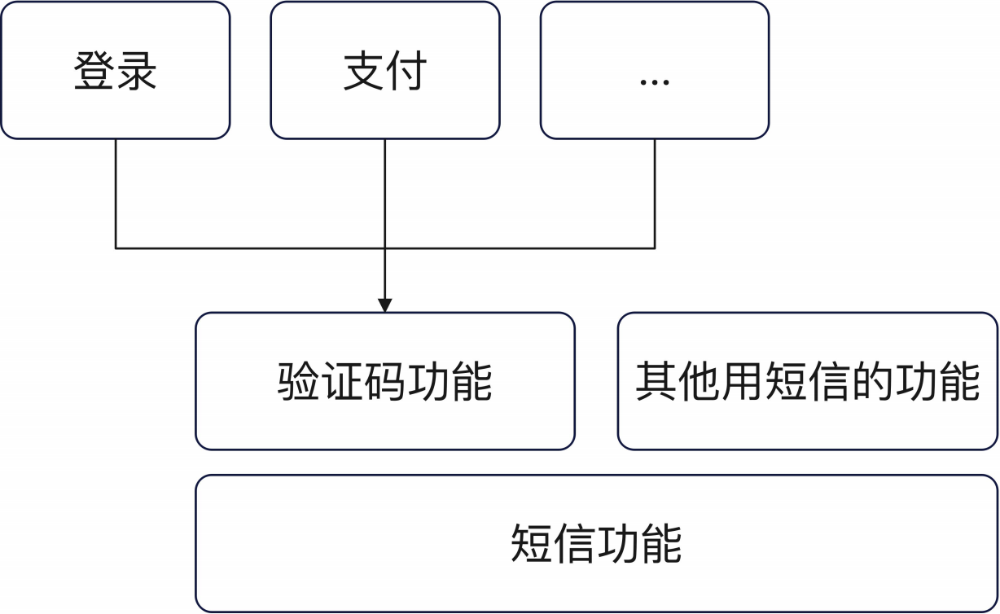
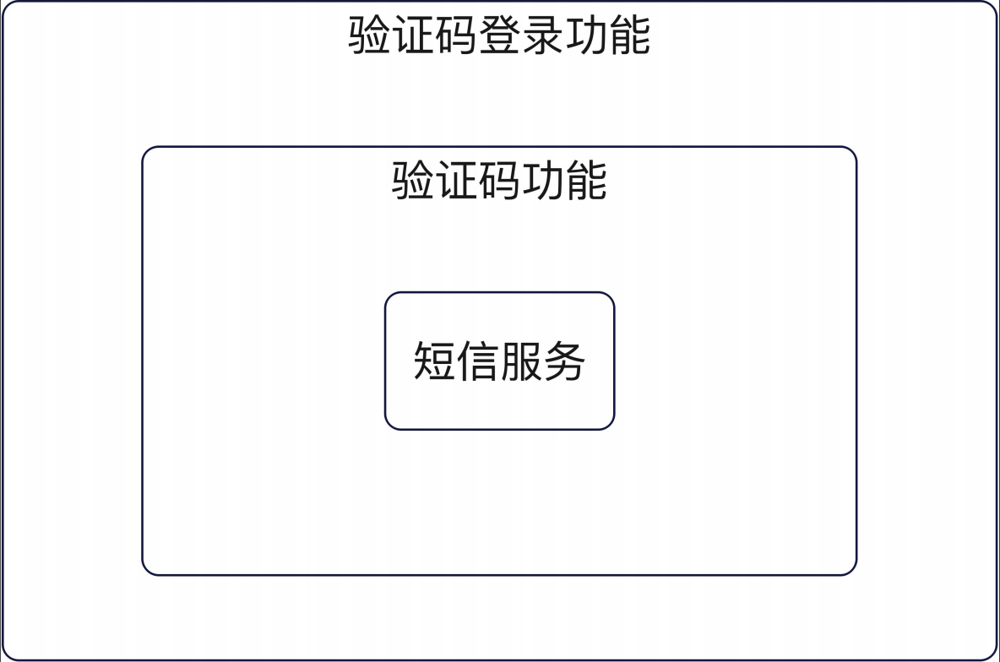
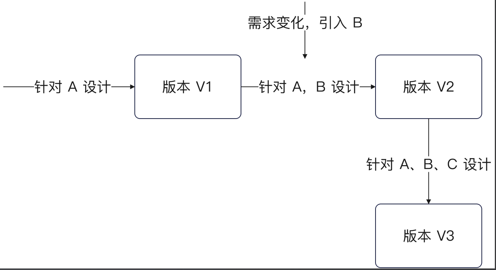

+++
title = '03-短信验证码登录'
date = 2025-09-17T08:46:42+08:00
draft = true
categories = [ "Go" ]
tags = [ "go"]
+++

## 需求分析与系统设计

**简要需求分析**

正常来说，如果你工作在国内的互联网公司，那么你收到的需求描述都是非常粗略的，没有任何细节。所以你要掌握快速需求分析的小技巧，主要有三点：

- 参考竞品。应该说大部分互联网的功能都是你抄我我抄你的，所以你基本上可以参考竞品。
			按理说这应该是产品经理要做的事情，现在假设我们的产品经理不称职，比较菜，所以只能我们自己代劳了。我们可以看看自己公司的竞品是如何做的，还可以自己去实践体验一下。比如它的输入和输出、它的具体业务场景的具体流程，还包括竞品是如何处理异常流程的（比如输入故意捣乱，不按套路出牌的方式）。


- 从不同角度分析：
	- 功能角度：功能角度也就是明确我们做到哪些功能，有没有轻重缓急之分，一个具体的功能要做到什么程度。
		此时可以去问下产品经理，不出意外，产品会说全都要，全部很重要。这种情况我们要自己有个排序，比如预测自己不能按时交付，哪些可以稍微往后延一延。

	- 非功能角度：对于中小型公司来说，按照这个顺序去思考安全性 > 扩展性 > 性能。第一个保证你的系统不会被人恶意搞崩，第二个是有限度应对将来的需求变更，第三个是优化用户体验。
		非功能角度才是决定了你出去能不能吹，以及你后面在公司的生活能不能安逸舒适。因为功能需求交给任何人都能做，出去面试谁都能说，它在面试中很难面出彩的，真正面出彩的是非功能。比如你出去说我做了一个短信功能，面试官一听，啊？就这。一旦如果你说你做了一个支持高并发的短信功能。面试官一听，说说看。面试官关注的点是高并发，而不是功能。
		为什么关系到安逸舒适，因为一旦你的非功能性做好，尤其是扩展做好，后面的维护是很轻松的。

- 从正常和异常流程两个角度思考：注意区分业务异常流程和技术异常流程。
	集合产品经理提的需求，站在用户的角度，去想我怎么用它，可能会发生什么异常，我该如何处理，这样就能理清楚整个流程中可能会遇到什么困难。在哪些地方，产品经理可能没有考虑清楚，在哪些角度你就会去思考需要我们流出哪些扩展性出来。

  
注意，如果你的产品经理很称职，你问产品经理就可以。只有在产品经理不称职的情况下，你才需要花费
比较多的功夫来分析需求。

**参考竞品**

以我们这个验证码登录功能为例，你可以看不同公司的验证码登录的实现。而后你就需要总结他们的功能特性：
- 大部分公司，在你发送手机验证码之前，都要求你先验证一下，比如说利用拼图，这一步你可以猜测是防止有人恶意触发发送短信。
- 大部分公司，在你发送了一个验证码之后，都不能连续发送，要隔一段时间。
- 大部分公司，在手机号码第一次使用的时候，直接会帮你注册一个账号。
- 大部分公司，手机验证码都有有效期。
- 大部分公司，你访问不同服务，手机验证码都是独立的，例如你在 A 功能上触发了手机验证码，在 B 功能上可以立刻触发再次发送验证码。
- 验证码只能使用一次，也就是验证码校验通过之后，这个验证码将无法再次使用。

**从功能和非功能的角度分析**

在功能上，整个需求可以简单描述为：
- 允许用户使用手机号码接受验证码登录。在登录的时候，如果手机号码是一个全新的手机号码，那么直接注册一个新的账号。
- 手机验证码的有效期是 10 分钟。
- 用户一分钟内只能发送一次验证码。
- 用户登录/注册成功之后跳转到首页。

在非功能上：保护系统，防止攻击者恶意发送短信。

**发送验证码流程**



**登录流程**



**深入分析**

接下来你要站在一个系统设计的角度去分析，怎么实现这个功能。

“手机验证码登录”讨论了两个事情，一个是验证码，一个是登录。这两个是强耦合的吗？也就是，别的业务有可能用手机验证码吗？所以，手机验证码应该是一个独立的功能。

1、登录这个行为一定要用手机验证码吗？不一定，因为还可以用邮箱，所以登录这个动作必然是独立的功能。
2、验证码算是登录的子功能吗？还是说是一个独立的功能？怎么判断这个问题呢？要想别的业务有没有可能也会用到手机验证码，有，比如还有修改密码、危险操作二次验证登。所以手机验证码本身就是一个独立的功能。

- 如果是模块，那么它是一个独立的模块。
- 如果是微服务，那么它是一个独立的微服务

**手机验证码功能**

进一步你会发现，手机验证码要通过短信来发送，那么短信是不是也会被别的业务使用？比如不一定发送验证码，而是发送一条订单通知。所以短信实际上也是一个独立的功能。

在把它做成一个独立的功能之后，你要进一步想：短信这个东西，有没有可能换供应商？比如说今天买了腾讯的短信，明天买了阿里的短信，后天买了不知道谁的短信。



**综合考虑**

综合考虑，你会发现你有两个变化点：
- 不同业务都要用短信功能和验证码功能
- 可能换供应商

所以你就要想，我现在该怎么留出一点点扩展的空间，保证万一后面新的业务要用验证码，我这边不动，或者说少动。万一要是换了供应商，我这边也可以少动或者不动。



架构如下：

短信是一个最底层的基础形态，在短信之上会有验证码功能，或者其他使用短信的功能。在验证码功能之上就是具体功能相关的，比如登录可能使用验证码，支付可能使用验证码，当然还可能有其他的场景。

**服务划分**
你也可以理解为模块划分。所以你需要：
- 一个独立的短信发送服务。
- 在独立的短信发送服务的基础上，封装一个验证码功能。
- 在验证码功能的基础上，封装一个登录功能。

最底层是短信服务，在之上封装验证码功能，再在这之上封装验证码登录功能。

这就是业务上的超前半步设计，也叫做叠床架屋。


## 短信服务

在我们之前的分析里面，起点应该是短信服务。
因为其它服务都是在它的基础上封装的，所以要最先弄完这个。
而进一步考虑到不同的供应商，所以这一次我们需要从接口设计开始。
那好，我们怎么知道该如何设计接口？

**以特定供应商的短信 API 开始**

在大部分业务的初期，你是知道有什么地方有扩展，但不知道将来会怎么扩展。所以你只需要考虑当下的需求，然后做一个简单的抽象，预留出接口就可以。

你不能指望，你能够设计一个接口，用上几十年，适配所有的需求变化，这是不现实的。所以这里我们就选定腾讯的短信服务，来试着抽象一个接口。



比如我现在只知道腾讯云，所以我只在腾讯云的基础上设计一个接口，这个接口的抽象程度其实不是很高。但将来我引入了阿里云，我发现v1版本的腾讯云接口无法适配，这时我就需要调整接口，让这个接口同时适应腾讯云和阿里云。

最理想的是V1 腾讯云的接口抽象时预料到阿里云的接口，就针对两个服务商做一个接口设计。但这种事很难的。同样的后面再引入华为云，就要重头来修改之前设计的接口，来到v3版本。

所以设计接口时，可以只针对当下的实现，可以适当的考虑将来能够预料到的变化。但不会将所有的变化有的没的都预料进来。这也是提前设计与过度设计的区别。

## 腾讯短信 API

你注意看腾讯短信 API 的特点。

首先是初始化短信客户端，里面要求传入各种鉴权参数。其次是发送一条短信的请求构造，里面传入的主要是短信

本身相关的参数。关键的是：
- 目标手机号码
- appId：你在腾讯短信上创建的应用的 ID。
- 签名：要求发送的短信必须标记是谁发的。
- 模板：要求你提前在服务商里面配置好，得到模板 ID。
- 参数：发送短信的时候的具体参数。

**接口抽象**

于是你可以总结出来一个东西，对于初始化客户端来说，主要是鉴权。但这本身算是某种特定实现在初始化的时候需要解决的内容。

发送一次消息，需要的参数：目标手机号码、appId、签名、模板、参数。其中 appId 和签名在我们小微书里面都是固定的，同样可以在初始化的时候指定，但是发送的时候就不用传递参数了。

```go
// internal/service/sms/types
package sms

import "context"

// Service 发送短信的抽象
// 简单理解为，这是一个适配不同短信供应商的抽象
type Service interface {
	// biz 表示很含糊的业务
	Send(ctx context.Context, biz string, args []string, numbers ...string) error
}

```

**sms 包**
这个 sms 被我放在了 service 包里面，是因为我认为它是一个服务。业界有一些人的做法是专门准备一个第三方包，然后放进去。
我不采用第三方包，是因为第三方不属于一种业务概念，它是一种横向切割方式，而我做成服务，依旧是保留了竖向切割。这两种做法我个人认为都没什么问题，你看自己喜好.

**腾讯实现：定义与初始化**

在这里，我依旧保持了依赖注入的形式，即要求外界传入一个 client，而不是自己在内部初始化一个client。
（PS：理论上你可以在 NewService 里面自己初始化这个客户端。）

1、在 internal/service/ 目录下新建 sms 目录，并在里面创建 types.go

```go
package sms

import "context"

// Service 发送短信的抽象
// 简单理解为，这是一个适配不同短信供应商的抽象
type Service interface {
	// biz 表示很含糊的业务
	Send(ctx context.Context, biz string, args []string, numbers ...string) error
}

```

2、在sms 目录新新建 tencent 目录，并在里面定义 service.go

```go
package tencent

import (
	"context"
	"fmt"

	"github.com/ecodeclub/ekit"
	"github.com/ecodeclub/ekit/slice"
	sms "github.com/tencentcloud/tencentcloud-sdk-go/tencentcloud/sms/v20210111"
	"go.uber.org/zap"
)

type Service struct {
	appId    *string
	signName *string
	client   *sms.Client
}

func NewService(client *sms.Client, appId, signName string) *Service {
	return &Service{
		client:   client,
		appId:    ekit.ToPtr[string](appId),
		signName: ekit.ToPtr[string](signName),
	}
}

// 在短信平台后台中tplId实际对应的就是一个业务场景，所以这里 biz直接代表的就是tplId
func (s *Service) Send(ctx context.Context, biz string, args []string, numbers ...string) error {
	req := sms.NewSendSmsRequest()
	req.SmsSdkAppId = s.appId
	req.SignName = s.signName
	req.TemplateId = ekit.ToPtr[string](biz)
	req.PhoneNumberSet = s.toStringPtrSlice(numbers)
	req.TemplateParamSet = s.toStringPtrSlice(args)

	resp, err := s.client.SendSms(req)
	zap.L().Info("发送短信",
		zap.Any("req", req),
		zap.Any("resp", resp),
		zap.Error(err))
	if err != nil {
		return err
	}

	for _, status := range resp.Response.SendStatusSet {
		if status.Code == nil || *(status.Code) != "Ok" {
			return fmt.Errorf("发送短信失败: %s, %s", *status.Code, *status.Message)
		}
	}

	return nil
}

func (s *Service) toStringPtrSlice(src []string) []*string {
	return slice.Map[string, *string](src, func(idx int, src string) *string {
		return &src
	})
}

```

3、新建测试文件 service_test.go

```go
package tencent

import (
	"context"
	"os"
	"testing"

	"github.com/stretchr/testify/assert"
	"github.com/tencentcloud/tencentcloud-sdk-go/tencentcloud/common"
	"github.com/tencentcloud/tencentcloud-sdk-go/tencentcloud/common/profile"
	sms "github.com/tencentcloud/tencentcloud-sdk-go/tencentcloud/sms/v20210111"
)

func TestSender(t *testing.T) {
	secretId, ok := os.LookupEnv("TENCENT_SMS_SECRET_ID")
	if !ok {
		t.Fatal()
	}
	secretKey, ok := os.LookupEnv("TENCENT_SMS_SECRET_KEY")

	c, err := sms.NewClient(common.NewCredential(secretId, secretKey),
		"ap-nanjing", profile.NewClientProfile())
	if err != nil {
		t.Fatal()
	}

	s := NewService(c, "1400949686", "盐都艾音悦网络")

	testCases := []struct {
		name    string
		tplId   string
		params  []string
		numbers []string
		wantErr error
	}{
		{
			name:    "发送验证码",
			tplId:   "2349072",
			params:  []string{"123456"},
			numbers: []string{"19232192342"},
		},
	}
	for _, tc := range testCases {
		t.Run(tc.name, func(t *testing.T) {
			er := s.Send(context.Background(), tc.tplId, tc.params, tc.numbers...)
			assert.Equal(t, tc.wantErr, er)
		})
	}
}

```

至此发送验证码的腾讯服务已完成。

**深入分析验证码的安全问题**

验证码一般都是 6 位数字，那么要深入考虑两个安全问题：

1. 控制住验证码发送频率，不至于一下子发送几百万条。
- 同一个手机号码，一分钟以内只能发送一次。
- 验证码有效期十分钟。
- 本身整个系统也有限流，也可以保护住系统。

2. 验证码不能被攻击者暴力破解，因为验证码只有 6 位，也就是只有十万种可能，所以不能让用户频繁输入验证码来暴力破解。
- 一个验证码，如果已经验证通过了，那么就不能再用。
- 一个验证码，如果已经三次验证失败，那么这个验证码就不再可用。在这种情况下，只会告

诉用户输入的验证码不对，但是不会提示验证码过于频繁失败问题。
注意：这个是业务复杂度，不是技术复杂度，理论上这些规则都是产品经理要告诉你的。你不需要仔细琢磨这些规则，因为你出去工作，换一个业务场景，这些全部用不上。


**验证码服务接口抽象**

验证码你很容易想到，它就只有两个接口，发送和验证：

- 根据业务、手机号码，发送验证码。在这个接口里面，要控制住发送频率。
- 验证验证码，在这个接口你要保证验证码不会被暴力破解。

所以这时候我们会在 service 包里面放一个CodeService，里面定义两个方法。

1、在 service 目录下新建 code.go

考虑如下：

发送验证码要哪些参数？验证码，发送给谁，所以有了两个参数，code和phone

仔细想一想，不同的业务之间验证码的内容也是不一样的，所以还可以考虑添加个 biz的参数来代表不同的业务来区分。

接着想到，发送验证码本身的码由谁来管理，也就是谁来生成，前端？后端？是调用它的人来生成，还是自己生成？

正常情况下，如果没有特殊要求，可以自己去生成。


```go
package service

import (
	"context"
	"fmt"
	"math/rand"

	"einscat.com/user-mgr/internal/repository"
	"einscat.com/user-mgr/internal/service/sms"
)

type CodeService struct {
	repo   repository.CodeRepository
	smsSvc sms.Service
	//codeTplId string // retrySvc 也可以放在这里注入，但是模板一般很多年都不会变的，所以注入方式意义不大
}

func NewCodeService(repo repository.CodeRepository, smsSvc sms.Service) *CodeService {
	return &CodeService{
		smsSvc: smsSvc,
		repo:   repo,
	}
}

// biz: 业务场景，不同的业务有各自的验证码，用于区分不同业务
func (svc *CodeService) Send(ctx context.Context, biz, phone string) error {
	// 两个步骤：
	// 1、生成一个验证码
	// 2、存储到 redis 中
	// 3、发送验证码到手机
	code := svc.generateCode()
	err := svc.repo.Store(ctx, biz, phone, code)
	if err != nil {
		return err
	}
}

// 第一个返回值表示是否验证通过
// 第二个返回值表示是否系统出错
// 当然也可以只返回一个返回值error，没有error表示验证通过，有error表示没有通过，至于是验证码错误还是系统错误，我不关心
func (svc *CodeService) Verify(ctx context.Context, biz, phone, inputCode string) (bool, error) {
	return svc.repo.Verify(ctx, biz, phone, inputCode)
}
```

**发送验证码**

验证码是一个有有效期的东西，所以最适合的存储就是 Redis，并且设置过期时间十分钟。

可以将 Redis 的 key 设置为 phone_code:$biz:$phone 的形态。为了进一步避免恶意发送短信，我们需要控制住发短信的频率。

因此整个思路是：
- 如果 Redis 中没有这个 key，那么就直接发送，说明还没有发送过验证码；
- 如果 Redis 中有这个 key，但是没有过期时间，说明系统异常，因为存进去的会设置过期时间，如果没有过期，也可能是同事在做测试；
- 如果 key 有过期时间，但是过期时间还有 9 分钟，发送太频发，拒绝；
- 否则，重新发送一个验证码。


**并发场景分析**

这种并发属于业务层面上、分布式环境下的并发，而不是语言层面上的并发，所以不能使用channel 或者 sync.Lock 来解决。

在平时编程中，但凡涉及到了检查数据-做某事的场景，都要考虑并发安全问题。

**怎么办？**

所以，我们要考虑的就是在 Redis 层面上实现。利用 lua 脚本将我们的检查并且做某事的逻辑封装成一个整体操作。

为什么 Redis 是安全的？因为 Redis 是单线程的。显然，Redis 是发不了验证码的，所以事实上，我们就是在 Redis 里面存验证码存好了，就认为可以发送出去了。

当然还可以考虑分布式锁。

## 实现

**set_code.lua**

在 internal/reposigory/cache/lua 目录下新建 set_code.lua
```lua
-- 你的验证码在 Redis 上的 key
-- phone_code:login:192xxxxxxxx
local key = KEYS[1]

-- 验证次数，我们一个验证码，最多重复三次，cnt记录还可以验证几次
-- phone_code:login:192xxxxxxxx:cnt
local cntKey = key..":cnt"

-- 你的验证码 123456
local val= ARGV[1]

-- 过期时间
local ttl = tonumber(redis.call("ttl", key))
if ttl == -1 then
    -- key 存在，但是没有过期时间
    -- 系统错误，你的同事手贱，手动设置了这个 key，但是没给过期时间
    return -2
    -- 540 = 600-60 九分钟
elseif ttl == -2 or ttl < 540 then
    redis.call("set", key, val)
    redis.call("expire", key, 600)
    redis.call("set", cntKey, 3)
    redis.call("expire", cntKey, 600)
    -- 完美，符合预期
    return 0
else
    -- 发送太频繁
    return -1
end
```

**verify_code**

在 同级目录下新建 verify_code.lua 文件

```lua
local key = KEYS[1]

-- 用户输入的 code
local expectedCode = ARGV[1]
local code = redis.call("get", key)
local cntKey = key..":cnt"

-- 转成一个数字
local cnt = tonumber(redis.call("get", cntKey))
if cnt == nil or cnt <= 0 then
    -- 说明，用户一直输错，有人搞你
    -- 或者已经用过了，也是有人搞你
    return -1
elseif expectedCode == code then
    -- 输入对了
    -- 用完，不能再用了
    redis.call("set", cntKey, -1)
    return 0
else
    -- 用户手一抖，输错了
    -- 可验证次数 -1
    redis.call("decr", cntKey)
    return -2
end
```

**code.go**

既然是操作缓存，所以接着在 repository/cache 下新建 code.go

```go
package cache

import (
	"context"
	_ "embed"
	"errors"
	"fmt"

	"github.com/redis/go-redis/v9"
)

var (
	// 编译器在编译的时候，会把set_code.lua放到这个 luaSetCode 变量里
	//go:embed lua/set_code.lua
	luaSetCode string
	//go:embed lua/verify_code.lua
	luaVerifyCode string

	ErrCodeSendTooMany        = errors.New("发送验证码太频繁")
	ErrCodeVerifyTooManyTimes = errors.New("验证次数太多")
	ErrUnknownForCode         = errors.New("我也不知发生什么了，反正是跟 code 有关")
)

type CodeCache struct {
	client redis.Cmdable
}

func NewCodeCache(client redis.Cmdable) *CodeCache {
	return &CodeCache{
		client: client,
	}
}

func (c *CodeCache) Set(ctx context.Context, biz, phone, code string) error {
	res, err := c.client.Eval(ctx, luaSetCode, []string{c.key(biz, phone)}, code).Int()
	if err != nil {
		// 调用 redis 出了问题
		return err
	}
	switch res {
	case 0:
		//成功
		return nil
	case -1:
		// 发送太频繁
		return ErrCodeSendTooMany
	default:
		// 系统错误
		// -2：验证码存在，但是没有过期时间
		return errors.New("系统错误")
	}
}

func (c *CodeCache) Verify(ctx context.Context, biz, phone, inputCode string) (bool, error) {
	res, err := c.client.Eval(ctx, luaVerifyCode, []string{c.key(biz, phone)}, inputCode).Int()
	if err != nil {
		return false, err
	}

	switch res {
	case 0:
		return true, nil
	case -1:
		// 正常来说，如果频繁出现这个错误，你就要告警，因为有人搞你
		return false, ErrCodeVerifyTooManyTimes
	case -2:
		return false, nil
	default:
		return false, ErrUnknownForCode
	}
}

func (c *CodeCache) key(biz, phone string) string {
	return fmt.Sprintf("phone_code:%s:%s", biz, phone)
}

```

上面是cache，接着就是先写调用 cache 层的 repository 层的code代码，在 repository 目录下新建 code.go

```go
package repository

import (
	"context"

	"einscat.com/user-mgr/internal/repository/cache"
)

var (
	ErrCodeSendTooMany        = cache.ErrCodeSendTooMany
	ErrCodeVerifyTooManyTimes = cache.ErrCodeVerifyTooManyTimes
)


type CodeRepository struct {
	cache *cache.CodeCache
}

func NewCodeRepository(c *cache.CodeCache) *CodeRepository {
	return &CodeRepository{
		cache: c,
	}
}

func (repo *CodeRepository) Store(ctx context.Context, biz, phone, code string) error {
	return repo.cache.Set(ctx, biz, phone, code)
}

func (repo *CodeRepository) Verify(ctx context.Context, biz, phone, inputCode string) (bool, error) {
	return repo.cache.Verify(ctx, biz, phone, inputCode)
}

```

接着编写用来调用 repository 层代码的 sevice层代码，在service目录下新建 code.go
```go
package service

import (
	"context"
	"fmt"
	"math/rand"

	"einscat.com/user-mgr/internal/repository"
	"einscat.com/user-mgr/internal/service/sms"
)

const (
	// 通用短信验证码
	codeTplId = "2349072"
)

var (
	ErrCodeVerifyTooManyTimes = repository.ErrCodeVerifyTooManyTimes
	ErrCodeSendTooMany        = repository.ErrCodeSendTooMany
)

// TODO 这里改造成小写命名是一种垃圾写法，后面调整
type CodeService struct {
	repo   repository.CodeRepository
	smsSvc sms.Service
	//codeTplId string // retrySvc 也可以放在这里注入，但是模板一般很多年都不会变的，所以注入方式意义不大
}

func NewCodeService(repo repository.CodeRepository, smsSvc sms.Service) *CodeService {
	return &CodeService{
		smsSvc: smsSvc,
		repo:   repo,
	}
}

// biz: 业务场景，不同的业务有各自的验证码，用于区分不同业务
func (svc *CodeService) Send(ctx context.Context, biz, phone string) error {
	// 两个步骤：
	// 1、生成一个验证码
	// 2、存储到 redis 中
	// 3、发送验证码到手机
	code := svc.generateCode()
	err := svc.repo.Store(ctx, biz, phone, code)
	if err != nil {
		return err
	}

	// 如果上面都成功了，但是下面这一步失败了怎么办，意味着redis有这个验证码，但是短信没有发出去，用户根本收不到
	// 这里是否可以删掉这个验证码？不能，因为error不一定是发送不出去，而可能是超时的 error，因为超时时候你根本不知道有没有发送出去，万一发送出去了，只是超时了。
	// 如果有误是否可以重试呢？做法应该在 codeService 里面添加个 retryService，不要在这里重试，而是应该在初始化的时候传入一个自己就会重试的smsSvc，引入重试用户可能会收到多个验证码。
	// 所以这里不打算引入重试机制，而是让用户重新发送
	err = svc.smsSvc.Send(ctx, codeTplId, []string{code}, phone)
	if err != nil {
		err = fmt.Errorf("发送短信出现异常 %w", err)
	}
	return err
}

func (svc *CodeService) Verify(ctx context.Context, biz, phone, inputCode string) (bool, error) {
	return svc.repo.Verify(ctx, biz, phone, inputCode)
}

func (svc *CodeService) generateCode() string {
	// 六位数，num 在 0, 999999 之间，包含 0 和 999999
	num := rand.Intn(1000000)
	// 不够六位的，加上前导 0，比如000001
	return fmt.Sprintf("%06d", num)
}

```

**验证验证码**

验证验证码的流程是：

- 查询验证码，如果验证码不存在，说明还没发；
- 验证码存在，验证次数少于等于 3 次，比较输入的验证码和预期的验证码是否相等；
- 验证码存在，验证次数大于 3 次，直接返回不相等。

所以你也可以看出来，为什么在发送验证码的时候，我们要额外存储一个 cnt 字段。类似地，验证验证码也要小心并发问题，所以用 lua 脚本来封装逻辑。

**深入讨论：业务逻辑放在哪里合适？**

按照 DDD 的理论，或者按照一般的业务开发的理论来说，前面放在 lua 脚本的逻辑应该是放在 CodeService 上的。

也就是说 CodeService 来负责检测，CodeService 来负责校验，并且保证使用安全，系统安全。然而，CodeService 在这里并不好做，因为它难以解决并发问题。

因此我们放到了 Redis 里面。缺点是，但凡你换一个缓存，比如 memcache，就得重新写一遍这个逻辑。

**深入讨论：验证码发送渠道抽象**

事实上我们这里还欠缺一个更加通用的抽象，就是发送渠道的抽象。
- 你可能是短信发送验证码。
- 你也可能是邮件发送验证码。
- 你还可能是语音拨号告知验证码。
- 其它第三方平台……
不过，这些发送渠道你都可以在将来真正有需要的时候再抽象出来，并且提供实现


-----

## 用户验证码登录

### 验证码登录接口

整体来说，我们需要两个 HTTP 接口：
- 触发发送验证码的接口。
- 校验验证码的接口。

我都定义到了 UserHandler 里面。也就是 UserHandler 通过聚合 CodeService 来实现验证码登录。

### 发送验证码实现

1、在 user-mgr/internal/web/user.go

```go
package web

import (
	"fmt"
	"net/http"

	"einscat.com/user-mgr/internal/service"

	"github.com/gin-gonic/gin"
	"go.uber.org/zap"
)

const (
	Biz = "LOGIN"
)

type UserHandler struct {
	svc     *service.UserService
	codeSvc *service.CodeService
}

func NewUserHandler(svc *service.UserService, codeSvc *service.CodeService) *UserHandler {
	return &UserHandler{
		svc:     svc,
		codeSvc: codeSvc,
	}
}

func (u *UserHandler) RegisterRoutes(server *gin.Engine) {
	ug := server.Group("/users")
	{
		// 请求发送短信验证码
		ug.POST("/auth/code", u.SendSmsCode)
		// 提交验证码并完成登录
		ug.POST("/auth/login", u.LoginWithSmsCode)
	}
}

func (u *UserHandler) SendSmsCode(ctx *gin.Context) {
	type Req struct {
		PhoneNumber string `json:"phone_number"`
	}
	var req Req
	if err := ctx.Bind(&req); err != nil {
		return
	}

	// TODO 正则表达式判断手机合理性
	if req.PhoneNumber == "" {
		ctx.JSON(http.StatusOK, Result{
			Code: 4,
			Msg:  "手机号码为空",
		})
		return
	}

	err := u.codeSvc.Send(ctx, Biz, req.PhoneNumber)
	switch err {
	case nil:
		ctx.JSON(http.StatusOK, Result{
			Msg: "发送成功",
		})
	case service.ErrCodeSendTooMany:
		ctx.JSON(http.StatusOK, Result{
			Msg: "发送太频繁，请稍后再试",
		})
	default:
		ctx.JSON(http.StatusOK, Result{
			Code: 5,
			Msg:  "系统错误",
		})
	}
}

func (u *UserHandler) LoginWithSmsCode(ctx *gin.Context) {
	
}

```

handler 层调用 service层的服务，所以通过依赖注入的方式集成 userService和 codeService

2、internal/service/code.go

```go
package service

import (
	"context"
	"fmt"
	"math/rand"

	"einscat.com/user-mgr/internal/repository"
	"einscat.com/user-mgr/internal/service/sms"
)

const (
	// 通用短信验证码
	codeTplId = "2349072"
)

var (
	ErrCodeVerifyTooManyTimes = repository.ErrCodeVerifyTooManyTimes
	ErrCodeSendTooMany        = repository.ErrCodeSendTooMany
)

type CodeService struct {
	repo   *repository.CodeRepository
	smsSvc sms.Service
}

func NewCodeService(repo *repository.CodeRepository, smsSvc sms.Service) *CodeService {
	return &CodeService{
		repo:   repo,
		smsSvc: smsSvc,
	}
}

// biz: 业务场景，不同的业务有各自的验证码，用于区分不同业务
func (svc *CodeService) Send(ctx context.Context, biz, phone string) error {
	// 两个步骤：
	// 1、生成一个验证码
	// 2、存储到 redis 中
	// 3、发送验证码到手机
	code := svc.generateCode()
	err := svc.repo.Store(ctx, biz, phone, code)
	if err != nil {
		return err
	}

	// 如果上面都成功了，但是下面这一步失败了怎么办，意味着redis有这个验证码，但是短信没有发出去，用户根本收不到
	// 这里是否可以删掉这个验证码？不能，因为error不一定是发送不出去，而可能是超时的 error，因为超时时候你根本不知道有没有发送出去，万一发送出去了，只是超时了。
	// 如果有误是否可以重试呢？做法应该在 codeService 里面添加个 retryService，不要在这里重试，而是应该在初始化的时候传入一个自己就会重试的smsSvc，引入重试用户可能会收到多个验证码。
	// 所以这里不打算引入重试机制，而是让用户重新发送
	err = svc.smsSvc.Send(ctx, codeTplId, []string{code}, phone)
	if err != nil {
		err = fmt.Errorf("发送短信出现异常 %w", err)
	}
	return err
}

func (svc *CodeService) Verify(ctx context.Context, biz, phone, code string) (bool, error) {
	return svc.repo.Verify(ctx, biz, phone, code)
}

func (svc *CodeService) generateCode() string {
	// 六位数，num 在 0, 999999 之间，包含 0 和 999999
	num := rand.Intn(1000000)
	// 不够六位的，加上前导 0，比如000001
	return fmt.Sprintf("%06d", num)
}

```


---

```
package dao

import (
	"gorm.io/gorm"
)

// Gender 自定义性别类型，增强代码类型安全
type Gender string

const (
	GenderMale    Gender = "MALE"
	GenderFemale  Gender = "FEMALE"
	GenderUnknown Gender = "UNKNOWN"
)

// Role 自定义角色类型
type Role string

const (
	RoleMember Role = "MEMBER"
	RoleAdmin  Role = "ADMIN"
)

// User 对应 'users' 表的GORM模型
type User struct {
	// gorm.Model 定义了 ID, CreatedAt, UpdatedAt, DeletedAt 四个字段
	// 但这里我们根据您的表结构进行自定义
	ID          uint64         `gorm:"column:id;primaryKey;autoIncrement" json:"id"`
	PhoneNumber string         `gorm:"column:phone_number;type:varchar(25);uniqueIndex;not null" json:"phone_number"`
	NickName    string         `gorm:"column:nick_name;type:varchar(50)" json:"nick_name"`
	AvatarURL   *string        `gorm:"column:avatar_url;type:varchar(255)" json:"avatar_url,omitempty"`
	Gender      Gender         `gorm:"column:gender;type:enum('MALE','FEMALE','UNKNOWN');default:'UNKNOWN'" json:"gender"`
	Role        Role           `gorm:"column:role;type:enum('MEMBER','ADMIN');not null;default:'MEMBER'" json:"role"`
	LastLoginAt *int64         `gorm:"column:last_login_at" json:"last_login_at,omitempty"`
	CreatedAt   int64          `gorm:"column:created_at;not null;autoCreateTime:milli" json:"created_at"`
	UpdatedAt   int64          `gorm:"column:updated_at;not null;autoUpdateTime:milli" json:"updated_at"`
	DeletedAt   gorm.DeletedAt `gorm:"column:deleted_at;index" json:"-"` // GORM软删除支持
}

// TableName 指定User模型对应的数据库表名
func (User) TableName() string {
	return "users"
}

```