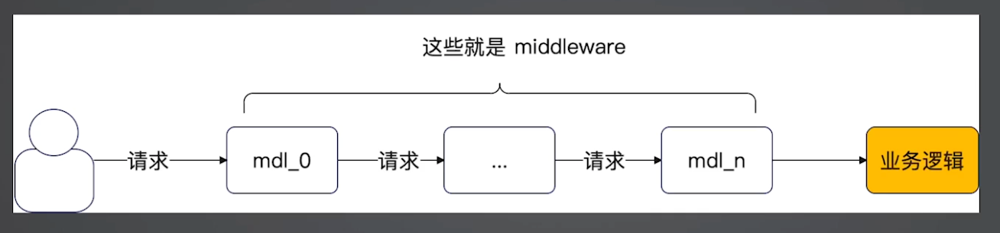

+++
title = 'AOP'
date = 2024-09-07T10:54:29+08:00
draft = true
+++

## 什么是AOP

在理解AOP之前，先介绍个东西，它在 Go 中叫中间件，也就是常说的 `middleware`。在其他语言中有叫做的 plugin、handler、filter、interceptor等等。

从图中可看到 middleware 通常是处理请求发出之后，在业务处理之前的内容，所以它通常适合用来解决一些所有业务都关心的问题，比如跨域、日志、鉴权等。

这个其实也叫做 AOP (Aspect-Oriented Programming) 解决方案。