+++
title = 'Gin入门-快速入门'
date = 2025-09-07T09:27:15+08:00
draft = true
categories = [ "Go" ]
tags = [ "go", "gin" ]
+++

应用示例选择 `Gin` 作为开发框架。`Gin` 是使用 `Golang` 编写的 HTTP Web 框架，它有着小而精的、高性能、灵活性好等优点备受大家喜爱。

## 启动

```go
package main

import (
	"net/http"

	"github.com/gin-gonic/gin"
)

func mainV1() {
	r := gin.Default()
	r.GET("/ping", func(c *gin.Context) {
		c.JSON(http.StatusOK, gin.H{
			"message": "pong",
		})
	})
	r.Run() // listen and serve on 0.0.0.0:8080 (for windows "localhost:8080")
}

func main() {
	// 实例化 gin 对象
	r := gin.Default()
	r.GET("/ping", pong)
	r.Run(":8083") // 可以自定义端口
}

func pong(c *gin.Context) {
	// 默认
	c.JSON(http.StatusOK, gin.H{
		"message": "pong",
	})

	// 也可以是map
	//c.JSON(http.StatusOK, map[string]string{
	//	"message": "pong",
	//})

	// 也可以是interface
	//c.JSON(http.StatusOK, map[string]interface{}{
	//	"message": "pong",
	//})

	// 也可以是any
	//c.JSON(http.StatusOK, map[string]any{
	//	"msg": "pong",
	//})
}

func main22() {
	// 实例化 gin 对象
	r := gin.Default()
	r.GET("/ping", pong)
	r.Run(":8083")
}

```

## New和Default的初始化路由的区别

我们看到第一句使用`r := gin.Default()` 的方式创建服务，实际上还有另外一种方式来创建：
```go
func main() {
	// 实例化 gin 对象
	r := gin.New()
	r.GET("/ping", pong)
	r.Run(":8083")
}
``

它们的区别在于：

Defualt 方式，会默认开启两个中间件，它的源码如下：
```go
// Default returns an Engine instance with the Logger and Recovery middleware already attached.
func Default(opts ...OptionFunc) *Engine {
	debugPrintWARNINGDefault()
	engine := New()
	engine.Use(Logger(), Recovery())
	return engine.With(opts...)
}
```
会看到一个 Logger，一个是 Recovery。

在启动时会在Console窗口看到打印出的log日志，就是 Logger 中间件在起作用：
```
[GIN-debug] [WARNING] Creating an Engine instance with the Logger and Recovery middleware already attached.

[GIN-debug] [WARNING] Running in "debug" mode. Switch to "release" mode in production.
 - using env:	export GIN_MODE=release
 - using code:	gin.SetMode(gin.ReleaseMode)

[GIN-debug] GET    /ping                     --> main.pong (3 handlers)
[GIN-debug] [WARNING] You trusted all proxies, this is NOT safe. We recommend you to set a value.
Please check https://pkg.go.dev/github.com/gin-gonic/gin#readme-don-t-trust-all-proxies for details.
[GIN-debug] Listening and serving HTTP on :8083


[GIN] 2025/09/07 - 09:40:27 | 200 |      71.333µs |             ::1 | GET      "/ping"

```
当发起一个请求是会看到一个日志输出，


对比下使用New方法，Console的输出如下：
```
[GIN-debug] [WARNING] Running in "debug" mode. Switch to "release" mode in production.
 - using env:	export GIN_MODE=release
 - using code:	gin.SetMode(gin.ReleaseMode)

[GIN-debug] GET    /ping                     --> main.pong (1 handlers)
[GIN-debug] [WARNING] You trusted all proxies, this is NOT safe. We recommend you to set a value.
Please check https://pkg.go.dev/github.com/gin-gonic/gin#readme-don-t-trust-all-proxies for details.
[GIN-debug] Listening and serving HTTP on :8083


```

当发起请求时会看到并没有任何日志的输出。

所以在开发时建议使用Default


下面再看下是有使用Recovery的区别，修改pong方法：
使用Default方式来启动服务，发现服务可以正常启动，console与之前并无二致
```go
./main.go:35:12: invalid operation: division by zero
```

但如果在页面中请求，会看到如下错误，此时终端也会出现panic相关错误：
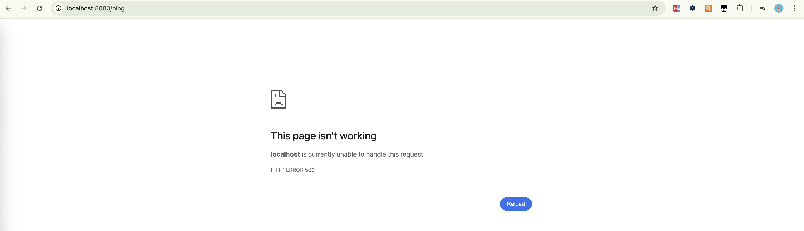

在postman中请求会收到一个500的返回错误，也就是说明请求正常，只是响应有问题。

Recover 会将异常进行捕获并处理，比如想客户端响应服务器有问题，但是不会让整个系统崩溃，不需要重启服务，对其他正常的服务并没有影响

在使用New方式启动服务，再请求：


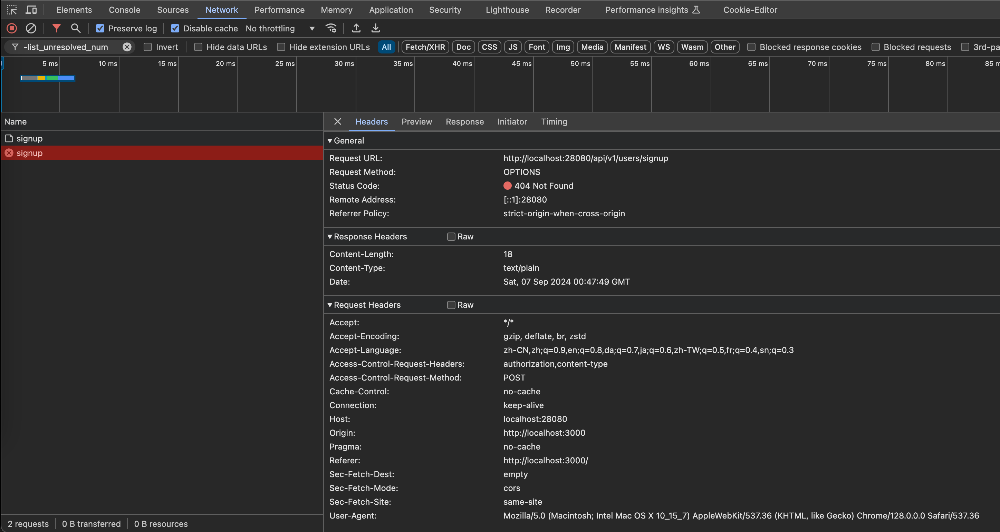
页面直接崩溃，也就是整个系统都崩溃了，它不会捕获错误，一旦发生错误，整个系统都会崩溃，需要重新启动服务。

最后不要忘了将 panic 测试代码回撤掉。

## 路由分组

**为什么需要路由分组**

比如一个项目既要提供商品服务，也有提供用户服务，为了区别两个服务，通常会分别为两个服务添加不一样的前缀，比如商品服务的前缀为 /goods，用户服务的前缀为 /users
 
```go
func main() {
	router := gin.Default()

	router.GET("/goods/list", goodsList)   // 商品列表
	router.GET("/goods/1", goodsDetail)    // 商品信息
	router.POST("/goods/add", createGoods) // 添加商品

	router.Run(":8083")
}
```

实际开发中路由不可能只有两三个，少至几十个，多至几个百也是有可能的，我们不可能将所有的url全部集中在一处进行管理，为了使路由分工明确，就有了路由分组的概念。
上面的路由都属于商品服务，它们的前缀也全都是一样的，所以我们可以提取出这些前缀，将前缀相同的作为一组，这样管理起来就比较方便了，修改代码如下：
```go
// 路由分组
func main() {
	router := gin.Default()

	// 路由分组 以 goods 开头
	goodsGroup := router.Group("/goods")
	goodsGroup.GET("/list", goodsList)   // 商品列表
	goodsGroup.GET("/detail/1", goodsDetail)    // 商品信息
	goodsGroup.POST("/add", createGoods) // 添加商品

	router.Run(":8083")
}
```

但是这样写代码还是显得拥挤，所以还可以通过大括号来就行代码块的分组，代码层次结构也比较好，代码调整如下：
```go
func main() {
	router := gin.Default()

	goodsGroup := router.Group("/goods")
	{
		goodsGroup.GET("/list", goodsList)     // 商品列表
		goodsGroup.GET("/detail/1", goodsDetail) // 商品信息
		goodsGroup.POST("/add", createGoods)   // 添加商品
	}

	router.Run(":8083")
}
```

## 路由参数

看下之前写的一条路由规则：
```go
goodsGroup := router.Group("/goods")
goodsGroup.GET("/detail/1", goodsDetail) // 商品信息
```

这条规则的意思是查询商品ID为1的商品详情，完整url如：/goods/detail/1
这是采用这种硬编码的方式，很不灵活，那如果要查询其他ID的商品详情，该如何处理呢？
我们可以将变化的内容比如商品ID提取到url中的变量中，比如：
```go
goodsGroup.GET("/detail/:id", goodsDetail) // 商品信息
```

这样如果url为 /goods/detail/1，就会将1这个ID传给url中的`:id` 这个变量，后端再进行接收，那又如何接收呢？

```go
func main() {
	router := gin.Default()

	goodsGroup := router.Group("/goods")
	{
		goodsGroup.GET("", goodsList) // 商品列表
		goodsGroup.GET("/detail/:id", goodsDetail) // 商品信息
	}

	router.Run(":8083")
}

func goodsDetail(c *gin.Context) {
	id := c.Param("id") // 注意参数不带分号
	c.JSON(http.StatusOK, gin.H{
		"id":     id,
	})
}

```

通过 `c.Param("id")` 这种方式来接收参数，注意参数不带分号。

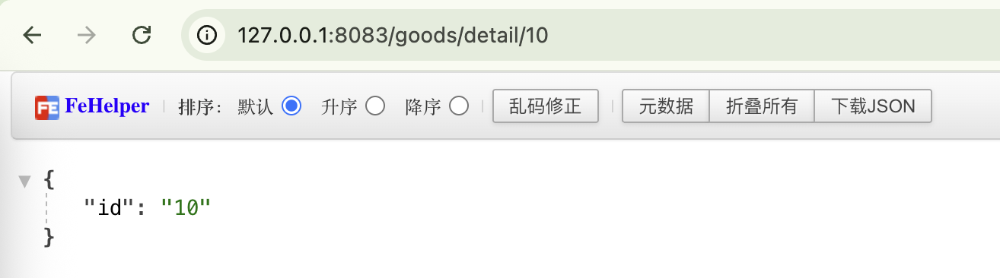


多个参数也是同样的方式处理：

```go
func main() {
	router := gin.Default()

	goodsGroup := router.Group("/goods")
	{
		goodsGroup.GET("", goodsList)              // 商品列表
		//goodsGroup.GET("/detail/:id", goodsDetail) // 商品信息
		goodsGroup.GET("/detail/:id/:action", goodsDetail) // 商品信息
	}

	router.Run(":8083")
}

func goodsDetail(c *gin.Context) {
	id := c.Param("id") // 注意参数不带分号
	action := c.Param("action")
	c.JSON(http.StatusOK, gin.H{
		"id": id,
		"action": action,
	})
}
```

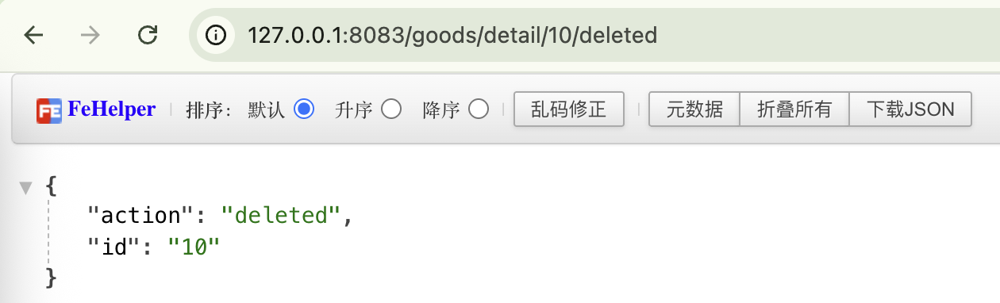


下面再看下一个列子：
```go
func main() {
	router := gin.Default()

	goodsGroup := router.Group("/goods")
	{
		goodsGroup.GET("", goodsList) // 商品列表
		goodsGroup.GET("/detail/:id/*action", goodsDetail) // 商品信息
	}
	router.Run(":8083")
}
```

与之前唯一不同的是将  `:action` 改成了 `*action`，这是什么意思？又是什么作用呢？

当我请求 `/goods/detail/10/pc/macbook/deleted` 这样的url时，action接收到的是 `/pc/macbook/deleted`

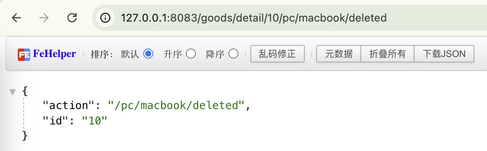

它能够将 :id 之后配置的url中所有内容当做一个整体全部取出来，获取的id之后的所有内容，实际使用中，这个情况使用的比较少，这里仅作为了解，使用场景通常用来获取服务器上的文件路径。

这个方式的使用还有个需要注意的地方：

```go
type Person struct {
	ID string `uri:"id" binding:"required,uuid"`
	Name string `uri:"name" binding:"required"`
}

func main() {
	router := gin.Default()
	// ShouldBindUri
	// 可以对URL模式做约束，比如希望ID是int
	router.GET("/:name/:id", func(c *gin.Context) {
		var person Person
		if err := c.ShouldBindUri(&person); err != nil {
			c.Status(http.StatusNotFound)
			return
		}
		c.JSON(http.StatusOK, gin.H{
			"name": person.Name,
			"id":   person.ID,
		})
	})
	router.Run(":8083")
}
```


上面的ID是string类型，且ID必须存在并且是uuid的类型，name的限制要必须存在，使用时通过 ShouldBindUri 来获取url参数。请求时我传入的id是一个数字，并且不是uuid类型

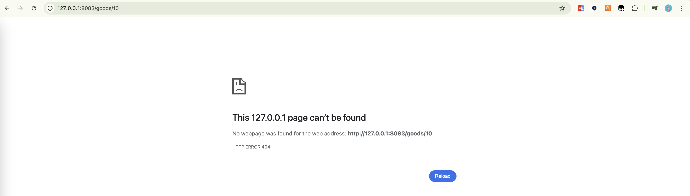

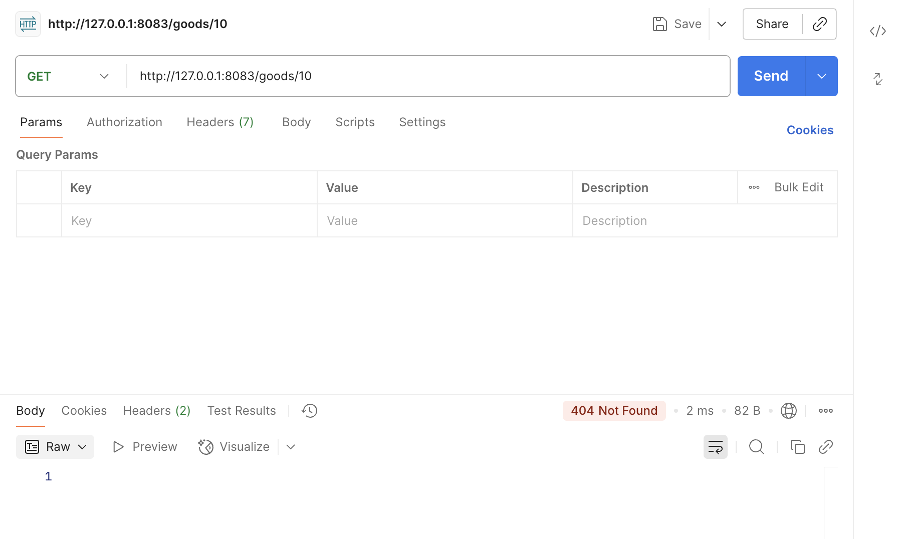

它返回的是404，这是因为url参数id不会一个string|uuid类型，而是一个int类型

如果现在调整为uuid（cffe1411-2714-4b0b-8b1b-3e1f2f3b7b6b）类型访问（http://127.0.0.1:8083/goods/cffe1411-2714-4b0b-8b1b-3e1f2f3b7b6b），就会看到访问正常：
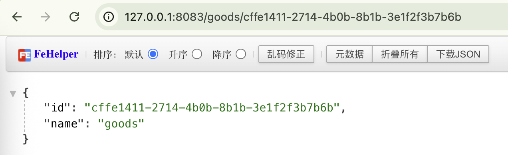
此时就会看到已经接收到了name和id的值。

现在我们将id改成int类型，再同样请求有什么不同：
```go

```

此时访问 `http://127.0.0.1:8083/food/12` 可以正常拿到id和name，但是如果请求`http://127.0.0.1:8083/food/cffe1411-2714-4b0b-8b1b-3e1f2f3b7b6b`则是出现404
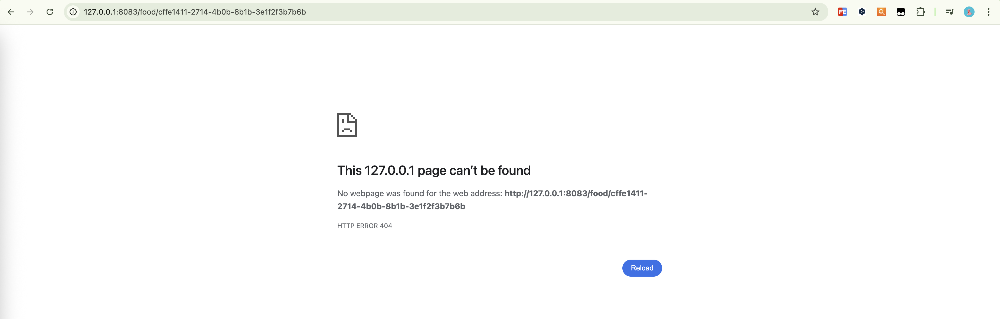

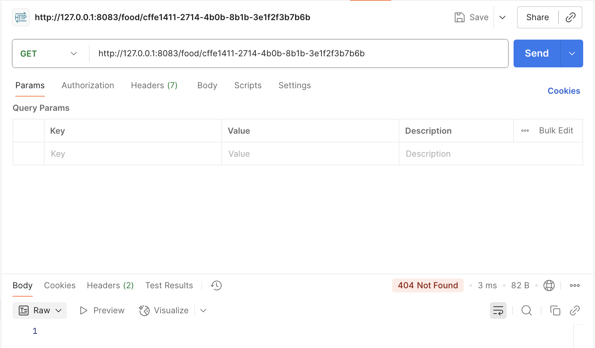

## GET和POST请求参数的获取

**获取get参数**

```go
func main() {
	router := gin.Default()
	router.GET("/welcome", welcome)
	router.Run(":8083")
}


// http://127.0.0.1:8083/welcome?firstname=aaa&lastname=bbb
func welcome(c *gin.Context) {
	firstName := c.DefaultQuery("firstname", "dog")
	lastName := c.Query("lastname") // query不需要默认值，defaultQuery需要默认值
	c.JSON(http.StatusOK, gin.H{
		"first_name": firstName,
		"last_name":  lastName,
	})
}

```

访问时url如下：`http://127.0.0.1:8083/welcome?firstname=aaa&lastname=bbb`

DefaultQuery 当url没有fistname参数时，设置默认值为dog，但如果firstname值是空的，也不会设置上默认值，而是空值，比如?firstname=&lastname=bbb
Query 方法没有设置默认值，如果没有值就是空的，比如?firstname=aaa&lastname=

上面都是Get参数的获取方式。

再看下 FORM 表单的POST提交方式：

```go
func main() {
	router := gin.Default()
	router.GET("/welcome", welcome)
	router.POST("/post_form", postForm)
	router.POST("/post", getPost)
	router.Run(":8083")
}

func postForm(c *gin.Context) {
	// 支持post form 表单，不支持json
	message := c.PostForm("message")
	nickname := c.DefaultPostForm("nickname", "zhangsan")

	c.JSON(http.StatusOK, gin.H{
		"message": message,
		"nickname":    nickname,
	})
}

```

使用postman 的Params 发送请求并不能获取到参数，会看到message的值是空的，这种方式实际上传只方式有问题：
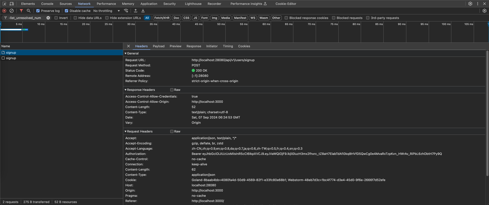


而是应该选择form-data方式:
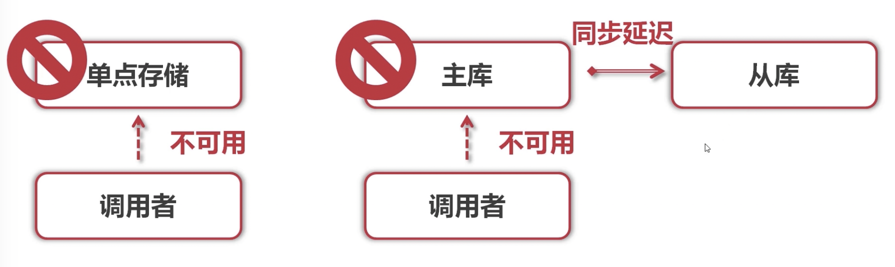


x-www-form-urlencoded 也能获取到：
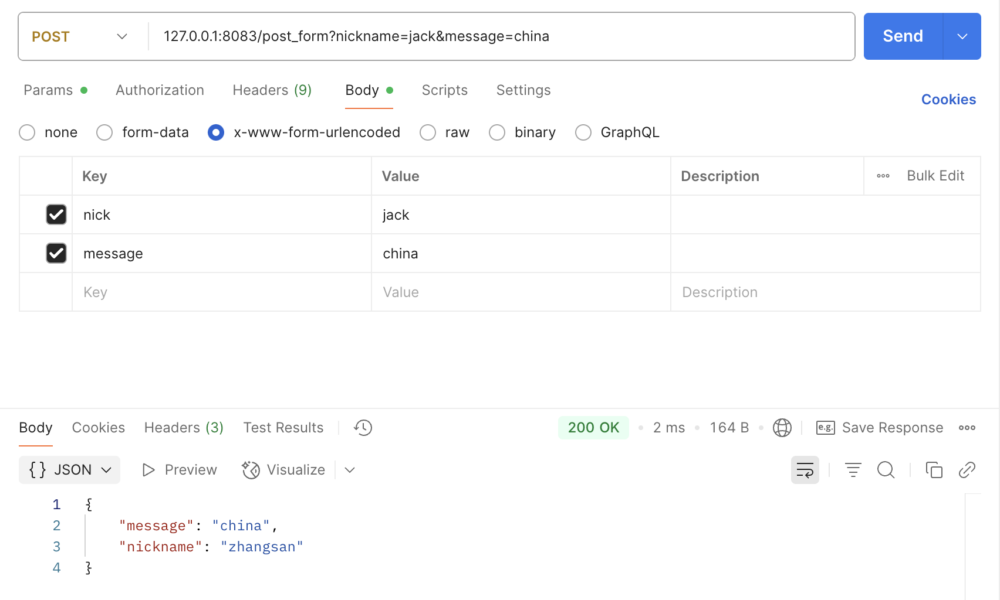

使用row方式也不行：
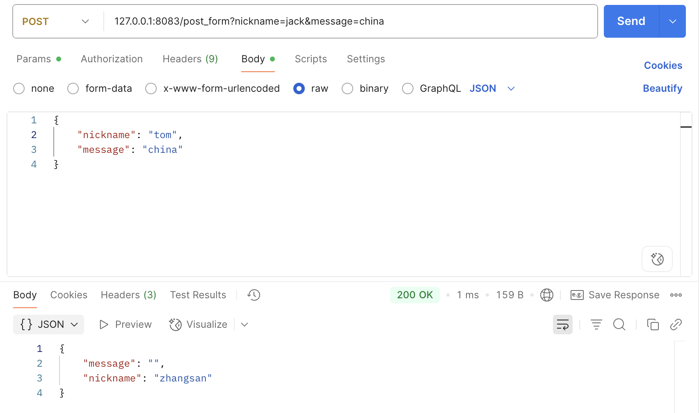


**混合获取**

```go
func main() {
	router := gin.Default()
	router.POST("/post", getPost)
	router.Run(":8083")
}

// 127.0.0.1:8083/post?id=111&page=20
// body: {"name": "aaa", "message": "bbb"}
func getPost(c *gin.Context) {
	id := c.Query("id")
	page := c.DefaultQuery("page", "0")
	name := c.PostForm("name") // 从post body中取出参数
	message := c.DefaultPostForm("message", "信息")

	c.JSON(http.StatusOK, gin.H{
		"id":      id,
		"page":    page,
		"name":    name,
		"message": message,
	})
}
```

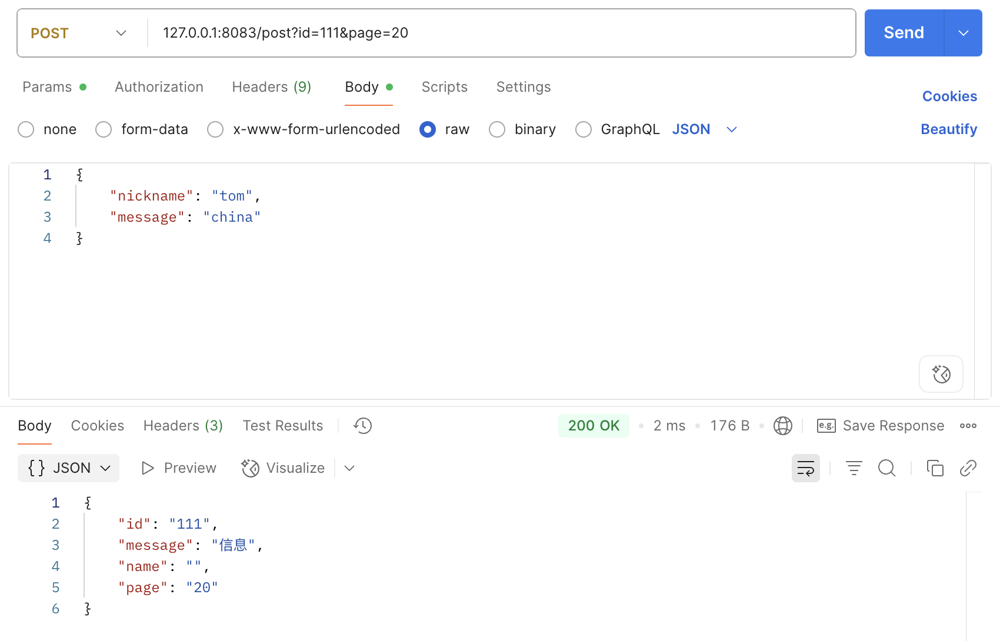


## 返回JSON和protof

**返回json**

Gin 中通常使用 c.JSON 就可以将返回以 Json 的格式输出。 我们在输出JSON的时候还可以输出struct，如果给struct配置json的标签，输出又会是什么样子呢？
在输出的时候会将struct进行转义，将Stuct 字段转换为标签多定义的内容。

```go
func main() {
	router := gin.Default()
	router.GET("/json", returnJson)
	router.Run(":8083")
}

func returnJson(c *gin.Context) {
	var msg struct {
		Name    string `json:"name"`
		Message string
		Number  int
	}
	msg.Name = "tom"
	msg.Message = "json测试"
	msg.Number = 20

	c.JSON(http.StatusOK, msg)
}

```

```json
{
    "name": "tom",
    "Message": "json测试",
    "Number": 20
}
```

会看到 name 的名称是结构体中Name配置的json标签，小写格式，其他的仍然是结构体定义的原始字段。

**protobuf**

user.proto 内容：
```proto
syntax = "proto3";

option go_package = ".;proto";

message  Teacher {
  string name = 1;
  repeated string course = 2;
}
```

```go
func main() {
	router := gin.Default()
	router.GET("/protobuf", returnProto)
	router.Run(":8083")
}

func returnProto(c *gin.Context) {
	course := []string{"python", "go", "php"}
	user := &proto.Teacher{
		Name:   "张三",
		Course: course,
	}
	c.ProtoBuf(http.StatusOK, user)
}

```

```
张三pythongophp
```

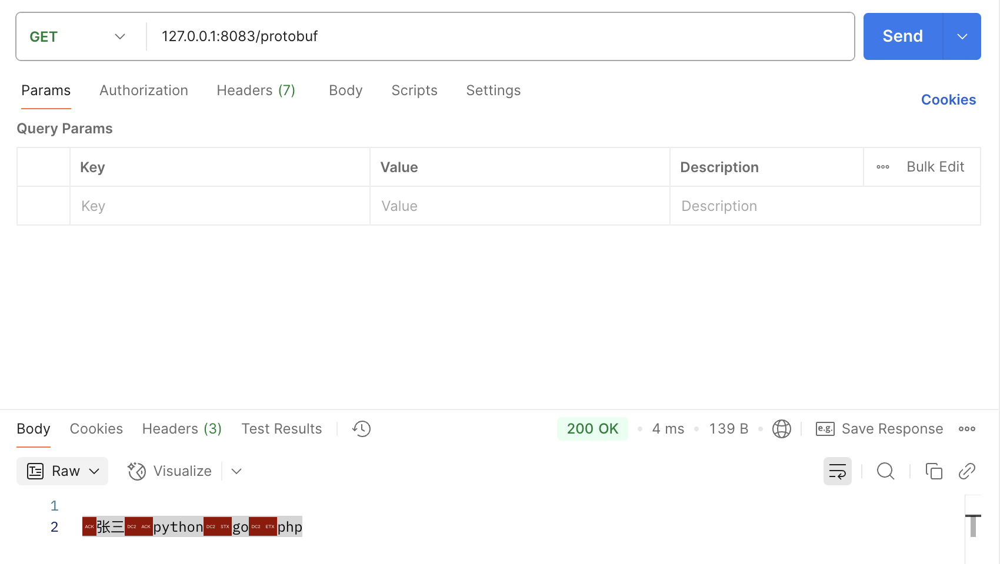

## 表单验证

表单的基本验证

若要将请求主体绑定到结构体中，请使用模型绑定，目前支持JSON、XML、YAML和标准表单值(foo=bar&boo=baz)的绑定。
Gin使用 go-playground/validator 验证参数，查看完整文档。

需要在绑定的字段上设置tag，比如，绑定格式为json，需要这样设置 json:"fieldname" 。
此外，Gin还提供了两套绑定方法：
● Must bind
  ○ Methods - Bind, BindJSON, BindXML, BindQuery, BindYAML
  ○ Behavior - 这些方法底层使用 MustBindWith，如果存在绑定错误，请求将被以下指令中止 c.AbortWithError(400, err).SetType(ErrorTypeBind)，响应状态代码会被设置为400，请求头Content-Type被设置为text/plain; charset=utf-8。注意，如果你试图在此之后设置响应代码，将会发出一个警告 [GIN-debug] [WARNING] Headers were already written. Wanted to override status code 400 with 422，如果你希望更好地控制行为，请使用ShouldBind相关的方法
● Should bind
  ○ Methods - ShouldBind, ShouldBindJSON, ShouldBindXML, ShouldBindQuery, ShouldBindYAML
  ○ Behavior - 这些方法底层使用 ShouldBindWith，如果存在绑定错误，则返回错误，开发人员可以正确处理请求和错误。
当我们使用绑定方法时，Gin会根据Content-Type推断出使用哪种绑定器，如果你确定你绑定的是什么，你可以使用MustBindWith或者BindingWith。
你还可以给字段指定特定规则的修饰符，如果一个字段用binding:"required"修饰，并且在绑定时该字段的值为空，那么将返回一个错误。


**登录**

```go
import (
	"fmt"
	"net/http"

	"github.com/gin-gonic/gin"
)

type LoginForm struct {
	// json表示前端传过来的是json格式，也可以配置form表单是个 两个互不影响
	User     string `form:"username" json:"user" binding:"required,min=3,max=10"`
	Password string `json:"password" binding:"required"`
}

func main() {
	router := gin.Default()

	router.POST("/login", func(c *gin.Context) {
		var loginForm LoginForm
		if err := c.ShouldBind(&loginForm); err != nil {
			fmt.Println(err.Error())
			c.JSON(http.StatusBadRequest, gin.H{
				"error": err.Error(),
			})

			return
		}
		c.JSON(http.StatusOK, gin.H{
			"msg": "登录成功",
		})
	})

	router.Run(":8083")
}

```

```
User     string `form:"username" json:"user" binding:"required,min=3,max=10"`
```
- 表示前端如果施一公form表单方式提交，提交的内容就必须是 user 字段，如果是json 方式提交，提交的内容也应该是 user，不同的方式提交是互不影响的。一般我们使用json提交方式比较多，可以只配置json，但也可以配置多个，比如form和json共存。
- 标签是对前端的传递或后端返回的数据字段的形式的呈现。
- 另外结构体对字段的约束除了 string 之外，还有标签中的 binding 设置的required 必填
- 如果你只写json标签，但是使用的是 form 提交，表单验证将会失败。
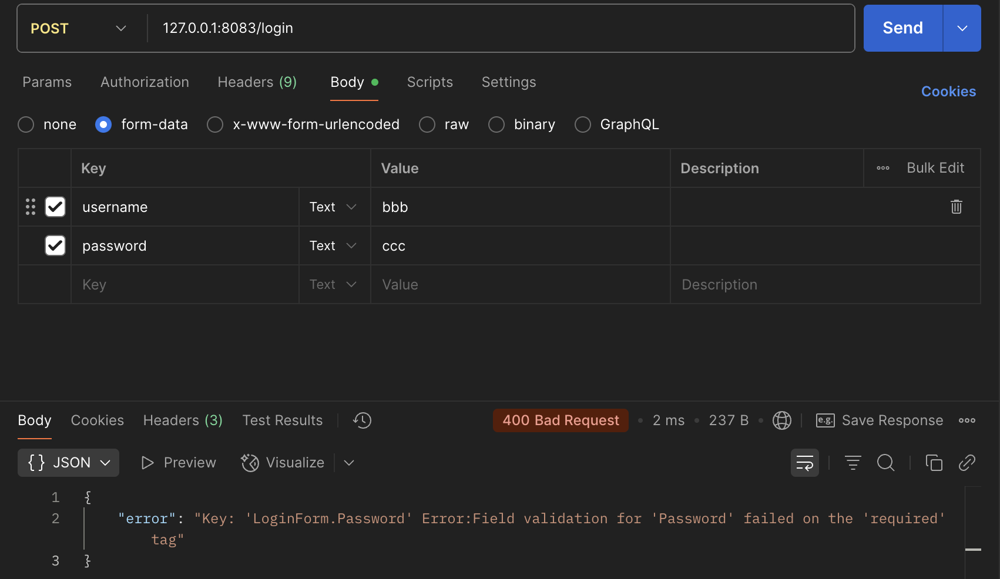

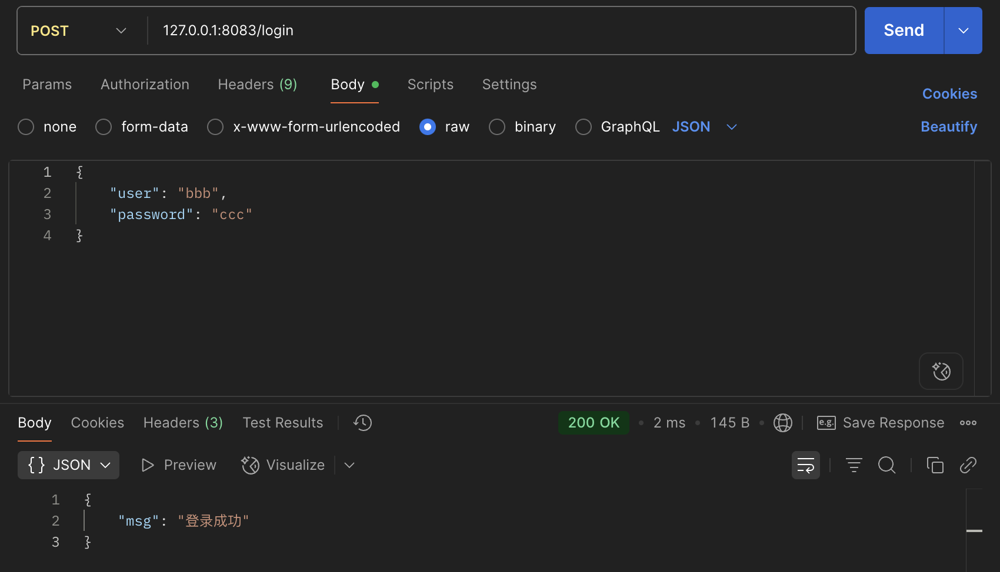


**注册**

```go
type SignUpForm struct {
	Name       string `json:"name" binding:"required"`
	Age        uint8  `json:"age" binding:"gte=1,lte=130"`
	Email      string `json:"email" binding:"required,email"`
	Password   string `json:"password" binding:"required"`
	RePassword string `json:"repassword" binding:"required,eqfield=Password"` // 跨字段验证
}

func main() {
	router := gin.Default()

	router.POST("/signup", func(c *gin.Context) {
		var signUpForm SignUpForm
		if err := c.ShouldBind(&signUpForm); err != nil {
			fmt.Println(err.Error())
			c.JSON(http.StatusBadRequest, gin.H{
				"error": err.Error(),
			})
			return
		}
		c.JSON(http.StatusOK, gin.H{
			"msg": "注册成功",
		})
	})

	router.Run(":8083")
}

```

在拿注册功能为例，可以看到：
- name 必填
- age，要求只大于等于1，小于等于130
- email，要求必填，邮箱格式
- password，要求必填
- repassword，要求必填，值与password相同.

在密码和重复密码的验证上，要求两次密码一直，当之前我们验证的时候都是单独一个字段，都是单独的本字段行添加限制，但密码和重复密码是两个不同的字段，需要两个字段进行配合，这就需要进行字段处理

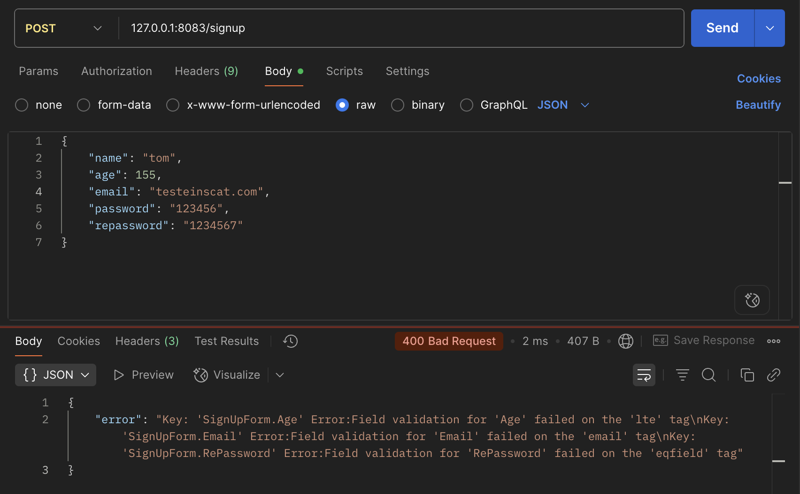

参考：https://pkg.go.dev/github.com/go-playground/validator/v10

## 表单提示错误信息翻译

参考：https://github.com/go-playground/validator/

```go
package main

import (
	"fmt"
	"net/http"

	"github.com/gin-gonic/gin"
	"github.com/gin-gonic/gin/binding"
	"github.com/go-playground/locales/en"
	"github.com/go-playground/locales/zh"
	ut "github.com/go-playground/universal-translator"
	"github.com/go-playground/validator/v10"
	en_translations "github.com/go-playground/validator/v10/translations/en"
	zh_translations "github.com/go-playground/validator/v10/translations/zh"
)

type LoginForm struct {
	User     string `json:"user" binding:"required,min=3,max=10"`
	Password string `json:"password" binding:"required"`
}

type SignUpForm struct {
	Name       string `json:"name" binding:"required"`
	Age        uint8  `json:"age" binding:"gte=1,lte=130"`
	Email      string `json:"email" binding:"required,email"`
	Password   string `json:"password" binding:"required"`
	RePassword string `json:"re_password" binding:"required,eqfield=Password"` // 跨字段验证
}

var trans ut.Translator

/*
*
locale: 传递中文还是英文
*/
func InitTrans(locale string) (err error) {
	// 修改gin框架中的 validator 引擎属性，实现定制
	// binding是gin的binding 将Engine变成Validate
	if v, ok := binding.Validator.Engine().(*validator.Validate); ok {
		zhT := zh.New() // 中文翻译器
		enT := en.New() // 英文翻译器
		// 第一个参数是备用的语言环境，后面的参数是应该支持的语言环境
		uni := ut.New(enT, zhT, enT)
		trans, ok = uni.GetTranslator(locale)
		if !ok {
			return fmt.Errorf("uni.GetTranslator(%s)", locale)
		}

		switch locale {
		case "en":
			en_translations.RegisterDefaultTranslations(v, trans)
		case "zh":
			zh_translations.RegisterDefaultTranslations(v, trans)
		default:
			en_translations.RegisterDefaultTranslations(v, trans)
		}
		return
	}
	return
}

func main() {
	if err := InitTrans("zh"); err != nil {
		fmt.Println("初始化翻译器错误")
		return
	}

	router := gin.Default()
	router.POST("/t/login", func(c *gin.Context) {
		var loginForm LoginForm
		if err := c.ShouldBind(&loginForm); err != nil {
			//fmt.Println(err.Error())
			//c.JSON(http.StatusBadRequest, gin.H{
			//	"error": err.Error(),
			//})

			// error类型转换
			errs, ok := err.(validator.ValidationErrors)
			if !ok {
				c.JSON(http.StatusOK, gin.H{
					"msg": err.Error(),
				})
			}
			c.JSON(http.StatusBadRequest, gin.H{
				"error": errs.Translate(trans),
			})

			return
		}
		c.JSON(http.StatusOK, gin.H{
			"msg": "登录成功",
		})
	})

	router.POST("/t/signup", func(c *gin.Context) {
		var signUpForm SignUpForm
		if err := c.ShouldBind(&signUpForm); err != nil {
			fmt.Println(err.Error())
			c.JSON(http.StatusBadRequest, gin.H{
				"error": err.Error(),
			})
			return
		}
		c.JSON(http.StatusOK, gin.H{
			"msg": "注册成功",
		})
	})
	_ = router.Run(":8083")
}

```

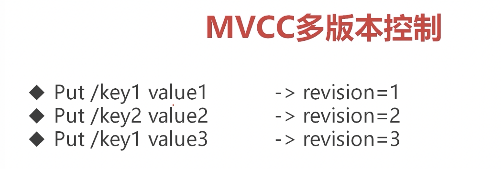