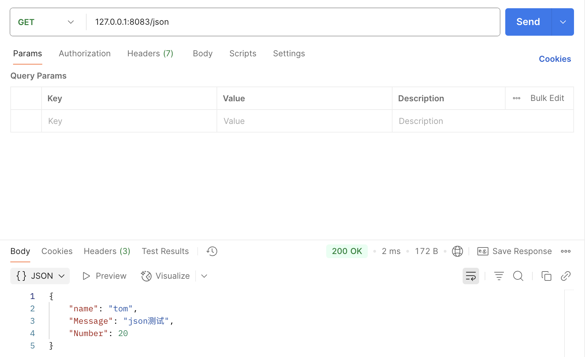
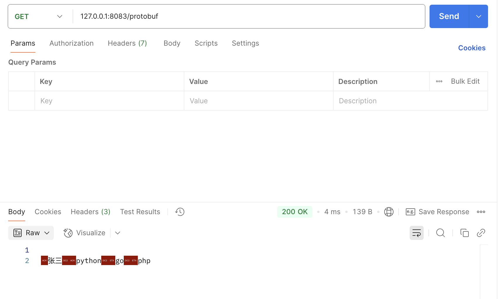
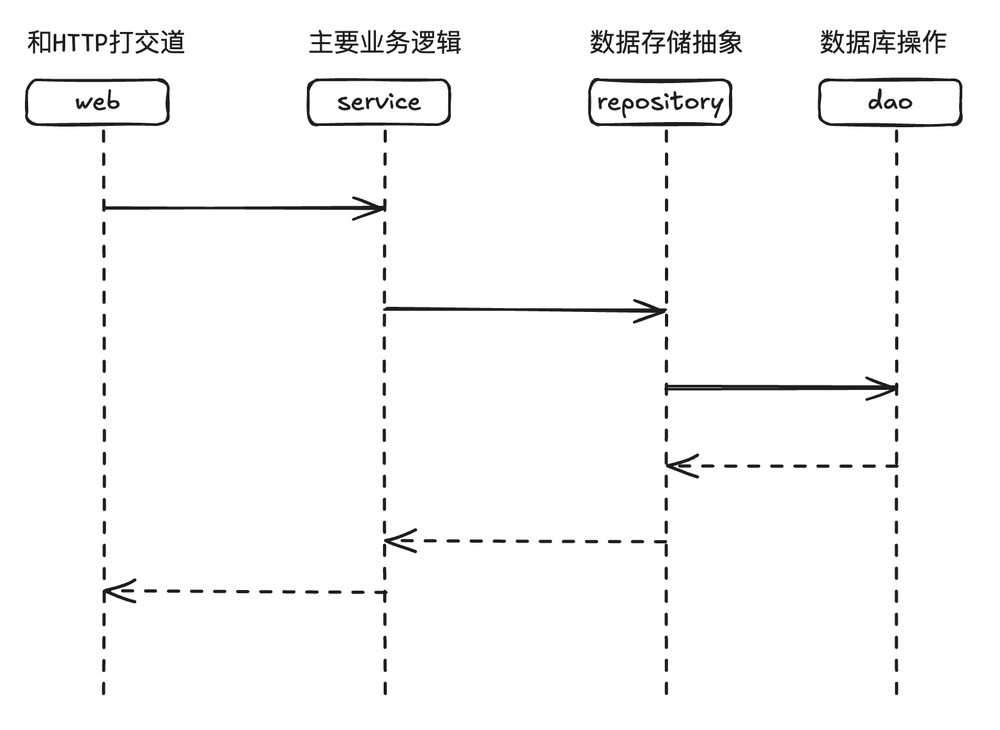
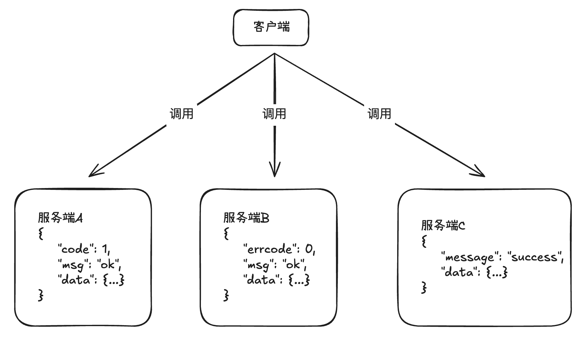

+++
title = 'Etcd入门使用'
date = 2024-09-10T22:50:39+08:00
draft = true
+++

## 特性

- 将数据存储在集群中的高可用KV存储
- 允许应用实时监听存储中的KV变化
- 能够容忍单点故障，能够应对网络分区

网络分区：分布式系统一般有多个节点，多个节点之间如果将网线切断，比如三个节点将两个节点网络断开，系统还能正常运行，这就叫网络分区

## 使用玩家

- kubernets
- cloud foundry

## 传统存储模型的痛点


etcd 就可以解决上述的问题。


## 原理

**抽屉理论（大多数理论）**

**etcd与Raft的关系**

- Raft 是强一致的集群日志同步算法
- etcd 是一个分布式KV存储
- etcd 利用 raft  算法在集群中同步 KV

Raft 协议是怎么工作的呢？
一个集群中有很多节点，将数据写入到日志中，然后将日志复制给所有的节点。
etcd 是如何实现分布式的？
etcd 利用raft算法，只需要将kv数据存储到 raft 算法的日志中，就会自然的随 raft 算法在集群中完成同步，最终每一个 etcd 节点都有完整的kv数据。


### quorum 大多数模型

etcd 集群一般有多个节点组成，一般有2N+1个节点，N表示一个基数节点，这才能形成大多数。比如5个节点，大多数就是3个节点

在分布式系统中，特别是分布式共识算法（如 Paxos 或 Raft）的上下文中，集群中的节点数通常是 2N + 1，其中 N 是指可以容忍的故障节点数。换句话说，N 是系统能够容忍的最大节点数（在这些节点出现故障的情况下），而 2N + 1 是总的节点数。

例如，如果一个系统希望能够容忍最多 1 个节点故障，那么集群中应有 2*1 + 1 = 3 个节点。这样，即使有一个节点失败，剩下的两个节点仍然可以达成共识，从而保持系统的一致性和可用性。

比如一个集群中有3个节点，一个充当 Leader 节点，另外两个充当 follower 节点。调用者将写入请求发送给 leader，leader 会将日志实时复制到其他follower节点。这个过程中调用者向Leader写入一个KV，这是Leader不会立即将结果返回给调用者，它会立即向集群中的follower做日志实时复制。这为第一阶段（日志的复制）：


当日志复制给 N+1 节点后，本地提交，返回给调用者写入成功。N+1是指大多数，比如3个节点中，要复制N+1=2个节点，由于Leader节点本身已经写入了，所以只需要另外再复制给一个 follower 节点。这位第二节点（提交）。这个节点3个节点就有两个节点是有数据了，就可以大胆告诉调用方


第二个阶段之后（完成提交之后），会周期性把提交信息告诉所有的 follower ，这样所有的 follower 就会达成自己的本地提交。这也是第二阶段

从这里也可以看出来 Raft 协议就是一个两次提交，首先是复制，复制给大多数就可以本地提交，后面就是集群的一起完整提交，这是异步的。

### 日志格式

raft 就是在写日志。现在比如集群中有5个节点：一个主4个从


### Raft 日志概念

- replication: 日志在 leader 节点生成，向 follower 节点复制，达到各个节点的日志序列最终一致
- term： 任期，重新选择产生的 leader，其 term 单调递增
- log index：日志行在日志序列的下标

### Raft 异常场景



### Raft 异常安全

- 选举 leader 需要半数以上节点参数
- 节点 commit 日志最多的允许选举为 leader
- commit 日志同样多，则term、index 越大的允许选举为 leader

### Raft 工作示例




### Raft 保证

- 提交成功的请求，一定不会丢
- 各个节点的数据将最终一致

### 交互协议

- 采用通用HTTP+JSON协议，性能低效
- SDK内置GRPC协议，性能高效

### 重要特性

- 底层存储是按 key 有序排列的，可以顺序遍历
- 因为key有序，所以etcd天然支持按目录结构高效遍历
- 支持复杂事务，提供类似 if ... then ... else ... 的事务能力
- 基于租约机制实现 key 的TTL 过期

### key 有序存储






## 安装

1. 下载

```bash
wget https://github.com/etcd-io/etcd/releases/download/v3.5.15/etcd-v3.5.15-linux-amd64.tar.gz
```

2. 解压

```bash
tar zxvf etcd-v3.5.15-linux-amd64.tar.gz
ln -s etcd-v3.5.15-linux-amd64 etcd
cd etcd
# ll
total 54108
drwxr-xr-x 3 520452 89939     4096 Jul 19 20:15 ./
drwxr-xr-x 4 root   root      4096 Sep 10 23:46 ../
drwxr-xr-x 3 520452 89939     4096 Jul 19 20:15 Documentation/
-rw-r--r-- 1 520452 89939    42066 Jul 19 20:15 README-etcdctl.md
-rw-r--r-- 1 520452 89939     7359 Jul 19 20:15 README-etcdutl.md
-rw-r--r-- 1 520452 89939     9210 Jul 19 20:15 README.md
-rw-r--r-- 1 520452 89939     7896 Jul 19 20:15 READMEv2-etcdctl.md
-rwxr-xr-x 1 520452 89939 23195648 Jul 19 20:15 etcd*
-rwxr-xr-x 1 520452 89939 17543168 Jul 19 20:15 etcdctl*
-rwxr-xr-x 1 520452 89939 14581760 Jul 19 20:15 etcdutl*
```

3. 启动

```bash
nohup ./etcd --listen-client-urls 'http://0.0.0.0:2379' --advertise-client-urls 'http://0.0.0.0:2379' &
```

4. 查看 less nohup.out 输出

```bash
{"level":"warn","ts":"2024-09-10T23:48:32.854059Z","caller":"embed/config.go:687","msg":"Running http and grpc server on single port. This is not recommended for production."}
{"level":"info","ts":"2024-09-10T23:48:32.854227Z","caller":"etcdmain/etcd.go:73","msg":"Running: ","args":["./etcd","--listen-client-urls","http://0.0.0.0:2379","--advertise-client-urls","http://0.0.0.0:2379"]}
{"level":"warn","ts":"2024-09-10T23:48:32.854395Z","caller":"etcdmain/etcd.go:105","msg":"'data-dir' was empty; using default","data-dir":"default.etcd"}
{"level":"warn","ts":"2024-09-10T23:48:32.854982Z","caller":"embed/config.go:687","msg":"Running http and grpc server on single port. This is not recommended for production."}
{"level":"info","ts":"2024-09-10T23:48:32.855014Z","caller":"embed/etcd.go:128","msg":"configuring peer listeners","listen-peer-urls":["http://localhost:2380"]}
{"level":"info","ts":"2024-09-10T23:48:32.855670Z","caller":"embed/etcd.go:136","msg":"configuring client listeners","listen-client-urls":["http://0.0.0.0:2379"]}
{"level":"info","ts":"2024-09-10T23:48:32.855818Z","caller":"embed/etcd.go:310","msg":"starting an etcd server","etcd-version":"3.5.15","git-sha":"9a5533382","go-version":"go1.21.12","go-os":"linux","go-arch":"amd64","max-cpu-set":16,"max-cpu-available":16,"member-initialized":false,"name":"default","data-dir":"default.etcd","wal-dir":"","wal-dir-dedicated":"","member-dir":"default.etcd/member","force-new-cluster":false,"heartbeat-interval":"100ms","election-timeout":"1s","initial-election-tick-advance":true,"snapshot-count":100000,"max-wals":5,"max-snapshots":5,"snapshot-catchup-entries":5000,"initial-advertise-peer-urls":["http://localhost:2380"],"listen-peer-urls":["http://localhost:2380"],"advertise-client-urls":["http://0.0.0.0:2379"],"listen-client-urls":["http://0.0.0.0:2379"],"listen-metrics-urls":[],"cors":["*"],"host-whitelist":["*"],"initial-cluster":"default=http://localhost:2380","initial-cluster-state":"new","initial-cluster-token":"etcd-cluster","quota-backend-bytes":2147483648,"max-request-bytes":1572864,"max-concurrent-streams":4294967295,"pre-vote":true,"initial-corrupt-check":false,"corrupt-check-time-interval":"0s","compact-check-time-enabled":false,"compact-check-time-interval":"1m0s","auto-compaction-mode":"periodic","auto-compaction-retention":"0s","auto-compaction-interval":"0s","discovery-url":"","discovery-proxy":"","downgrade-check-interval":"5s"}
{"level":"info","ts":"2024-09-10T23:48:32.857847Z","caller":"etcdserver/backend.go:81","msg":"opened backend db","path":"default.etcd/member/snap/db","took":"1.658811ms"}
{"level":"info","ts":"2024-09-10T23:48:32.860426Z","caller":"etcdserver/raft.go:495","msg":"starting local member","local-member-.5.15","git-sha":"9a5533382","go-version":"go1.21.12","go-os":"linux","go-arch":"amd64","max-cpu-set":16,"max-cpu-available":16,"
member-initialized":false,"name":"default","data-dir":"default.etcd","wal-dir":"","wal-dir-dedicated":"","member-dir":"default.et
cd/member","force-new-cluster":false,"heartbeat-interval":"100ms","election-timeout":"1s","initial-election-tick-advance":true,"s
napshot-count":100000,"max-wals":5,"max-snapshots":5,"snapshot-catchup-entries":5000,"initial-advertise-peer-urls":["http://local
host:2380"],"listen-peer-urls":["http://localhost:2380"],"advertise-client-urls":["http://0.0.0.0:2379"],"listen-client-urls":["h
ttp://0.0.0.0:2379"],"listen-metrics-urls":[],"cors":["*"],"host-whitelist":["*"],"initial-cluster":"default=http://localhost:238
0","initial-cluster-state":"new","initial-cluster-token":"etcd-cluster","quota-backend-bytes":2147483648,"max-request-bytes":1572
864,"max-concurrent-streams":4294967295,"pre-vote":true,"initial-corrupt-check":false,"corrupt-check-time-interval":"0s","compact
-check-time-enabled":false,"compact-check-time-interval":"1m0s","auto-compaction-mode":"periodic","auto-compaction-retention":"0s
","auto-compaction-interval":"0s","discovery-url":"","discovery-proxy":"","downgrade-check-interval":"5s"}
{"level":"info","ts":"2024-09-10T23:48:32.857847Z","caller":"etcdserver/backend.go:81","msg":"opened backend db","path":"default.
etcd/member/snap/db","took":"1.658811ms"}
{"level":"info","ts":"2024-09-10T23:48:32.860426Z","caller":"etcdserver/raft.go:495","msg":"starting local member","local-member-
id":"8e9e05c52164694d","cluster-id":"cdf818194e3a8c32"}
{"level":"info","ts":"2024-09-10T23:48:32.860520Z","logger":"raft","caller":"etcdserver/zap_raft.go:77","msg":"8e9e05c52164694d switched to configuration voters=()"}
{"level":"info","ts":"2024-09-10T23:48:32.860570Z","logger":"raft","caller":"etcdserver/zap_raft.go:77","msg":"8e9e05c52164694d became follower at term 0"}
{"level":"info","ts":"2024-09-10T23:48:32.860585Z","logger":"raft","caller":"etcdserver/zap_raft.go:77","msg":"newRaft 8e9e05c52164694d [peers: [], term: 0, commit: 0, applied: 0, lastindex: 0, lastterm: 0]"}
{"level":"info","ts":"2024-09-10T23:48:32.860602Z","logger":"raft","caller":"etcdserver/zap_raft.go:77","msg":"8e9e05c52164694d became follower at term 1"}
{"level":"info","ts":"2024-09-10T23:48:32.860651Z","logger":"raft","caller":"etcdserver/zap_raft.go:77","msg":"8e9e05c52164694d switched to configuration voters=(10276657743932975437)"}
{"level":"warn","ts":"2024-09-10T23:48:32.865492Z","caller":"auth/store.go:1241","msg":"simple token is not cryptographically signed"}
{"level":"info","ts":"2024-09-10T23:48:32.867325Z","caller":"mvcc/kvstore.go:418","msg":"kvstore restored","current-rev":1}
{"level":"info","ts":"2024-09-10T23:48:32.868436Z","caller":"etcdserver/quota.go:94","msg":"enabled backend quota with default vawitched to configuration voters=(10276657743932975437)"}
{"level":"warn","ts":"2024-09-10T23:48:32.865492Z","caller":"auth/store.go:1241","msg":"simple token is not cryptographically sig
ned"}
{"level":"info","ts":"2024-09-10T23:48:32.867325Z","caller":"mvcc/kvstore.go:418","msg":"kvstore restored","current-rev":1}
{"level":"info","ts":"2024-09-10T23:48:32.868436Z","caller":"etcdserver/quota.go:94","msg":"enabled backend quota with default va
","auto-compaction-interval":"0s","discovery-url":"","discovery-proxy":"","downgrade-check-interval":"5s"}
{"level":"info","ts":"2024-09-10T23:48:32.857847Z","caller":"etcdserver/backend.go:81","msg":"opened backend db","path":"default.
","auto-compaction-interval":"0s","discovery-url":"","discovery-proxy":"","downgrade-check-interval":"5s"}
{"level":"info","ts":"2024-09-10T23:48:32.857847Z","caller":"etcdserver/backend.go:81","msg":"opened backend db","path":"default.
etcd/member/snap/db","took":"1.658811ms"}
{"level":"info","ts":"2024-09-10T23:48:32.860426Z","caller":"etcdserver/raft.go:495","msg":"starting local member","local-member-
id":"8e9e05c52164694d","cluster-id":"cdf818194e3a8c32"}
{"level":"info","ts":"2024-09-10T23:48:32.860520Z","logger":"raft","caller":"etcdserver/zap_raft.go:77","msg":"8e9e05c52164694d s
witched to configuration voters=()"}
{"level":"info","ts":"2024-09-10T23:48:32.860570Z","logger":"raft","caller":"etcdserver/zap_raft.go:77","msg":"8e9e05c52164694d b
ecame follower at term 0"}
{"level":"info","ts":"2024-09-10T23:48:32.860585Z","logger":"raft","caller":"etcdserver/zap_raft.go:77","msg":"newRaft 8e9e05c521
{"level":"info","ts":"2024-09-10T23:48:32.860585Z","logger":"raft","caller":"etcdserver/zap_raft.go:77","msg":"newRaft 8e9e05c521
64694d [peers: [], term: 0, commit: 0, applied: 0, lastindex: 0, lastterm: 0]"}
{"level":"info","ts":"2024-09-10T23:48:32.860602Z","logger":"raft","caller":"etcdserver/zap_raft.go:77","msg":"8e9e05c52164694d b
64694d [peers: [], term: 0, commit: 0, applied: 0, lastindex: 0, lastterm: 0]"}
{"level":"info","ts":"2024-09-10T23:48:32.860602Z","logger":"raft","caller":"etcdserver/zap_raft.go:77","msg":"8e9e05c52164694d b
ecame follower at term 1"}
{"level":"info","ts":"2024-09-10T23:48:32.860651Z","logger":"raft","caller":"etcdserver/zap_raft.go:77","msg":"8e9e05c52164694d s
864,"max-concurrent-streams":4294967295,"pre-vote":true,"initial-corrupt-check":false,"corrupt-check-time-interval":"0s","compact
-check-time-enabled":false,"compact-check-time-interval":"1m0s","auto-compaction-mode":"periodic","auto-compaction-retention":"0s
","auto-compaction-interval":"0s","discovery-url":"","discovery-proxy":"","downgrade-check-interval":"5s"}
","auto-compaction-interval":"0s","discovery-url":"","discovery-proxy":"","downgrade-check-interval":"5s"}
","auto-compaction-interval":"0s","discovery-url":"","discovery-proxy":"","downgrade-check-interval":"5s"}
{"level":"info","ts":"2024-09-10T23:48:32.857847Z","caller":"etcdserver/backend.go:81","msg":"opened backend db","path":"default.
{"level":"info","ts":"2024-09-10T23:48:32.857847Z","caller":"etcdserver/backend.go:81","msg":"opened backend db","path":"default.
etcd/member/snap/db","took":"1.658811ms"}
{"level":"info","ts":"2024-09-10T23:48:32.860426Z","caller":"etcdserver/raft.go:495","msg":"starting local member","local-member-
id":"8e9e05c52164694d","cluster-id":"cdf818194e3a8c32"}
{"level":"info","ts":"2024-09-10T23:48:32.860520Z","logger":"raft","caller":"etcdserver/zap_raft.go:77","msg":"8e9e05c52164694d s
witched to configuration voters=()"}
{"level":"info","ts":"2024-09-10T23:48:32.860570Z","logger":"raft","caller":"etcdserver/zap_raft.go:77","msg":"8e9e05c52164694d b
ecame follower at term 0"}
{"level":"info","ts":"2024-09-10T23:48:32.860585Z","logger":"raft","caller":"etcdserver/zap_raft.go:77","msg":"newRaft 8e9e05c521
64694d [peers: [], term: 0, commit: 0, applied: 0, lastindex: 0, lastterm: 0]"}
{"level":"info","ts":"2024-09-10T23:48:32.860602Z","logger":"raft","caller":"etcdserver/zap_raft.go:77","msg":"8e9e05c52164694d b
ecame follower at term 1"}
ecame follower at term 1"}
ecame follower at term 1"}
{"level":"info","ts":"2024-09-10T23:48:32.860651Z","logger":"raft","caller":"etcdserver/zap_raft.go:77","msg":"8e9e05c52164694d s
witched to configuration voters=(10276657743932975437)"}
{"level":"warn","ts":"2024-09-10T23:48:32.865492Z","caller":"auth/store.go:1241","msg":"simple token is not cryptographically sig
ned"}
{"level":"info","ts":"2024-09-10T23:48:32.867325Z","caller":"mvcc/kvstore.go:418","msg":"kvstore restored","current-rev":1}
{"level":"info","ts":"2024-09-10T23:48:32.868436Z","caller":"etcdserver/quota.go:94","msg":"enabled backend quota with default va
lue","quota-name":"v3-applier","quota-size-bytes":2147483648,"quota-size":"2.1 GB"}
{"level":"info","ts":"2024-09-10T23:48:32.869524Z","caller":"etcdserver/server.go:867","msg":"starting etcd server","local-member-id":"8e9e05c52164694d","local-server-version":"3.5.15","cluster-version":"to_be_decided"}
{"level":"info","ts":"2024-09-10T23:48:32.869744Z","caller":"etcdserver/server.go:751","msg":"started as single-node; fast-forwarding election ticks","local-member-id":"8e9e05c52164694d","forward-ticks":9,"forward-duration":"900ms","election-ticks":10,"election-timeout":"1s"}
{"level":"info","ts":"2024-09-10T23:48:32.869705Z","caller":"fileutil/purge.go:50","msg":"started to purge file","dir":"default.etcd/member/snap","suffix":"snap.db","max":5,"interval":"30s"}
{"level":"info","ts":"2024-09-10T23:48:32.869851Z","caller":"fileutil/purge.go:50","msg":"started to purge file","dir":"default.etcd/member/snap","suffix":"snap","max":5,"interval":"30s"}
{"level":"info","ts":"2024-09-10T23:48:32.869740Z","caller":"v3rpc/health.go:61","msg":"grpc service status changed","service":"","status":"SERVING"}
{"level":"info","ts":"2024-09-10T23:48:32.869872Z","caller":"fileutil/purge.go:50","msg":"started to purge file","dir":"default.etcd/member/wal","suffix":"wal","max":5,"interval":"30s"}
{"level":"info","ts":"2024-09-10T23:48:32.870432Z","logger":"raft","caller":"etcdserver/zap_raft.go:77","msg":"8e9e05c52164694d switched to configuration voters=(10276657743932975437)"}
{"level":"info","ts":"2024-09-10T23:48:32.870591Z","caller":"membership/cluster.go:421","msg":"added member","cluster-id":"cdf818
194e3a8c32","local-member-id":"8e9e05c52164694d","added-peer-id":"8e9e05c52164694d","added-peer-peer-urls":["http://localhost:238
0"]}
{"level":"info","ts":"2024-09-10T23:48:32.872105Z","caller":"embed/etcd.go:599","msg":"serving peer traffic","address":"127.0.0.1
:2380"}
{"level":"info","ts":"2024-09-10T23:48:32.872121Z","caller":"embed/etcd.go:571","msg":"cmux::serve","address":"127.0.0.1:2380"}
{"level":"info","ts":"2024-09-10T23:48:32.872174Z","caller":"embed/etcd.go:279","msg":"now serving peer/client/metrics","local-me
mber-id":"8e9e05c52164694d","initial-advertise-peer-urls":["http://localhost:2380"],"listen-peer-urls":["http://localhost:2380"],
"advertise-client-urls":["http://0.0.0.0:2379"],"listen-client-urls":["http://0.0.0.0:2379"],"listen-metrics-urls":[]}
{"level":"info","ts":"2024-09-10T23:48:33.860902Z","logger":"raft","caller":"etcdserver/zap_raft.go:77","msg":"8e9e05c52164694d i
s starting a new election at term 1"}
{"level":"info","ts":"2024-09-10T23:48:33.860973Z","logger":"raft","caller":"etcdserver/zap_raft.go:77","msg":"8e9e05c52164694d b
ecame pre-candidate at term 1"}
{"level":"info","ts":"2024-09-10T23:48:33.861015Z","logger":"raft","caller":"etcdserver/zap_raft.go:77","msg":"8e9e05c52164694d r
eceived MsgPreVoteResp from 8e9e05c52164694d at term 1"}
{"level":"info","ts":"2024-09-10T23:48:33.861033Z","logger":"raft","caller":"etcdserver/zap_raft.go:77","msg":"8e9e05c52164694d b
ecame candidate at term 2"}
{"level":"info","ts":"2024-09-10T23:48:33.861043Z","logger":"raft","caller":"etcdserver/zap_raft.go:77","msg":"8e9e05c52164694d r
eceived MsgVoteResp from 8e9e05c52164694d at term 2"}
{"level":"info","ts":"2024-09-10T23:48:33.861056Z","logger":"raft","caller":"etcdserver/zap_raft.go:77","msg":"8e9e05c52164694d b
ecame leader at term 2"}
{"level":"info","ts":"2024-09-10T23:48:33.861067Z","logger":"raft","caller":"etcdserver/zap_raft.go:77","msg":"raft.node: 8e9e05c
52164694d elected leader 8e9e05c52164694d at term 2"}
{"level":"info","ts":"2024-09-10T23:48:33.861781Z","caller":"etcdserver/server.go:2629","msg":"setting up initial cluster version
 using v2 API","cluster-version":"3.5"}
{"level":"info","ts":"2024-09-10T23:48:33.862176Z","caller":"embed/serve.go:103","msg":"ready to serve client requests"}
{"level":"info","ts":"2024-09-10T23:48:33.862173Z","caller":"etcdserver/server.go:2118","msg":"published local member to cluster
through raft","local-member-id":"8e9e05c52164694d","local-member-attributes":"{Name:default ClientURLs:[http://0.0.0.0:2379]}","r
equest-path":"/0/members/8e9e05c52164694d/attributes","cluster-id":"cdf818194e3a8c32","publish-timeout":"7s"}
{"level":"info","ts":"2024-09-10T23:48:33.862421Z","caller":"membership/cluster.go:584","msg":"set initial cluster version","clus
ter-id":"cdf818194e3a8c32","local-member-id":"8e9e05c52164694d","cluster-version":"3.5"}
{"level":"info","ts":"2024-09-10T23:48:33.862480Z","caller":"etcdmain/main.go:44","msg":"notifying init daemon"}
{"level":"info","ts":"2024-09-10T23:48:33.862590Z","caller":"etcdmain/main.go:50","msg":"successfully notified init daemon"}
{"level":"info","ts":"2024-09-10T23:48:33.862567Z","caller":"api/capability.go:75","msg":"enabled capabilities for version","clus
ter-version":"3.5"}
{"level":"info","ts":"2024-09-10T23:48:33.862659Z","caller":"etcdserver/server.go:2653","msg":"cluster version is updated","clust
er-version":"3.5"}
{"level":"info","ts":"2024-09-10T23:48:33.862902Z","caller":"v3rpc/health.go:61","msg":"grpc service status changed","service":""
,"status":"SERVING"}
{"level":"info","ts":"2024-09-10T23:48:33.863501Z","caller":"embed/serve.go:187","msg":"serving client traffic insecurely; this i
s strongly discouraged!","traffic":"grpc+http","address":"[::]:2379"}
```

可以看到 server 2379 端口上做了监听，监听在任意网卡上，这种做法不建议。

4. 使用

**设置一个key并获取**

 
```bash
root@ubuntu:/opt/etcd# ./etcdctl put name etcd
OK
root@ubuntu:/opt/etcd# ./etcdctl get name
name
etcd
root@ubuntu:/opt/etcd# ./etcdctl del name
1
root@ubuntu:/opt/etcd# ./etcdctl get name
root@ubuntu:/opt/etcd#
```

etcd 底层存储是按key顺序存储，比如吧定时任务放到job目录下
```bash
root@ubuntu:/opt/etcd# ./etcdctl put "/cron/jobs/job1" "{...job1}"
OK
root@ubuntu:/opt/etcd# ./etcdctl put "/cron/jobs/job2" "{...job2}"
OK
root@ubuntu:/opt/etcd#
```

对于etcd 这两个目录它是不理解的“/cron/jobs/job1”， “/cron/jobs/job2”，它只知道是两个字符串，只有我们理解它是个目录，但因为etcd有序，所以相同前缀的key会排列在一起，所以可以get某一个job

```bash
root@ubuntu:/opt/etcd# ./etcdctl get "/cron/jobs/job1"
/cron/jobs/job1
{...job1}
root@ubuntu:/opt/etcd#
```

获取 jobs 目录下的所有job，直接get "/cron/jobs" 肯定获取不到，因为它不理解这是目录，而是认为是字符串
```bash
root@ubuntu:/opt/etcd# ./etcdctl get "/cron/jobs" --prefix
/cron/jobs/job1
{...job1}
/cron/jobs/job2
{...job2}
root@ubuntu:/opt/etcd#
```

另开一个终端watch 监听某个前缀（比如某个目录）的变化：
```bash
root@ubuntu:/opt/etcd# ./etcdctl watch "/cron/jobs/" --prefix


```
回车之后会发现进入到了阻塞状态

现在回到原来的终端去做个更新：
```bash
root@ubuntu:/opt/etcd# ./etcdctl put "/cron/jobs/job2" "{111}"
OK
root@ubuntu:/opt/etcd# ./etcdctl del "/cron/jobs/job2"
1
root@ubuntu:/opt/etcd#
```

会发现watch监听输出：
```bash
root@ubuntu:/opt/etcd# ./etcdctl watch "/cron/jobs/" --prefix


PUT
/cron/jobs/job2
{111}
DELETE
/cron/jobs/job2

```

从这里可以看出来 etcd 很适合做配置的分发，可以实时感受到变化。

## Go 连接 etcd

