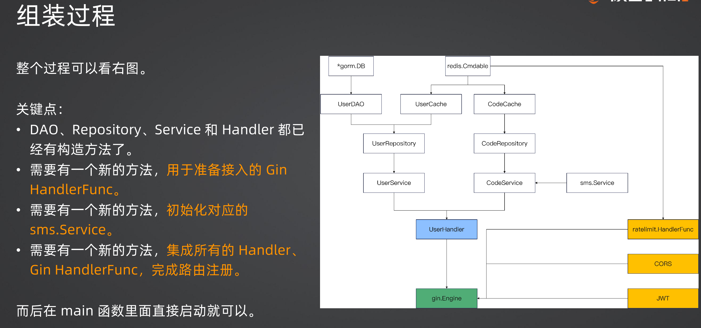

+++
title = '依赖注入与Wire'
date = 2025-08-28T12:16:27+08:00
draft = true
categories = [ "Go" ]
tags = [ "go", "wire" ]
+++

先看一个常见的初始化代码：

```go
func main() {
	db := initDB()
	rdb := initRedis()

	server := initWebServer()
	u := initUser(db, rdb)
	u.RegisterRoutes(server)

	server.Run(":80")
}

func initUser(db *gorm.DB, rdb goredis.Cmdable) *web.UserHandler {
	ud := dao.NewUserDAO(db)
	uc := cache.NewUserCache(rdb)
	repo := repository.NewUserRepository(ud, uc)
	svc := service.NewUserService(repo)

	codeCache := cache.NewCodeCache(rdb)
	codeRepo := repository.NewCodeRepository(codeCache)
	smsSvc := memory.NewService()
	codeSvc := service.NewCodeService(codeRepo, smsSvc)
	u := web.NewUserHandler(svc, codeSvc)
	return u
}

func initWebServer() *gin.Engine {
	...
}

func initRedis() goredis.Cmdable {
	...
}

func initDB() *gorm.DB {
	...
}
```

步骤如下：

- 初始化第三方依赖，如 DB、Redis等
- 用 DB、Redis 初始化 DAO、Cache
- 用 DAO、Cache 初始化 Repository
- 用 Repository 初始化 Service
- 用 Service 初始化 Handler
- 初始化 Gin，然后注册路由
- 初始化结束

从上面的过程可以看到就是层层组装，逐渐依赖，这也是标准的依赖注入写法。

> 依赖注入：指 A 依赖 B，即 A 要调用 B 上的方法，那么 A 在初始化的时候就要求传入一个构建的 B，而不是让 A 自己去构建 B。

比如 NewUserHandler 方法中要求传入 service，它的内部丝毫不关心如何初始化 Service，

这个过程看上去很优雅，层次分明，但实际上也很繁琐，另外也不利于重构，


对比：


像左边的非注入方式的写法缺点如下：
- 需要自己去维护管理初始化细节
- 没办法复用公共资源，比如里面的redis初始化，在其他地方使用时可能需要重新初始化

所有右边的注入方式所依赖的服务初始化根本不关注，它只管用，减轻了方法的职责。而不是过分干涉，人生太短，它可不想那么累，就像富二代，它们才不管父母怎么挣钱的，它们只管花。

两种写法的对比：


难道依赖注入就没有缺点吗？


## 引入依赖注入中间件


## wire

1、安装
```
go install github.com/google/wire/cmd/wire@latest
```

2、运行
```
wire
```

例：
```
wire
wire: xaosphere: wrote /Users/finnley/workspace/Mine/xaosphere/wire_gen.go
```

