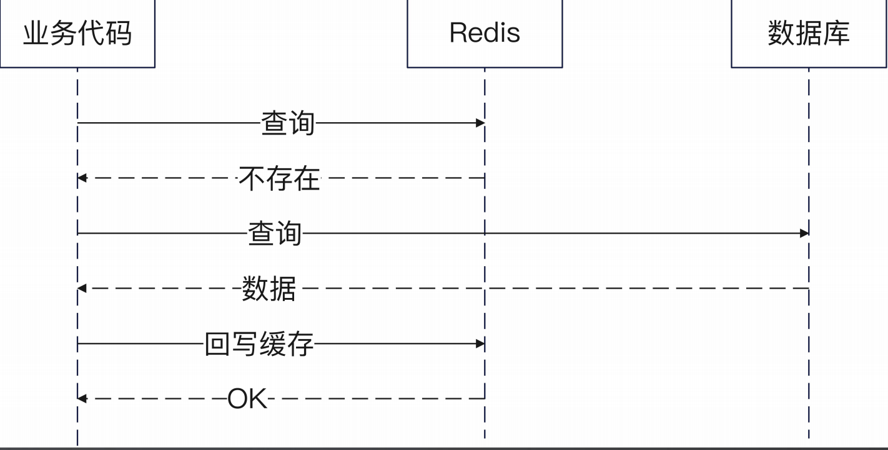

+++
title = '性能优化之引入缓存'
date = 2025-08-26T10:36:11+08:00
draft = true
categories = [ "Go" ]
tags = [ "go", "cache" ]
+++

## 性能瓶颈

`数据库查询`是我们常见一个性能瓶颈，我们可以考虑引入 `Redis缓存` 来优化这个问题。

用户可以 `先从Redis查询`，在缓存未命中的情况下，就直接从数据库查询。

