+++
title = '浏览器跨域请求问题'
date = 2024-09-07T08:12:10+08:00
draft = true
categories = [ "Go" ]
tags = [ "go", "cros" ]
+++

## 背景

有一个前后端分离的项目，前端向后端业务发起了一个注册的请求，从 network 中看到下面的现象：

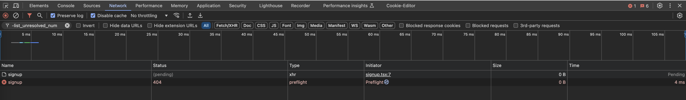


点击第一个请求:

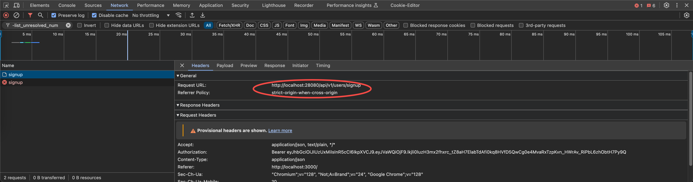

看到标头发现请求的URL是： http://localhost:28080/api/v1/users/signup

点击第二个请求：

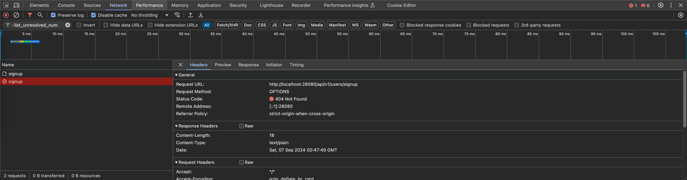

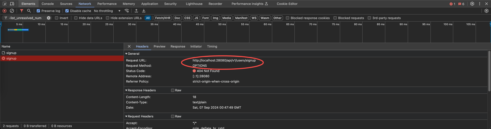

标头发现请求的URL也是： http://localhost:28080/api/v1/users/signup

我命名发送点击了一次，为什么会有两次请求呢？

再看下服务器接收到的请求输出：

```
[GIN] 2024/09/07 - 08:47:49 | 404 |      61.167µs |             ::1 | OPTIONS  "/api/v1/users/signup"
```

## 原因分析

这其实就是跨域中要解决的问题，就是它会发送的一个 preflight 的请求，这个可以从控制台看到，比如 console 中的输出如下：

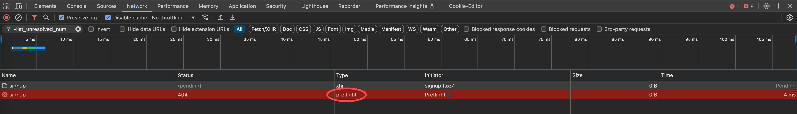

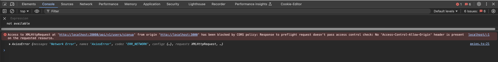 

```
localhost/:1 Access to XMLHttpRequest at 'http://localhost:28080/api/v1/users/signup' from origin 'http://localhost:3000' has been blocked by CORS policy: Response to preflight request doesn't pass access control check: No 'Access-Control-Allow-Origin' header is present on the requested resource.
```

从上面信息可以知道两件事：

1. `http://localhost:3000` 向 `http://localhost:28080/api/v1/users/signup` 发起的请求被阻塞了。
2. 对预检请求的响应未通过访问控制检查，preflight 并没有传递 `access control check`，原因是因为请求的资源上没有设置 “Access-Control-Allow-Origin” 标头。 在哪里设置？是在 `preflight request` 中设置

## 什么是跨域请求

一个网站请求另一个网站，两个网站存在协议（如http、https）、域名（如a.com, b.com）、端口（如a.com:8080, a.com:8081）任意一个不同，就认为是跨域请求。

那么浏览器是怎么判断是否是两个网站呢？

1. 通过协议判断
2. 通过端口判断
3. 通过域名判断

比如请求是从 `localhost:3000` 发送到后端 `localhost:28080` 的。在请求的时候，浏览器认为 `localhost:3000` 是一个网站，`localhost:28080` 是一个网站。现在是从一个网站发送请求到另一个网站，浏览器就不答应，因为攻击者可以伪造请求发送到后端服务器，浏览器是不允许这样的行为存在的。

主要是浏览器不允许这种行为，而后端无所谓，所以跨域请求其实就是浏览器阻止的。这种就是跨域请求。

协议、域名和端口任意一个不同，都是跨域请求。正常来说，如果我们不做额外处理，是没有办法这么发送请求的，就会跨域现象。

浏览器为什么这么设计呢？主要是为了防止黑客伪造一些乱七八糟的东西不断地发送请求。

## 如何解决跨域问题

跨域的问题是浏览器不准请求从一个网站发往另一个网站，如果要解决这个问题，就是让浏览器答应允许将请求从一个网站发往另一个网站。

解决思路就是问浏览器浏览器，`localhost:28080` 是否可以接收从 `localhost:3000` 过来的请求。浏览器因为跨域不让发送请求过来，要解决这个问题就让浏览器允许它发送请求过来。

关键是怎么告诉浏览器呢？谁告诉谁？比如：`localhost:18080` 怎么告诉 `localhost:3000` 允许将请求发送过来呢？
需要通过一个叫 `preflight` 请求的机制。需要在 `preflight` 请求里面告诉浏览器，让其允许接收 `localhost:3000` 发过来的请求。

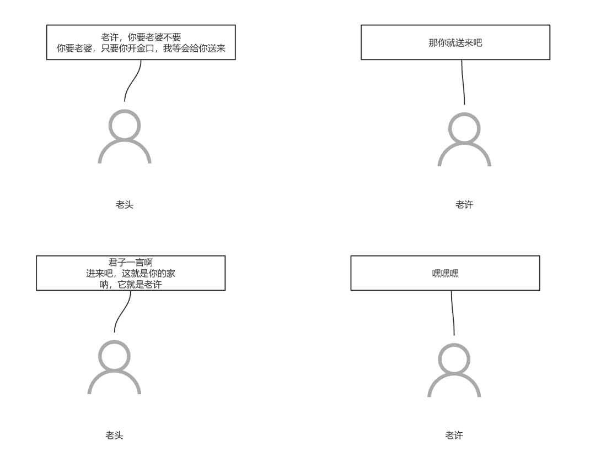

这就是为什么会有两个请求，第一个请求是先问下 localhost:28080，能不能接收 localhost:3000 的请求，也就是下面这个请求，这就是 preflight：

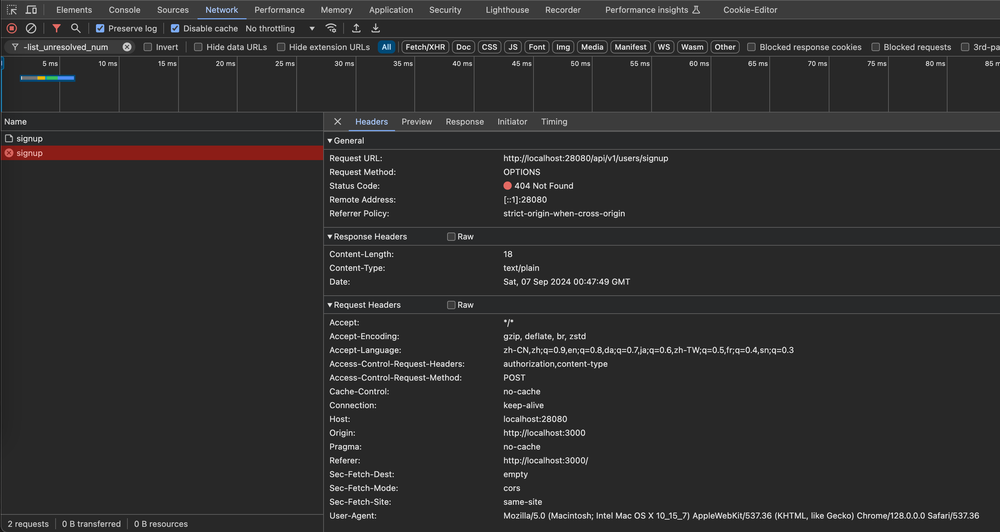
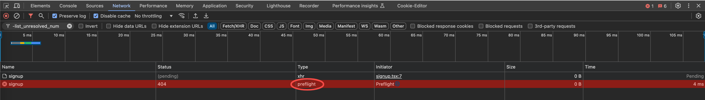

看到 preflight 可以理解为是提前问一下后端允不允许 `localhost:3000` 的请求过来。如果允许访问，然后会将下面的请求发送过去，也就是下面的这个请求

然后 `localhost:28080` 回复浏览器说要， 然后 浏览器就会将 `localhost:3000` 的请求发过来，也就是这个请求：
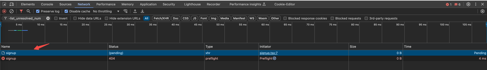


下面就是如何告诉localhostL:28080它呢？关键就是要在 preflight 请求中配置一些参数，就要需要在 preflight 请求的响应里面进行配置，也就是在过来询问是否允许的时候告诉它。

* preflight 请求的特征

preflight 请求会发送到同一个地址上，使用 Options 方法，没有请求参数。

比如正常请求注册接口 `/users/signup` ，就会有一个 preflight 的请求也发送到 `/users/signup` ，但是它的 method 是 Options 

后端在收到 preflight 请求之后就要告诉它允许接收从 localhost:3000 发过来的请求（Allow-Origins: http://localhost:3000），也可以接收它在 Header 里面携带 Content-Type（Allow-Headers），以及能接受的方法包括（Allow-Methods: 全部方法）；

然后紧接着就是请求方就会把真正的请求发送过去，如何看出来的呢？可以看请求标头，如下图所示：
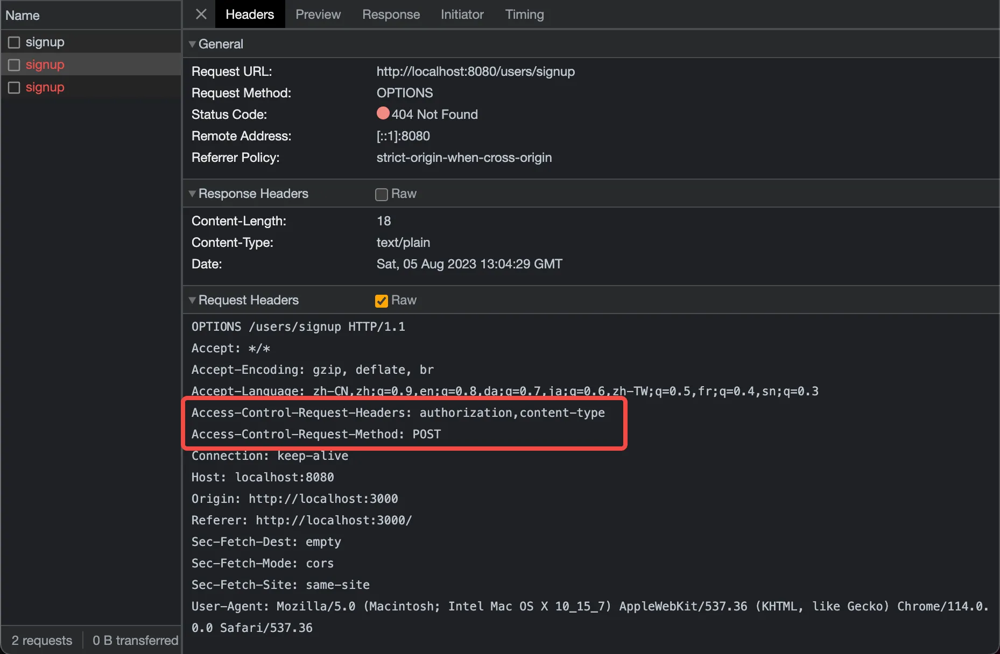

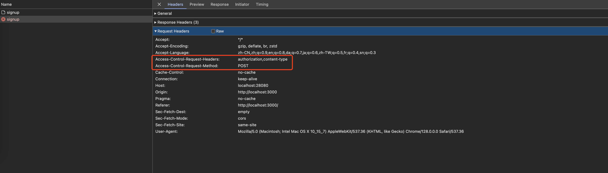

也就是 localhost:3000 告诉localhost:28080， 我接下来有个请求要发送给你，发送的请求要带两个头部，一个 authorization， 一个是 content-type，我发送的请求是 post 请求。

也有点像亲戚给你介绍对象，先告诉你，她那里有个姑娘170，,100斤，很漂亮，你要不要（这就是 preflighst 请求），这是你告诉她要，然后她就会把人介绍给你，介绍给你这就是正式的业务请求。

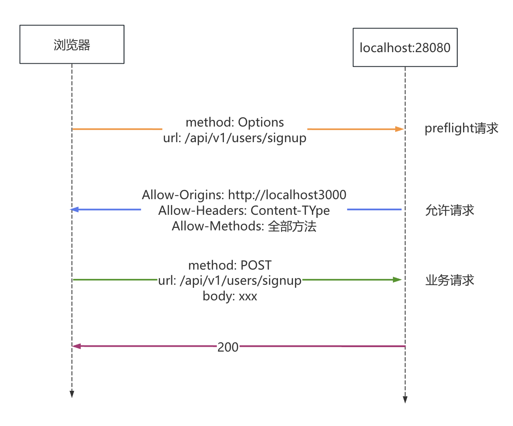


大多数的web框架都提供的跨域的解决方案。

配置之后查看相应头：

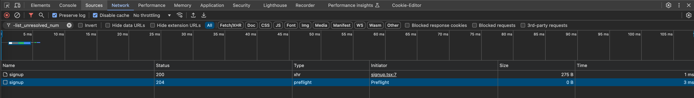
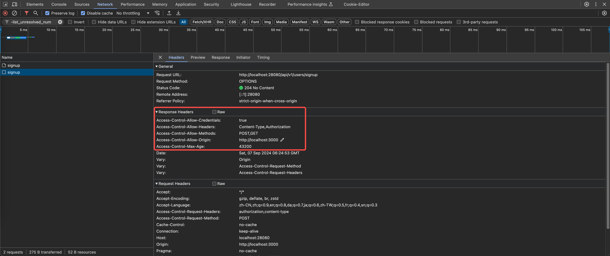
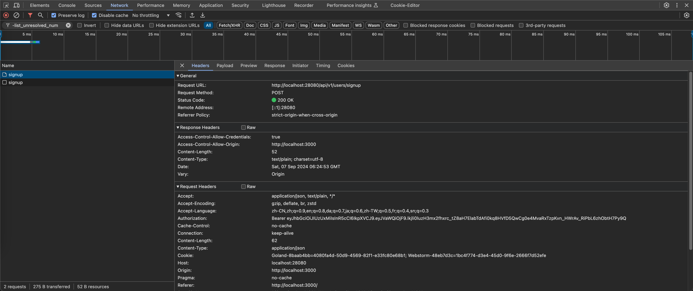


## 总结

跨域解决策略：

解决跨域配置什么也是看请求的标头携带的什么 ,cors 跨域就配置什么
● 跨域问题是因为发送请求的协议+域名+端口和接受请求的协议+域名+端口对应不上，比如上面的localhost:3000发送到 localhost:8080上
● 解决跨域问题的关键是在 preflight 请求里面告诉浏览器自己愿意接受请求
● 一般框架都有跨域解决方案