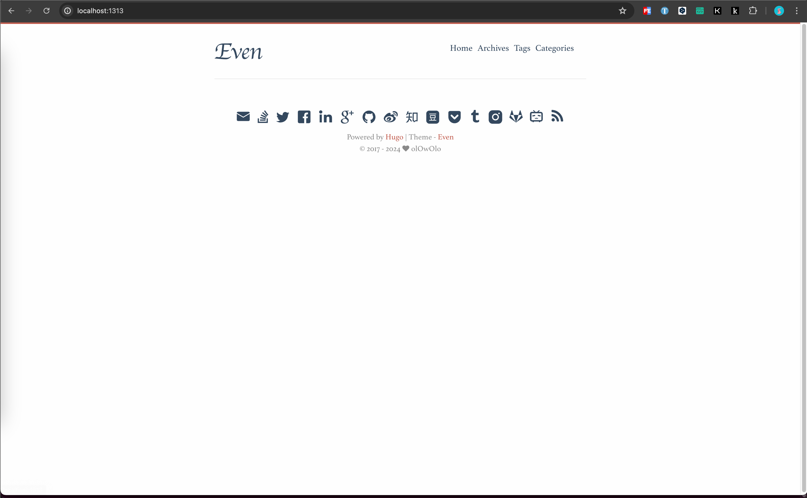

+++
title = 'Hugo快速上手'
date = 2024-01-13T18:14:38+08:00
draft = true
categories = [ "Hugo" ]
tags = [ "hugo" ]
+++

## 安装 Hugo

```
brew install hugo
```

* 根据自己操作系统选择对应安装方式。

参考：https://gohugo.io/installation/macos/


## 安装 Git

```
brew install git
```

* 根据自己操作系统选择对应安装方式。


## 创建站点

1、新建站点目录

```
hugo new site hugo
```

完整过程如下：

```
➜  hugo new site hugo
Congratulations! Your new Hugo site was created in /Users/finnley/Writing/hugo.

Just a few more steps...

1. Change the current directory to /Users/finnley/Writing/hugo.
2. Create or install a theme:
   - Create a new theme with the command "hugo new theme <THEMENAME>"
   - Install a theme from https://themes.gohugo.io/
3. Edit hugo.toml, setting the "theme" property to the theme name.
4. Create new content with the command "hugo new content <SECTIONNAME>/<FILENAME>.<FORMAT>".
5. Start the embedded web server with the command "hugo server --buildDrafts".

See documentation at https://gohugo.io/.
```

* `hugo new site hugo` 命令中第一个 `hugo` 是命令参数，第二个 `hugo` 是我站点名称，也是站点目录名称。自由配置，名称自取。
* Hugo 默认配置文件格式是 `TOML`，如果想转换为 `YAML` 格式，可以使用如下命令指定默认配置文件格式：

```
hugo new site hugo --format=yaml
```

2、进入站点目录初始化 Git 仓库

```
cd hugo
git init
```

3、站点目录结构如下：

```
archetypes
assets
content
data
hugo.toml
i18n
layouts
static
themes
```

此时如果执行 `hugo server -D` 访问页面会提示 `Page Not Found`，是因为还没有安装任何主题。


## 主题配置

### hugo-theme-stack

1、加载主题，将主题作为我的 Git 子目录：

```
git submodule add https://github.com/CaiJimmy/hugo-theme-stack/ themes/hugo-theme-stack
```

参考：https://stack.jimmycai.com/

参考：https://moyu.ee/p/hugo-stack/

2、备份默认站点配置文件

```
mv hugo.toml hugo.toml.backup
```

3、将 `stack` 主题样例配置文件复制到站点目录下

```
cp themes/hugo-theme-stack/exampleSite/config.yaml ./
```

* 注意提供的样例配置文件格式是 `yaml` 。

4、执行 `hugo server`，预览效果

完整输出如下：

```
➜  hugo git:(main) ✗ hugo server
Watching for changes in /Users/finnley/Writing/hugo/{archetypes,assets,content,data,i18n,layouts,static,themes}
Watching for config changes in /Users/finnley/Writing/hugo/config.yaml, /Users/finnley/Writing/hugo/themes/hugo-theme-stack/config.yaml
Start building sites …
hugo v0.121.2-6d5b44305eaa9d0a157946492a6f319da38de154+extended darwin/arm64 BuildDate=2024-01-05T12:21:15Z VendorInfo=brew

WARN  Search page not found. Create a page with layout: search.
WARN  Archives page not found. Create a page with layout: archives.

                   | EN | ZH-CN | AR
-------------------+----+-------+-----
  Pages            |  7 |     7 |  7
  Paginator pages  |  0 |     0 |  0
  Non-page files   |  0 |     0 |  0
  Static files     |  0 |     0 |  0
  Processed images |  3 |     0 |  0
  Aliases          |  4 |     3 |  3
  Sitemaps         |  2 |     1 |  1
  Cleaned          |  0 |     0 |  0

Built in 79 ms
Environment: "development"
Serving pages from memory
Running in Fast Render Mode. For full rebuilds on change: hugo server --disableFastRender
Web Server is available at http://localhost:1313/ (bind address 127.0.0.1)
Press Ctrl+C to stop

```

预览效果：


5、复制样例目录中页面布局文件

```
cp -r themes/hugo-theme-stack/exampleSite/content/categories ./content
cp -r themes/hugo-theme-stack/exampleSite/content/page ./content
cp -r themes/hugo-theme-stack/exampleSite/content/_index.zh-cn.md ./content
cp themes/hugo-theme-stack/exampleSite/content/_index.md ./content
```

6、重启 `hugo server`

预览效果：


#### 默认语言设置

修改 `config.yaml` 文件配置，将默认语言改成中文 `zh-cn`。

```
languageCode: zh-cn
DefaultContentLanguage: zh-cn
hasCJKLanguage: true
```

由于不需要其他语言，可以删除 `languages`` 中除 `zh-cn`` 外的项目。删除后配置如下：

```
...

languages:
    zh-cn:
        languageName: 中文
        title: 演示站点
        weight: 2
        params:
            description: 演示说明

...
```

预览效果：


#### 站点名称

设置站点名称

```
...
languages:
    zh-cn:
        languageName: 中文
        title: 活死人
        weight: 2
        params:
            description: 活死人

...
```


#### 头像和简介

头像和简介通过 `config.yaml` 中的 `params.sidebar` 相关属性进行配置。

1、图片存放在 `assets/` 目录中。


2、设置 emoji 。可以在 [getemoji](https://getemoji.com/) 找自己喜欢的 emoji

3、设置个性描述 subtitle

修改后配置如下：

```
...

sidebar:
    emoji: 💀
    subtitle: 虽千万里，吾往矣
    avatar:
        enabled: true
        local: true
        src: img/avatar.jpg # img/avatar.png

...
```

预览效果：


#### 侧边栏

左侧菜单 (主页、关于、归档、搜索、链接)，它们在 `content/page/` 目录中有对应的目录。


以 Archives 归档目录为例，把对应目录中的 `index.md` 复制为 `index.zh-cn.md`，然后将 `index.zh-cn.md` 的 `front matter` 中的 `title` 修改成对应的中文标题即可，此时侧边栏则会显示成中文。


预览效果：


#### 首页文章列表

主题默认在主页战术 `content/post` 目录下的内容，所以应该在该目录下新建文章。`stack` 主题页提供了一些样例文章，将样例文章复制到站点 `content` 目录下：

```
cp -r themes/hugo-theme-stack/exampleSite/content/post ./content
```

预览效果：


* 注意，Hugo 官方文档入门教程里面是在 `content/posts` 目录新建文章。


#### 日期格式

默认的格式是 `Jan 02, 2006`：


在 `config.yaml` 中修改以下两处：

```
params:
    dateFormat:
        published: 2006/01/02
        lastUpdated: 2006/01/02
```

预览效果：


#### 上传至 Github

```
cd hugo
git init
git remote add origin git@github.com:finnley/finnley.github.io.git  # 替换为自己的 Github 仓库地址
git add .
git commit -m "first commit"
git push -u origin main
```


#### 部署

1、站点目录新建 `.github/workflows/hugo.yaml` 文件

```
cd hugo
mkdir -p .github/workflows
vim .github/workflows/hugo.yaml
```

2、访问下面链接，复制提供的样例内容到 `.github/workflows/hugo.yaml`

[hosting-on-github](https://gohugo.io/hosting-and-deployment/hosting-on-github/)

3、修改 `branches` 中的 `main` 为 `hugo`，如果在 【上传至 Github】 中没有新开分支，就可以不用修改

4、推送至 Github，并按照 [hosting-on-github](https://gohugo.io/hosting-and-deployment/hosting-on-github/) 操作即可实现 Github 部署


#### 自定义菜单分类（单页“活死人”分类）

什么是自定义菜单分类？就是我想在左侧菜单栏新加一个类似 “关于” 的菜单分类
先预览下效果：


比如我想添加个“活死人”的分类：

1、在 `content/page` 目录下新建 `walking-dead` 的目录

2、在 `walking-dead` 目录下新建 `index.zh-cn.md` 文件，内容如下：

```
---
title: "活死人"
layout: "walking-dead"
slug: "walking-dead"
menu:
    main:
        weight: -100
        params: 
            icon: skull
---
```

3、在 `walking-dead` 目录下新建 `index.md` 文件，内容如下：

```
---
title: "Walking Dead"
layout: "walking-dead"
slug: "walking-dead"
menu:
    main:
        weight: -100
        params: 
            icon: skull
---
```

* `weight` : 用于控制菜单在左侧展示的顺序
* `icon` : 菜单图标，放置在 `hugo/assets/icons` 目录下

4、效果预览


参考：https://stack.jimmycai.com/config/menu


#### 左侧菜单顺序调整

比如默认菜单顺序如下图，“活死人”分类排在了倒数第二个，我打算将其排到“主页”下面


##### 修改方式一

1、修改 `page` 页面文件里面中 `menu.main` 的 `weight`


2、我想要将 “活死人” 放到第二个位置，则将 `weight` 权重改为 `-100`，修改后效果如下：


3、`weight` 权重规律是 `数值` 越小顺序越靠前


##### 修改方式二

1、修改 `config.yaml` 的 `menu.main` 为如下配置：

```
### Custom menu
### See https://docs.stack.jimmycai.com/configuration/custom-menu.html
### To remove about, archive and search page menu item, remove `menu` field from their FrontMatter
menu:
    main:
        - name: 活死人
          url: /walking-dead/
          weight: 20
          params:
            icon: skull
        - name: 关于
          url: /about/
          weight: 30
          params:
            icon: user
        - name: 归档
          url: /archives/
          weight: 40
          params:
            icon: archives
        - name: 搜索
          url: /search/
          weight: 50
          params:
            icon: search
        - name: 链接
          url: /link/
          weight: 60
          params:
            icon: link
```

2、使用这种方式需要移除 `content/page` 下各文件中的 `menu item`


预览效果：


3、`weight` 权重规律是 `数值` 越小顺序越靠前


#### 单页分类添加文章

* 什么是单页分类添加文章？

举例：
我添加了一个“活死人”的单页分类，当点击“活死人”分类时，它是一个单独页面展示的。
之后我可能会创建一些文章，这些文章是单独属于“活死人”分类下的。并且对于正常发布（非草稿）的“活死人”分类笔记也会展示在主页。

预览效果：


处理步骤：

简单处理，“活死人”分类下展示类似归档页面的列表，只是列表中展示的文章仅属于“活死人”分类，而不是所有文章

1、新建文章，文章所属分类为自定义分类

```
hugo new content walking-dead/活死人笔记-1.zh-cn.md
```

执行后会在 `content` 目录下生成 `walking-dead` 目录，并会在该目录下生成文章对应的 Markdown 文件：

默认配置如下：

```
+++
title = '活死人笔记-1'
date = 2024-01-14T07:13:36+08:00
draft = true
+++
```

此时文章不会在“主页”中展示，因为 `draft` 为 `true` 表示草稿状态，还尚未发布，为了预览效果，需要现先 `true` 改为 `false`。

2、复制 stack 主题 layouts 中的 `archives.html` 布局模板到站点 layouts 下

```
cd hugo
mkdir ./layouts/_default
cp themes/hugo-theme-stack/layouts/_default/archives.html ./layouts/_default/walking-dead.html
```

此时点击“活死人”菜单，展示的是和“归档”页面一样的效果。这是为什么呢？
因为在【自定义菜单分类（单页“活死人”分类）】一节中通过 `layout: "walking-dead"` 指定了该分类下的布局页面是 `walking-dead`，并且上面命令就是复制过来的 `walking-dead.html` 源文件就是 `archives.html` 文件

3、walking-dead.html 布局调整

首先移除顶部不需要的 `{{ define "body-class" }}template-archives{{ end }}`，再移除顶部不需要的 `<header>...</header>`

剩余代码如下：

```
{{ define "main" }}
    {{ $pages := where .Site.RegularPages "Type" "in" .Site.Params.mainSections }}
    {{ $notHidden := where .Site.RegularPages "Params.hidden" "!=" true }}
    {{ $filtered := ($pages | intersect $notHidden) }}

    {{ range $filtered.GroupByDate "2006" }}
    {{ $id := lower (replace .Key " " "-") }}
    <div class="archives-group" id="{{ $id }}">
        <h2 class="archives-date section-title"><a href="{{ $.RelPermalink }}#{{ $id }}">{{ .Key }}</a></h2>
        <div class="article-list--compact">
            {{ range .Pages }}
                {{ partial "article-list/compact" . }}
            {{ end }}
        </div>
    </div>
    {{ end }}

    {{ partialCached "footer/footer" . }}
{{ end }}

```

* `{{ $pages := where .Site.RegularPages "Type" "in" .Site.Params.mainSections }}` : 将所有符合条件的页面存储在 `$pages` 变量中。这段代码使用 Hugo 的 `where` 函数来筛选符合 `.Site.Params.mainSections` 参数定义的页面类型。
* `{{ $notHidden := where .Site.RegularPages "Params.hidden" "!=" true }}`: 将所有非隐藏的页面存储在 `$notHidden` 变量中。这段代码使用 `where` 函数来筛选出 `Params.hidden` 不等于 `true` 的页面。
* `{{ $filtered := ($pages | intersect $notHidden) }}`: 将两个页面变量 `$pages` 和 `$notHidden` 求交集，并将结果保存在 `$filtered` 变量中。这意味着最终 `$filtered` 中只有同时满足前两个筛选条件的页面。

解释到这里就差不过明白了，想到我是否可以仅筛选指定的页面类型的，比如我筛选个“活死人” 页面类型？

于是将 `{{ $pages := where .Site.RegularPages "Type" "in" .Site.Params.mainSections }}` 调整为 `{{ $pages := where .Site.RegularPages "Type" "==" "walking-dead" }}`，其他代码都不需要改。

重启服务，刷新页面，预览效果如下：


4、主页设置“活死人”分类文章展示

点击主页，发现“活死人”分类下的文章并没有展示出来，`draft` 值也设置的 `false`，与是结合上一步中调整的 `mainSections` 翻看 [MainSections](https://gohugo.io/methods/site/mainsections/) ，并在 `config.yaml` 搜索关于 `mainSections` 的配置。默认配置如下：

```yaml
params:
    mainSections:
        - post
```

关联到 `post` 是不是关联的是 `content/post` 目录，而我的 `walking-dead` 目录也在 `content` 下，于是将 `walking-dead` 添加进去：

```
params:
    mainSections:
        - post
        - walking-dead
```

重启服务，预览效果如下，基本满足了我的需求:


#### 菜单 url 中文调整

点击菜单 “关于” 的时候瞥见 url 中存在中文：


于是修改 `content/page/about/index.zh-cn.md` 文件，在 `title` 添加 `slug: "about"`

预览效果:


菜单 “链接” 也存在同样现象，也是一样的调整。


### hugo-theme-even

1、加载主题

```
git clone https://github.com/olOwOlo/hugo-theme-even themes/even
git submodule add https://github.com/olOwOlo/hugo-theme-even/ themes/even
```

2、备份默认站点配置文件

```
mv hugo.toml hugo.toml.backup
```

3、将 主题样例配置文件复制到站点目录下

```
cp themes/even/exampleSite/config.toml ./
```

* 注意提供的样例配置文件格式是 `toml` 。

4、执行 `hugo server`，预览效果

```
hugo server
```

预览：



5、复制 `exampleSite/content/post` 到站点 `content` 目录下，然后再刷新页面预览效果

```

```


#### 上传至 Github

```
cd hugo
git init
git remote add origin git@github.com:finnley/finnley.github.io.git  # 替换为自己的 Github 仓库地址
git add .
git commit -m "first commit"
git push -u origin main
```


#### 部署

1、站点目录新建 `.github/workflows/hugo.yaml` 文件

```
cd hugo
mkdir -p .github/workflows
vim .github/workflows/hugo.yaml
```

2、访问下面链接，复制提供的样例内容到 `.github/workflows/hugo.yaml`

[hosting-on-github](https://gohugo.io/hosting-and-deployment/hosting-on-github/)

3、修改 `branches` 中的 `main` 为 `hugo`，如果在 【上传至 Github】 中没有新开分支，就可以不用修改

4、推送至 Github，并按照 [hosting-on-github](https://gohugo.io/hosting-and-deployment/hosting-on-github/) 操作即可实现 Github 部署


hugo new content moments.md
hugo new content bookmarks.md
hugo new content videos.md
hugo new content photos.md
hugo new content about.md