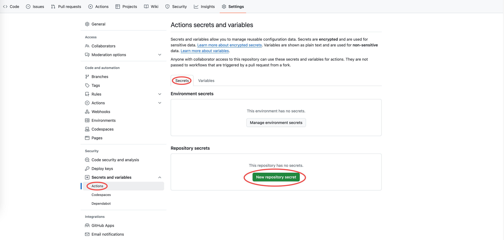
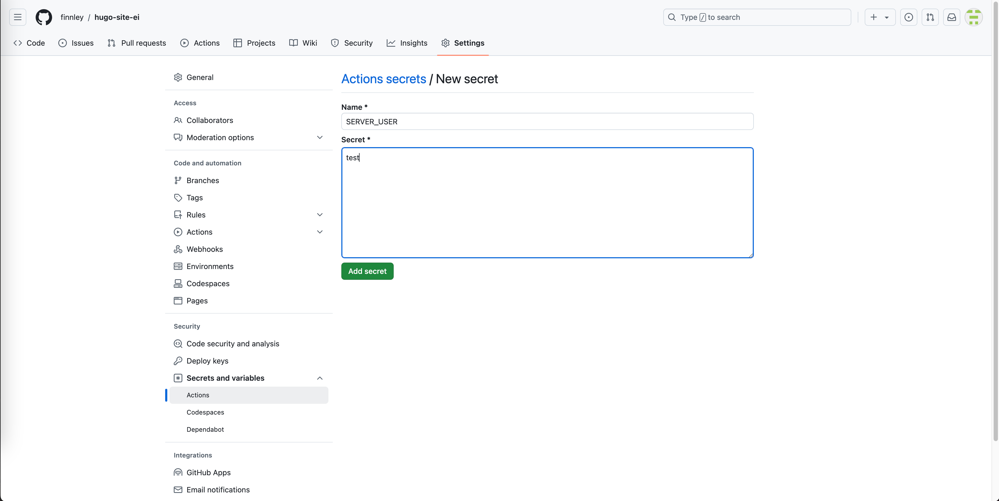

+++
title = '站点部署'
date = 2024-08-31T12:03:46+08:00
draft = true
categories = [ "Hugo" ]
tags = [ "hugo" ]
+++

## 步骤概述

1. 在个人服务器上设置 SSH 访问
2. 创建 GitHub Action 工作流
3. 配置 Vercel 以触发 GitHub Actions
4. 验证部署

## 详细步骤

1. 在个人服务器上设置 SSH 访问

* 创建一个新的用户账户（例如deploy）

```
sudo add deploy
```

* 为新用户生成 SSH 秘钥对：

在本地计算机上，使用以下命令生成密钥对（不需要密码短语）：
```bash
ssh-keygen -t rsa -b 4096 -C "deploy"
```

将生成的公钥（通常位于 ~/.ssh/id_rsa.pub）复制。

## 配置 SSH 用户

为了让 GitHub Actions 能够通过 SSH 连接到你的个人服务器进行部署，我需要创建一个专门用于部署的服务器用户，并确保配置好必要的 SSH 访问权限。以下是创建和配置该用户的步骤：

### 步骤 1: 创建服务器用户

1. **通过 SSH 登录到你的服务器**
   ```bash
   ssh your_current_user@your_server_ip
   ```

2. **创建一个新用户**
   使用 `adduser` 命令创建一个新用户（以 `deploy` 为例）：
   ```bash
   sudo adduser deploy
   ```
    
    执行 sudo adduser deploy 会：

    * 创建一个用户名为 deploy 的新用户。
    * 为该用户创建一个主目录，通常是 /home/deploy。
    * 设置默认的用户 shell（通常是 /bin/bash）。
    * 为新用户设置初始的组权限。

### 步骤 2: 设置 SSH 密钥

1. **在本地机器上生成 SSH 密钥**
   如果还没有 SSH 密钥，可以使用以下命令生成：
   ```bash
   ssh-keygen -t rsa -b 4096 -C "your_email@example.com"
   ```
   按照提示完成密钥生成，通常会生成 `~/.ssh/id_rsa`（私钥）和 `~/.ssh/id_rsa.pub`（公钥）。过程如下：

   ```
    # ssh-keygen -t rsa -b 4096 -C "43@43.com"
    Generating public/private rsa key pair.
    Enter file in which to save the key (/root/.ssh/id_rsa): 
    Enter passphrase (empty for no passphrase): 
    Enter same passphrase again: 
    Your identification has been saved in /root/.ssh/id_rsa.
    Your public key has been saved in /root/.ssh/id_rsa.pub.
    The key fingerprint is:
    SHA256:mICtJoau6GZ7wMjTvEU+fN0ZaUDO/EHn8HJk3zUNPC8 43@43.com
    The key's randomart image is:
    +---[RSA 4096]----+
    |        .. o =.oo|
    |   o    +.. B + =|
    |  . o    +.o.+ +.|
    |.  . o o  .++ E .|
    |*.= + o S o.o  . |
    |+B o = . . o     |
    | .o o o          |
    |oo o             |
    |*oo              |
    +----[SHA256]-----+
    [root@VM-0-2-centos ~]# 
   ```

2. **将公钥复制到服务器**
   使用 `ssh-copy-id` 命令将公钥添加到新用户的 `~/.ssh/authorized_keys` 文件中：

如果你没有为 `deploy` 用户设置过密码，那么需要通过其他方式将公钥上传到 `deploy` 用户的 `authorized_keys` 文件中。

* 临时使用 `root` 账户上传公钥

1. **登录到服务器**：
   ```bash
   ssh your_current_user@your_server_ip
   ```

2. **切换到 `root` 用户**（如果你有 `root` 权限）：
   ```bash
   sudo -i
   ```

3. **创建 `.ssh` 目录和 `authorized_keys` 文件**：
   ```bash
   mkdir -p /home/deploy/.ssh
   touch /home/deploy/.ssh/authorized_keys
   ```

4. **将公钥内容添加到 `authorized_keys` 文件**：
   - 你可以用 `echo` 命令将公钥内容追加到 `authorized_keys` 文件中：
     ```bash
     echo "your_public_key_content" >> /home/deploy/.ssh/authorized_keys
     ```

    如：
    ```
    echo $(cat ~/.ssh/id_rsa.pub) >> /home/deploy/.ssh/authorized_keys
    ```


5. **设置正确的权限**：
   ```bash
   chown -R deploy:deploy /home/deploy/.ssh
   chmod 700 /home/deploy/.ssh
   chmod 600 /home/deploy/.ssh/authorized_keys
   ```

6. **退出 `root` 用户会话**：
   ```bash
   exit
   ```

## 

我希望使用 deploy 用户通过 SSH 连接到个人服务器，然后将 Hugo 站点的构建结果部署到某个目录下，而该目录对其他用户（例如 root）可见，你可以按照以下步骤进行设置。

1. 选择目标目录
选择一个适合的目录，例如 /var/www/hugo-site-ei，作为最终部署目标。这个目录应该具备足够的权限，使得所有需要访问该内容的用户都可以进行操作。

2. 更改目录权限
在你的个人服务器上运行以下命令来创建目录并设置权限：

```bash
# 创建目录（如果还没有的话）
sudo mkdir -p /var/www/hugo-site-ei

# 创建一个新的组，例如 www-data
sudo groupadd www-data

# 将目录的所有者设为 root，并将组设为刚才创建的 www-data
sudo chown root:www-data /var/www/hugo-site-ei

# 设置权限，使得所属组可以读写
sudo chmod 775 /var/www/hugo-site-ei

# 将 deploy 用户添加到 www-data 组中
sudo usermod -aG www-data deploy
```

## 创建 GitHub Action 工作流

根据您提供的 GitHub Actions 工作流示例，我将指导您如何调整该工作流以便将 Hugo 站点部署到您的个人服务器，而不是 GitHub Pages。我们将使用 Docker 来运行 Nginx，并使用 SSH 将构建后的文件复制到服务器上。

```
name: Deploy Hugo site to Personal Server

on:
  # Runs on pushes targeting the default branch
  push:
    branches:
      - main

  # Allows you to run this workflow manually from the Actions tab
  workflow_dispatch:

permissions:
  contents: read
  id-token: write

concurrency:
  group: "deploy"
  cancel-in-progress: false

defaults:
  run:
    shell: bash

jobs:
  # Build job
  build:
    runs-on: ubuntu-latest
    env:
      HUGO_VERSION: 0.121.0
    steps:
      - name: Install Hugo CLI
        run: |
          wget -O ${{ runner.temp }}/hugo.deb https://github.com/gohugoio/hugo/releases/download/v${HUGO_VERSION}/hugo_extended_${HUGO_VERSION}_linux-amd64.deb \
          && sudo dpkg -i ${{ runner.temp }}/hugo.deb
      - name: Install Dart Sass
        run: sudo snap install dart-sass
      - name: Checkout
        uses: actions/checkout@v4
        with:
          submodules: recursive
          fetch-depth: 0
      - name: Build with Hugo
        env:
          HUGO_ENVIRONMENT: production
          HUGO_ENV: production
        run: |
          hugo \
            --gc \
            --minify

      - name: Archive public directory
        uses: actions/upload-artifact@v2
        with:
          name: public
          path: ./public

  # Deployment job
  deploy:
    runs-on: ubuntu-latest
    needs: build
    steps:
      - name: Download public directory
        uses: actions/download-artifact@v2
        with:
          name: public

      - name: Copy files to server
        uses: appleboy/scp-action@master
        with:
          host: ${{ secrets.SSH_HOST }}               # 替换为你的服务器 IP
          username: ${{ secrets.SSH_USER }}          # SSH 用户名
          key: ${{ secrets.SSH_PRIVATE_KEY }}           # 加入在 Secrets 中的私钥
          port: ${{ secrets.SSH_PORT }}
          source: "public/*"                   # 拷贝构建后的文件
          target: "/var/www/hugo-site-ei" # 映射到 Docker 卷的位置

      - name: Restart Nginx container
        run: |
          ssh -o StrictHostKeyChecking=no -i ${{ secrets.SSH_PRIVATE_KEY }} ${{ secrets.SSH_USER }}@${{ secrets.SSH_HOST }} "docker restart hugo-site-nginx-server"
```

步骤解析
Build Job：

安装 Hugo 和 Dart Sass。
检出代码。
构建 Hugo 站点并生成静态文件，在 ./public 目录下。
将 ./public 目录打包为一个工件，以便后续步骤下载。
Deploy Job：

下载之前构建的 public 目录。
使用 appleboy/scp-action 将构建后的 Hugo 文件传输到您的个人服务器指定目录。
通过 SSH 重启 Nginx Docker 容器以使更改生效。

注意事项
Secrets 配置：确保你已在 GitHub 仓库中添加了名为 SSH_PRIVATE_KEY 的密钥，其值为 github_ei_deploy 用户的私钥。

Nginx 配置：确保 Nginx Docker 容器的配置正确指向 /usr/share/nginx/html 目录，其中包含 Hugo 输出的静态网站内容。

安全设置：根据需要更新防火墙规则，以确保可以安全地访问服务器。

域名和 SSL 配置：如果您使用自己的域名，请确保 DNS 设置正确，并根据需要添加 SSL/TLS 支持。

执行上述工作流后，每当你将在 main 分支上的修改推送时，GitHub Actions 将自动构建并部署 Hugo 站点到你指定的个人服务器。







## 创建 Nginx Docker 容器

创建 Nginx 配置目录：

mkdir -p ~/nginx/conf.d

创建一个简单的 Nginx 配置文件（~/nginx/conf.d/default.conf）：

```nginx
server {
    listen 80;
    server_name your_domain.com; # 替换为你的域名或 IP

    location / {
        root /var/www/hugo-site-ei`; # Hugo 输出目录
        index index.html index.htm;
        try_files $uri $uri/ =404;
    }
}

```

启动 Nginx Docker 容器：

```
docker run --name hugo-site-nginx-server -v ~/nginx/conf.d:/etc/nginx/conf.d -v /var/www/hugo-site-ei:/usr/share/nginx/html -d -p 80:80 nginx

```

~/hugo_output 是 Hugo 生成的输出目录，你可以在后续步骤中将其更新.


##
当您在执行 Docker 命令时遇到 `permission denied while trying to connect to the Docker daemon socket` 错误，通常是由于当前用户没有权限访问 Docker 守护进程。Docker 通常需要 root 权限或属于 `docker` 用户组的用户才能运行 Docker 命令。

### 解决方法

以下是几种解决此问题的常见方法：

#### 1. 将用户添加到 Docker 组

如果您希望您的 SSH 用户（例如 `github_ei_deploy`）能够运行 Docker 命令，而不需要使用 `sudo`，可以将该用户添加到 `docker` 用户组中。

```bash
# 登录到您的个人服务器
ssh $SERVER_USER@$SERVER_IP

# 将用户添加到 docker 组
sudo usermod -aG docker $SERVER_USER

如：
sudo usermod -aG docker deploy

# 确保您注销并重新登录以使更改生效
```

### 2. 使用 sudo 运行 Docker 命令

如果不想将用户添加到 `docker` 组，您也可以修改 Docker 命令，以在运行时使用 `sudo`，这样可以使用超级用户权限运行命令：

```bash
ssh -o StrictHostKeyChecking=no -i private_key $SERVER_USER@$SERVER_IP "sudo docker load -i /var/www/hugo-site-ei/public.tar.gz && sudo docker run -d --rm -p 80:80 -v /var/www/hugo-site-ei:/usr/share/nginx/html nginx"
```

> **注意**: 使用 `sudo` 时，可能会要求输入密码。如果您的脚本在自动化环境中运行，您可能需要配置无密码 sudo 访问（这要谨慎操作）。

### 3. 检查 Docker 服务是否正在运行

确保 Docker 服务在您的个人服务器上正常运行。可以通过以下命令检查 Docker 服务状态：

```bash
sudo systemctl status docker
```

如果 Docker 没有运行，可以使用以下命令启动它：

```bash
sudo systemctl start docker
```

### 4. 验证 Docker Socket 权限

确认 `/var/run/docker.sock` 的权限，确保用户有足够的权限访问 Docker socket：

```bash
ls -l /var/run/docker.sock
```

您应该看到类似于以下内容的输出：

```plaintext
srw-rw---- 1 root docker 0 date time /var/run/docker.sock
```

确保您的用户在 `docker` 组内，这样就可以访问 Docker socket。

### 5. 重启 SSH 会话

确保对用户组的更改生效后，注销并重新连接到 SSH 会话。

### 示例修正后的命令

如果您选择使用 `sudo`，可以使用如下命令：

```bash
scp -o StrictHostKeyChecking=no -i private_key public.tar.gz $SERVER_USER@$SERVER_IP:/var/www/hugo-site-ei
ssh -o StrictHostKeyChecking=no -i private_key $SERVER_USER@$SERVER_IP "sudo docker load -i /var/www/hugo-site-ei/public.tar.gz && sudo docker run -d --rm -p 80:80 -v /var/www/hugo-site-ei:/usr/share/nginx/html nginx"
```

### 总结

确保您的用具有适当的权限来运行 Docker 命令。您可以选择将其添加到 `docker` 组中，或者直接使用 `sudo` 来执行 Docker 命令。如果还有其他问题，请随时告诉我！