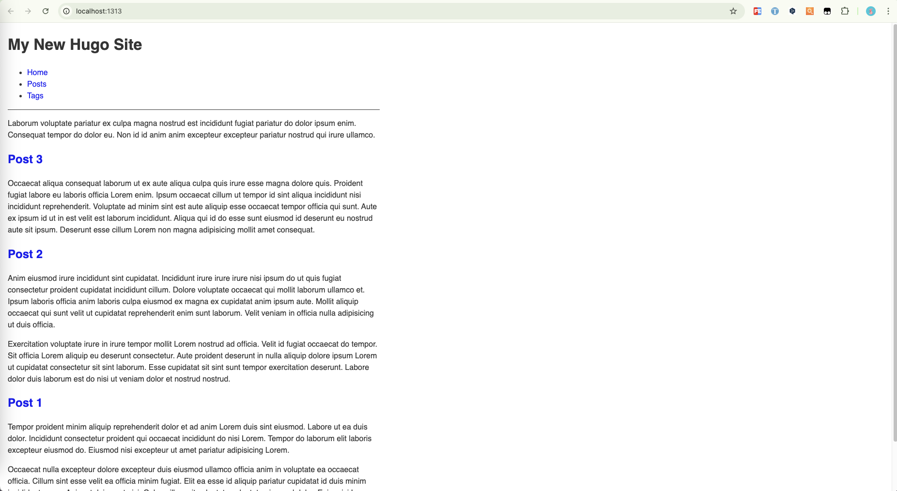
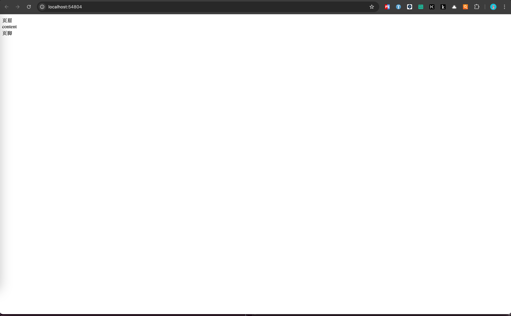
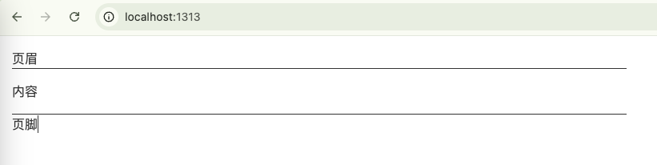
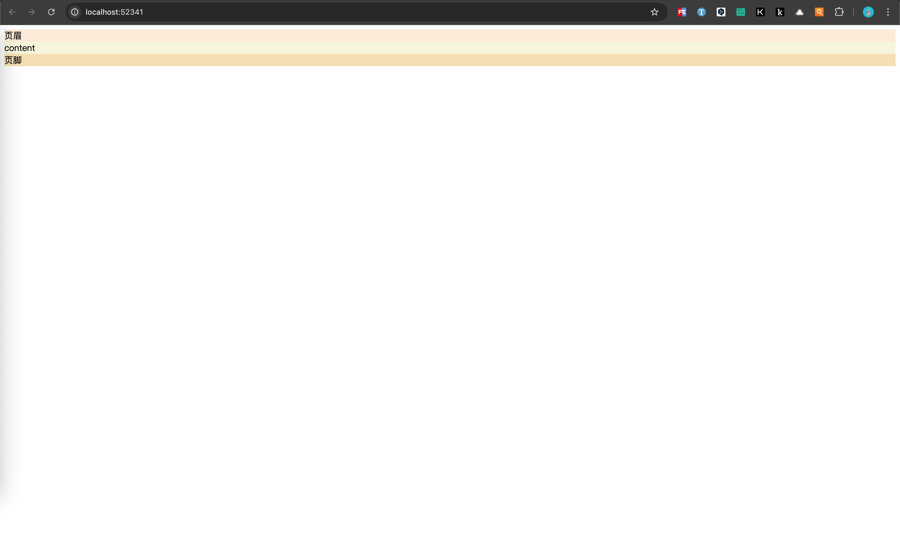
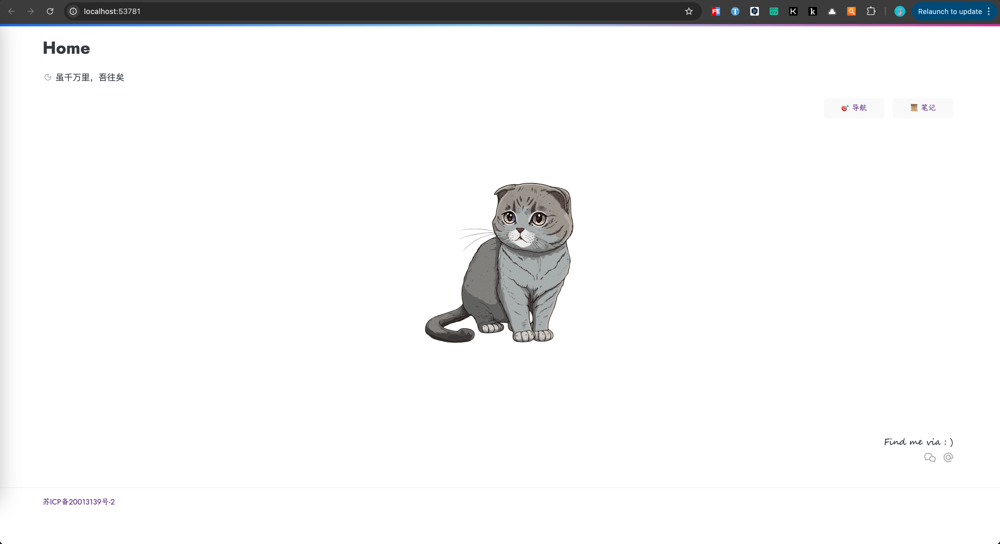
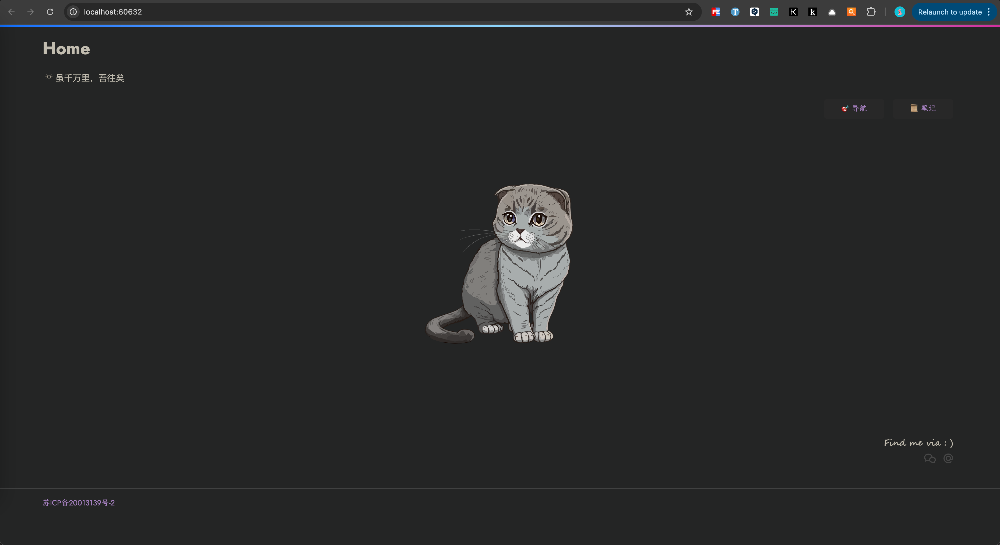

+++
title = '自定义Hugo主题'
date = 2024-07-22T18:00:44+08:00
draft = true
categories = [ "Hugo" ]
tags = [ "hugo" ]
+++

## 初始化主题项目

1. 新建主题

该命令会在当前目录下生成 `themes` 目录，并在 `themes` 目录下下生成主题 `hugo-theme-ei`。

```bash
hugo new theme hugo-theme-ei
```

2. 初始化仓库
```
cd themes/hugo-theme-ei
git init
git remote add github {Your repository}
```

在 `hugo-theme-ei` 根目录下添加 `.gitignore` 文件，内容如下：
```
.idea
.DS_Store
```

3. 新建 t1-init 分支，下载官方提供的示例站点内容到主题的 exampleSite 目录下，下载后不用怀疑，就是个空的目录

```bash
git clone https://github.com/gohugoio/hugoBasicExample.git exampleSite
rm -rf exampleSite/.git
```


4. 添加配置文件

复制 `hugo-theme-ei` 主题目录下的 `hugo.toml` 文件到 `exampleSite` 示例站点目录
```bash
cp hugo.toml exampleSite/
```

在示例站点的配置文件 `hugo.toml` 文件中添加主题配置：theme = 'hugo-theme-ei'，内容如下：

```
baseURL = 'https://example.org/'
languageCode = 'zh-cn'
title = 'My New Hugo Site'

theme = 'hugo-theme-ei'
```

7. 运行命令启动示例站点

```bash
hugo server -s exampleSite --gc --themesDir=../..
```

命令输入如下：
```
➜  hugo-theme-ei git:(t1-init-basic-example) ✗  hugo server -s exampleSite --gc --themesDir=../..
Watching for changes in /Users/finnley/workspace/Projects/themes/hugo-theme-ei/{archetypes,assets,content,data,i18n,layouts,static}
Watching for config changes in /Users/finnley/workspace/Projects/themes/hugo-theme-ei/exampleSite/hugo.toml, /Users/finnley/workspace/Projects/themes/hugo-theme-ei/hugo.toml
Start building sites …
hugo v0.147.7-189453612e4bedc4f27495a7b1145321c8d89807+extended darwin/arm64 BuildDate=2025-05-31T12:41:12Z VendorInfo=gohugoio


                  │ EN
──────────────────┼────
 Pages            │ 18
 Paginator pages  │  0
 Non-page files   │  1
 Static files     │  1
 Processed images │  0
 Aliases          │  0
 Cleaned          │  0

Built in 28 ms
Environment: "development"
Serving pages from disk
Running in Fast Render Mode. For full rebuilds on change: hugo server --disableFastRender
Web Server is available at http://localhost:1313/ (bind address 127.0.0.1)
Press Ctrl+C to stop

```

8. 访问 `http://localhost:61183/` 预览





## 初始化布局

1. 进入 hugo-theme-ei，编辑 `layouts/_default` 下的 baseof.html

```html
<!DOCTYPE html>
<html lang="zh-CN">
<head>
  {{ partial "head.html" . }}
</head>
<body>
  <header>
    {{ partial "header.html" . }}
  </header>
  <main>
    {{ block "main" . }}{{ end }}
  </main>
  <footer>
    {{ partial "footer.html" . }}
  </footer>
</body>
</html>
```

这是一个html页面的基本架构

`{{ partial "head.html" . }}` 是html 中的 `head` 头部。这里将它单独作为一个文件并引入。

`body` 下将整个页面划分为3块，页眉（header）、内容主体（main）、页脚（footer）。


2. 接着新建 head.html

编辑 `layouts/partials/head.html` 文件，现在先写入内容，因为后面虽然引入更新的css和js还会继续更新该文件

```html
<meta http-equiv="Content-Type" content="text/html; charset=UTF-8">
<meta name="viewport" content="width=device-width, initial-scale=1">
<title>行知路</title>
{{ partialCached "head/css.html" . }}
{{ partialCached "head/js.html" . }}
```

3. 新增页眉 header.html

编辑 `layouts/partials/header.html` 文件，我的主体暂时没有用到 Header，所以文件直接留空。

4. 新增home.html文件

该页面用来展示内容主体。编辑 `layouts/home.html` 文件：
```html
{{ define "main" }}
内容
{{ end }}
```

5. 新增 footer.html 文件

编辑 `layouts/partials/footer.html` 文件：
```html
页脚
```

6. 此时的页面效果如下






## 引入scss

1. 在 assets 下新建 `style.scss` 文件、`scss` 目录，然后在 scss 目录下新建 page.scss 文件

3. 编辑 head.html 文件，增加以下内容来引入style.scss：

```html
{{ $style := resources.Get "style.scss" | toCSS | minify | fingerprint }}
<link rel="stylesheet" href="{{ $style.Permalink }}">
```

head.html 完整内容如下：
```html
<meta http-equiv="Content-Type" content="text/html; charset=UTF-8">
<meta name="viewport" content="width=device-width, initial-scale=1">
<title>行知路</title>
{{ $style := resources.Get "style.scss" | toCSS | minify | fingerprint }}
<link rel="stylesheet" href="{{ $style.Permalink }}">

```

```html
<head>
    <meta name="viewport" content="width=device-width, initial-scale=1">
    <meta http-equiv="Content-Type" content="text/html;charset=UTF-8">
    <meta name="description" content="{{ .Title }} - {{ .Permalink }}">
    <meta name="author" content="{{ .Site.Params.Author }} - {{ .Site.BaseURL }}">
    <!-- 必应分析 -->
    <meta name="msvalidate.01" content="B46311949B856F2A7015F366FB3CE878" />
    <title>{{ .Title }}</title>
    <link rel="icon" type="image/png" href="/favicon.ico">

    {{ $style := resources.Get "style.scss" | toCSS | minify | fingerprint }}
    <link rel="stylesheet" href="{{ $style.Permalink }}">
</head>
```

4. 编辑 style.scss，内容如下：

```scss
@import 'scss/page';
```

5. 为三块栏设置简单的css样式，编辑page.css

page.scss完整内容如下：
```scss
/*=============================================
=            Variables                        =
=============================================*/

// Fonts
$font-stack: 'jostFont', 'kaiti', -apple-system, BlinkMacSystemFont, 'Segoe UI', Roboto, Helvetica, Arial, sans-serif;

// Colors
$bg-color: #ffffff;
$title-color: #2c3e50;
$slogan-color: #7f8c8d;
$button-bg: rgba(239, 239, 239, 0.5);
$button-hover-bg: rgba(239, 239, 239, 0.8);
$button-text-color: #5d2f86;
$button-hover-color: #e69;
$footer-text-color: #b0b0b0;
$footer-hover-color: #777;
$footer-border-color: #eeeeee;


/*=============================================
=            Mixins                           =
=============================================*/

@mixin user-select($value) {
  user-select: $value;
  -webkit-user-select: $value;
  -moz-user-select: $value;
  -ms-user-select: $value;
}


/*=============================================
=            Base & Keyframes                 =
=============================================*/

body, h1, p {
  margin: 0;
}

a {
  text-decoration: none;
}

@font-face {
  font-family: 'jostFont';
  font-style: normal;
  font-weight: 400;
  font-display: swap;
  src: url(https://fonts.gstatic.com/s/jost/v14/92zUdgNDAwE0hVIn7L4.woff2) format("woff2");
}

@font-face {
  font-family: 'kaiti';
  src: local("STKaiti"), local("KaiTi"), local("楷体"), local("楷体_GB2312");
}

@keyframes fadeIn {
  from {
    opacity: 0;
    transform: translateY(15px);
  }
  to {
    opacity: 1;
    transform: translateY(0);
  }
}


/*=============================================
=            Layout & Styles                  =
=============================================*/

html, body {
  height: 100vh;
  margin: 0;
  overflow: hidden;
  font-family: $font-stack;
  background-color: $bg-color;
}

body {
  display: flex;
  flex-direction: column;
}

header {
  height: 4px;
  background-image: linear-gradient(90deg, #0d6efd, #8ed6fb 50%, #d32e9d);
  flex-shrink: 0;
}

main {
  flex-grow: 1;
  display: flex;
  flex-direction: column;
  justify-content: center;
  align-items: center;
  padding: 20px;
  box-sizing: border-box;
}

.content-group {
  text-align: center;
  animation: fadeIn 1.2s ease-out;
  @include user-select(none);
}

.title {
  font-size: 3.5rem;
  font-weight: 500;
  color: $title-color;
  margin-bottom: 8px;
}

.slogan {
  font-size: 1.1rem;
  color: $slogan-color;
  margin-bottom: 40px;
}

.profile-image {
  width: 150px;
  height: 150px;
  border-radius: 50%;
  object-fit: cover;
  border: 4px solid $bg-color;
  box-shadow: 0 5px 20px rgba(0, 0, 0, 0.1);
  margin-bottom: 40px;
}

.menu {
  display: flex;
  justify-content: center;
  gap: 20px;

  a {
    display: block;
    width: 96px;
    padding: 12px 8px;
    background: $button-bg;
    border-radius: 6px;
    font-size: 1rem;
    color: $button-text-color;
    transition: all 0.3s ease-out;

    &:hover {
      color: $button-hover-color;
      text-shadow: 0 0 1px $button-hover-color;
      transform: translateY(-5px) scale(1.05);
      box-shadow: 0 8px 15px rgba(0, 0, 0, 0.1);
      background: $button-hover-bg;
    }
  }
}

footer {
  flex-shrink: 0;
  text-align: center;
  padding: 20px 0;
  border-top: 1px solid $footer-border-color;
  background-color: $bg-color;

  a {
    font-size: 0.85rem;
    color: $footer-text-color;

    &:hover {
      color: $footer-hover-color;
    }
  }
}
```

此时预览效果如下：



3. 修改 exampleSite 目录下的 hugo.toml 配置文件

内容如下：
```
baseURL = 'https://einscat.com/'
languageCode = 'zh-cn'
title = '行知路'

# 启用主题
theme = 'hugo-theme-ei'

hasCJKLanguage = true
summaryLength = 80
paginate = 11
enableGitInfo = true

[params]
    author = '陆知行'
    slogan = '虽千万里，吾往矣' # 'Life is just a joker.' 'Life should be interesting.'

    # 页面语言，默认中文
    en = false
    # 英文首页标题，默认 'Virgo'
    homeTitleEn = '活死人'
    # 中文首页标题，默认 ‘一晌贪欢’
    homeTitleZh = 'Walking Dead'

    # 激活暗色模式，
    # 由于静态页面的限制，我们使用浏览器本地存储来记忆该状态，
    # 如果设置为 `true` 后，默认不是暗色模式，清除浏览器缓存后刷新页面即可
    dark = true

    # 文章列表页单列显示
    isSingleColumnOfPostList = true

    # 是否显示相邻页链接
    isShowPrevNextLink = true

    # 激活页面加载时的过渡动画
    hasActiveAnimate = true

    # 激活 cool 模式，酷爽但是消耗资源也更多，
    # 如果想更换页面背景，只需要将图片命名为 `default.jpg` 后，置于 `/static/imgs/bg` 文件夹中即可，
    # 浏览器有缓存，更换后强制页面刷新（快捷键为 Ctrl+Shift+R）一下即可
    hasActiveCool = false

    # 展开/折叠代码块，默认不折叠，
    # 设置为 `true` ，则默认折叠所有代码块，
    # 提示，在移动设备中，系统设置为永久折叠代码块
    # (该项设置不重要，完全是个人喜好)
    hasFoldAllCodeBlocks = false

    # 如下导航链接，你应该创建对应的 `.md` 文件，以生成对应的页面
    # -----------------------------------
    # Nav - nav.md or nav/index.md
    # Search - search.md or search/index.md
    # Archive - archive.md or archive/index.md
    # Wiki - posts/wiki.md or wiki/index.md
    # About - about.md or about/index.md
    # -----------------------------------
    # 菜单选项定制，使用 `00、01、23` 等进行选项顺序调整
    # 🐶🎉👀💡👓🐌
    [params.menu]
        [params.menu.00]
            active = true
            path = '/nav'
            en = 'Nav'
            zh = '导航'
            icon = '🎯'

        [params.menu.22]
            active = true
            path = 'https://notes.einscat.com'
            en = 'Notes'
            zh = '笔记'
            icon = '📜'

    # 首页图片/文字
    [params.img]
        # 如果你不想显示图片，想显示一段话，只需要
        # 设置 `noImgButWords` 为 true 即可
        notImgButWords = false
        # 内置了 `girl.jpg, wukong.jpg, and tux.jpg, cat.svg ……`，当然你可以
        # 把自己喜欢图片放在 `static/imgs/` 目录中，并在 `src` 引用它,
        # 你还可以通过 `width` 调整引入图片的显示大小，
        # 如果，将 `width` 设置为 '' 或 0 ，
        # 将默认使用图片自身分辨率尺寸
        src = 'cat.svg'
        width = 0
        # words = "Stay hungry, Stay foolish. <br>Your time is limited, so don't waste it living someone else's life. <br>Have the courage to follow your heart and intuition. They somehow already know what you truly want to become. Everything else is secondary. <br>-- Steve Jobs."
        # words = "多少事，从来急；<br>天地转，光阴迫。<br>一万年太久，只争朝夕。<br>-- 教员"
        words = "“照顾好自己的身体和情绪，<br>这场人生，<br>你就赢了一大半，<br>其余的其余，<br>人生自有安排。”"

    [params.contact]
        icp = '苏ICP备20013139号-2'             # 备案号，如果你不想显示，设置为 '' 空即可
        icplink = '//beian.miit.gov.cn'           # 备案链接
        # weibo = '6867589681'                     # e.g. https://weibo.com/u/6867589681
        wechat = 'imgs/bg/wechat.jpg'           # 微信二维码地址
        # zhihu = 'loveminimal'                   # e.g. https://www.zhihu.com/people/loveminimal
        # jianshu = 'eebcc2974936'                # e.g. https://www.jianshu.com/u/eebcc2974936
        email = 'mingmin.yuen@outlook.com'
        # github = 'finnley'                  # e.g. https://github.com/finnley
        # bilibili = '11608450'                   # e.g. https://space.bilibili.com/11608450
        # twitter = 'loveminimal163'                 # e.g. https://twitter.com/loveminimal163
        # facebook = 'loveminimal'              # e.g. https://facebook.com/loveminimal
        # instagram = 'loveminimal163'          # e.g. https://www.instagram.com/loveminimal163
        # youtube = 'UCkWIBwe3rZTDAmBs0GJngkA' # e.g. https://www.youtube.com/channel/UCkWIBwe3rZTDAmBs0GJngkA
        # telegram = 'loveminimal'                # e.g. https://web.telegram.org/k/#@loveminimal
        color = '#696969'                        # 图标颜色，默认为浅灰色
        slogan = 'Find me via : )'               # 联系标语，不想显示，可以置空

    # 在开发环境下（http://localhost:1313/），不再启用评论插件，
    # 如果想在开发环境下启用它，修改服务端口即可，如下
    # hugo server -p=1314
    [params.utterances]
        active = true                             # 是否启用评论插件
        repo = "loveminimal/comment"               # 输入你的仓库名称
        issueTerm = "pathname"
        theme = "github-light"
        crossorigin = "anonymous"

# 以下为 Markdown 解析擎的一些设置，
# 建议保持不变
[markup]
    [markup.asciidocExt]
        preserveTOC = true
    [markup.highlight]
        # 代码块显示风格、行号显示
        style = "github"
        lineNos = false
    [markup.tableOfContents]
        endLevel = 3
        ordered = false
        startLevel = 2
    [markup.goldmark]
        [markup.goldmark.renderer]
            unsafe = true
```

编辑 hugo-theme-ei 目录下的 `content/posts/_index.md` 删除内容后内容如下：

```
+++
title = 'Home'
date = 2023-01-01T08:00:00-07:00
draft = false
+++
```

然后重新启动：
```bash
hugo server -s exampleSite --gc --themesDir=../..
```

预览如下：


## 导航

1. 在 content 目录下添加 nav.md 文件，内容如下：

```
---
title: Nav
aliases: [nav]
type: nav
date: 2023-05-26 14:11
---

<div class="nav">

## 🌞 *分类 ONE*
- [mineitem one](/)
- [mineitem two](/archive)
- [mineitem three](https://nav-item-three.com)
 
## 🔨 *分类 TWO*
- [toolitem three](https://nav-item-three.com)

## 📑 *分类 THREE*
- [docitem one](/)
- [docitem two](/archive)
- [docitem three](https://nav-item-three.com)

</div>

## 🔖 *标签 BOOKMARKs*

<div class="bookmark">

- bookmark item one https://bookmark-item-one.com
- bookmark item two https://bookmark-item-two.com
- bookmark item three https://bookmark-item-three.com

</div>
```

2. 添加 single.html 和 _ctgtag.html 页面（很重要，会影响导航页的展示）

3. 预览：


## 设置黑夜主题

1. 移除 assets/js/main.js

```
rm -rf assets/js/main.js
```

2. 在 assets 下新建main.js

3. 在 assets/js 下添加新的js

4. head.html 引入 assets/main.js

```
{{ $built := resources.Get "main.js" | js.Build "main.js" }}
<script type="text/javascript" src="{{ $built.RelPermalink }}" defer></script>
```

完整内容如下：

```
<head>
    <meta name="viewport" content="width=device-width, initial-scale=1">
    <meta http-equiv="Content-Type" content="text/html;charset=UTF-8">
    <meta name="description" content="{{ .Title }} - {{ .Permalink }}">
    <meta name="author" content="{{ .Site.Params.Author }} - {{ .Site.BaseURL }}">
    <!-- 必应分析 -->
    <meta name="msvalidate.01" content="B46311949B856F2A7015F366FB3CE878" />
    <title>{{ .Title }}</title>
    <link rel="icon" type="image/png" href="/favicon.ico">

    {{ $style := resources.Get "style.scss" | toCSS | minify | fingerprint }}
    <link rel="stylesheet" href="{{ $style.Permalink }}">

    {{ $built := resources.Get "main.js" | js.Build "main.js" }}
    <script type="text/javascript" src="{{ $built.RelPermalink }}" defer></script>
</head>
```
4. 预览




## 后续

抱歉，不会前端，待我学完前端归来...