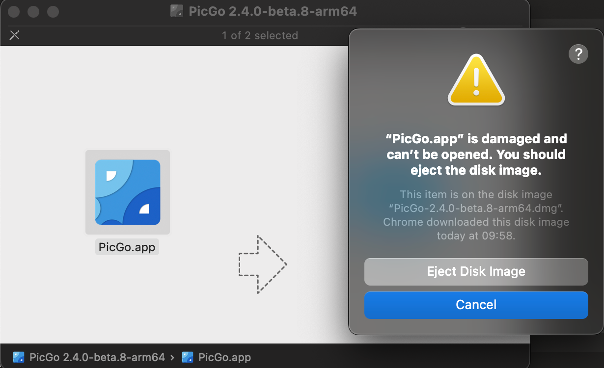
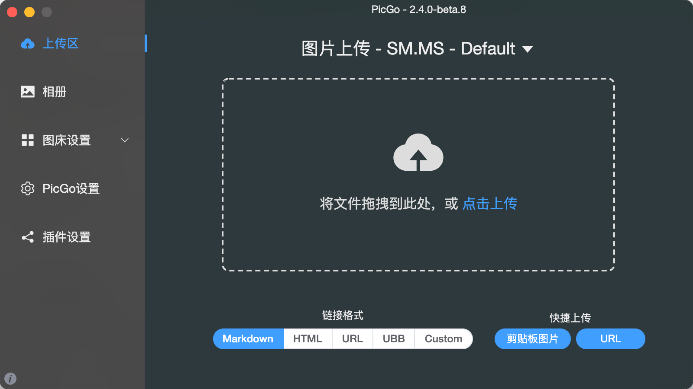

+++
title = 'Mac(M2)安装PicGo'
date = 2024-08-15T10:03:50+08:00
draft = true
categories = [ "Mac" ]
+++

## 下载地址

|    下载源    | 下载地址 |
| ----------- | ------- |
|    Github   |  https://github.com/Molunerfinn/PicGo/releases |
|    腾讯云COS |  https://github.com/Molunerfinn/PicGo/releases |

	
下载的 `PicGo-2.4.0-beta.8-arm64.dmg`，截止当前时间（2024-08-15 10:11:51），该版本为最新版。

## 安装

问题1: 安装后打开 picgo 报错：xxx 已损坏，无法打开。 您应该将它移到废纸篓。



解决方法：


先取消然后终端输入：

```
sudo xattr -r -d com.apple.quarantine 你的APP路径

```

APP 路径的获取方法：

打开 “访达”（Finder）进入 “应用程序” 目录，找到该软件图标，将图标拖到终端窗口，最终的命令类似:

```
sudo xattr -r -d com.apple.quarantine /Applications/PicGo.app
```

然后重新打开，界面如下：




