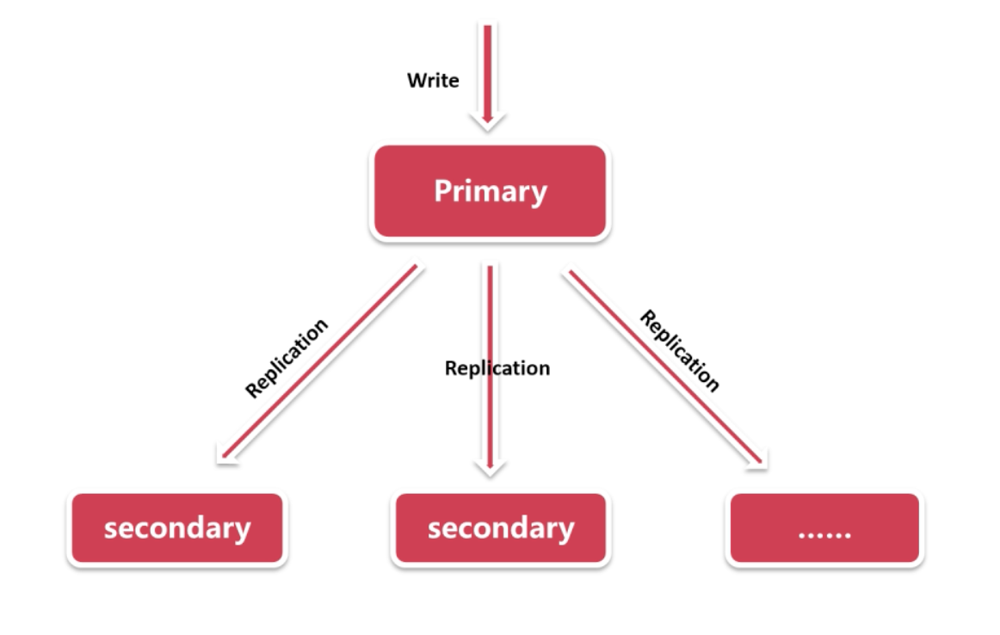

+++
title = 'MongoDB复制集'
date = 2024-05-12T16:12:04+08:00
draft = true
categories = [ "MongoDB" ]
tags = [ "mongo" ]
+++

## 复制集诞生的背景

单点模式

单点模式部署方便，只要在一台机器上进行部署。

但是单点模式也存在一些痛点，比如以下场景：

1、硬盘故障，比如存储空间不够，怎么办？

2、网络故障，比如网络通信或者机房电力故障，服务器无法正常提供服务怎么办？

3、备份。进行备份时，为了保证数据一致性，要将实例关闭或者添加写锁来保证备份的有效性，这时为不影响业务该怎么办？

这些都反应了单点模式在生产环境的不稳定性。

在这样的背景复制集诞生了。

复制集从传统主从结构Master/Slave 演变而来。

复制集是由一组拥有相同数据集的 mongod 实例所组成的集群。其中由一个数据节点为主节点，称为 Primary，所有的写请求都是在该节点完成的，而其他的数据节点都是从节点，称为 Secondary，这些从节点接收从主节点传过来的操作并应用，以此来保持与主节点的数据保持一致。

复制集时通过复制达到数据冗余，从而达到提高数据的可靠性。

## 概念

复制集中有个节点：

数据节点：存储数据，可以冲淡主从节点

投票节点：负责选举，不存储数据，不能充当主从节点
 
## 数据复制

主节点接收所有来自客户端的写操作，一个复制集只能有一个主节点，主节点通过将所有数据集的变动记录到oplog中，不记录读操作，从节点通过主节点的oplog来进行复制操作。

由于复制集中只有主节点能接受写操作，从节点是无法写入的，从而在数据一致性得到了充分的保证。

比如存在一份 MongoDB 数据集，用户可以对数据服务发起各种请求（读取、更新等请求）

但是一旦数据服务出现了故障，用户就无法正常获取对数据的请求，数据库服务也就无法响应用户的请求。对客户来说就出现了服务的中断。这显然是不好的。

如果对于同样的一份数据，还有另一份数据服务，里面包含了另一个数据的备份，就不应担心出现这样的故障了。因为可以让用户将请求发送给其他的数据库服务中

这样就仍然可以保证数据库服务是可用的。这种服务的特点就成为高可用。

还有下面这样的故障，数据库服务是可用的，但是数据库中的某些数据丢失了，我们仍然可以利用数据库的备份来恢复原来丢失的数据。

在对同一份数据存在多个备份之下，还有其他好处，比如这些备份保存在不同的地点，用户降低不用地区用户请求的延迟。

这些都是架构的优点：

* 提供了高可用性
* 保证了数据安全
* 有利于负载/分流

MongoDB 中提供这样类似的机制，叫做 `复制集`。

## 复制集

复制集中会对同一份数据保存多个备份

 

多个mongod 进程组成一个集群，就把这个集群称为复制集。复制集中每个mongod进程称为一个节点，复制集中的不同根节点分工可能也不同，首先每个复制集中都有一个主节点，除了主节点外，其他的节点都称为副节点

主节点负责所有的用户关于写请求，副节点会不停的从主节点进行数据的备份和复制到副节点中。这样保证每个符节点都最大程度上和主节点上数据保持同步。

复制过程是个异步的复制过程。这中间必然会或多或少存在延迟。但绝大部分情况是，副节点数据和主节点数据是保持同步的。

可以读取数据的请求，在默认情况下，读取请求也是有主节点处理，但是用户是可以在读取请求中增加一些读取选项，比如用户也可以要求复制集中的副节点来处理用户的读取请求。但是这并不能保证副节点在任意时间点数据保证完全同步，这种方式读取就存在风险。

除了处理用户的请求外，复制集节点之间也会相互发送请求，比如每个复制集中的节点都会向其他节点互相发送心跳请求，所用是让各个节点之间互相汇报健康状况

总结：

* 主节点负责处理所哟逇写入请求
* 默认情况下，主节点和副节点都可以处理读取请求
* 副节点从主节点或者符合条件的副节点中复制数据
* 每个节点都会向其他节点发送心跳请求
* 默认每隔2秒发送过一次，超过10秒则请求超时
* 复制集中最多可以有50个节点，原因是每个节点之间都需要发送心跳，

### 复制集选举

如果主节点发送故障，就会出现无法处理用户请求。这种情况显然不能体现复制集的高可用性。
其实复制集中的主节点是整个复制集通过选举算法产生的，当原本主节点无法提供正常服务时，复制集就会通过一次新的选举从其他的节点中选出新的主节点。
袁明民 > MongoDB 复制集选举 > image2024-5-21 7:57:24.png

复制集中的每个节点都有个选举计数器，当节点参与一次新的选举的时候，自己的选举计数器会+1，现在假设每个节点的选举计数器都是term=N，表示这些节点目前已经参与了N次选举。

如果现在主节点A发生了故障，剩下的两个B、C副节点任意节点都可以发起一次新的选举。
袁明民 > MongoDB 复制集选举 > image2024-5-21 8:3:55.png
如何发现主节点发生了故障呢？
节点之间是会不断给符节点发送心跳请求，当主节点发生故障故障了，发送的心跳请求可能会超时，副节点就能发现主节点故障，主节点可能不能正常工作了，此时任意副节点都可以发起一次选举。
但在实际应用中，我们是可以给节点设置优先级别，当优先级不同时，mongodb 算法会尽最大努力让优先级别最高的副节点当选为主节点。
现在比如说副节点B发起一次新的选举，就把副节点B称为候选节点，它发起新的选举会去询问其他节点是否愿意选举它为新的主节点。
袁明民 > MongoDB 复制集选举 > image2024-5-21 8:4:21.png
过程如下：
1、先将自己的选举计数器+1，因为发起了一次新的选举
袁明民 > MongoDB 复制集选举 > image2024-5-21 8:5:9.png
2、自己给自己投上一票（哈哈）
袁明民 > MongoDB 复制集选举 > image2024-5-21 8:7:42.png
3、给其他节点发送投票请求，询问其他节点是否愿意投自己一票。请求中包含了原本副节点B更新过的的选举计数器（term=N+1）,副节点C称为投票节点。当然候选节点也会讲请求发送给主节点，也就是会发送给复制集中的其他所有点解，只是由于主节点故障，候选节点未必会收到投票结果。
袁明民 > MongoDB 复制集选举 > image2024-5-21 8:11:28.png
4、投票节点收到投票请求之后，如果发现投票请求中的计数器的值比自己的要大，投票节点会先更新下自己的选举计数器(同步选举计数器)，接着投票节点决定投票结果，并告诉候选节点
袁明民 > MongoDB 复制集选举 > image2024-5-21 8:16:41.png
投票节点的投票结果是如何决定的呢？
投票节点会对比候选节点上数据的与自己的节点上的数据差异同步情况，也就是投票节点会拿候选节点与原本主节点的数据相似程度是否和自己与主节点的数据相似程度更高，如果高，投票节点就会投上一票

5、如果候选节点最后的赞成票数超过节点半数，那么候选节点就会成功当选为新的主节点

袁明民 > MongoDB 复制集选举 > image2024-5-21 8:25:34.png

此时复制集就恢复正常，可以继续处理用户的请求。但是此时这个复制集中能正常工作的节点就剩下了2个，如果当新主节点B再次出现故障时，就剩下了一个节点了，这个节点也会发起新的选举，它会给自己投上一票，但是其他节点发生故障，无法给它投票，最终出现的结果他的赞成票数小于节点数一半，那么这次选举就永远不会成功。

虽然两个节点现在可以正常工作，但是此时的复制集的状态就比较危险。因为它不能承担起下一次故障。这也从另一方面证明了我们在创建复制集时至少3个节点

6、如果候选节点最后的赞成票数没有超过节点半数，那么候选节点就不会当选为新的主节点，它会继续回去做副节点

袁明民 > MongoDB 复制集选举 > image2024-5-21 8:33:44.png

7、接下来另外的节点机会发出一次新的选举，它就会成为候选节点，并重复上面的选举过程，所以说选举可能会发生多次，知道出现新的主节点

袁明民 > MongoDB 复制集选举 > image2024-5-21 8:35:54.png

总结

候选节点发起新的选举，每个节点会投票给比自己与主节点数据差异更节点的节点，候选节点也会投自己一票
投票赞成票数超过节点半数的候选节点当选新的主节点
复制集中投票节点最多7个，原因是投票成本，可能发起不止一次投票
触发选举：
主节点与副节点心跳超时
复制集初始化时，此时还没有任何主节点和副节点，需要首先选出一个主节点
新节点接入已正常工作的复制集时（来了个更优秀的），新节点不一定是新节点，可能是之前的节点（有背景）

### 复制集投票机

一种特殊且很常用的新的类型的节点。

上面的例子中除了主节点，其他的节点都称为副节点。副节点的作用就是将数据从主节点同步到副节点上来。

可能有些时候我们并不需要那么多的数据备份，比如有些场景中会认为只要两个数据的备份就够了。

作用：

每个复制集中都是通过选举产生主节点，想要胜任主节点，就必须要获得赞成票数超过节点半数，如果只要两份数据备份而使用两个节点来搭建复制集，就可能最后各节点得到的票数相同，或者票数没有超过节点数半数的情况。

因为复制集中节点数是奇数，投票结果使用会有个明确的结果，不是超过半数就是少于半数（类似联合国）这种结果利于判断，如果节点数是双数，投票结果就可能刚好为半数，这种情况就比较尴尬。

所以为了很好的完成选举，我们更倾向于将节点数设置为奇数。

如果我们不想要太多的数据备份，但是我们想要有足够的可以投票的节点，这时候就可以使用称为投票机的节点，投票机节点本身也是副节点，只是它是一个行为比较特殊的副节点。

特殊之处：

投票机节点不会从主节点同步数据，它不会保存任何数据库文档的数据，但它仍然像其他副节点一样可以参与投票（找外援拉票）

投票机只可以给别人投票，不会给自己投票（因为投票机不包含任何数据，所以它也不可能成为主节点）。

总结：

* 没有任何数据
* 可以投票
* 不可能成为主节点

## 复制集数据备份

#### 初始同步

当一个节点作为全新的成员加入到复制集中时或者认为想将一个节点的数据重新初始化一次，此时将数据同步的过程称为“初始同步”

1、首先会将新节点（副节点）中已有的文档数据清理干净，从初始化状态开始同步

2、将主节点上的数据拷贝到新节点，包括所有的数据库、集合、索引、文档

通过拷贝，新节点上就重新从主节点同步了数据，在拷贝过程中主节点仍然是正常工作的，所以这个过程中用户仍然可能是会将请求发送给主节点的，这些新的数据是不会包含在这个拷贝过程中的。

拷贝只是初始同步，当这一步拷贝完成之后，还需要将这期间更新的数据拷贝到新节点上，所以数据同步过程还要包括同步写库记录同步

3、写库记录同步

当用户想主节点发送写数据请求时，可以将每一个写入数据的请求看做是一条记录，这些很多写入的记录是按照一定顺序排列的，主节点会将这些请求保留下来，包含了这些写入请求的清单就成为写库记录。

当完成上一步中各种拷贝之后，就需要不停的从主节点再进行新的数据同步的时候，拷贝过去的就不再是文档本身了，而是从主节点那边保留下来的写库记录，当主节点将这些写库记录拷贝到新节点时，并不是拷贝一条写库记录就将这条写库记录应用到到新节点的数据记录上，如果做这种同步应用性能就会很差，所以新节点在拷贝写库记录的时候，不管三七二十一，先将写库记录全部拷贝过来，保存在自己的特殊的 local.oplog.rs 集合中.

新节点在拷贝完写库记录之后，就会将这些写库记录请求应用到自己已有的数据上，也就是主节点上对数据做什么操作，新节点也对数据做同样操作

## MongoDB 副本集

### 架构

常见的架构如上图，Secondary 节点持续复制 Primary 节点的数据，Arbiter 节点负责心跳检测和选举，该节点不接收数据。

### 副本集复制原理

当Primary 节点有修改操作时，会将变更记录在oplog中，有一个线程会持续监听 oplog 的变化，当有变化时会将变化传到 Secondary从节点，然后在从节点回放。

### 故障恢复原理

副本集中节点两两互相发送心跳，当超过5次未收到对方心跳时，就会认为对方失联，如果失联的是主节点，那么从节点会发起选举，选举出新的主节点，如果失联的是从节点，则不会发起新的选举，选举时基于raft一致性算法