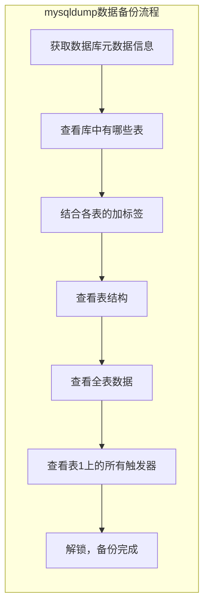
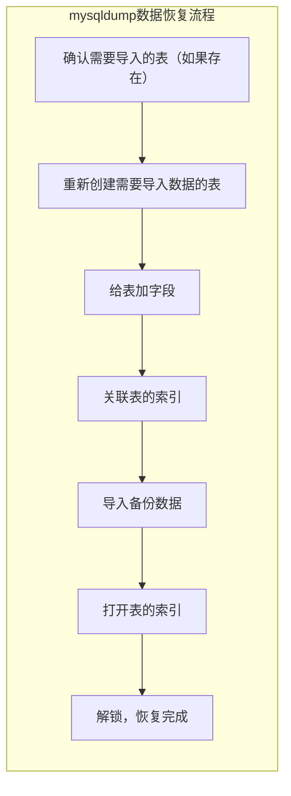
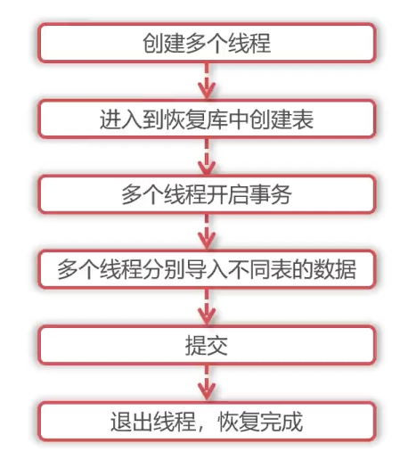

+++
title = 'MySQL逻辑备份工具——mysqldump'
date = 2024-09-01T08:07:10
draft = true
categories = [ "MySQL" ]
tags = [ "mysql" ]
+++

# 1 mysqldump

## 1.1 概述

* 非常常用的MySQL逻辑备份工具（逻辑备份表示输出的也是逻辑上可读的文本文件）
* MySQL 自带
* 输出的备份内容为 SQL 语句，方便阅读和还原
* SQL 语句占用空间较小（InnDB的库不仅有数据还有索引、B+Tree、日志，这些都会占用空间，逻辑备份SQL语句就是标准的行记录）

参考文档：https://dev.mysql.com/doc/refman/8.0/en/mysqldump.html

## 1.2 功能

- 可备份一个或多个表
- 可备份一个或多个库
- 可备份所有库表

## 1.3 优缺点

**优点**

  - MySQL 自带，集成时只需要考虑MySQL的操作系统依赖，而无需关注工具是否需要额外依赖、支持版本、架构等支持程度。故在继承时省去了继承成本。
  - 可方便查看、编辑备份文件，灵活性高、适用于数据量不大、快速开发测试等场景。
  - 受众较广，被大多数人所熟知。

**缺点**

  - 单线程，备份速度较慢。
  - 对于备份大量数据，它并不是快速和可扩展的解决方案，因为当数据量大时，即使备份合理，但是恢复的速度也会非常慢，因为重放SQL语句会涉及到插入、创建索引等磁盘I/O。
  - 对于大规模备份和还原，推荐使用物理备份，因为物理备份以原始格式复制数据文件来快速达到还原目的。
  - 官方文档中推荐使用 MySQL Shell，因为 MySQL Shell 程序可提供多线程并行转储、文件压缩和进度信息显示等功能。


## 1.4 原理

使用下面语句进行数据备份：
```sql
SELECT SQL_NOT_CACHE FROM `t`;
```

SQL_NOT_CACHE 查询存出的数据不会进入SQL缓存。

# 2 准备

## 2.1 环境

  主机   | IP            | 作用 | 用户
------- | ------------- | ---  | ---
chaos-1 | 172.20.30.1   | 备份  | u_backup
chaos-2 | 172.20.30.2   | 恢复  | u_recover

## 2.2 数据

1、登录 `chaos-1` 主机创建备份用户。

```sql 
create user 'u_backup'@'%' identified by '123';
```

2、赋予备份用户权限。

```sql
grant select, reload, process, lock tables, replication client, replication_slave_admin, show view, trigger on  *.* to 'u_backup'@'%';
```

- select：用于备份表数据时查询数据
- reload：用于备份前刷新 MySQL 日志文件
- process：如果不存储表空间信息，即备份时没有增加 --load-tablespace，则需要 process 权限。
- lock tables：如果备份时，没有增加--sntraction 参数，即在使用 mysqldump 时会给表增加读锁
- replication client：如果备份时需要记录位点，即增加 `--master-data` 参数。
- replication_slave_admin：如果增加--dump——salve
- show view：要备份视图
- trigger：要备份触发器

3、创建测试库表。

```sql
create database backup1;
use backup1

create table t1 (
  id int not null auto_increment primary key,
  firstname varchar(20) default null,
  lastname varchar(20) default null
) engine=InnoDB charset=utf8mb4;
```

4、插入测试数据。

```sql
insert into t1(firstname, lastname) values ('zhang', 'san'), ('li', 'si');
```

5、登录 `chaos-2` 机器连接 MySQL，创建恢复用户。

```sql
create user 'u_recover'@'%' identified by '123';
```

6、赋予恢复用户权限。

```sql
grant lock tables, drop, create, alter, select, insert, SUPER on *.* to 'u_recover'@'%';
```

- lock tables：恢复数据库会进行锁表，并且是写锁，
- drop、create：另外备份文件中会有drop操作，会将表drop 表再重新建，再导入备份数据，所以需要drop，create
- alter：导入数据之前会关闭表的索引，以提高写入速度，导入之后还会再开启表索引，所以需要 alter 权限
- select：导入时会需要查询一些参数，所以需要 select 权限
- insert：导入数据就是执行 insert 语句，所以需要insert权限

> 注意：添加的SUPER是因为我在第二次恢复过程出现了下面错误
  ```bash
  [root@chaos-1 backup]# mysql -u'u_recover' -p'123' -h 172.20.30.2 recover1 < bak1.sql
  mysql: [Warning] Using a password on the command line interface can be insecure.
  ERROR 1227 (42000) at line 18: Access denied; you need (at least one of) the SUPER, SYSTEM_VARIABLES_ADMIN or SESSION_VARIABLES_ADMIN privilege(s) for this operation
  ```

7、创建恢复数据库。

```sql
create database recover1;
```

## 2.3 快速使用

1、登录 `chaos-1` 主机，创建存放备份目录

```bash
mkdir -p /data/backup
cd /data/backup
```

2、备份上面创建的 backup1 库

```bash
[root@chaos-1 backup]# mysqldump -u'u_backup' -p'123' --set-gtid-purged=off backup1 > backup1.sql
mysqldump: [Warning] Using a password on the command line interface can be insecure.
[root@chaos-1 backup]# ll
total 4
-rw-r--r-- 1 root root 1949 9月   7 23:00 backup1.sql
[root@chaos-1 backup]#
```

- `--set-gtid-purged=off`：备份时通过该参数关闭 GTID 信息，作用主要是方便恢复
- `> backup1.sql`：导入到指定文件
- `backup1`：mysqldump 会将命令行中第一个名称参数 backup1 看做数据库的名称，所以该命令会备份 backup1 数据库的数据

3、查看备份内容

```bash
-- MySQL dump 10.13  Distrib 8.0.39, for Linux (x86_64)
--
-- Host: localhost    Database: backup1
-- ------------------------------------------------------
-- Server version	8.0.39

/*!40101 SET @OLD_CHARACTER_SET_CLIENT=@@CHARACTER_SET_CLIENT */;
/*!40101 SET @OLD_CHARACTER_SET_RESULTS=@@CHARACTER_SET_RESULTS */;
/*!40101 SET @OLD_COLLATION_CONNECTION=@@COLLATION_CONNECTION */;
/*!50503 SET NAMES utf8mb4 */;
/*!40103 SET @OLD_TIME_ZONE=@@TIME_ZONE */;
/*!40103 SET TIME_ZONE='+00:00' */;
/*!40014 SET @OLD_UNIQUE_CHECKS=@@UNIQUE_CHECKS, UNIQUE_CHECKS=0 */;
/*!40014 SET @OLD_FOREIGN_KEY_CHECKS=@@FOREIGN_KEY_CHECKS, FOREIGN_KEY_CHECKS=0 */;
/*!40101 SET @OLD_SQL_MODE=@@SQL_MODE, SQL_MODE='NO_AUTO_VALUE_ON_ZERO' */;
/*!40111 SET @OLD_SQL_NOTES=@@SQL_NOTES, SQL_NOTES=0 */;

--
-- Table structure for table `t1`
--

DROP TABLE IF EXISTS `t1`;
/*!40101 SET @saved_cs_client     = @@character_set_client */;
/*!50503 SET character_set_client = utf8mb4 */;
CREATE TABLE `t1` (
  `id` int NOT NULL AUTO_INCREMENT,
  `firstname` varchar(20) DEFAULT NULL,
  `lastname` varchar(20) DEFAULT NULL,
  PRIMARY KEY (`id`)
) ENGINE=InnoDB AUTO_INCREMENT=3 DEFAULT CHARSET=utf8mb4 COLLATE=utf8mb4_0900_ai_ci;
/*!40101 SET character_set_client = @saved_cs_client */;

--
-- Dumping data for table `t1`
--

LOCK TABLES `t1` WRITE;
/*!40000 ALTER TABLE `t1` DISABLE KEYS */;
INSERT INTO `t1` VALUES (1,'zhang','san'),(2,'li','si');
/*!40000 ALTER TABLE `t1` ENABLE KEYS */;
UNLOCK TABLES;
/*!40103 SET TIME_ZONE=@OLD_TIME_ZONE */;

/*!40101 SET SQL_MODE=@OLD_SQL_MODE */;
/*!40014 SET FOREIGN_KEY_CHECKS=@OLD_FOREIGN_KEY_CHECKS */;
/*!40014 SET UNIQUE_CHECKS=@OLD_UNIQUE_CHECKS */;
/*!40101 SET CHARACTER_SET_CLIENT=@OLD_CHARACTER_SET_CLIENT */;
/*!40101 SET CHARACTER_SET_RESULTS=@OLD_CHARACTER_SET_RESULTS */;
/*!40101 SET COLLATION_CONNECTION=@OLD_COLLATION_CONNECTION */;
/*!40111 SET SQL_NOTES=@OLD_SQL_NOTES */;

-- Dump completed on 2024-09-07 23:00:37
```

备份文件内容大致如下：

- MySQL的版本 `8.0.39`
- 备份实例的 `Host` 信息 `localhost`
- 数据库名称 `backup1`
- 删表语句 `DROP TABLE ...`
- 建表语句 `CREATE TABLE ...`
- 锁表语句 `LOCK TABLES ...`，加锁是为了在恢复时保证数据一致性
- 数据写入语句 `INSERT INTO ...`
- 锁释放语句 `UNLOCK TABLES ...`

> 注意：将数据恢复到目标实例时，由于备份文件中默认带有 drop 语句，这就会导致删除目标实例的表，所以恢复时一定要注意。

4、恢复

为了操作方便就不将备份文件上传至 `chaos-2` 主机来恢复，而是在 `chaos-1` 机器上远程恢复至 `chaos-2` 主机上的目标实例。

5、先查看 `chaos-2` 主机上目标实例的库表记录

```sql
mysql> show databases;
+--------------------+
| Database           |
+--------------------+
| information_schema |
| mysql              |
| performance_schema |
| recover1           |
| sys                |
+--------------------+
5 rows in set (0.01 sec)

mysql> use recover1
Database changed
mysql> show tables;
Empty set (0.00 sec)

```

6、恢复

在 `chaos-1` 主机上执行恢复

```bash
[root@chaos-1 backup]# mysql -u'u_recover' -p'123' -h 172.20.30.2 recover1 < backup1.sql
mysql: [Warning] Using a password on the command line interface can be insecure.
[root@chaos-1 backup]#
```

7、查看 `chaos-2` 目标实例数据

```sql
mysql> show databases;
+--------------------+
| Database           |
+--------------------+
| information_schema |
| mysql              |
| performance_schema |
| recover1           |
| sys                |
+--------------------+
5 rows in set (0.01 sec)

mysql> use recover1
Database changed
mysql> show tables;
Empty set (0.00 sec)

mysql> show tables;
+--------------------+
| Tables_in_recover1 |
+--------------------+
| t1                 |
+--------------------+
1 row in set (0.00 sec)

mysql> select * from t1;
+----+-----------+----------+
| id | firstname | lastname |
+----+-----------+----------+
|  1 | zhang     | san      |
|  2 | li        | si       |
+----+-----------+----------+
2 rows in set (0.00 sec)
```

# 3 过程分析

> 通过开启 `general_log` 实时查看 mysqldump 备份/恢复时执行了哪些操作，从而了解 mysqldump 备份/恢复原理。

## 3.1 备份过程

1、登录 `chaos-1` 主机实例查看 `general_log` 位置并开启 `general_log`

```sql
mysql> show global variables like '%general%';
+------------------+-----------------------------------+
| Variable_name    | Value                             |
+------------------+-----------------------------------+
| general_log      | OFF                               |
| general_log_file | /data/mysql/log/mysql-general.log |
+------------------+-----------------------------------+
2 rows in set (0.01 sec)
mysql> set global general_log=on;
Query OK, 0 rows affected (0.00 sec)

mysql> show global variables like '%general%';
+------------------+-----------------------------------+
| Variable_name    | Value                             |
+------------------+-----------------------------------+
| general_log      | ON                                |
| general_log_file | /data/mysql/log/mysql-general.log |
+------------------+-----------------------------------+

```

2、新开一个窗口实时观察日志：

```bash
tail -f /data/mysql/log/mysql-general.log
```

3、在 `chaos-1` 主机上执行备份

```bash
[root@chaos-1 backup]# mysqldump -u'u_backup' -p'123' backup1 > backup1.sql
mysqldump: [Warning] Using a password on the command line interface can be insecure.
Warning: A partial dump from a server that has GTIDs will by default include the GTIDs of all transactions, even those that changed suppressed parts of the database. If you don't want to restore GTIDs, pass --set-gtid-purged=OFF. To make a complete dump, pass --all-databases --triggers --routines --events.
Warning: A dump from a server that has GTIDs enabled will by default include the GTIDs of all transactions, even those that were executed during its extraction and might not be represented in the dumped data. This might result in an inconsistent data dump.
In order to ensure a consistent backup of the database, pass --single-transaction or --lock-all-tables or --master-data.
[root@chaos-1 backup]#
```

4、查看 `general_log` 日志

```bash
2024-09-07T15:06:50.741915Z	   12 Connect	u_backup@localhost on  using Socket
2024-09-07T15:06:50.742107Z	   12 Query	/*!40100 SET @@SQL_MODE='' */
2024-09-07T15:06:50.742212Z	   12 Query	/*!40103 SET TIME_ZONE='+00:00' */
2024-09-07T15:06:50.742294Z	   12 Query	/*!80000 SET SESSION information_schema_stats_expiry=0 */
2024-09-07T15:06:50.742360Z	   12 Query	SET SESSION NET_READ_TIMEOUT= 86400, SESSION NET_WRITE_TIMEOUT= 86400
2024-09-07T15:06:50.742472Z	   12 Query	SHOW VARIABLES LIKE 'gtid_mode'
2024-09-07T15:06:50.744634Z	   12 Query	SELECT @@GLOBAL.GTID_EXECUTED
2024-09-07T15:06:50.744862Z	   12 Query	SELECT LOGFILE_GROUP_NAME, FILE_NAME, TOTAL_EXTENTS, INITIAL_SIZE, ENGINE, EXTRA FROM INFORMATION_SCHEMA.FILES WHERE ENGINE = 'ndbcluster' AND FILE_TYPE = 'UNDO LOG' AND FILE_NAME IS NOT NULL AND LOGFILE_GROUP_NAME IS NOT NULL AND LOGFILE_GROUP_NAME IN (SELECT DISTINCT LOGFILE_GROUP_NAME FROM INFORMATION_SCHEMA.FILES WHERE ENGINE = 'ndbcluster' AND FILE_TYPE = 'DATAFILE' AND TABLESPACE_NAME IN (SELECT DISTINCT TABLESPACE_NAME FROM INFORMATION_SCHEMA.PARTITIONS WHERE TABLE_SCHEMA IN ('backup1'))) GROUP BY LOGFILE_GROUP_NAME, FILE_NAME, ENGINE, TOTAL_EXTENTS, INITIAL_SIZE ORDER BY LOGFILE_GROUP_NAME
2024-09-07T15:06:50.748001Z	   12 Query	SELECT DISTINCT TABLESPACE_NAME, FILE_NAME, LOGFILE_GROUP_NAME, EXTENT_SIZE, INITIAL_SIZE, ENGINE FROM INFORMATION_SCHEMA.FILES WHERE FILE_TYPE = 'DATAFILE' AND TABLESPACE_NAME IN (SELECT DISTINCT TABLESPACE_NAME FROM INFORMATION_SCHEMA.PARTITIONS WHERE TABLE_SCHEMA IN ('backup1')) ORDER BY TABLESPACE_NAME, LOGFILE_GROUP_NAME
2024-09-07T15:06:50.749523Z	   12 Query	SHOW VARIABLES LIKE 'ndbinfo\_version'
2024-09-07T15:06:50.751748Z	   12 Init DB	backup1
2024-09-07T15:06:50.751859Z	   12 Query	show tables
2024-09-07T15:06:50.752951Z	   12 Query	LOCK TABLES `t1` READ /*!32311 LOCAL */
2024-09-07T15:06:50.753189Z	   12 Query	show table status like 't1'
2024-09-07T15:06:50.754350Z	   12 Query	SET SQL_QUOTE_SHOW_CREATE=1
2024-09-07T15:06:50.754445Z	   12 Query	SET SESSION character_set_results = 'binary'
2024-09-07T15:06:50.754524Z	   12 Query	show create table `t1`
2024-09-07T15:06:50.754787Z	   12 Query	SET SESSION character_set_results = 'utf8mb4'
2024-09-07T15:06:50.754904Z	   12 Query	show fields from `t1`
2024-09-07T15:06:50.756156Z	   12 Query	show fields from `t1`
2024-09-07T15:06:50.757180Z	   12 Query	SELECT /*!40001 SQL_NO_CACHE */ * FROM `t1`
2024-09-07T15:06:50.757353Z	   12 Query	SET SESSION character_set_results = 'binary'
2024-09-07T15:06:50.757438Z	   12 Query	use `backup1`
2024-09-07T15:06:50.757539Z	   12 Query	select @@collation_database
2024-09-07T15:06:50.757645Z	   12 Query	SHOW TRIGGERS LIKE 't1'
2024-09-07T15:06:50.758616Z	   12 Query	SET SESSION character_set_results = 'utf8mb4'
2024-09-07T15:06:50.758714Z	   12 Query	SET SESSION character_set_results = 'binary'
2024-09-07T15:06:50.758814Z	   12 Query	SELECT COLUMN_NAME,                       JSON_EXTRACT(HISTOGRAM, '$."number-of-buckets-specified"')                FROM information_schema.COLUMN_STATISTICS                WHERE SCHEMA_NAME = 'backup1' AND TABLE_NAME = 't1'
2024-09-07T15:06:50.759237Z	   12 Query	SET SESSION character_set_results = 'utf8mb4'
2024-09-07T15:06:50.759366Z	   12 Query	UNLOCK TABLES
2024-09-07T15:06:50.760712Z	   12 Quit
```

过程如下：

1. `12` 表示主线程号，从备份开始到结束，可以看到始终是 `12`，可以看出 mysqldump 其实是单线程备份。
2. `Connect	u_bak@localhost on  using Socket` 首先是通过 socket 方式建立连接
3. 设置一些会话变量，获取数据库的元数据信息，比如执行 `Query	SHOW VARIABLES LIKE 'gtid\_mode'` 查看GTID模式是否开启；
4. 信息查询
5. 库表查询
6. 为表加读锁
7. 查看表结构，表结构会写入到备份文件中
8. 查询表数据，
9. 查看触发器
10. 释放锁
11. 退出

## 3.2 备份原理




## 3.3 恢复过程

> 目标：通过开启 `general_log` 实时查看 mysqldump 恢复时执行了哪些操作，从而了解 mysqldump 恢复原理

1、登录 `chaos-2` 主机实例查看 `general_log` 位置并开启 `general_log`

```
mysql> show global variables like '%general%';
+------------------+-----------------------------------+
| Variable_name    | Value                             |
+------------------+-----------------------------------+
| general_log      | OFF                               |
| general_log_file | /data/mysql/log/mysql-general.log |
+------------------+-----------------------------------+
2 rows in set (0.00 sec)

mysql> set global general_log=on;
Query OK, 0 rows affected (0.00 sec)

mysql> show global variables like '%general%';
+------------------+-----------------------------------+
| Variable_name    | Value                             |
+------------------+-----------------------------------+
| general_log      | ON                                |
| general_log_file | /data/mysql/log/mysql-general.log |
+------------------+-----------------------------------+
```

2、新开一个窗口实时观察日志：

```bash
tail -f /data/mysql/log/mysql-general.log
```

3、登录到 `chaos-1` 主机进行目标实例的远程恢复

```bash
[root@chaos-1 backup]# mysql -u'u_recover' -p'123' -h 172.20.30.2 recover1 < backup1.sql
mysql: [Warning] Using a password on the command line interface can be insecure.
[root@chaos-1 backup]#
```

4、查看日志

```bash
2024-09-07T15:10:12.898219Z	   12 Connect	u_recover@172.20.30.1 on recover1 using SSL/TLS
2024-09-07T15:10:12.898609Z	   12 Query	select @@version_comment limit 1
2024-09-07T15:10:12.898897Z	   12 Query	/*!40101 SET @OLD_CHARACTER_SET_CLIENT=@@CHARACTER_SET_CLIENT */
2024-09-07T15:10:12.899051Z	   12 Query	/*!40101 SET @OLD_CHARACTER_SET_RESULTS=@@CHARACTER_SET_RESULTS */
2024-09-07T15:10:12.899201Z	   12 Query	/*!40101 SET @OLD_COLLATION_CONNECTION=@@COLLATION_CONNECTION */
2024-09-07T15:10:12.899312Z	   12 Query	/*!50503 SET NAMES utf8mb4 */
2024-09-07T15:10:12.899443Z	   12 Query	/*!40103 SET @OLD_TIME_ZONE=@@TIME_ZONE */
2024-09-07T15:10:12.899543Z	   12 Query	/*!40103 SET TIME_ZONE='+00:00' */
2024-09-07T15:10:12.899659Z	   12 Query	/*!40014 SET @OLD_UNIQUE_CHECKS=@@UNIQUE_CHECKS, UNIQUE_CHECKS=0 */
2024-09-07T15:10:12.899770Z	   12 Query	/*!40014 SET @OLD_FOREIGN_KEY_CHECKS=@@FOREIGN_KEY_CHECKS, FOREIGN_KEY_CHECKS=0 */
2024-09-07T15:10:12.899870Z	   12 Query	/*!40101 SET @OLD_SQL_MODE=@@SQL_MODE, SQL_MODE='NO_AUTO_VALUE_ON_ZERO' */
2024-09-07T15:10:12.899973Z	   12 Query	/*!40111 SET @OLD_SQL_NOTES=@@SQL_NOTES, SQL_NOTES=0 */
2024-09-07T15:10:12.900086Z	   12 Query	SET @MYSQLDUMP_TEMP_LOG_BIN = @@SESSION.SQL_LOG_BIN
2024-09-07T15:10:12.900193Z	   12 Query	SET @@SESSION.SQL_LOG_BIN= 0
2024-09-07T15:10:12.900308Z	   12 Query	SET @@GLOBAL.GTID_PURGED=/*!80000 '+'*/ '0ae76375-6d28-11ef-8223-0242ac141e01:1-12'
2024-09-07T15:10:12.901010Z	   12 Query	DROP TABLE IF EXISTS `t1`
2024-09-07T15:10:12.909129Z	   12 Query	/*!40101 SET @saved_cs_client     = @@character_set_client */
2024-09-07T15:10:12.909310Z	   12 Query	/*!50503 SET character_set_client = utf8mb4 */
2024-09-07T15:10:12.909553Z	   12 Query	CREATE TABLE `t1` (
  `id` int NOT NULL AUTO_INCREMENT,
  `firstname` varchar(20) DEFAULT NULL,
  `lastname` varchar(20) DEFAULT NULL,
  PRIMARY KEY (`id`)
) ENGINE=InnoDB AUTO_INCREMENT=3 DEFAULT CHARSET=utf8mb4 COLLATE=utf8mb4_0900_ai_ci
2024-09-07T15:10:12.919987Z	   12 Query	/*!40101 SET character_set_client = @saved_cs_client */
2024-09-07T15:10:12.920223Z	   12 Query	LOCK TABLES `t1` WRITE
2024-09-07T15:10:12.921145Z	   12 Query	/*!40000 ALTER TABLE `t1` DISABLE KEYS */
2024-09-07T15:10:12.921531Z	   12 Query	INSERT INTO `t1` VALUES (1,'zhang','san'),(2,'li','si')
2024-09-07T15:10:12.921869Z	   12 Query	/*!40000 ALTER TABLE `t1` ENABLE KEYS */
2024-09-07T15:10:12.922548Z	   12 Query	UNLOCK TABLES
2024-09-07T15:10:12.922714Z	   12 Query	SET @@SESSION.SQL_LOG_BIN = @MYSQLDUMP_TEMP_LOG_BIN
2024-09-07T15:10:12.922849Z	   12 Query	/*!40103 SET TIME_ZONE=@OLD_TIME_ZONE */
2024-09-07T15:10:12.922984Z	   12 Query	/*!40101 SET SQL_MODE=@OLD_SQL_MODE */
2024-09-07T15:10:12.923200Z	   12 Query	/*!40014 SET FOREIGN_KEY_CHECKS=@OLD_FOREIGN_KEY_CHECKS */
2024-09-07T15:10:12.923313Z	   12 Query	/*!40014 SET UNIQUE_CHECKS=@OLD_UNIQUE_CHECKS */
2024-09-07T15:10:12.923417Z	   12 Query	/*!40101 SET CHARACTER_SET_CLIENT=@OLD_CHARACTER_SET_CLIENT */
2024-09-07T15:10:12.923534Z	   12 Query	/*!40101 SET CHARACTER_SET_RESULTS=@OLD_CHARACTER_SET_RESULTS */
2024-09-07T15:10:12.923641Z	   12 Query	/*!40101 SET COLLATION_CONNECTION=@OLD_COLLATION_CONNECTION */
2024-09-07T15:10:12.923739Z	   12 Query	/*!40111 SET SQL_NOTES=@OLD_SQL_NOTES */
2024-09-07T15:10:12.924344Z	   12 Quit
```

如果要导入表已经存在，DROP TABLE IF EXISTS `t1` 就会表先删除，如果要往目标实例恢复数据时，一定要先保证目标实例中表数据是不需要的或者已经提前备份了，因为它会将表删除掉并重新创建该表；

`LOCK TABLES `t1` WRITE` 会为表加锁，加的是写锁，加写锁是其他的会话读写都是不能进行的；
`/*!40000 ALTER TABLE `t1` ENABLE KEYS */` 会关闭表索引，因为导入数据钱关闭表索引会让表导入速度更快些。
通过Insert 语句导入数据，打开表索引，然后打开解锁，

## 3.4 恢复原理


                                                                                                                                                    


# 4 常见用法

**环境准备**

1、数据准备

- 登录`chaos-1` 机器在 `backup1` 库中创建和 t1 表一样的 t2 表；
- 创建一个新库 `backup2`；
- 在 backup2 库中创建和 backup1.t1 一样的表；
- 写入测试数据

```sql
create table backup1.t2 like backup1.t1;
create database backup2; 
create table backup2.t1 like backup1.t1;
insert into backup1.t2(firstname, lastname) select firstname, lastname from backup1.t1;
insert into backup2.t1(firstname, lastname) select firstname, lastname from backup1.t1;
```

两个库 backup1 和 backup2 库两张表 backup2 库一张表t1，共三张表且表中数据都一样。

2、登录 `chaos-2` 机器为恢复用户添加权限

```sql
grant lock tables, drop, create, alter, select, insert, delete, system_variables_admin, references, trigger, create view, set_user_id, system_user on *.* to u_recover@'%';
```

- delete：使用 replace into 代替 insert into 需要 delete 权限
- system_variables_admin： 允许修改变量
- references：允许创建外键
- trigger：允许创建触发器
- create view：允许创建视图
- set_user_id：允许在执行视图或存储过程时设置有效的授权ID
- system_user：允许设置系统用户

3、 清空 `chaos-2` 之前的测试恢复的表

```sql
drop table recover1.t1;
```

**--set-gtid-purged**

> 是否在输出中添加 SET @@GLOBAL.GTID_PURGED

在开启GTID的情况下，默认不添加任何参数会在备份文件中记录GTID的信息。

```bash
mysqldump -u'u_backup' -p'123' backup1 >backup1_gtid.sql
```

查看备份文件：

```bash
[root@chaos-1 backup]# cat backup1_gtid.sql
...

SET @@GLOBAL.GTID_PURGED=/*!80000 '+'*/ '0ae76375-6d28-11ef-8223-0242ac141e01:1-17';

--
-- Table structure for table `t1`
--

...
```

从上面的备份文件中会看到设置GTID `SET @@GLOBAL.GTID_PURGED ...`的语句，这就是添加这个参数 `--set-gtid-purged` 的作用。在恢复数据库时就可能因为存在这条语句而存在问题：

```
# mysql -u'u_recover' -p'123' -h172.20.30.2 recover1 < backup1_gtid.sql
mysql: [Warning] Using a password on the command line interface can be insecure.
ERROR 3546 (HY000) at line 24: @@GLOBAL.GTID_PURGED cannot be changed: the added gtid set must not overlap with @@GLOBAL.GTID_EXECUTED
```

提示 `GTID_PURGED` 不能被修改，所以我们如果不希望记录GTID信息，就可以增加参数 `--set-gtid-purged=off`

备份语句：

```bash
# mysqldump -u'u_backup' -p'123' --set-gtid-purged=off backup1 >backup1_gtid_off.sql
mysqldump: [Warning] Using a password on the command line interface can be insecure.
```

此时再来查看被文件就不会看到`SET @@GLOBAL.GTID_PURGED ...`这样的语句了。

恢复语句：
```bash
# mysql -u'u_recover' -p'123' -h172.20.30.2 recover1 < backup1_gtid_off.sql
```

在 `chaos-2` 机器恢复后的数据

```sql
mysql> show tables;
+--------------------+
| Tables_in_recover1 |
+--------------------+
| t1                 |
| t2                 |
+--------------------+
2 rows in set (0.00 sec)

mysql> use recover1;
Database changed
mysql> select * from t1;
+----+-----------+----------+
| id | firstname | lastname |
+----+-----------+----------+
|  1 | zhang     | san      |
|  2 | li        | si       |
+----+-----------+----------+
2 rows in set (0.00 sec)

mysql> select * from t2;
+----+-----------+----------+
| id | firstname | lastname |
+----+-----------+----------+
|  1 | zhang     | san      |
|  2 | li        | si       |
+----+-----------+----------+
2 rows in set (0.00 sec)

mysql>
```

> 使用建议：备份时将指定 `--set-gtid-purged=off`

**--databases**

> 备份过个库，可缩写为 `-B`

备份多个数据库。 通常，mysqldump 会将命令行上的第一个名称参数视为数据库名称，将后面的名称视为表名称。使用该选项后，它会将所有名称参数都视为数据库名称。 CREATE DATABASE 和 USE 语句将包含在每个新数据库之前的输出中。

备份：

```bash
# mysqldump -u'u_backup' -p'123' --set-gtid_purged=off -B backup1 backup2 > backup1_backup2.sql
```

查看备份文件：

```bash 
# cat backup1_backup2.sql
...
CREATE DATABASE /*!32312 IF NOT EXISTS*/ `backup1` /*!40100 DEFAULT CHARACTER SET utf8mb4 COLLATE utf8mb4_0900_ai_ci */ /*!80016 DEFAULT ENCRYPTION='N' */;

USE `backup1`;

...

CREATE DATABASE /*!32312 IF NOT EXISTS*/ `backup2` /*!40100 DEFAULT CHARACTER SET utf8mb4 COLLATE utf8mb4_0900_ai_ci */ /*!80016 DEFAULT ENCRYPTION='N' */;

USE `backup2`;

...
```

恢复：

执行恢复操作，可以不用指定库名，因为会重新创建 backup1 和 backup2

```bash
# mysql -u'u_recover' -p'123' -h172.20.30.2 < backup1_backup2.sql
```

查看恢复数据：

略

使用建议：

备份所有库时场景下使用。


**--all-databases** 

> 备份所有数据库中的所有表。 效果与 `--databases` 一致，在使用与 与 `-B db1 db2 ...` 效果一致。可缩写为 `-A`。备份文件会包含所有库的 create database 语句，包括系统表


备份：

```bash
mysqldump -u'u_backup' -p'123' --set-gtid_purged=off -A > all.sql
```

恢复：

```
mysql -u'u_recover' -p'123' -h172.20.30.2 < all.sql
```

> 注意：由于该参数会备份系统表，所以这一操作在恢复时会将所有的表重建，也包括系统表，之前创建的恢复用户也会丢失。需要注意这点

使用建议：

当需要备份系统表时使用该参数，如无此需求，推荐使用 `--databases`

**备份恢复某一张表**

> 先接库名再接表名。通常，mysqldump 会将命令行上的第一个名称参数视为数据库名称，将后面的名称视为表名称

备份：

```
# mysqldump -u'u_backup' -p'123' --set-gtid_purged=off backup1 t1 > backup1_t1.sql
```

将 `chaos-2` 删除之前恢复的 backup1 和 backup2库，recover1 库下的所有表，然后再重新恢复：

```sql
mysql> use recover1;
Database changed
mysql> show tables;
Empty set (0.00 sec)

mysql>
```

`chaos-1` 执行恢复：

```bash
mysql -u'u_recover' -p'123' -h172.20.30.2 recover1 < backup1_t1.sql
```

在 `chaos-2` 上查看恢复数据：
```sql
mysql> show tables;
+--------------------+
| Tables_in_recover1 |
+--------------------+
| t1                 |
+--------------------+
1 row in set (0.00 sec)

mysql> select * from t1;
+----+-----------+----------+
| id | firstname | lastname |
+----+-----------+----------+
|  1 | zhang     | san      |
|  2 | li        | si       |
+----+-----------+----------+
2 rows in set (0.00 sec)

mysql>
```

同样的，如果要备份过个表，第一次参数是库，后面的接的参数都认为是表，比如：

```bash
mysqldump -u'u_backup' -p'123' --set-gtid_purged=off backup1 t1 t2 > backup1_t1_t2.sql
```

恢复：
```bash
mysql -u'u_recover' -p'123' -h172.20.30.2 recover1 < backup1_t1_t2.sql
```

在 `chaos-2` 查看恢复数据：

```sql
mysql> show tables;
+--------------------+
| Tables_in_recover1 |
+--------------------+
| t1                 |
| t2                 |
+--------------------+
2 rows in set (0.00 sec)

mysql> select * from t1;
+----+-----------+----------+
| id | firstname | lastname |
+----+-----------+----------+
|  1 | zhang     | san      |
|  2 | li        | si       |
+----+-----------+----------+
2 rows in set (0.00 sec)

mysql> select * from t2;
+----+-----------+----------+
| id | firstname | lastname |
+----+-----------+----------+
|  1 | zhang     | san      |
|  2 | li        | si       |
+----+-----------+----------+
2 rows in set (0.00 sec)
```

使用建议：

当需要指定表备份时可以使用这种方式。

**远程备份**

在第二台机器 `chaos-2` 上执行远程备份，远程备份第一台机器的数据。

```
mkdir /data/backup && cd /data/backup
mysqldump -u'u_backup' -p'123' -h'172.20.30.1' --set-gtid_purged=off backup1 t1 > backup1_t1.sql
```

查看前30行

恢复，直接在第二台机器 `chaos-2` 上执行恢复至本地，恢复前先清空 recover1 中的表

```bash
mysql -u'u_recover' -p'123' recover1 < backup1_t1.sql
```

查看恢复数据：

```sql
mysql> show tables;
+--------------------+
| Tables_in_recover1 |
+--------------------+
| t1                 |
+--------------------+
1 row in set (0.01 sec)

mysql> select * from t1;
+----+-----------+----------+
| id | firstname | lastname |
+----+-----------+----------+
|  1 | zhang     | san      |
|  2 | li        | si       |
+----+-----------+----------+
2 rows in set (0.00 sec)

mysql>
```

**备份文件中增加删库语句**

```bash
mysqldump -u'u_bak' -p'123' --set-gtid_purged=off --add-drop-database -B bak1 bak2 >bak1_bak2_add_drop_db.sql
```

一定是要加了-A或者-B参数才会增加 drop database 语句

恢复

```bash
mysql -u'u_recover' -p'123' -h172.20.30.2 < bak1_bak2_add_drop_db.sql
```

因为备份文件中已经增加了库名，这里这里不用指定

**不加建库语句**

默认 mysqldump 没有建库语句，如果增加了-A或者-B参数时，会在备份文件中增加 create database 语句，如果我们不希望有create database 语句 ，使用-n 或者--no-create-db
```bash
mysqldump -u'u_bak' -p'123' --set-gtid_purged=off -n -B bak1 bak2 >bak1_bak2_no_create_db.sql
```

```bash
mysql -u'u_recover' -p'123' -h172.20.30.2 < bak1_bak2_no_create_db.sql
```

**备份文件职工不增加删表语句**

默认备份文件中都会有drop table 的语句， 如果有时候目标库存在某个表，不希望删除这个表，就可以在备份时配置在备份文件中不增加删表语句

它不会在每条create table之前添加drop table 语句
```bash
mysqldump -u'u_bak' -p'123' --set-gtid_purged=off --skip-add-drop-table bak1 t1 >bak1_t1_no_drop_table.sql
```

由于备份文件中没有drop table 语句，但目标库中又存在对应表，所以需要手动drop 再正常恢复

```bash
[root@chaos-1 data]# mysql -u'u_recover' -p'123' -h172.20.30.2 recover1 < bak1_t1_no_drop_table.sql
mysql: [Warning] Using a password on the command line interface can be insecure.
ERROR 1050 (42S01) at line 24: Table 't1' already exists
[root@chaos-1 data]#
```

```bash
drop table recover1.t1;
mysql -u'u_recover' -p'123' -h172.20.30.2 recover1 < bak1_t1_no_drop_table.sql
```  

**insert 语句包含所有的列名**

默认 insert 语句是不包含列名的，如果要想包含列名：

-c 表示语句中包含所有的列名
```bash
mysqldump -u'u_bak' -p'123' --set-gtid_purged=off -c bak1 t1 >bak1_t1_complete_insert.sql
```

在查看备份文件观察：


恢复

```bash
mysql -u'u_recover' -p'123' -h172.20.30.2 recover1 < bak1_t1_complete_insert.sql
```

**只备份表结构**

-d 参数表示只备份表结构，不包括数据，也可以使用--no-data 表示

```bash
mysqldump -u'u_bak' -p'123' --set-gtid_purged=off -d bak1 t1 >bak1_t1_no_data.sql
```

恢复

```bash
mysql -u'u_recover' -p'123' -h172.20.30.2 recover1 < bak1_t1_no_data.sql
```

**只备份数据**

```bash
mysqldump -u'u_bak' -p'123' --set-gtid_purged=off -t bak1 t1 >bak1_t1_no_create.sql
```

恢复

```bash
mysql -u'u_recover' -p'123' -h172.20.30.2 recover1 < bak1_t1_no_create.sql
```

**用replace 语句代替insert语句**

使用 mysqldump 备份时，数据都默认转成 insert 语句，如果想要replace语句代替insert语句，另外需要再只备份表数据的前提下，因为如果有备份表结构，就会将表重建，那就基本上不会存在重复数据了，replace 也就没有意义了，使用replace 其实就是为了处理重复数据，重复数据就是想要使用备份来替换

```bash
mysqldump -u'u_bak' -p'123' --set-gtid_purged=off -t --replace bak1 t1 >bak1_t1_no_create_replace.sql
```

更新下第二台机器上的表数据，然后观察恢复后是有有被替换
```
update t1 set a = 'aaa' where id = 1;
```

查看两台机器t1表的区别:

恢复

```bash
mysql -u'u_recover' -p'123' -h172.20.30.2 recover1 < bak1_t1_no_create_replace.sql
``` 

**使用 insert ignore 语句代替 insert 语句**

也是在只备份数据的前提下,，如果恢复时目标数据和恢复数据一样，就会以目标数据为准


```bash
mysqldump -u'u_bak' -p'123' --set-gtid_purged=off -t --insert-ignore bak1 t1 >bak1_t1_insert_ignore.sql
```

修改目标数据
```
update t1 set a = 'aaa' where id = 1;
```

恢复

```bash
mysql -u'u_recover' -p'123' -h172.20.30.2 recover1 < bak1_t1_insert_ignore.sql
```

**带条件的备份**


```bash
mysqldump -u'u_bak' -p'123' --set-gtid_purged=off bak1 t1 -w"id=1" >bak1_t1_id_1.sql
```

恢复

```bash
mysql -u'u_recover' -p'123' -h172.20.30.2 recover1 < bak1_t1_id_1.sql
```

**在备份前刷新MySQL服务的日志**

有时候为了方便后续的数据恢复，有时在备份时希望刷新MYSQL的服务日志文件

备份前查看日志文件
```sql
show binary logs;
```

备份：
```bash
mysqldump -u'u_bak' -p'123' --set-gtid_purged=off -F bak1 t1 >bak1_t1_flush_logs.sql
```

恢复

```bash
mysql -u'u_recover' -p'123' -h172.20.30.2 recover1 < bak1_t1_flush_logs.sql
```

**开启一个事务进行备份操作**

如果备份都是事务表，可以通过开启事务来备份数据

```
mysqldump -u'u_bak' -p'123' --set-gtid_purged=off --single-transaction bak1 t1 >bak1_t1_single_transaction.sql
```

该参数会将事务隔离级别设置为 replica read，可重复读，并且备份之前发送一条 start transaction 语句，仅对Inndb表有用，

**不带加锁语句**

备份：
```bash
mysqldump -u'u_bak' -p'123' --set-gtid_purged=off --skip-add-locks bak1 t1 >bak1_t1_skip_locks.sql
```

恢复

```bash
mysql -u'u_recover' -p'123' -h172.20.30.2 recover1 < bak1_t1_skip_locks.sql
```

**记录备份实例的位点**

希望创建备份源的从库，可以增加位点参数

--master-data=0 表示在备份文件中不记录位点信息
--master-data=1 表示在备份文件中写入changing master to 语句
--master-data=2 表示在备份文件中写入changing master to 语句，但是以注释的方式

备份：
```bash
mysqldump -u'u_bak' -p'123' --set-gtid_purged=off --master-data=1 bak1 t1 >bak1_t1_master_data_1.sql
```

恢复

```bash
mysql -u'u_recover' -p'123' -h172.20.30.2 recover1 < bak1_t1_master_data_1.sql
```


## mysqldumper

### 优缺点

* 优势

多线程。可以在备份时开启多个线程，多个线程可以备份不同的表，大大提升备份速度。

导出的备份文件，如表结构和数据是分开存放，方便查看和解析。

备份过程使用事务，能保证一致性和可靠性。

* 缺点

由于参数较少，故没有 mysqldump 灵活；
社区维护、文档不齐全。


### 安装

1、下载

```bash
wget https://github.com/mydumper/mydumper/releases/download/v0.16.6-2/mydumper-0.16.6-2.el7.x86_64.rpm
```

2、安装

```bash
yum install -y mydumper-0.16.6-2.el7.x86_64.rpm
```

3、验证

```bash
# mydumper --version
mydumper v0.16.6-2, built against MySQL 5.7.44-48 with SSL support
```

### 环境准备

1、在 `chaos-1` 上创建备份用户

```sql
create user 'u_mydumper'@'%' identified with mysql_native_password by '123';
```

2、设置备份权限

```sql  
grant create, insert, select, reload, process, lock tables, replication client, replication_slave_admin, show view, trigger, backup_admin, super on *.* to u_mydumper@'%';
```

- create: 恢复数据库需要建表权限
- insert: 恢复数据时是通过Insert 语句回复数据的
- select: 备份时通过select * from 查询表全部数据
- reload: 备份完成后还原数据需要重新mysql配置
- process:备份时会执行 show process list
- lock tables:备份时加全局读锁
- replication client: 记录位点
- replication_slave_admin: 查看复制状态
- show view: 备份视图
- trigger: 备份触发器

3、开启 general_log 

先另开窗口打印 general_log

```bash
set global general_log=on;
tail -f /data/mysql/log/mysql-general.log
```

4、创建备份目录

```bash
mkdir /data/backup/mydumper
cd /data/backup/mydumper
```

5、备份

```bash
[root@chaos-1 mydumper]# ll
total 0
[root@chaos-1 mydumper]# mydumper -u 'u_mydumper' -p '123' -S '/tmp/mysql.sock' -B backup1 -o ./backup1
[root@chaos-1 mydumper]# ll
total 4
drwxr-x--- 2 root root 4096 9月   8 15:19 backup1
[root@chaos-1 mydumper]# ll backup1/
total 32
-rw-r----- 1 root root 405 9月   8 15:19 backup1-schema-create.sql
-rw-r----- 1 root root 292 9月   8 15:19 backup1.t1.00000.sql
-rw-r----- 1 root root 288 9月   8 15:19 backup1.t1.00001.sql
-rw-r----- 1 root root 490 9月   8 15:19 backup1.t1-schema.sql
-rw-r----- 1 root root 292 9月   8 15:19 backup1.t2.00000.sql
-rw-r----- 1 root root 288 9月   8 15:19 backup1.t2.00001.sql
-rw-r----- 1 root root 490 9月   8 15:19 backup1.t2-schema.sql
-rw-r--r-- 1 root root 558 9月   8 15:19 metadata
[root@chaos-1 mydumper]#
```

-S 接socket
-B 备份某个库
-o 后接备份的文件夹

6、查看备份文件

- `backup1-schema-create.sql` 里面是建库语句
- `backup1.t1-schema.sql` 里面是建表语句，同样 `backup1.t2-schema.sql` 也是
- `backup1.t1.00000.sql` 里面是数据文件


7、查看 general_log

```bash
2024-09-08T07:19:46.299224Z	   23 Connect	u_mydumper@localhost on  using Socket
2024-09-08T07:19:46.299476Z	   23 Query	/*!40101 SET NAMES binary*/
2024-09-08T07:19:46.299637Z	   23 Query	SELECT @@version_comment, @@version
2024-09-08T07:19:46.299927Z	   23 Query	SELECT @@SQL_MODE
2024-09-08T07:19:46.300091Z	   23 Query	SET SESSION FOREIGN_KEY_CHECKS = 0
2024-09-08T07:19:46.300151Z	   23 Query	SET SESSION WAIT_TIMEOUT = 2147483
2024-09-08T07:19:46.300194Z	   23 Query	/*!80003 SET SESSION INFORMATION_SCHEMA_STATS_EXPIRY = 0  */
2024-09-08T07:19:46.300233Z	   23 Query	SET SESSION NET_WRITE_TIMEOUT = 2147483
2024-09-08T07:19:46.300274Z	   23 Query	SET SESSION SQL_MODE = 'NO_AUTO_VALUE_ON_ZERO,ONLY_FULL_GROUP_BY,NO_ZERO_IN_DATE,NO_ZERO_DATE,ERROR_FOR_DIVISION_BY_ZERO,NO_ENGINE_SUBSTITUTION'
2024-09-08T07:19:46.300356Z	   23 Query	SELECT FIND_IN_SET('ANSI', @@SQL_MODE) OR FIND_IN_SET('ANSI_QUOTES', @@SQL_MODE)
2024-09-08T07:19:46.300480Z	   23 Query	SET SESSION TRANSACTION ISOLATION LEVEL REPEATABLE READ
2024-09-08T07:19:46.300697Z	   23 Query	SHOW PROCESSLIST
2024-09-08T07:19:46.300967Z	   23 Query	SHOW REPLICA STATUS
2024-09-08T07:19:46.301104Z	   23 Query	LOCK INSTANCE FOR BACKUP
2024-09-08T07:19:46.301160Z	   23 Query	FLUSH NO_WRITE_TO_BINLOG TABLES
2024-09-08T07:19:46.304138Z	   23 Query	FLUSH TABLES WITH READ LOCK
2024-09-08T07:19:46.306118Z	   24 Connect	u_mydumper@localhost on  using Socket
2024-09-08T07:19:46.306224Z	   26 Connect	u_mydumper@localhost on  using Socket
2024-09-08T07:19:46.306229Z	   25 Connect	u_mydumper@localhost on  using Socket
2024-09-08T07:19:46.306324Z	   24 Query	/*!40101 SET NAMES binary*/
2024-09-08T07:19:46.306374Z	   26 Query	/*!40101 SET NAMES binary*/
2024-09-08T07:19:46.306415Z	   27 Connect	u_mydumper@localhost on  using Socket
2024-09-08T07:19:46.306480Z	   25 Query	/*!40101 SET NAMES binary*/
2024-09-08T07:19:46.306515Z	   26 Query	SET SESSION FOREIGN_KEY_CHECKS = 0
2024-09-08T07:19:46.306527Z	   24 Query	SET SESSION FOREIGN_KEY_CHECKS = 0
2024-09-08T07:19:46.306655Z	   26 Query	SET SESSION WAIT_TIMEOUT = 2147483
2024-09-08T07:19:46.306665Z	   27 Query	/*!40101 SET NAMES binary*/
2024-09-08T07:19:46.306672Z	   24 Query	SET SESSION WAIT_TIMEOUT = 2147483
2024-09-08T07:19:46.306709Z	   26 Query	/*!80003 SET SESSION INFORMATION_SCHEMA_STATS_EXPIRY = 0  */
2024-09-08T07:19:46.306696Z	   25 Query	SET SESSION FOREIGN_KEY_CHECKS = 0
2024-09-08T07:19:46.306744Z	   24 Query	/*!80003 SET SESSION INFORMATION_SCHEMA_STATS_EXPIRY = 0  */
2024-09-08T07:19:46.306776Z	   26 Query	SET SESSION NET_WRITE_TIMEOUT = 2147483
2024-09-08T07:19:46.306792Z	   24 Query	SET SESSION NET_WRITE_TIMEOUT = 2147483
2024-09-08T07:19:46.306800Z	   25 Query	SET SESSION WAIT_TIMEOUT = 2147483
2024-09-08T07:19:46.306831Z	   26 Query	SET SESSION SQL_MODE = 'NO_AUTO_VALUE_ON_ZERO,ONLY_FULL_GROUP_BY,NO_ZERO_IN_DATE,NO_ZERO_DATE,ERROR_FOR_DIVISION_BY_ZERO,NO_ENGINE_SUBSTITUTION'
2024-09-08T07:19:46.306842Z	   27 Query	SET SESSION FOREIGN_KEY_CHECKS = 0
2024-09-08T07:19:46.306863Z	   25 Query	/*!80003 SET SESSION INFORMATION_SCHEMA_STATS_EXPIRY = 0  */
2024-09-08T07:19:46.306843Z	   24 Query	SET SESSION SQL_MODE = 'NO_AUTO_VALUE_ON_ZERO,ONLY_FULL_GROUP_BY,NO_ZERO_IN_DATE,NO_ZERO_DATE,ERROR_FOR_DIVISION_BY_ZERO,NO_ENGINE_SUBSTITUTION'
2024-09-08T07:19:46.306894Z	   26 Query	/*!40103 SET TIME_ZONE='+00:00' */
2024-09-08T07:19:46.306919Z	   25 Query	SET SESSION NET_WRITE_TIMEOUT = 2147483
2024-09-08T07:19:46.306942Z	   27 Query	SET SESSION WAIT_TIMEOUT = 2147483
2024-09-08T07:19:46.306959Z	   24 Query	/*!40103 SET TIME_ZONE='+00:00' */
2024-09-08T07:19:46.307003Z	   26 Query	SET SESSION TRANSACTION ISOLATION LEVEL REPEATABLE READ
2024-09-08T07:19:46.307011Z	   25 Query	SET SESSION SQL_MODE = 'NO_AUTO_VALUE_ON_ZERO,ONLY_FULL_GROUP_BY,NO_ZERO_IN_DATE,NO_ZERO_DATE,ERROR_FOR_DIVISION_BY_ZERO,NO_ENGINE_SUBSTITUTION'
2024-09-08T07:19:46.307035Z	   27 Query	/*!80003 SET SESSION INFORMATION_SCHEMA_STATS_EXPIRY = 0  */
2024-09-08T07:19:46.307073Z	   24 Query	SET SESSION TRANSACTION ISOLATION LEVEL REPEATABLE READ
2024-09-08T07:19:46.307073Z	   26 Query	START TRANSACTION /*!40108 WITH CONSISTENT SNAPSHOT */
2024-09-08T07:19:46.307121Z	   25 Query	/*!40103 SET TIME_ZONE='+00:00' */
2024-09-08T07:19:46.307130Z	   27 Query	SET SESSION NET_WRITE_TIMEOUT = 2147483
2024-09-08T07:19:46.307132Z	   24 Query	START TRANSACTION /*!40108 WITH CONSISTENT SNAPSHOT */
2024-09-08T07:19:46.307223Z	   27 Query	SET SESSION SQL_MODE = 'NO_AUTO_VALUE_ON_ZERO,ONLY_FULL_GROUP_BY,NO_ZERO_IN_DATE,NO_ZERO_DATE,ERROR_FOR_DIVISION_BY_ZERO,NO_ENGINE_SUBSTITUTION'
2024-09-08T07:19:46.307225Z	   25 Query	SET SESSION TRANSACTION ISOLATION LEVEL REPEATABLE READ
2024-09-08T07:19:46.307227Z	   26 Query	SHOW STATUS LIKE 'binlog_snapshot_gtid_executed'
2024-09-08T07:19:46.307288Z	   24 Query	SHOW STATUS LIKE 'binlog_snapshot_gtid_executed'
2024-09-08T07:19:46.307328Z	   25 Query	START TRANSACTION /*!40108 WITH CONSISTENT SNAPSHOT */
2024-09-08T07:19:46.307339Z	   27 Query	/*!40103 SET TIME_ZONE='+00:00' */
2024-09-08T07:19:46.307484Z	   27 Query	SET SESSION TRANSACTION ISOLATION LEVEL REPEATABLE READ
2024-09-08T07:19:46.307487Z	   25 Query	SHOW STATUS LIKE 'binlog_snapshot_gtid_executed'
2024-09-08T07:19:46.307562Z	   27 Query	START TRANSACTION /*!40108 WITH CONSISTENT SNAPSHOT */
2024-09-08T07:19:46.307715Z	   27 Query	SHOW STATUS LIKE 'binlog_snapshot_gtid_executed'
2024-09-08T07:19:46.316262Z	   26 Query	SHOW MASTER STATUS
2024-09-08T07:19:46.316316Z	   24 Init DB	backup1
2024-09-08T07:19:46.316478Z	   24 Query	SHOW TABLE STATUS
2024-09-08T07:19:46.319230Z	   24 Query	SELECT CHARACTER_SET_NAME FROM INFORMATION_SCHEMA.COLLATIONS WHERE collation_name='utf8mb4_0900_ai_ci'
2024-09-08T07:19:46.319331Z	   26 Query	SHOW CREATE DATABASE IF NOT EXISTS `backup1`
2024-09-08T07:19:46.320924Z	   24 Query	select COLUMN_NAME from information_schema.COLUMNS where TABLE_SCHEMA='backup1' and TABLE_NAME='t1' and COLUMN_TYPE ='json'
2024-09-08T07:19:46.321115Z	   27 Query	select COLUMN_NAME from information_schema.COLUMNS where TABLE_SCHEMA='backup1' and TABLE_NAME='t2' and COLUMN_TYPE ='json'
2024-09-08T07:19:46.321922Z	   24 Query	SHOW INDEX FROM `backup1`.`t1`
2024-09-08T07:19:46.323250Z	   27 Query	SHOW INDEX FROM `backup1`.`t2`
2024-09-08T07:19:46.323863Z	   24 Query	select COLUMN_NAME from information_schema.COLUMNS where TABLE_SCHEMA='backup1' and TABLE_NAME='t1' and extra like '%GENERATED%' and extra not like '%DEFAULT_GENERATED%'
2024-09-08T07:19:46.324946Z	   24 Query	SHOW CREATE TABLE `backup1`.`t1`
2024-09-08T07:19:46.324970Z	   27 Query	select COLUMN_NAME from information_schema.COLUMNS where TABLE_SCHEMA='backup1' and TABLE_NAME='t2' and extra like '%GENERATED%' and extra not like '%DEFAULT_GENERATED%'
2024-09-08T07:19:46.326130Z	   27 Query	SHOW CREATE TABLE `backup1`.`t2`
2024-09-08T07:19:46.326278Z	   24 Query	EXPLAIN SELECT /*!40001 SQL_NO_CACHE */ * FROM `backup1`.`t2`
2024-09-08T07:19:46.326373Z	   25 Query	EXPLAIN SELECT /*!40001 SQL_NO_CACHE */ * FROM `backup1`.`t1`
2024-09-08T07:19:46.327162Z	   23 Query	UNLOCK TABLES
2024-09-08T07:19:46.327597Z	   24 Query	SELECT /*!40001 SQL_NO_CACHE */ MIN(`id`),MAX(`id`),LEFT(MIN(`id`),1),LEFT(MAX(`id`),1) FROM `backup1`.`t2`
2024-09-08T07:19:46.327622Z	   25 Query	SELECT /*!40001 SQL_NO_CACHE */ MIN(`id`),MAX(`id`),LEFT(MIN(`id`),1),LEFT(MAX(`id`),1) FROM `backup1`.`t1`
2024-09-08T07:19:46.328085Z	   25 Query	SELECT /*!40001 SQL_NO_CACHE */ * FROM `backup1`.`t2`  WHERE (`id` IS NULL OR(`id` = 1))
2024-09-08T07:19:46.328139Z	   24 Query	SELECT /*!40001 SQL_NO_CACHE */ * FROM `backup1`.`t2`  WHERE (`id` = 2)
2024-09-08T07:19:46.328265Z	   27 Query	SELECT /*!40001 SQL_NO_CACHE */ * FROM `backup1`.`t1`  WHERE (`id` IS NULL OR(`id` = 1))
2024-09-08T07:19:46.328343Z	   26 Query	SELECT /*!40001 SQL_NO_CACHE */ * FROM `backup1`.`t1`  WHERE (`id` = 2)
2024-09-08T07:19:46.328568Z	   24 Quit
2024-09-08T07:19:46.328750Z	   25 Quit
2024-09-08T07:19:46.328945Z	   27 Quit
2024-09-08T07:19:46.328959Z	   26 Quit
2024-09-08T07:19:46.329096Z	   23 Query	UNLOCK INSTANCE
2024-09-08T07:19:46.329177Z	   23 Quit
```

首先 `Connect	u_mydumper@localhost on  using Socket`连接到 backup1 库，23 是线程ID，可以看做是主线程；
接着设置会话级别变量；
`LOCK INSTANCE FOR BACKUP`: 给实例加备份锁，在备份期间  可以运行DML，但是不能执行DDL
`FLUSH NO_WRITE_TO_BINLOG TABLES` 将当前打开的表都刷新到磁盘，并且清楚缓存，这样就方便使用 select 语句查询从而备份
`FLUSH TABLES WITH READ LOCK`，给备份中所有表增加全局读锁

又创建了三个线程24、26、25、27
再为每个线程设置会话级别变量
每个线程会将隔离级别设置 repeatable read，比如 `26 Query	SET SESSION TRANSACTION ISOLATION LEVEL REPEATABLE READ`
再开启事务 `26 Query	START TRANSACTION `
再是查询状态的语句，查看库的建库、建表语句
再通过 `select * from ...` 来备份的语句
查看备份信息
查看触发器
解锁
退出备份线程
主线程解锁备份锁
退出线程

对比mysqldump 只开启一个线程


### 备份原理


### 恢复

1. 在 `chaos-1` 上创建恢复库

```sql
create database backup1_recover
```

```bash
[root@chaos-1 mydumper]# ll
total 4
drwxr-x--- 2 root root 4096 9月   8 15:19 backup1
[root@chaos-1 mydumper]# myloader -u 'u_mydumper' -p '123' -S /tmp/mysql.sock -B backup1_recover -d ./backup1

** (myloader:1897): WARNING **: 15:53:28.235: zstd command not found on any static location, use --exec-per-thread for non default locations
```

2、打印general_log

```bash
2024-09-08T07:53:28.231674Z	   29 Connect	u_mydumper@localhost on  using Socket
2024-09-08T07:53:28.231871Z	   29 Query	/*!40101 SET NAMES binary*/
2024-09-08T07:53:28.232043Z	   29 Query	SELECT @@version_comment, @@version
2024-09-08T07:53:28.232313Z	   29 Query	/*!40114 SET SESSION UNIQUE_CHECKS = 0  */
2024-09-08T07:53:28.232454Z	   29 Query	SET SESSION AUTOCOMMIT = 0
2024-09-08T07:53:28.232513Z	   29 Query	SET SESSION WAIT_TIMEOUT = 2147483
2024-09-08T07:53:28.232571Z	   29 Query	SET SESSION NET_WRITE_TIMEOUT = 2147483
2024-09-08T07:53:28.232629Z	   29 Query	/*!40101 SET SESSION SQL_MODE = 'NO_AUTO_VALUE_ON_ZERO'  */
2024-09-08T07:53:28.232702Z	   29 Query	SET SESSION SQL_LOG_BIN = 0
2024-09-08T07:53:28.232769Z	   29 Query	/*!40114 SET SESSION FOREIGN_KEY_CHECKS = 0  */
2024-09-08T07:53:28.233171Z	   29 Query	/*!40114 SET SESSION UNIQUE_CHECKS = 0  */
2024-09-08T07:53:28.233508Z	   29 Query	SET SESSION AUTOCOMMIT = 0
2024-09-08T07:53:28.233633Z	   29 Query	SET SESSION WAIT_TIMEOUT = 2147483
2024-09-08T07:53:28.233724Z	   32 Connect	u_mydumper@localhost on  using Socket
2024-09-08T07:53:28.233733Z	   29 Query	SET SESSION NET_WRITE_TIMEOUT = 2147483
2024-09-08T07:53:28.233735Z	   31 Connect	u_mydumper@localhost on  using Socket
2024-09-08T07:53:28.233741Z	   30 Connect	u_mydumper@localhost on  using Socket
2024-09-08T07:53:28.233892Z	   29 Query	/*!40101 SET SESSION SQL_MODE = 'NO_AUTO_VALUE_ON_ZERO'  */
2024-09-08T07:53:28.233974Z	   31 Query	/*!40101 SET NAMES binary*/
2024-09-08T07:53:28.233913Z	   32 Query	/*!40101 SET NAMES binary*/
2024-09-08T07:53:28.234066Z	   30 Query	/*!40101 SET NAMES binary*/
2024-09-08T07:53:28.234125Z	   31 Query	/*!40114 SET SESSION UNIQUE_CHECKS = 0  */
2024-09-08T07:53:28.234149Z	   32 Query	/*!40114 SET SESSION UNIQUE_CHECKS = 0  */
2024-09-08T07:53:28.234192Z	   31 Query	SET SESSION AUTOCOMMIT = 0
2024-09-08T07:53:28.234206Z	   30 Query	/*!40114 SET SESSION UNIQUE_CHECKS = 0  */
2024-09-08T07:53:28.234230Z	   32 Query	SET SESSION AUTOCOMMIT = 0
2024-09-08T07:53:28.234208Z	   29 Query	SET SESSION SQL_LOG_BIN = 0
2024-09-08T07:53:28.234260Z	   31 Query	SET SESSION WAIT_TIMEOUT = 2147483
2024-09-08T07:53:28.234294Z	   30 Query	SET SESSION AUTOCOMMIT = 0
2024-09-08T07:53:28.234308Z	   32 Query	SET SESSION WAIT_TIMEOUT = 2147483
2024-09-08T07:53:28.234318Z	   31 Query	SET SESSION NET_WRITE_TIMEOUT = 2147483
2024-09-08T07:53:28.234384Z	   30 Query	SET SESSION WAIT_TIMEOUT = 2147483
2024-09-08T07:53:28.234387Z	   32 Query	SET SESSION NET_WRITE_TIMEOUT = 2147483
2024-09-08T07:53:28.234418Z	   31 Query	/*!40101 SET SESSION SQL_MODE = 'NO_AUTO_VALUE_ON_ZERO'  */
2024-09-08T07:53:28.234445Z	   30 Query	SET SESSION NET_WRITE_TIMEOUT = 2147483
2024-09-08T07:53:28.234452Z	   32 Query	/*!40101 SET SESSION SQL_MODE = 'NO_AUTO_VALUE_ON_ZERO'  */
2024-09-08T07:53:28.234478Z	   31 Query	SET SESSION SQL_LOG_BIN = 0
2024-09-08T07:53:28.234512Z	   30 Query	/*!40101 SET SESSION SQL_MODE = 'NO_AUTO_VALUE_ON_ZERO'  */
2024-09-08T07:53:28.234522Z	   29 Query	/*!40114 SET SESSION FOREIGN_KEY_CHECKS = 0  */
2024-09-08T07:53:28.234513Z	   32 Query	SET SESSION SQL_LOG_BIN = 0
2024-09-08T07:53:28.234541Z	   31 Query	/*!40114 SET SESSION FOREIGN_KEY_CHECKS = 0  */
2024-09-08T07:53:28.234572Z	   30 Query	SET SESSION SQL_LOG_BIN = 0
2024-09-08T07:53:28.234613Z	   32 Query	/*!40114 SET SESSION FOREIGN_KEY_CHECKS = 0  */
2024-09-08T07:53:28.234632Z	   30 Query	/*!40114 SET SESSION FOREIGN_KEY_CHECKS = 0  */
2024-09-08T07:53:28.234740Z	   31 Query	CREATE DATABASE IF NOT EXISTS `backup1_recover`
2024-09-08T07:53:28.237166Z	   32 Query	USE `backup1_recover`
2024-09-08T07:53:28.237226Z	   30 Query	USE `backup1_recover`
2024-09-08T07:53:28.237355Z	   32 Query	/*!40101 SET NAMES binary*/
2024-09-08T07:53:28.237375Z	   30 Query	/*!40101 SET NAMES binary*/
2024-09-08T07:53:28.237492Z	   32 Query	/*!40014 SET FOREIGN_KEY_CHECKS=0*/
2024-09-08T07:53:28.237507Z	   30 Query	/*!40014 SET FOREIGN_KEY_CHECKS=0*/
2024-09-08T07:53:28.237570Z	   32 Query	/*!40101 SET SQL_MODE='NO_AUTO_VALUE_ON_ZERO,ONLY_FULL_GROUP_BY,NO_ZERO_IN_DATE,NO_ZERO_DATE,ERROR_FOR_DIVISION_BY_ZERO,NO_ENGINE_SUBSTITUTION'*/
2024-09-08T07:53:28.237592Z	   30 Query	/*!40101 SET SQL_MODE='NO_AUTO_VALUE_ON_ZERO,ONLY_FULL_GROUP_BY,NO_ZERO_IN_DATE,NO_ZERO_DATE,ERROR_FOR_DIVISION_BY_ZERO,NO_ENGINE_SUBSTITUTION'*/
2024-09-08T07:53:28.237655Z	   32 Query	/*!40103 SET TIME_ZONE='+00:00' */
2024-09-08T07:53:28.237682Z	   30 Query	/*!40103 SET TIME_ZONE='+00:00' */
2024-09-08T07:53:28.237802Z	   32 Query	CREATE TABLE `t2` (
  `id` int NOT NULL AUTO_INCREMENT,
  `firstname` varchar(20) DEFAULT NULL,
  `lastname` varchar(20) DEFAULT NULL,
  PRIMARY KEY (`id`)
) ENGINE=InnoDB AUTO_INCREMENT=4 DEFAULT CHARSET=utf8mb4 COLLATE=utf8mb4_0900_ai_ci
2024-09-08T07:53:28.237807Z	   30 Query	CREATE TABLE `t1` (
  `id` int NOT NULL AUTO_INCREMENT,
  `firstname` varchar(20) DEFAULT NULL,
  `lastname` varchar(20) DEFAULT NULL,
  PRIMARY KEY (`id`)
) ENGINE=InnoDB AUTO_INCREMENT=3 DEFAULT CHARSET=utf8mb4 COLLATE=utf8mb4_0900_ai_ci
2024-09-08T07:53:28.251842Z	   29 Query	USE `backup1_recover`
2024-09-08T07:53:28.251861Z	   31 Query	USE `backup1_recover`
2024-09-08T07:53:28.252015Z	   29 Query	START TRANSACTION
2024-09-08T07:53:28.252044Z	   31 Query	START TRANSACTION
2024-09-08T07:53:28.252179Z	   32 Query	START TRANSACTION
2024-09-08T07:53:28.252260Z	   31 Query	/*!40101 SET NAMES binary*/
2024-09-08T07:53:28.252269Z	   30 Query	START TRANSACTION
2024-09-08T07:53:28.252329Z	   32 Query	/*!40101 SET NAMES binary*/
2024-09-08T07:53:28.252445Z	   31 Query	/*!40014 SET FOREIGN_KEY_CHECKS=0*/
2024-09-08T07:53:28.252464Z	   29 Query	/*!40101 SET NAMES binary*/
2024-09-08T07:53:28.252480Z	   30 Query	/*!40101 SET NAMES binary*/
2024-09-08T07:53:28.252515Z	   32 Query	/*!40014 SET FOREIGN_KEY_CHECKS=0*/
2024-09-08T07:53:28.252536Z	   31 Query	/*!40101 SET SQL_MODE='NO_AUTO_VALUE_ON_ZERO,ONLY_FULL_GROUP_BY,NO_ZERO_IN_DATE,NO_ZERO_DATE,ERROR_FOR_DIVISION_BY_ZERO,NO_ENGINE_SUBSTITUTION'*/
2024-09-08T07:53:28.252605Z	   32 Query	/*!40101 SET SQL_MODE='NO_AUTO_VALUE_ON_ZERO,ONLY_FULL_GROUP_BY,NO_ZERO_IN_DATE,NO_ZERO_DATE,ERROR_FOR_DIVISION_BY_ZERO,NO_ENGINE_SUBSTITUTION'*/
2024-09-08T07:53:28.252613Z	   30 Query	/*!40014 SET FOREIGN_KEY_CHECKS=0*/
2024-09-08T07:53:28.252615Z	   31 Query	/*!40103 SET TIME_ZONE='+00:00' */
2024-09-08T07:53:28.252686Z	   32 Query	/*!40103 SET TIME_ZONE='+00:00' */
2024-09-08T07:53:28.252704Z	   29 Query	/*!40014 SET FOREIGN_KEY_CHECKS=0*/
2024-09-08T07:53:28.252719Z	   30 Query	/*!40101 SET SQL_MODE='NO_AUTO_VALUE_ON_ZERO,ONLY_FULL_GROUP_BY,NO_ZERO_IN_DATE,NO_ZERO_DATE,ERROR_FOR_DIVISION_BY_ZERO,NO_ENGINE_SUBSTITUTION'*/
2024-09-08T07:53:28.252746Z	   31 Query	INSERT INTO `t2` VALUES(2,"li","si")
2024-09-08T07:53:28.252788Z	   32 Query	INSERT INTO `t1` VALUES(1,"zhang","san")
2024-09-08T07:53:28.252804Z	   30 Query	/*!40103 SET TIME_ZONE='+00:00' */
2024-09-08T07:53:28.252906Z	   30 Query	INSERT INTO `t1` VALUES(2,"li","si")
2024-09-08T07:53:28.253213Z	   29 Query	/*!40101 SET SQL_MODE='NO_AUTO_VALUE_ON_ZERO,ONLY_FULL_GROUP_BY,NO_ZERO_IN_DATE,NO_ZERO_DATE,ERROR_FOR_DIVISION_BY_ZERO,NO_ENGINE_SUBSTITUTION'*/
2024-09-08T07:53:28.253327Z	   29 Query	/*!40103 SET TIME_ZONE='+00:00' */
2024-09-08T07:53:28.253607Z	   32 Query	COMMIT
2024-09-08T07:53:28.253763Z	   30 Query	COMMIT
2024-09-08T07:53:28.253889Z	   29 Query	INSERT INTO `t2` VALUES(1,"zhang","san")
2024-09-08T07:53:28.254163Z	   31 Query	COMMIT
2024-09-08T07:53:28.254437Z	   29 Query	COMMIT
2024-09-08T07:53:28.255288Z	   32 Quit
```

会先创建连接；
设置会话级别变量；
创建恢复库 `CREATE DATABASE IF NOT EXISTS `；
创建表，不同的表创建在不同的线程中，
不同线程会开启事务，往不同的表中写入数据，再进行提交，最后分别退出几个线程


**恢复原理**





### 使用

**--database**

> 备份某个库，或简写为 `-B`

备份：

```bash
cd /data/backup/mydumper
mydumper -u 'u_mydumper' -p '123' -S /tmp/mysql.sock -B backup1 -o ./backup1
```

注意：重复备份时使用同一目录，目录下不能存在内容，否则会出现下面提示：
```bash
[root@chaos-1 mydumper]# mydumper -u 'u_mydumper' -p '123' -S /tmp/mysql.sock -B backup1 -o ./backup1

** (mydumper:1926): ERROR **: 16:03:44.585: Directory is not empty (use --clear or --dirty): ./backup1

Trace/breakpoint trap (core dumped)
```

恢复：

```bash
myloader -u 'u_mydumper' -p '123' -S /tmp/mysql.sock -B backup1_recover_01 -d  ./backup1
```

如果 `backup1_recover_01` 不存在会自动自动创建


使用建议：

当需要备份或恢复某个数据库时使用才参数，

**--tables-list**

> 备份某一张或多张表，可以简写为 `-T`

Comma delimited table list to dump (does not exclude regex option). Table name must include database name. For instance: test.t1,test.t2

备份：

```bash
[root@chaos-1 mydumper]# mydumper -u 'u_mydumper' -p '123' -S /tmp/mysql.sock -T backup1.t1,backup1.t2 -o ./backup1_t1_t2
[root@chaos-1 mydumper]# ll
total 8
drwxr-x--- 2 root root 4096 9月   8 16:05 backup1
drwxr-x--- 2 root root 4096 9月   8 16:09 backup1_t1_t2
[root@chaos-1 mydumper]#
```

注意：多个表之间使用 `,` 分隔，并且逗号后面不能有空格，否则备份失败：
```bash
** (mydumper:1962): ERROR **: 16:08:37.640: Table name  is not in DATABASE.TABLE format
```

恢复：

现将原来的t1表删除，因为 mydumper备份的数据只有建表语句，没有drop table操作 
```bash
myloader -u 'u_mydumper' -p '123' -S /tmp/mysql.sock -B backup1_recover_02 -d  ./backup1_t1_t2
```

使用建议：

当需要备份指定表时使用该参数。

**备份所有库**

不加任何参数表示备份所有库，包括了所有系统库的数据

备份：
```bash
mydumper -u 'u_mydumper' -p '123' -S /tmp/mysql.sock  -o ./all
``` 

恢复：
```bash
myloader -u 'u_mydumper' -p '123' -S /tmp/mnsql.sock -d ./all
```
**--regex**

1、可以排除不需要的库，比如图 mysql 和 test 库

备份：
```bash
mydumper -u 'u_mydumper' -p '123' -S /tmp/mysql.sock --regex '^(?!(mysql\.|test\.))'  -o ./backup_no_mysql_test
``` 

2、只备份指定库，如mysql和test

```bash
mydumper -u 'u_mydumper' -p '123' -S /tmp/mysql.sock --regex '^(mysql\.|test\.)'  -o ./backup_mysql_test
```

3、不备份以某个关键字'backup'开头的数据库


```bash
mydumper -u 'u_mydumper' -p '123' -S /tmp/mysql.sock --regex '^(?!(backup))'  -o ./no_backup_prefix
```

**--threads**

> 指定线程数备份。默认开启4个线程进行备份，如果不够，可以在备份时指定线程数

开启general_log,并监控日志

指定8个线程:

```bash
mydumper -u 'u_mydumper' -p '123' -S /tmp/mysql.sock -t 8  -o ./backup_8_thread
```

查看 general_log 中可以查看到开启了8个线程

**--compress**

> 压缩备份

```bash
mydumper -u 'u_mydumper' -p '123' -S /tmp/mysql.sock -B backup1 --compress -o ./backup1_compress
```

查看备份内容：

```bash
[root@chaos-1 mydumper]# mydumper -u 'u_mydumper' -p '123' -S /tmp/mysql.sock -B backup1 --compress -o ./backup1_compress
[root@chaos-1 mydumper]# ll
total 76
drwxr-x--- 2 root root 20480 9月   8 16:16 all
drwxr-x--- 2 root root  4096 9月   8 16:05 backup1
drwxr-x--- 2 root root  4096 9月   8 16:26 backup1_compress
drwxr-x--- 2 root root  4096 9月   8 16:09 backup1_t1_t2
drwxr-x--- 2 root root  4096 9月   8 16:20 backup_mysql_test
drwxr-x--- 2 root root 20480 9月   8 16:19 backup_no_mysql_test
drwxr-x--- 2 root root 20480 9月   8 16:21 no_backup_prefix
[root@chaos-1 mydumper]# ll backup1_compress
total 32
-rw-r----- 1 root root 294 9月   8 16:26 backup1-schema-create.sql.gz
-rw-r----- 1 root root 230 9月   8 16:26 backup1.t1.00000.sql.gz
-rw-r----- 1 root root 226 9月   8 16:26 backup1.t1.00001.sql.gz
-rw-r----- 1 root root 330 9月   8 16:26 backup1.t1-schema.sql.gz
-rw-r----- 1 root root 231 9月   8 16:26 backup1.t2.00000.sql.gz
-rw-r----- 1 root root 227 9月   8 16:26 backup1.t2.00001.sql.gz
-rw-r----- 1 root root 330 9月   8 16:26 backup1.t2-schema.sql.gz
-rw-r--r-- 1 root root 558 9月   8 16:26 metadata
[root@chaos-1 mydumper]
```


恢复时可以不用加任何参数，myloader 恢复是可以自动解压:
```bash
myloader -u 'u_mydumper' -p '123' -S /tmp/mysql.sock -B backup1_recover_compress -d ./backup1_compress
```

## mysqlpump

参考文档：https://dev.mysql.com/doc/refman/8.0/en/mysqlpump.html

> 从 MySQL 8.0.34 起，mysqlpump 已被弃用；预计它将在未来的 MySQL 版本中被移除。 故这里仅贴上官方文档地址，而不做记录。

## MySQL Shell

这里记录的是内置的使用工具————逻辑转储和执行逻辑还原：

逻辑转储和执行逻辑还原可以理解为就是逻辑备份与逻辑恢复。

实用工具名称              | 作用
----                    | ----
util.dumpInstance()     | 备份数据库实例，包括用户
util.dumpSchemas()      | 备份指定数据库 schema
util.dumpTables()       | 备份指定表或视图
util.loadDump()         | 恢复上述三个实用用具备份

### 功能

- 多线程备份
- 文件压缩
- 备份过程展示进度信息
- 备份文件包括schela DDL 文件，包含数据的以制表符分隔的 .tsv 文件
- 支持在本非期间锁定备份实例，以确保数据一致性，默认工具会将表数据分块到多个数据文件，并对文件进行压缩
- 实例备份不包含系统实例，schema备份不包含mysql表数据。

* 使用

可通过配置选项来备份包含或者排除指定的schema和表、用户、角色、授权、时间、触发器等

* 注意事项

- 仅支持 MySQL Server GA 版，DMP目前支持的 5.7 以上版本无此限制。
- 支持 5.7 以上版本，5.6版本支持不完整。
- 8.0.27 之前的使用工具无法恢复 8.0.27 版本之后的数据，所以建议使用使用最新版本的使用工具（截止2024-09-05 23:20:11，最新版本为 8.0.38）
- 实例或模式中的对象名称必须使用 latin1 或 utf8 字符集。
- 只有使用 InnoDB 存储引擎的表才能保证数据一致性。


* 优点

比 mysqldump、mydumper 恢复速度快，更灵活

#### 缺点

1. 工具比较新，可能隐藏存在一些缺陷。
比如：创建两个用户dmpu1 会用复杂密码“Hello@world#123”，一个是用户是 dmpu2，使用数字字符串“123”作为密码
在使用数字作为密码时，提示“123” 不是字符串
```bash
[root@chaos-1 bin]# ./mysqlsh -- util check-for-server-upgrade --user=dmpu2 --host=localhost --port=3306 --password='123' --outputFormat=JSON
ERROR: Argument connectionData: Argument password is expected to be a string
```
对比 dmpu2，则无此现象：
```bash
# ./mysqlsh -- util check-for-server-upgrade --user=dmpu1 --host=localhost --port=3306 --password='Hello@world#123' --outputFormat=JSON
```
2. 存在限制较多，使用时需要熟悉注意点，故学习成本较高。比如：
- 恢复数据时，目标 MySQL 实例上 `local_infile` 系统变量的全局设置必须为 `ON`，参考文档：[mysql-shell-utilities-dump-instance-schema](https://dev.mysql.com/doc/mysql-shell/8.0/en/mysql-shell-utilities-dump-instance-schema.html#mysql-shell-utilities-dump-opt-requirements)
- 使用上，MySQL Shell 配置较多，更为灵活，比如支持js, python, sql等语言；支持交互模式和API命令行模式等，参考文档：[mysql-shell-active-language](https://dev.mysql.com/doc/mysql-shell/8.0/en/mysql-shell-active-language.html)
3. 开发实现成本
  - mysqldump mysql 自带，DMP无需集成
  - 需要DMP urman 组件需要另外集成。集成步骤如下：
    a)、进入 https://downloads.mysql.com/archives/shell/ 下载最新版本版本并上传至FTP指定目录
    b)、urman 调整 Makefile，build.spec 构建包配置文件，在构建包时从ftp下载 mysql-shell 压缩包并解压到包urman-agent安装目录下，使rman-agent组件安装后直接可以进入bin目录下执行mysqlsh二进制程序
    c）、评估集成成本0.5人天


mysqlsh -- util check-for-server-upgrade --user=root --host=localhost --port=3306 --password='123' --outputFormat=JSON --config-path=/etc/mysql/my.cnf

create user 'dmpu1'@'%' identified with mysql_native_password by 'Hello@world#123';
grant create, insert, select, reload, process, lock tables, replication client, replication_slave_admin, show view, trigger, backup_admin, super on *.* to dmpu1@'%';


create user 'dmpu2'@'%' identified with mysql_native_password by '123';
grant create, insert, select, reload, process, lock tables, replication client, replication_slave_admin, show view, trigger, backup_admin, super on *.* to dmpu2@'%';


./mysqlsh -- util check-for-server-upgrade --user=dmpu1 --host=localhost --port=3306 --password='Hello@world#123' --outputFormat=JSON
./mysqlsh -- util check-for-server-upgrade --user=dmpu2 --host=localhost --port=3306 --password='123' --outputFormat=JSON


参考文档：
- []()
- [Dump Loading Utility](https://dev.mysql.com/doc/mysql-shell/8.0/en/mysql-shell-utilities-load-dump.html#mysql-shell-utilities-load-dump-requirements)


### 安装

下载地址：https://dev.mysql.com/downloads/shell/

1、下载

```bash
wget https://dev.mysql.com/get/Downloads/MySQL-Shell/mysql-shell-8.0.38-linux-glibc2.17-x86-64bit.tar.gz
```

2、解压安装

```
# tar zxvf mysql-shell-8.0.38-linux-glibc2.17-x86-64bit.tar.gz -C /opt/
# cd /opt/
# mv mysql-shell-8.0.38-linux-glibc2.17-x86-64bit mysql-shell
# ./bin/mysqlsh --version
./bin/mysqlsh   Ver 8.0.38 for Linux on x86_64 - for MySQL 8.0.38 (MySQL Community Server (GPL))
```

### 数据准备

延用上面的库表数据。

```
./mysqlsh  -- util dump-schemas --help


util dump-schemas <schemas> --outputUrl=<str> [<options>]

./mysqlsh  -- util dump-schemas ['backup1'] --user=root --host=localhost --port=3306 --password='123' --outputUrl='/data/backup/mysql-shell/backup1_schema'

./mysqlsh --user=root --port=3306 --password='123' -- util dump-schemas ['backup1'] --outputUrl='/data/backup/mysql-shell/backup1_schema'

./mysqlsh --user=root --port=3306 --password='123' -- util dump-schemas 'backup1' --outputUrl='/data/backup/mysql-shell/backup1_schema'


util.dumpSchemas(['backup1'],'/data/backup/mysql-shell/backup1_schema')
```

## 常用方法

```
util.dumpInstance(outputUrl[, options]) 
util.dumpSchemas(schemas, outputUrl[, options])
util.dumpTables(schema, tables, outputUrl[, options])
```

**备份指定schema**

```bash
[root@chaos-1 backup]# /opt/mysql-shell/bin/mysqlsh --user=root --port=3306 --password='123' -- util dump-schemas 'backup1' --outputUrl='/data/backup/mysql-shell/backup1_schema'
WARNING: Using a password on the command line interface can be insecure.
Acquiring global read lock
Global read lock acquired
Initializing - done
1 schemas will be dumped and within them 1 table, 0 views.
Gathering information - done
All transactions have been started
Locking instance for backup
Global read lock has been released
Writing global DDL files
Running data dump using 4 threads.
NOTE: Progress information uses estimated values and may not be accurate.
Writing schema metadata - done
Writing DDL - done
Writing table metadata - done
Starting data dump
100% (2 rows / ~2 rows), 0.00 rows/s, 0.00 B/s uncompressed, 0.00 B/s compressed
Dump duration: 00:00:00s
Total duration: 00:00:00s
Schemas dumped: 1
Tables dumped: 1
Uncompressed data size: 20 bytes
Compressed data size: 29 bytes
Compression ratio: 0.7
Rows written: 2
Bytes written: 29 bytes
Average uncompressed throughput: 20.00 B/s
Average compressed throughput: 29.00 B/s
[root@chaos-1 backup]#
```

删除 backup1 


恢复：
```bash
[root@chaos-1 backup]# /opt/mysql-shell/bin/mysqlsh --user=root --port=3306 --password='123' -- util load-dump '/data/backup/mysql-shell/backup1_schema'
WARNING: Using a password on the command line interface can be insecure.
Loading DDL and Data from '/data/backup/mysql-shell/backup1_schema' using 4 threads.
Opening dump...
Target is MySQL 8.0.39. Dump was produced from MySQL 8.0.39
Scanning metadata - done
Checking for pre-existing objects...
Executing common preamble SQL
Executing DDL - done
Executing view DDL - done
Starting data load
Executing common postamble SQL
100% (20 bytes / 20 bytes), 0.00 B/s, 1 / 1 tables done
Recreating indexes - done
1 chunks (2 rows, 20 bytes) for 1 tables in 1 schemas were loaded in 0 sec (avg throughput 20.00 B/s)
0 warnings were reported during the load.
[root@chaos-1 backup]#
```


**备份指定表**
```bash
util dump-tables <schema> <tables> --outputUrl=<str> [<options>]
[root@chaos-1 backup]# /opt/mysql-shell/bin/mysqlsh --user=root --port=3306 --password='123' -- util dump-tables 'backup1' 't2'  --outputUrl='/data/backup/mysql-shell/backup1_t2'
WARNING: Using a password on the command line interface can be insecure.
Acquiring global read lock
Global read lock acquired
Initializing - done
1 tables and 0 views will be dumped.
Gathering information - done
All transactions have been started
Locking instance for backup
Global read lock has been released
Writing global DDL files
Running data dump using 4 threads.
NOTE: Progress information uses estimated values and may not be accurate.
Writing schema metadata - done
Writing DDL - done
Writing table metadata - done
Starting data dump
?% (0 rows / ?), 0.00 rows/s, 0.00 B/s uncompressed, 0.00 B/s compressed
Dump duration: 00:00:00s
Total duration: 00:00:00s
Schemas dumped: 1
Tables dumped: 1
Uncompressed data size: 0 bytes
Compressed data size: 9 bytes
Compression ratio: 0.0
Rows written: 0
Bytes written: 9 bytes
Average uncompressed throughput: 0.00 B/s
Average compressed throughput: 9.00 B/s
[root@chaos-1 backup]#
```


恢复：
```
[root@chaos-1 backup]#  /opt/mysql-shell/bin/mysqlsh --user=root --port=3306 --password='123' -- util load-dump '/data/backup/mysql-shell/backup1_t2' --includeTables='backup1.t2'
WARNING: Using a password on the command line interface can be insecure.
Loading DDL and Data from '/data/backup/mysql-shell/backup1_t2' using 4 threads.
Opening dump...
Target is MySQL 8.0.39. Dump was produced from MySQL 8.0.39
Scanning metadata - done
Checking for pre-existing objects...
Executing common preamble SQL
Executing DDL - done
Executing view DDL - done
Starting data load
?% (0 bytes / ?), 0.00 B/s, 0 / 1 tables done
Recreating indexes - done
Executing common postamble SQL
No data loaded.
0 warnings were reported during the load.
```


**备份整个实例**

outputUrl 是备份目录

先创建备份用户：
```sql
create user 'u_utility'@'%' identified with mysql_native_password by '123';
```

授权：
```sql
grant create, insert, select, reload, process, lock tables, replication client, replication_slave_admin, show view, trigger, event, backup_admin, super on *.* to u_utility@'%';
```


备份:

```bash
 MySQL  127.0.0.1:3306 ssl  JS > util.dumpInstance('/data/backup/mysql-shell/full')
Acquiring global read lock
Global read lock acquired
Initializing - done
2 out of 6 schemas will be dumped and within them 3 tables, 0 views.
5 out of 8 users will be dumped.
Gathering information - done
All transactions have been started
Locking instance for backup
Global read lock has been released
Writing global DDL files
Writing users DDL
Running data dump using 4 threads.
NOTE: Progress information uses estimated values and may not be accurate.
Writing schema metadata - done
Writing DDL - done
Writing table metadata - done
Starting data dump
100% (6 rows / ~6 rows), 0.00 rows/s, 0.00 B/s uncompressed, 0.00 B/s compressed
Dump duration: 00:00:00s
Total duration: 00:00:00s
Schemas dumped: 2
Tables dumped: 3
Uncompressed data size: 60 bytes
Compressed data size: 87 bytes
Compression ratio: 0.7
Rows written: 6
Bytes written: 87 bytes
Average uncompressed throughput: 60.00 B/s
Average compressed throughput: 87.00 B/s
 MySQL  127.0.0.1:3306 ssl  JS >

查看备份内容：
```bash
[root@chaos-1 mysql-shell]# ll full/
total 88
-rw-r----- 1 root root  317 9月   9 00:22 backup1.json
-rw-r----- 1 root root  569 9月   9 00:22 backup1.sql
-rw-r----- 1 root root   29 9月   9 00:22 backup1@t1@@0.tsv.zst
-rw-r----- 1 root root    8 9月   9 00:22 backup1@t1@@0.tsv.zst.idx
-rw-r----- 1 root root  629 9月   9 00:22 backup1@t1.json
-rw-r----- 1 root root  739 9月   9 00:22 backup1@t1.sql
-rw-r----- 1 root root   29 9月   9 00:22 backup1@t2@@0.tsv.zst
-rw-r----- 1 root root    8 9月   9 00:22 backup1@t2@@0.tsv.zst.idx
-rw-r----- 1 root root  629 9月   9 00:22 backup1@t2.json
-rw-r----- 1 root root  739 9月   9 00:22 backup1@t2.sql
-rw-r----- 1 root root  275 9月   9 00:22 backup2.json
-rw-r----- 1 root root  569 9月   9 00:22 backup2.sql
-rw-r----- 1 root root   29 9月   9 00:22 backup2@t1@@0.tsv.zst
-rw-r----- 1 root root    8 9月   9 00:22 backup2@t1@@0.tsv.zst.idx
-rw-r----- 1 root root  629 9月   9 00:22 backup2@t1.json
-rw-r----- 1 root root  739 9月   9 00:22 backup2@t1.sql
-rw-r----- 1 root root  356 9月   9 00:22 @.done.json
-rw-r----- 1 root root  984 9月   9 00:22 @.json
-rw-r----- 1 root root  240 9月   9 00:22 @.post.sql
-rw-r----- 1 root root  240 9月   9 00:22 @.sql
-rw-r----- 1 root root 4391 9月   9 00:22 @.users.sql
[root@chaos-1 mysql-shell]#
```

查看数据

`backup1.sql` 建库信息
`backup1@t1@@0.tsv.zst` 数据信息


**备份指定库**

```bash
 MySQL  127.0.0.1:3306 ssl  JS > util.dumpSchemas(['backup1'],'/data/backup/mysql-shell/backup1_schema')
Acquiring global read lock
Global read lock acquired
Initializing - done
1 schemas will be dumped and within them 2 tables, 0 views.
Gathering information - done
All transactions have been started
Locking instance for backup
Global read lock has been released
Writing global DDL files
Running data dump using 4 threads.
NOTE: Progress information uses estimated values and may not be accurate.
Writing schema metadata - done
Writing DDL - done
Writing table metadata - done
Starting data dump
100% (4 rows / ~4 rows), 0.00 rows/s, 0.00 B/s uncompressed, 0.00 B/s compressed
Dump duration: 00:00:00s
Total duration: 00:00:00s
Schemas dumped: 1
Tables dumped: 2
Uncompressed data size: 40 bytes
Compressed data size: 58 bytes
Compression ratio: 0.7
Rows written: 4
Bytes written: 58 bytes
Average uncompressed throughput: 40.00 B/s
Average compressed throughput: 58.00 B/s
 MySQL  127.0.0.1:3306 ssl  JS >
```

查看备份内容：
```bash
[root@chaos-1 mysql-shell]# ll backup1_schema
total 56
-rw-r----- 1 root root 317 9月   9 00:28 backup1.json
-rw-r----- 1 root root 569 9月   9 00:28 backup1.sql
-rw-r----- 1 root root  29 9月   9 00:28 backup1@t1@@0.tsv.zst
-rw-r----- 1 root root   8 9月   9 00:28 backup1@t1@@0.tsv.zst.idx
-rw-r----- 1 root root 629 9月   9 00:28 backup1@t1.json
-rw-r----- 1 root root 739 9月   9 00:28 backup1@t1.sql
-rw-r----- 1 root root  29 9月   9 00:28 backup1@t2@@0.tsv.zst
-rw-r----- 1 root root   8 9月   9 00:28 backup1@t2@@0.tsv.zst.idx
-rw-r----- 1 root root 629 9月   9 00:28 backup1@t2.json
-rw-r----- 1 root root 739 9月   9 00:28 backup1@t2.sql
-rw-r----- 1 root root 266 9月   9 00:28 @.done.json
-rw-r----- 1 root root 770 9月   9 00:28 @.json
-rw-r----- 1 root root 240 9月   9 00:28 @.post.sql
-rw-r----- 1 root root 240 9月   9 00:28 @.sql
[root@chaos-1 mysql-shell]#
```

**备份指定表**

```bash
 MySQL  127.0.0.1:3306 ssl  JS > util.dumpTables('backup1',['t2'],'/data/backup/mysql-shell/backup1_t2')
Acquiring global read lock
Global read lock acquired
Initializing - done
1 tables and 0 views will be dumped.
Gathering information - done
All transactions have been started
Locking instance for backup
Global read lock has been released
Writing global DDL files
Running data dump using 4 threads.
NOTE: Progress information uses estimated values and may not be accurate.
Writing schema metadata - done
Writing DDL - done
Writing table metadata - done
Starting data dump
100% (2 rows / ~2 rows), 0.00 rows/s, 0.00 B/s uncompressed, 0.00 B/s compressed
Dump duration: 00:00:00s
Total duration: 00:00:00s
Schemas dumped: 1
Tables dumped: 1
Uncompressed data size: 20 bytes
Compressed data size: 29 bytes
Compression ratio: 0.7
Rows written: 2
Bytes written: 29 bytes
Average uncompressed throughput: 20.00 B/s
Average compressed throughput: 29.00 B/s
 MySQL  127.0.0.1:3306 ssl  JS >
```

查看备份内容：
```bash
[root@chaos-1 mysql-shell]# ll backup1_t2
total 40
-rw-r----- 1 root root 214 9月   9 00:32 backup1.json
-rw-r----- 1 root root 470 9月   9 00:32 backup1.sql
-rw-r----- 1 root root  29 9月   9 00:32 backup1@t2@@0.tsv.zst
-rw-r----- 1 root root   8 9月   9 00:32 backup1@t2@@0.tsv.zst.idx
-rw-r----- 1 root root 629 9月   9 00:32 backup1@t2.json
-rw-r----- 1 root root 739 9月   9 00:32 backup1@t2.sql
-rw-r----- 1 root root 207 9月   9 00:32 @.done.json
-rw-r----- 1 root root 769 9月   9 00:32 @.json
-rw-r----- 1 root root 240 9月   9 00:32 @.post.sql
-rw-r----- 1 root root 240 9月   9 00:32 @.sql
[root@chaos-1 mysql-shell]#
```

**展示备份进度**

```bash
 MySQL  127.0.0.1:3306 ssl  JS > util.dumpSchemas(['backup1'],'/data/backup/mysql-shell/backup1_schema_progress', {showProgress: true})
Acquiring global read lock
Global read lock acquired
Initializing - done
1 schemas will be dumped and within them 2 tables, 0 views.
Gathering information - done
All transactions have been started
Locking instance for backup
Global read lock has been released
Writing global DDL files
Running data dump using 4 threads.
NOTE: Progress information uses estimated values and may not be accurate.
Writing schema metadata - done
Writing DDL - done
Writing table metadata - done
Starting data dump
100% (4 rows / ~4 rows), 0.00 rows/s, 0.00 B/s uncompressed, 0.00 B/s compressed
Dump duration: 00:00:00s
Total duration: 00:00:00s
Schemas dumped: 1
Tables dumped: 2
Uncompressed data size: 40 bytes
Compressed data size: 58 bytes
Compression ratio: 0.7
Rows written: 4
Bytes written: 58 bytes
Average uncompressed throughput: 40.00 B/s
Average compressed throughput: 58.00 B/s
 MySQL  127.0.0.1:3306 ssl  JS >
```

**恢复**


恢复：
```bash
SET GLOBAL local_infile = ON;
util.loadDump("/data/backup/mysql-shell/full", {showProgress:true})
```


# ./bin/mysqlsh -S /tmp/mysql.sock 
mysql-js> util.loadDump("/data/backup/full",{loadUsers: true})
util.loadDump("/data/backup/universe",{loadUsers: true})


[root@-udp-1 bin]# ./mysqlsh -S /opt/mysql/data/3306/mysqld.sock -uroot -P3306 -p123
MySQL Shell 8.0.38

Copyright (c) 2016, 2024, Oracle and/or its affiliates.
Oracle is a registered trademark of Oracle Corporation and/or its affiliates.
Other names may be trademarks of their respective owners.

Type '\help' or '\?' for help; '\quit' to exit.
WARNING: Using a password on the command line interface can be insecure.
Creating a session to 'root@localhost:3306'
Fetching schema names for auto-completion... Press ^C to stop.
Your MySQL connection id is 404
Server version: 5.7.25-log MySQL Community Server (GPL)
No default schema selected; type \use <schema> to set one.
 MySQL  localhost:3306  JS >

 MySQL  localhost:3306  JS > util.loadDump("/data/backup/universe",{loadUsers: true})
Loading DDL, Data and Users from '/data/backup/universe' using 4 threads.
Opening dump...
WARNING: The 'loadUsers' option is set to true, but the dump does not contain the user data.
Target is MySQL 5.7.25-log. Dump was produced from MySQL 5.7.25-log
Scanning metadata - done
Checking for pre-existing objects...
Executing common preamble SQL
Executing DDL - done
Executing user accounts SQL...
Executing view DDL - done
Starting data load
Executing common postamble SQL
100% (130.08 KB / 130.08 KB), 0.00 B/s, 17 / 17 tables done
Recreating indexes - done
17 chunks (39 rows, 130.08 KB) for 17 tables in 1 schemas were loaded in 0 sec (avg throughput 130.08 KB/s)
1 accounts were loaded
0 warnings were reported during the load.
 MySQL  localhost:3306  JS >
```

