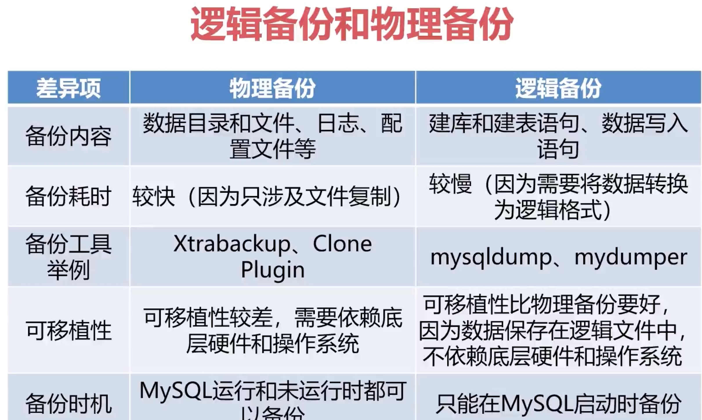
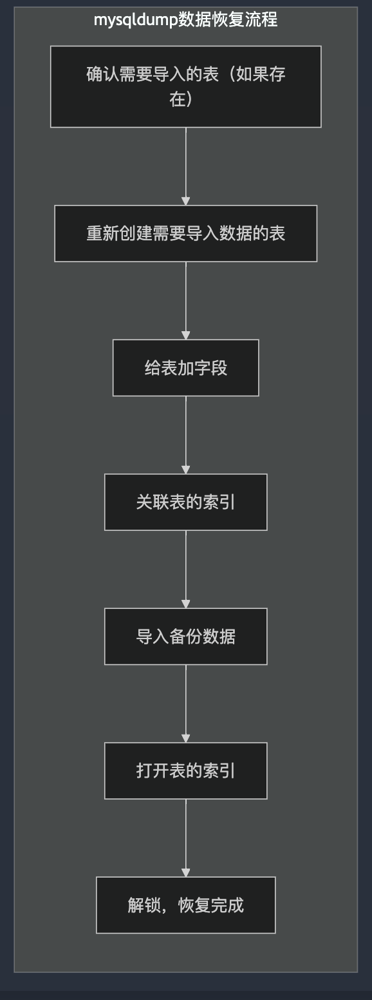
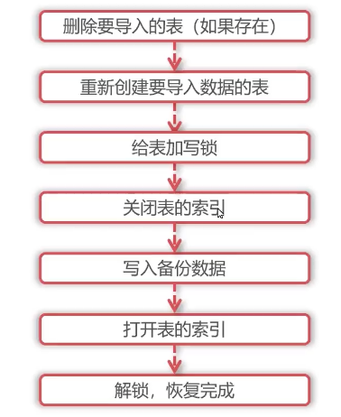

+++
title = 'MySQL备份与恢复-简介'
date = 2024-08-28T10:43:43+08:00
draft = true
categories = [ "MySQL" ]
tags = [ "mysql" ]
+++

<!-- markdown-toc start - Don't edit this section. Run M-x markdown-toc-refresh-toc -->
<p style="text-align:center;font-size:1.3em">文档目录结构</p>

<!-- markdown-toc end -->

# 一、概述

对任何数据库来说，备份都非常重要，数据库备份可以在关键时刻保证我们不丢失或者少丢失数据，虽然可以通过复制技术保留数据库的多个副本， 但数据库复制并不能取代备份的作用。

比如在主数据库上因为误操作删除了一批数据，由于主从复制时间很短，在我们发现时从库上的数据也可能被删除了，因此不能使用从库的数据来恢复主库上的数据，而应该使用原来的备份进行误删除数据的恢复。

# 二、备份的分类

分类有以下维度：

## （一）备份时数据库的状态

备份时是否锁定状态。备份时，数据库被锁住，别人都不能使用。或者备份时，数据库未被锁住，别人都可以使用。根据这种方式，将备份分为以下几种方式：

1. 热备（Hot Backup）：备份时数据库正常运行中，业务可以正常读写，在这种状态进行备份。这种方式备份对业务侵入最小。
2. 冷备（Cold Backup）：备份时数据库完全停止状态，也就是将数据库停机。对业务侵入最大，业务既不能读也不能写。
3. 温备（Warm Backup）：处于冷备和热备之间，数据库停止了，但没有完全停止，即数据库只能读，但是数据库不能再更新了，因为备份要从数据库拉数据，整个数据库不能动。

## （二）备份文件的格式

备份的文件是以什么格式编排的。

1、逻辑备份

输出文本或SQL语句，将数据按照逻辑的方式导出成人可读的逻辑性文本。

2、物理备份（裸文件备份）

备份数据库原始底层文件，如果是 innoDB ，备份的就是 ibd 文件（ibd表空间），还有一些元数据文件，虽然这些文件人不可读，，但是这些文件里面是含有数据的。

## （三）备份内容

1、完全备份（全量备份）：备份完整的数据

2、增量备份：备份差异数据。备份这一次与上一次的数据差异，比如数据增加的行，减少的行，修改的行。

3、日志备份：备份 binlog 日志，binlog 表示的是数据库在这一段时间所有数据差异和变化的操作。

日志备份其实也是增量备份的一种。但增量备份一般是逻辑的，日志备份正常是将binlog文件备份下来，有点类似物理的增量备份。

# 备份工具

* mysqldump: 逻辑，热，全备工具，备份出来的是人可读的sql文件
* xtrabackup: 物理，热，全量+增量备份

# 小结

备份方式的分类：
- 状态
- 格式
- 内容

备份方式无绝对好坏，仅是用途不同。

## 逻辑备份和物理备份



## 创建测试用户和表

准备两台机器 `172.20.30.1` 和 `172.20.30.2`。

`172.20.30.1` 机器用于备份。
`172.20.30.2` 机器用于还原。


1、登录 `172.20.30.1` 创建单独备份用户

```sql 
create user 'u_bak'@'%' identified by '123';
```

2、赋予备份用户权限.

备份表数据时是通过 select 来查询出数据的，所以需要 select 权限。
另外备份前需要刷新MySQL的日志文件，所以需要 reload 权限。
如果不存储表空间信息，即备份时没有增加--load-tablespace，则需要 process 权限。
如果备份时，没有增加--sntraction 参数，即在使用 mysqldump 时会给表增加读锁，则需要 lock tables 权限。
如果备份时需要记录位点，即增加 --must-data参数，则需要 replication client 权限。
如果增加--dump——salve，需要 replication_slave_admin 权限。
如果要备份视图，则需要 show view 权限
如果要备份触发器，则需要 trigger 权限

```sql
grant select, reload, process, lock tables, replication client, replication_slave_admin, show view, trigger on  *.* to 'u_bak'@'%';
```

3、创建测试库

```sql
create database bak1;
use bak1

create table t1 (
  id int not null auto_increment primary key,
  a varchar(20) default null,
  b int default null
) engine=InnoDB charset=utf8mb4;
```

4、插入测试数据

```sql
insert into t1(a, b) values ('one', 1), ('two', 2);
```

5、登录`172.20.30.2`机器连接MySQL，创建恢复用户

```sql
create user u_recover@'%' identified by '123';
```

6、赋予  恢复用户权限

恢复数据库会进行锁表，并且是写锁，
另外备份文件中会有drop操作，会将表drop 表再重新建，再导入备份数据，所以需要drop，create
导入数据之前会关闭表的索引，以提高写入速度，导入之后还会再开启表索引，所以需要 alter 权限
导入时会需要查询一些参数，所以需要 select 权限
导入数据就是执行 insert 语句，所以需要insert权限
```sql
grant lock tables, drop, create, alter, select, insert on *.* to 'u_recover'@'%';
```

7、创建恢复数据库

```
create database recover1;
```

8、回到第一个机器 `172.20.30.1` ，尝试用 mysqldump 备份某个库

备份时先关闭GTID信息，方便待会恢复
> bak1.sql 导入到指定文件
```sql
mysqldump -u'u_bak' -p'123' --set-gtid-purged=off bak1 > bak1.sql

[root@chaos-1 data]# mysqldump -u'u_bak' -p'123' --set-gtid-purged=off bak1 > bak1.sql
mysqldump: [Warning] Using a password on the command line interface can be insecure.
```

mysqldump 会将命令行中第一个名称参数 bak1 看做数据库的名称，所以该命令会备份bak1 这个数据库的数据

9、查看备份内容

```
cat bak1.sql
-- MySQL dump 10.13  Distrib 8.0.32, for Linux (aarch64)
--
-- Host: localhost    Database: bak1
-- ------------------------------------------------------
-- Server version	8.0.32

/*!40101 SET @OLD_CHARACTER_SET_CLIENT=@@CHARACTER_SET_CLIENT */;
/*!40101 SET @OLD_CHARACTER_SET_RESULTS=@@CHARACTER_SET_RESULTS */;
/*!40101 SET @OLD_COLLATION_CONNECTION=@@COLLATION_CONNECTION */;
/*!50503 SET NAMES utf8mb4 */;
/*!40103 SET @OLD_TIME_ZONE=@@TIME_ZONE */;
/*!40103 SET TIME_ZONE='+00:00' */;
/*!40014 SET @OLD_UNIQUE_CHECKS=@@UNIQUE_CHECKS, UNIQUE_CHECKS=0 */;
/*!40014 SET @OLD_FOREIGN_KEY_CHECKS=@@FOREIGN_KEY_CHECKS, FOREIGN_KEY_CHECKS=0 */;
/*!40101 SET @OLD_SQL_MODE=@@SQL_MODE, SQL_MODE='NO_AUTO_VALUE_ON_ZERO' */;
/*!40111 SET @OLD_SQL_NOTES=@@SQL_NOTES, SQL_NOTES=0 */;

--
-- Table structure for table `t1`
--

DROP TABLE IF EXISTS `t1`;
/*!40101 SET @saved_cs_client     = @@character_set_client */;
/*!50503 SET character_set_client = utf8mb4 */;
CREATE TABLE `t1` (
  `id` int NOT NULL AUTO_INCREMENT,
  `a` varchar(20) DEFAULT NULL,
  `b` int DEFAULT NULL,
  PRIMARY KEY (`id`)
) ENGINE=InnoDB AUTO_INCREMENT=3 DEFAULT CHARSET=utf8mb4 COLLATE=utf8mb4_0900_ai_ci;
/*!40101 SET character_set_client = @saved_cs_client */;

--
-- Dumping data for table `t1`
--

LOCK TABLES `t1` WRITE;
/*!40000 ALTER TABLE `t1` DISABLE KEYS */;
INSERT INTO `t1` VALUES (1,'one',1),(2,'two',2);
/*!40000 ALTER TABLE `t1` ENABLE KEYS */;
UNLOCK TABLES;
/*!40103 SET TIME_ZONE=@OLD_TIME_ZONE */;

/*!40101 SET SQL_MODE=@OLD_SQL_MODE */;
/*!40014 SET FOREIGN_KEY_CHECKS=@OLD_FOREIGN_KEY_CHECKS */;
/*!40014 SET UNIQUE_CHECKS=@OLD_UNIQUE_CHECKS */;
/*!40101 SET CHARACTER_SET_CLIENT=@OLD_CHARACTER_SET_CLIENT */;
/*!40101 SET CHARACTER_SET_RESULTS=@OLD_CHARACTER_SET_RESULTS */;
/*!40101 SET COLLATION_CONNECTION=@OLD_COLLATION_CONNECTION */;
/*!40111 SET SQL_NOTES=@OLD_SQL_NOTES */;

-- Dump completed on 2024-09-03  7:41:46
```

备份文件中包含了MySQL的版本，还有备份实例的 host 信息、数据库名称、drop table 语句，注意将数据恢复到目标实例时，文件中默认是带有drop语句的，这也会导致误删除目标实例的语句，所以在恢复时一定要注意。

还有create table 语句，锁表语句（会为表增加写锁）、写入数据SQL 、释放锁，这样可以保证恢复过程中的数据一致性

10、恢复

注意这里是在第一台机器上远程恢复至 172.20.30.2

先查看172.20.30.2是否有表记录：
```
mysql> show databases;
+--------------------+
| Database           |
+--------------------+
| information_schema |
| mysql              |
| performance_schema |
| recover1           |
| sys                |
+--------------------+
5 rows in set (0.00 sec)

mysql> use recover1
Database changed
mysql> show tables;
Empty set (0.00 sec)

mysql>
```

```bash
mysql -u'u_recover' -p'123' -h 172.20.30.2 recover1 <bak1.sql

[root@chaos-1 data]# mysql -u'u_recover' -p'123' -h 172.20.30.2 recover1 <bak1.sql
mysql: [Warning] Using a password on the command line interface can be insecure.
[root@chaos-1 data]#
```

如果不能恢复需要将第二胎机器的防火墙关闭
```bash
iptables -F
```

11、第二胎机器查看恢复数据

```sql
mysql> show tables;
+--------------------+
| Tables_in_recover1 |
+--------------------+
| t1                 |
+--------------------+
1 row in set (0.01 sec)

mysql> select * from t1;
+----+------+------+
| id | a    | b    |
+----+------+------+
|  1 | one  |    1 |
|  2 | two  |    2 |
+----+------+------+
2 rows in set (0.00 sec)
```

## mysqldump 备份过程中会执行哪些命令

1、实时打印查询日志 general log 来观察mysqldump 执行了哪些命令，从而知道mysqldump备份原理

查看general_log位置

```
mysql> show global variables like '%general%';
+------------------+-----------------------------------+
| Variable_name    | Value                             |
+------------------+-----------------------------------+
| general_log      | OFF                               |
| general_log_file | /data/mysql/log/mysql-general.log |
+------------------+-----------------------------------+
2 rows in set (0.02 sec)
```

开启：
```sql
set global general_log=on
```

2、实时观察日志：
```bash
 tail -f /data/mysql/log/mysql-general.log
```

3、执行备份操作

```bash
mysqldump -u'u_bak' -p'123' bak1 > bak11.sql

[root@chaos-1 data]# mysqldump -u'u_bak' -p'123' bak1 > bak1.sql
mysqldump: [Warning] Using a password on the command line interface can be insecure.
Warning: A partial dump from a server that has GTIDs will by default include the GTIDs of all transactions, even those that changed suppressed parts of the database. If you don't want to restore GTIDs, pass --set-gtid-purged=OFF. To make a complete dump, pass --all-databases --triggers --routines --events.
Warning: A dump from a server that has GTIDs enabled will by default include the GTIDs of all transactions, even those that were executed during its extraction and might not be represented in the dumped data. This might result in an inconsistent data dump.
In order to ensure a consistent backup of the database, pass --single-transaction or --lock-all-tables or --master-data.
[root@chaos-1 data]#
```

4、查看日志：
```bash
2024-09-03T22:52:22.841325Z	   14 Connect	u_bak@localhost on  using Socket
2024-09-03T22:52:22.841614Z	   14 Query	/*!40100 SET @@SQL_MODE='' */
2024-09-03T22:52:22.841749Z	   14 Query	/*!40103 SET TIME_ZONE='+00:00' */
2024-09-03T22:52:22.841849Z	   14 Query	/*!80000 SET SESSION information_schema_stats_expiry=0 */
2024-09-03T22:52:22.841954Z	   14 Query	SET SESSION NET_READ_TIMEOUT= 86400, SESSION NET_WRITE_TIMEOUT= 86400
2024-09-03T22:52:22.842149Z	   14 Query	SHOW VARIABLES LIKE 'gtid\_mode'
2024-09-03T22:52:22.844478Z	   14 Query	SELECT @@GLOBAL.GTID_EXECUTED
2024-09-03T22:52:22.844829Z	   14 Query	SELECT LOGFILE_GROUP_NAME, FILE_NAME, TOTAL_EXTENTS, INITIAL_SIZE, ENGINE, EXTRA FROM INFORMATION_SCHEMA.FILES WHERE ENGINE = 'ndbcluster' AND FILE_TYPE = 'UNDO LOG' AND FILE_NAME IS NOT NULL AND LOGFILE_GROUP_NAME IS NOT NULL AND LOGFILE_GROUP_NAME IN (SELECT DISTINCT LOGFILE_GROUP_NAME FROM INFORMATION_SCHEMA.FILES WHERE ENGINE = 'ndbcluster' AND FILE_TYPE = 'DATAFILE' AND TABLESPACE_NAME IN (SELECT DISTINCT TABLESPACE_NAME FROM INFORMATION_SCHEMA.PARTITIONS WHERE TABLE_SCHEMA IN ('bak1'))) GROUP BY LOGFILE_GROUP_NAME, FILE_NAME, ENGINE, TOTAL_EXTENTS, INITIAL_SIZE ORDER BY LOGFILE_GROUP_NAME
2024-09-03T22:52:22.847105Z	   14 Query	SELECT DISTINCT TABLESPACE_NAME, FILE_NAME, LOGFILE_GROUP_NAME, EXTENT_SIZE, INITIAL_SIZE, ENGINE FROM INFORMATION_SCHEMA.FILES WHERE FILE_TYPE = 'DATAFILE' AND TABLESPACE_NAME IN (SELECT DISTINCT TABLESPACE_NAME FROM INFORMATION_SCHEMA.PARTITIONS WHERE TABLE_SCHEMA IN ('bak1')) ORDER BY TABLESPACE_NAME, LOGFILE_GROUP_NAME
2024-09-03T22:52:22.847956Z	   14 Query	SHOW VARIABLES LIKE 'ndbinfo\_version'
2024-09-03T22:52:22.850958Z	   14 Init DB	bak1
2024-09-03T22:52:22.851049Z	   14 Query	show tables
2024-09-03T22:52:22.851734Z	   14 Query	LOCK TABLES `t1` READ /*!32311 LOCAL */
2024-09-03T22:52:22.851890Z	   14 Query	show table status like 't1'
2024-09-03T22:52:22.852551Z	   14 Query	SET SQL_QUOTE_SHOW_CREATE=1
2024-09-03T22:52:22.852642Z	   14 Query	SET SESSION character_set_results = 'binary'
2024-09-03T22:52:22.852730Z	   14 Query	show create table `t1`
2024-09-03T22:52:22.852943Z	   14 Query	SET SESSION character_set_results = 'utf8mb4'
2024-09-03T22:52:22.853046Z	   14 Query	show fields from `t1`
2024-09-03T22:52:22.853723Z	   14 Query	show fields from `t1`
2024-09-03T22:52:22.854272Z	   14 Query	SELECT /*!40001 SQL_NO_CACHE */ * FROM `t1`
2024-09-03T22:52:22.854390Z	   14 Query	SET SESSION character_set_results = 'binary'
2024-09-03T22:52:22.854469Z	   14 Query	use `bak1`
2024-09-03T22:52:22.854559Z	   14 Query	select @@collation_database
2024-09-03T22:52:22.854659Z	   14 Query	SHOW TRIGGERS LIKE 't1'
2024-09-03T22:52:22.855215Z	   14 Query	SET SESSION character_set_results = 'utf8mb4'
2024-09-03T22:52:22.855296Z	   14 Query	SET SESSION character_set_results = 'binary'
2024-09-03T22:52:22.855395Z	   14 Query	SELECT COLUMN_NAME,                       JSON_EXTRACT(HISTOGRAM, '$."number-of-buckets-specified"')                FROM information_schema.COLUMN_STATISTICS                WHERE SCHEMA_NAME = 'bak1' AND TABLE_NAME = 't1'
2024-09-03T22:52:22.855606Z	   14 Query	SET SESSION character_set_results = 'utf8mb4'
2024-09-03T22:52:22.855683Z	   14 Query	UNLOCK TABLES
2024-09-03T22:52:22.858512Z	   14 Quit
```

首先建立连接，
获取数据库的元数据信息，比如执行 `Query	SHOW VARIABLES LIKE 'gtid\_mode'` 查看GTID模式是否开启
查看信息
查看备份库GROUP文件信息
查看数据文件信息
查看库表
给表加读锁
查看表结构，表结构会写入到备份文件中
查询表数据，
查看书发起
解锁

## 备份原理




## mysqldump 恢复过程中会执行哪些命令

1、实时打印 general log

查看general_log位置

```
mysql> show global variables like '%general%';
+------------------+-----------------------------------+
| Variable_name    | Value                             |
+------------------+-----------------------------------+
| general_log      | OFF                               |
| general_log_file | /data/mysql/log/mysql-general.log |
+------------------+-----------------------------------+
2 rows in set (0.02 sec)
```

开启：
```sql
set global general_log=on;
```

2、实时观察日志：
```bash
tail -f /data/mysql/log/mysql-general.log
```

```
[root@chaos-1 data]# 
                     mysql -u'u_recover' -p'123' -h 172.20.30.2 recover1 <bak1.sql
mysql: [Warning] Using a password on the command line interface can be insecure.
ERROR 1227 (42000) at line 18: Access denied; you need (at least one of) the SUPER, SYSTEM_VARIABLES_ADMIN or SESSION_VARIABLES_ADMIN privilege(s) for this operation
[root@chaos-1 data]#
```


2、查看日志

```
2024-09-03T22:54:42.529488Z	   11 Connect	u_recover@172.20.30.1 on recover1 using SSL/TLS
2024-09-03T22:54:42.530242Z	   11 Query	select @@version_comment limit 1
2024-09-03T22:54:42.530858Z	   11 Query	/*!40101 SET @OLD_CHARACTER_SET_CLIENT=@@CHARACTER_SET_CLIENT */
2024-09-03T22:54:42.531062Z	   11 Query	/*!40101 SET @OLD_CHARACTER_SET_RESULTS=@@CHARACTER_SET_RESULTS */
2024-09-03T22:54:42.531206Z	   11 Query	/*!40101 SET @OLD_COLLATION_CONNECTION=@@COLLATION_CONNECTION */
2024-09-03T22:54:42.531409Z	   11 Query	/*!50503 SET NAMES utf8mb4 */
2024-09-03T22:54:42.531616Z	   11 Query	/*!40103 SET @OLD_TIME_ZONE=@@TIME_ZONE */
2024-09-03T22:54:42.531797Z	   11 Query	/*!40103 SET TIME_ZONE='+00:00' */
2024-09-03T22:54:42.532034Z	   11 Query	/*!40014 SET @OLD_UNIQUE_CHECKS=@@UNIQUE_CHECKS, UNIQUE_CHECKS=0 */
2024-09-03T22:54:42.532256Z	   11 Query	/*!40014 SET @OLD_FOREIGN_KEY_CHECKS=@@FOREIGN_KEY_CHECKS, FOREIGN_KEY_CHECKS=0 */
2024-09-03T22:54:42.532477Z	   11 Query	/*!40101 SET @OLD_SQL_MODE=@@SQL_MODE, SQL_MODE='NO_AUTO_VALUE_ON_ZERO' */
2024-09-03T22:54:42.532726Z	   11 Query	/*!40111 SET @OLD_SQL_NOTES=@@SQL_NOTES, SQL_NOTES=0 */
2024-09-03T22:54:42.532903Z	   11 Query	DROP TABLE IF EXISTS `t1`
2024-09-03T22:54:42.549586Z	   11 Query	/*!40101 SET @saved_cs_client     = @@character_set_client */
2024-09-03T22:54:42.549748Z	   11 Query	/*!50503 SET character_set_client = utf8mb4 */
2024-09-03T22:54:42.550054Z	   11 Query	CREATE TABLE `t1` (
  `id` int NOT NULL AUTO_INCREMENT,
  `a` varchar(20) DEFAULT NULL,
  `b` int DEFAULT NULL,
  PRIMARY KEY (`id`)
) ENGINE=InnoDB AUTO_INCREMENT=3 DEFAULT CHARSET=utf8mb4 COLLATE=utf8mb4_0900_ai_ci
2024-09-03T22:54:42.564345Z	   11 Query	/*!40101 SET character_set_client = @saved_cs_client */
2024-09-03T22:54:42.564489Z	   11 Query	LOCK TABLES `t1` WRITE
2024-09-03T22:54:42.565084Z	   11 Query	/*!40000 ALTER TABLE `t1` DISABLE KEYS */
2024-09-03T22:54:42.565426Z	   11 Query	INSERT INTO `t1` VALUES (1,'one',1),(2,'two',2)
2024-09-03T22:54:42.566173Z	   11 Query	/*!40000 ALTER TABLE `t1` ENABLE KEYS */
2024-09-03T22:54:42.566611Z	   11 Query	UNLOCK TABLES
2024-09-03T22:54:42.566718Z	   11 Query	/*!40103 SET TIME_ZONE=@OLD_TIME_ZONE */
2024-09-03T22:54:42.566807Z	   11 Query	/*!40101 SET SQL_MODE=@OLD_SQL_MODE */
2024-09-03T22:54:42.566900Z	   11 Query	/*!40014 SET FOREIGN_KEY_CHECKS=@OLD_FOREIGN_KEY_CHECKS */
2024-09-03T22:54:42.567086Z	   11 Query	/*!40014 SET UNIQUE_CHECKS=@OLD_UNIQUE_CHECKS */
2024-09-03T22:54:42.567193Z	   11 Query	/*!40101 SET CHARACTER_SET_CLIENT=@OLD_CHARACTER_SET_CLIENT */
2024-09-03T22:54:42.567307Z	   11 Query	/*!40101 SET CHARACTER_SET_RESULTS=@OLD_CHARACTER_SET_RESULTS */
2024-09-03T22:54:42.567439Z	   11 Query	/*!40101 SET COLLATION_CONNECTION=@OLD_COLLATION_CONNECTION */
2024-09-03T22:54:42.567546Z	   11 Query	/*!40111 SET SQL_NOTES=@OLD_SQL_NOTES */
2024-09-03T22:54:42.567762Z	   11 Quit
```

如果要导入表已经存在，DROP TABLE IF EXISTS `t1` 就会表先删除，如果要往目标实例恢复数据时，一定要先保证目标实例中表数据是不需要的或者已经提前备份了，因为它会将表删除掉并重新创建该表；

`LOCK TABLES `t1` WRITE` 会为表加锁，加的是写锁，加写锁是其他的会话读写都是不能进行的；
`/*!40000 ALTER TABLE `t1` ENABLE KEYS */` 会关闭表索引，因为导入数据钱关闭表索引会让表导入速度更快些。
通过Insert 语句导入数据，打开表索引，然后打开解锁，

## 恢复原理




## mysqldump 常见用法

### 环境准备

1、登录`172.20.30.1` 机器创建和 t1 表一样的 t2表
```sql
create table bak1.t2 like bak1.t1;
```

2. 创建一个新库 bak2
```sql
create database bak2; 
```

3、在 bak2 表中创建 bak1.t1 一样的表

```sql
create table bak2.t1 like bak1.t1;
```

4. 写入测试数据

```
insert into bak1.t2(a, b) select a, b from bak1.t1;
insert into bak2.t1(a, b) select a, b from bak1.t1;
```

5. 登录`172.20.30.2` 机器为恢复用户添加权限
 
使用 replace into 代替 insert into 需要 delete 权限
system_variables_admin 允许修改变量
references 允许创建外键
trigger 允许创建触发器
create view 允许创建视图
set_user_id 允许在执行视图或存储过程时设置有效的授权ID
system_user 允许设置系统用户

```sql
grant lock tables, drop, create, alter, select, insert, delete, system_variables_admin, references, trigger, create view, set_user_id, system_user on *.* to u_recover@'%';
```

### 备份不增加GTID信息

在开启GTID的情况下，默认不添加任何参数会记录GTID的信息

```bash
mysqldump -u'u_bak' -p'123' bak1 >bal1_gtid.sql

# mysqldump -u'u_bak' -p'123' bak1 >bal1_gtid.sql
mysqldump: [Warning] Using a password on the command line interface can be insecure.
Warning: A partial dump from a server that has GTIDs will by default include the GTIDs of all transactions, even those that changed suppressed parts of the database. If you don't want to restore GTIDs, pass --set-gtid-purged=OFF. To make a complete dump, pass --all-databases --triggers --routines --events.
Warning: A dump from a server that has GTIDs enabled will by default include the GTIDs of all transactions, even those that were executed during its extraction and might not be represented in the dumped data. This might result in an inconsistent data dump.
In order to ensure a consistent backup of the database, pass --single-transaction or --lock-all-tables or --master-data.
```

查看备份文件：
```
-- MySQL dump 10.13  Distrib 8.0.32, for Linux (aarch64)
--
-- Host: localhost    Database: bak1
-- ------------------------------------------------------
-- Server version	8.0.32

/*!40101 SET @OLD_CHARACTER_SET_CLIENT=@@CHARACTER_SET_CLIENT */;
/*!40101 SET @OLD_CHARACTER_SET_RESULTS=@@CHARACTER_SET_RESULTS */;
/*!40101 SET @OLD_COLLATION_CONNECTION=@@COLLATION_CONNECTION */;
/*!50503 SET NAMES utf8mb4 */;
/*!40103 SET @OLD_TIME_ZONE=@@TIME_ZONE */;
/*!40103 SET TIME_ZONE='+00:00' */;
/*!40014 SET @OLD_UNIQUE_CHECKS=@@UNIQUE_CHECKS, UNIQUE_CHECKS=0 */;
/*!40014 SET @OLD_FOREIGN_KEY_CHECKS=@@FOREIGN_KEY_CHECKS, FOREIGN_KEY_CHECKS=0 */;
/*!40101 SET @OLD_SQL_MODE=@@SQL_MODE, SQL_MODE='NO_AUTO_VALUE_ON_ZERO' */;
/*!40111 SET @OLD_SQL_NOTES=@@SQL_NOTES, SQL_NOTES=0 */;
SET @MYSQLDUMP_TEMP_LOG_BIN = @@SESSION.SQL_LOG_BIN;
SET @@SESSION.SQL_LOG_BIN= 0;

--
-- GTID state at the beginning of the backup
--

SET @@GLOBAL.GTID_PURGED=/*!80000 '+'*/ '1fb68bf4-6a46-11ef-a16d-0242ac141e01:1-11';

--
-- Table structure for table `t1`
--

...
```

会看到一条关于设置GTID的语句：
```
SET @@GLOBAL.GTID_PURGED=/*!80000 '+'*/ '1fb68bf4-6a46-11ef-a16d-0242ac141e01:1-11';
```

在恢复数据库就可能因为这条语句而存在问题：
```
mysql -u'u_recover' -p'123' -h172.20.30.2 recover1 < bak1_gtid.sql

[root@chaos-1 data]# mysql -u'u_recover' -p'123' -h172.20.30.2 recover1 < bak1_gtid.sql
mysql: [Warning] Using a password on the command line interface can be insecure.
ERROR 3546 (HY000) at line 24: @@GLOBAL.GTID_PURGED cannot be changed: the added gtid set must not overlap with @@GLOBAL.GTID_EXECUTED
[root@chaos-1 data]#
```

提示 GTID_PURGED 不能被修改，所以我们如果不希望记录GTID信息，就可以增加参数 `--set-gtid-purged=off`

备份语句如下：
```bash
mysqldump -u'u_bak' -p'123' --set-gtid-purged=off bak1 >bak1_gtid_off.sql

# mysqldump -u'u_bak' -p'123' --set-gtid-purged=off bak1 >bak1_gtid_off.sql
mysqldump: [Warning] Using a password on the command line interface can be insecure.
```

再来查看备份文件：

```
-- MySQL dump 10.13  Distrib 8.0.32, for Linux (aarch64)
--
-- Host: localhost    Database: bak1
-- ------------------------------------------------------
-- Server version	8.0.32

/*!40101 SET @OLD_CHARACTER_SET_CLIENT=@@CHARACTER_SET_CLIENT */;
/*!40101 SET @OLD_CHARACTER_SET_RESULTS=@@CHARACTER_SET_RESULTS */;
/*!40101 SET @OLD_COLLATION_CONNECTION=@@COLLATION_CONNECTION */;
/*!50503 SET NAMES utf8mb4 */;
/*!40103 SET @OLD_TIME_ZONE=@@TIME_ZONE */;
/*!40103 SET TIME_ZONE='+00:00' */;
/*!40014 SET @OLD_UNIQUE_CHECKS=@@UNIQUE_CHECKS, UNIQUE_CHECKS=0 */;
/*!40014 SET @OLD_FOREIGN_KEY_CHECKS=@@FOREIGN_KEY_CHECKS, FOREIGN_KEY_CHECKS=0 */;
/*!40101 SET @OLD_SQL_MODE=@@SQL_MODE, SQL_MODE='NO_AUTO_VALUE_ON_ZERO' */;
/*!40111 SET @OLD_SQL_NOTES=@@SQL_NOTES, SQL_NOTES=0 */;

--
-- Table structure for table `t1`
--

DROP TABLE IF EXISTS `t1`;
/*!40101 SET @saved_cs_client     = @@character_set_client */;
/*!50503 SET character_set_client = utf8mb4 */;
CREATE TABLE `t1` (
  `id` int NOT NULL AUTO_INCREMENT,
  `a` varchar(20) DEFAULT NULL,
  `b` int DEFAULT NULL,
  PRIMARY KEY (`id`)
) ENGINE=InnoDB AUTO_INCREMENT=3 DEFAULT CHARSET=utf8mb4 COLLATE=utf8mb4_0900_ai_ci;
/*!40101 SET character_set_client = @saved_cs_client */;

--
-- Dumping data for table `t1`
--

LOCK TABLES `t1` WRITE;
/*!40000 ALTER TABLE `t1` DISABLE KEYS */;
INSERT INTO `t1` VALUES (1,'one',1),(2,'two',2);
/*!40000 ALTER TABLE `t1` ENABLE KEYS */;
UNLOCK TABLES;

--
-- Table structure for table `t2`
--

DROP TABLE IF EXISTS `t2`;
/*!40101 SET @saved_cs_client     = @@character_set_client */;
/*!50503 SET character_set_client = utf8mb4 */;
CREATE TABLE `t2` (
  `id` int NOT NULL AUTO_INCREMENT,
  `a` varchar(20) DEFAULT NULL,
  `b` int DEFAULT NULL,
  PRIMARY KEY (`id`)
) ENGINE=InnoDB AUTO_INCREMENT=4 DEFAULT CHARSET=utf8mb4 COLLATE=utf8mb4_0900_ai_ci;
/*!40101 SET character_set_client = @saved_cs_client */;

--
-- Dumping data for table `t2`
--
```

已经没有set-gtid信息了。

恢复语句：
```
mysql -u'u_recover' -p'123' -h172.20.30.2 recover1 < bak1_gtid_off.sql

[root@chaos-1 data]# mysql -u'u_recover' -p'123' -h172.20.30.2 recover1 < bak1_gtid_off.sql
mysql: [Warning] Using a password on the command line interface can be insecure
```

第二台机器查看数据

```sql
mysql> select * from t1;
+----+------+------+
| id | a    | b    |
+----+------+------+
|  1 | one  |    1 |
|  2 | two  |    2 |
+----+------+------+
2 rows in set (0.00 sec)
```

### 备份多个库

```bash
mysqldump -u'u_bak' -p'123' -B bak1 bak2 >bak1_bak2.sql

```

-B 后面接的库都认为是要备份的库，另外备份文件中会包含create database 语句


## 最简单的备份（OUTFILE 命令备份）

* MySQL原生SQL指令
* 最原始的逻辑备份方式
* 备份的功能和效果取决于如何写SQL语句

1、首先查询MySQL的导出路径
 
mysql 都有个能够安全操作的文件目录，比如想把outfile内容导出成文件，就可以看下安装的MySQL server可操作的哪些系统文件路径

```sql
mysql> show variables like '%secure%';
+--------------------------+-----------------------+
| Variable_name            | Value                 |
+--------------------------+-----------------------+
| require_secure_transport | OFF                   |
| secure_auth              | ON                    |
| secure_file_priv         | /var/lib/mysql-files/ |
+--------------------------+-----------------------+
3 rows in set (0.00 sec)
```


也就是导出时要导出到 /var/lib/mysql-files/ 这个文件夹里，这个文件夹才是mysqld 能操作的安全文件夹 

2、准备数据

```sql
mysql> create table t1 (f1 int, f2 int);
mysql> insert into t1 values(4, 6), (6, 3), (7, 1);
mysql> select * from t1;
+------+------+
| f1   | f2   |
+------+------+
|    4 |    6 |
|    6 |    3 |
|    7 |    1 |
+------+------+
```

3、使用 `into outfile` 指令将查询结果导出至文件

语法如下：
```sql
select * into outfile '/var/lib/mysql-files/out_file_test' from Z;
```

示例：
```sql
mysql> select * into outfile '/var/lib/mysql-files/t1-out' from t1;
Query OK, 3 rows affected (0.02 sec)

mysql> exit
Bye
# cat /var/lib/mysql-files/t1-out
4	6
6	3
7	1
```

也可以如下操作来使用分隔符：

```sql
select * into outfile '/var/lib/mysql-files/t1-out2' fields terminated by ',' from t1;
mysql> exit
Bye
# cat /var/lib/mysql-files/t1-out2
4,6
6,3
7,1
#
```

如果现在有个场景：
我想备份所有的表，但是在备份 t1 这张表的时候 t2 表数据改动了，我原本是想要个一致性的视图，也就是从我备份开始的时候不要有任何数据库的改动，即备份同一时刻所有表的内容，这个outfile 是否可以做到呢？
可以
在InnoDB 事务下，可以做到一致性视图


> 但这种 OUTFILE 方式存在问题

* 输出文本简略
* 输出的文件无法还原，往往用来简单导出数据

## mysqldump 备份

* 非常常用的MySQL逻辑备份工具
* MySQL Server 自带
* 输出的备份内容为 SQL语句，平衡了阅读和还原
* SQL 语句占用空间较小

### mysqldump 原理

粗糙些说就是通过往 MySQL 下发 SQL指令，将所有表数据查询出来导入到 SQL文件中。但是并不是下发的简单的SELECT语句。

* mysqldump 使用以下语句对数据进行备份：

语法：
```sql
SELECT SQL_NO_CACHE FROM `T`;
```

MySQL 8.0 之前的SQL语句结果都是有缓存的，主要是方便下次查询SQL语句的时候可以直接输出查询结果，不用到硬盘上找。但是这个特性对 mysqldump 是不友好的，mysqldump 会对每个表的结果作缓存（对每个表做select *），这样对别的用户查询时没有意义，还白白占用了 MySQL Server 层的缓存空间，所以需要这个命令对MySQL结果不进行缓存。

所以 SQL_NO_CACHE 查询出的数据不会进入SQL缓存

### 如何使用

直接导出的SQL文件即可进行还原

```sql
source test.sql
```

1、准备数据：

```sql
create database d1;
use d1;
create table z(a int, b int, c int, d int);
insert into z values(1,2,3,4),(5, 6, 7,8),(9, 10,11,23);
select * from z;
+------+------+------+------+
| a    | b    | c    | d    |
+------+------+------+------+
|    1 |    2 |    3 |    4 |
|    5 |    6 |    7 |    8 |
|    9 |   10 |   11 |   23 |
+------+------+------+------+
3 rows in set (0.01 sec)
```

2、mysqldump 使用以下语句对数据进行备份：

```shell
# mysqldump -uroot -p123123 --databases d1 --single-transaction > test.sql
mysqldump: [Warning] Using a password on the command line interface can be insecure.
```

`--single-transaction` 表示可重复读隔离级别进行备份，这样可以保证从备份第一个表到备份最后一个表，所备份的内容都是同一时刻的。


3、查看备份内容

```shell
# cat test.sql
-- MySQL dump 10.13  Distrib 5.7.44, for Linux (x86_64)
--
-- Host: localhost    Database: d1
-- ------------------------------------------------------
-- Server version	5.7.44

/*!40101 SET @OLD_CHARACTER_SET_CLIENT=@@CHARACTER_SET_CLIENT */;
/*!40101 SET @OLD_CHARACTER_SET_RESULTS=@@CHARACTER_SET_RESULTS */;
/*!40101 SET @OLD_COLLATION_CONNECTION=@@COLLATION_CONNECTION */;
/*!40101 SET NAMES utf8 */;
/*!40103 SET @OLD_TIME_ZONE=@@TIME_ZONE */;
/*!40103 SET TIME_ZONE='+00:00' */;
/*!40014 SET @OLD_UNIQUE_CHECKS=@@UNIQUE_CHECKS, UNIQUE_CHECKS=0 */;
/*!40014 SET @OLD_FOREIGN_KEY_CHECKS=@@FOREIGN_KEY_CHECKS, FOREIGN_KEY_CHECKS=0 */;
/*!40101 SET @OLD_SQL_MODE=@@SQL_MODE, SQL_MODE='NO_AUTO_VALUE_ON_ZERO' */;
/*!40111 SET @OLD_SQL_NOTES=@@SQL_NOTES, SQL_NOTES=0 */;

--
-- Current Database: `d1`
--

CREATE DATABASE /*!32312 IF NOT EXISTS*/ `d1` /*!40100 DEFAULT CHARACTER SET latin1 */;

USE `d1`;

--
-- Table structure for table `z`
--

DROP TABLE IF EXISTS `z`;
/*!40101 SET @saved_cs_client     = @@character_set_client */;
/*!40101 SET character_set_client = utf8 */;
CREATE TABLE `z` (
  `a` int(11) DEFAULT NULL,
  `b` int(11) DEFAULT NULL,
  `c` int(11) DEFAULT NULL,
  `d` int(11) DEFAULT NULL
) ENGINE=InnoDB DEFAULT CHARSET=latin1;
/*!40101 SET character_set_client = @saved_cs_client */;

--
-- Dumping data for table `z`
--

LOCK TABLES `z` WRITE;
/*!40000 ALTER TABLE `z` DISABLE KEYS */;
INSERT INTO `z` VALUES (1,2,3,4),(5,6,7,8),(9,10,11,23);
/*!40000 ALTER TABLE `z` ENABLE KEYS */;
UNLOCK TABLES;
/*!40103 SET TIME_ZONE=@OLD_TIME_ZONE */;

/*!40101 SET SQL_MODE=@OLD_SQL_MODE */;
/*!40014 SET FOREIGN_KEY_CHECKS=@OLD_FOREIGN_KEY_CHECKS */;
/*!40014 SET UNIQUE_CHECKS=@OLD_UNIQUE_CHECKS */;
/*!40101 SET CHARACTER_SET_CLIENT=@OLD_CHARACTER_SET_CLIENT */;
/*!40101 SET CHARACTER_SET_RESULTS=@OLD_CHARACTER_SET_RESULTS */;
/*!40101 SET COLLATION_CONNECTION=@OLD_COLLATION_CONNECTION */;
/*!40111 SET SQL_NOTES=@OLD_SQL_NOTES */;

-- Dump completed on 2024-05-04  3:05:14
```

从备份内容中看到 “CREATE TABLE `z` ...” 自动写了建表语句；还有 “INSERT INTO `z` VALUES (1,2,3,4),(5,6,7,8),(9,10,11,23);” 插入了三行数据

不光建库建表语句有，还有锁表的语句 “LOCK TABLES `z` WRITE; ... UNLOCK TABLES;” 这个主要用在还原上，因为需要保证数据一致性，故需要锁表并在还原后释放。

### 注意事项

--single-transaction： 在 RR 级别下进行（InnoDB），保证第一张表到最后一张表都是同一时刻的数据，保证备份的一致性。
--lock-all-tables: 使用 FWWRL 锁所有表（MyISAM），FWWRL是个全局锁，所有表只能读不能写
--local-tables: 使用 READ LOCAL 锁当前库的表（MyISAM），如果允许牺牲一致性，允许第一张表到最后一张表时数据是有变化的，也就是备份到哪张表时就用 local-tables 锁住那张表
--all-databases: 备份所有库