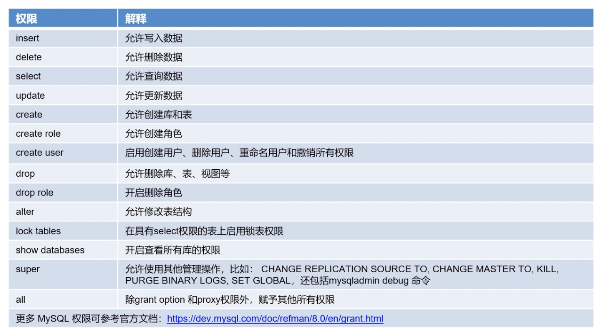
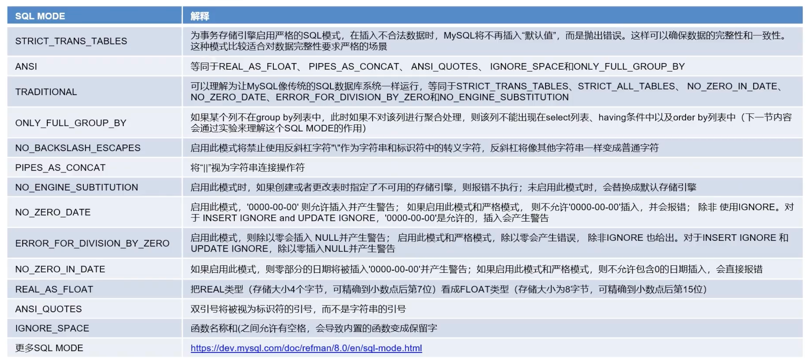

+++
title = 'MySQL修改用户权限'
date = 2024-07-26T10:18:50+08:00
draft = true
+++

## MySQL用户管理

在学习时通常使用root用户登录MySQL，但是在实际生产中一般会使用非 root 的其他用户登录，而这些非root用户就需要我们去创建。

除了DBA外，甚至不同的业务连接同一个MySQL服务也会创建不同的用户，为这些用户配置他们的最小的权限。


### 创建用户

创建一个  `'dmpu1'@'localhost'` 的用户：

```sql
create user 'dmpu1'@'localhost' identified by 'mysqlpass';
```

`@` 后面接的是客户端的host，如果是本机可以是localhost或者127.0.0.1，如果是远程就是客户端IP。

`'dmpu1'@'localhost'` 被视为一个整体，如果用户名一样，但是host不一样，则会被视为两个不同的账号；

如果host没有写，默认是 `%` ，表示对所有机器都生效。这里localhost表示在mysql所在的服务器才能连接。

场景：
如果有用户想申请某个库的远程只读用户，他的机器是’192.168.1.3‘，则创建用户命令如下：
```sql
create user 'jack'@'192.168.1.3' identified by 'mysqlpass';
```

有时候客户端可能是多个网段的IP，还可以对网段授权：
```sql
create user 'jack'@'192.168.1.%' identified by 'mysqlpass';
```

如上面创建语句中，网段是`192.168.1`,

### 查看用户

查看创建的用户

```sql
 mysql> select user, host from mysql.user;
+------------------+-------------+
| user             | host        |
+------------------+-------------+
| jack             | 192.168.1.% |
| jack             | 192.168.1.3 |
| dmpu1            | localhost   |
| mysql.infoschema | localhost   |
| mysql.session    | localhost   |
| mysql.sys        | localhost   |
| root             | localhost   |
+------------------+-------------+
7 rows in set (0.01 sec)
```

可以看到上面创建的几个用户

查看 mysql.user 表的其他字段：

```sql
mysql> desc mysql.user;
+--------------------------+-----------------------------------+------+-----+-----------------------+-------+
| Field                    | Type                              | Null | Key | Default               | Extra |
+--------------------------+-----------------------------------+------+-----+-----------------------+-------+
| Host                     | char(255)                         | NO   | PRI |                       |       |
| User                     | char(32)                          | NO   | PRI |                       |       |
| Select_priv              | enum('N','Y')                     | NO   |     | N                     |       |
| Insert_priv              | enum('N','Y')                     | NO   |     | N                     |       |
| Update_priv              | enum('N','Y')                     | NO   |     | N                     |       |
| Delete_priv              | enum('N','Y')                     | NO   |     | N                     |       |
| Create_priv              | enum('N','Y')                     | NO   |     | N                     |       |
| Drop_priv                | enum('N','Y')                     | NO   |     | N                     |       |
| Reload_priv              | enum('N','Y')                     | NO   |     | N                     |       |
| Shutdown_priv            | enum('N','Y')                     | NO   |     | N                     |       |
| Process_priv             | enum('N','Y')                     | NO   |     | N                     |       |
| File_priv                | enum('N','Y')                     | NO   |     | N                     |       |
| Grant_priv               | enum('N','Y')                     | NO   |     | N                     |       |
| References_priv          | enum('N','Y')                     | NO   |     | N                     |       |
| Index_priv               | enum('N','Y')                     | NO   |     | N                     |       |
| Alter_priv               | enum('N','Y')                     | NO   |     | N                     |       |
| Show_db_priv             | enum('N','Y')                     | NO   |     | N                     |       |
| Super_priv               | enum('N','Y')                     | NO   |     | N                     |       |
| Create_tmp_table_priv    | enum('N','Y')                     | NO   |     | N                     |       |
| Lock_tables_priv         | enum('N','Y')                     | NO   |     | N                     |       |
| Execute_priv             | enum('N','Y')                     | NO   |     | N                     |       |
| Repl_slave_priv          | enum('N','Y')                     | NO   |     | N                     |       |
| Repl_client_priv         | enum('N','Y')                     | NO   |     | N                     |       |
| Create_view_priv         | enum('N','Y')                     | NO   |     | N                     |       |
| Show_view_priv           | enum('N','Y')                     | NO   |     | N                     |       |
| Create_routine_priv      | enum('N','Y')                     | NO   |     | N                     |       |
| Alter_routine_priv       | enum('N','Y')                     | NO   |     | N                     |       |
| Create_user_priv         | enum('N','Y')                     | NO   |     | N                     |       |
| Event_priv               | enum('N','Y')                     | NO   |     | N                     |       |
| Trigger_priv             | enum('N','Y')                     | NO   |     | N                     |       |
| Create_tablespace_priv   | enum('N','Y')                     | NO   |     | N                     |       |
| ssl_type                 | enum('','ANY','X509','SPECIFIED') | NO   |     |                       |       |
| ssl_cipher               | blob                              | NO   |     | NULL                  |       |
| x509_issuer              | blob                              | NO   |     | NULL                  |       |
| x509_subject             | blob                              | NO   |     | NULL                  |       |
| max_questions            | int unsigned                      | NO   |     | 0                     |       |
| max_updates              | int unsigned                      | NO   |     | 0                     |       |
| max_connections          | int unsigned                      | NO   |     | 0                     |       |
| max_user_connections     | int unsigned                      | NO   |     | 0                     |       |
| plugin                   | char(64)                          | NO   |     | caching_sha2_password |       |
| authentication_string    | text                              | YES  |     | NULL                  |       |
| password_expired         | enum('N','Y')                     | NO   |     | N                     |       |
| password_last_changed    | timestamp                         | YES  |     | NULL                  |       |
| password_lifetime        | smallint unsigned                 | YES  |     | NULL                  |       |
| account_locked           | enum('N','Y')                     | NO   |     | N                     |       |
| Create_role_priv         | enum('N','Y')                     | NO   |     | N                     |       |
| Drop_role_priv           | enum('N','Y')                     | NO   |     | N                     |       |
| Password_reuse_history   | smallint unsigned                 | YES  |     | NULL                  |       |
| Password_reuse_time      | smallint unsigned                 | YES  |     | NULL                  |       |
| Password_require_current | enum('N','Y')                     | YES  |     | NULL                  |       |
| User_attributes          | json                              | YES  |     | NULL                  |       |
+--------------------------+-----------------------------------+------+-----+-----------------------+-------+
51 rows in set (0.01 sec)
```

### 删除用户

比如要删除 `jack@192.168.1.3`这一用户：
```sql
drop user jack@192.168.1.3;
```

再次查看用户记录：
```sql
mysql> select user, host from mysql.user;
+------------------+-------------+
| user             | host        |
+------------------+-------------+
| jack             | 192.168.1.% |
| dmpu1            | localhost   |
| mysql.infoschema | localhost   |
| mysql.session    | localhost   |
| mysql.sys        | localhost   |
| root             | localhost   |
+------------------+-------------+
```

## MySQL权限管理

上面只是创建了用户，但是这些用户还不能对数据库做任何操作，还需要赋予响应的权限才能对数据库进行操作。

### 权限分类

- 全局权限：这类权限适用于整个 MySQL 服务器，比如允许用户创建、修改、删除数据库、管理用户账户、设置全局服务变量等操作
- 数据库权限：这类权限适用于针对某个数据库的操作，比如在某个数据库中创建、修改表、创建视图、存储过程、函数等操作
- 表和列权限：这一权限如允许用户对某张表执行增删查改等操作，另外这些操作可以精确到某一列

### 常用权限



可以进入到数据库中执行下面sql可以看到MySQL支持的所有权限:

```sql
mysql> show privileges;
+------------------------------+---------------------------------------+-------------------------------------------------------+
| Privilege                    | Context                               | Comment                                               |
+------------------------------+---------------------------------------+-------------------------------------------------------+
| Alter                        | Tables                                | To alter the table                                    |
| Alter routine                | Functions,Procedures                  | To alter or drop stored functions/procedures          |
| Create                       | Databases,Tables,Indexes              | To create new databases and tables                    |
| Create routine               | Databases                             | To use CREATE FUNCTION/PROCEDURE                      |
| Create role                  | Server Admin                          | To create new roles                                   |
| Create temporary tables      | Databases                             | To use CREATE TEMPORARY TABLE                         |
| Create view                  | Tables                                | To create new views                                   |
| Create user                  | Server Admin                          | To create new users                                   |
| Delete                       | Tables                                | To delete existing rows                               |
| Drop                         | Databases,Tables                      | To drop databases, tables, and views                  |
| Drop role                    | Server Admin                          | To drop roles                                         |
| Event                        | Server Admin                          | To create, alter, drop and execute events             |
| Execute                      | Functions,Procedures                  | To execute stored routines                            |
| File                         | File access on server                 | To read and write files on the server                 |
| Grant option                 | Databases,Tables,Functions,Procedures | To give to other users those privileges you possess   |
| Index                        | Tables                                | To create or drop indexes                             |
| Insert                       | Tables                                | To insert data into tables                            |
| Lock tables                  | Databases                             | To use LOCK TABLES (together with SELECT privilege)   |
| Process                      | Server Admin                          | To view the plain text of currently executing queries |
| Proxy                        | Server Admin                          | To make proxy user possible                           |
| References                   | Databases,Tables                      | To have references on tables                          |
| Reload                       | Server Admin                          | To reload or refresh tables, logs and privileges      |
| Replication client           | Server Admin                          | To ask where the slave or master servers are          |
| Replication slave            | Server Admin                          | To read binary log events from the master             |
| Select                       | Tables                                | To retrieve rows from table                           |
| Show databases               | Server Admin                          | To see all databases with SHOW DATABASES              |
| Show view                    | Tables                                | To see views with SHOW CREATE VIEW                    |
| Shutdown                     | Server Admin                          | To shut down the server                               |
| Super                        | Server Admin                          | To use KILL thread, SET GLOBAL, CHANGE MASTER, etc.   |
| Trigger                      | Tables                                | To use triggers                                       |
| Create tablespace            | Server Admin                          | To create/alter/drop tablespaces                      |
| Update                       | Tables                                | To update existing rows                               |
| Usage                        | Server Admin                          | No privileges - allow connect only                    |
| XA_RECOVER_ADMIN             | Server Admin                          |                                                       |
| SHOW_ROUTINE                 | Server Admin                          |                                                       |
| SET_USER_ID                  | Server Admin                          |                                                       |
| SENSITIVE_VARIABLES_OBSERVER | Server Admin                          |                                                       |
| RESOURCE_GROUP_USER          | Server Admin                          |                                                       |
| PASSWORDLESS_USER_ADMIN      | Server Admin                          |                                                       |
| INNODB_REDO_LOG_ENABLE       | Server Admin                          |                                                       |
| CONNECTION_ADMIN             | Server Admin                          |                                                       |
| AUTHENTICATION_POLICY_ADMIN  | Server Admin                          |                                                       |
| AUDIT_ABORT_EXEMPT           | Server Admin                          |                                                       |
| REPLICATION_APPLIER          | Server Admin                          |                                                       |
| INNODB_REDO_LOG_ARCHIVE      | Server Admin                          |                                                       |
| SERVICE_CONNECTION_ADMIN     | Server Admin                          |                                                       |
| CLONE_ADMIN                  | Server Admin                          |                                                       |
| PERSIST_RO_VARIABLES_ADMIN   | Server Admin                          |                                                       |
| FLUSH_USER_RESOURCES         | Server Admin                          |                                                       |
| RESOURCE_GROUP_ADMIN         | Server Admin                          |                                                       |
| REPLICATION_SLAVE_ADMIN      | Server Admin                          |                                                       |
| BACKUP_ADMIN                 | Server Admin                          |                                                       |
| GROUP_REPLICATION_ADMIN      | Server Admin                          |                                                       |
| FIREWALL_EXEMPT              | Server Admin                          |                                                       |
| SYSTEM_VARIABLES_ADMIN       | Server Admin                          |                                                       |
| AUDIT_ADMIN                  | Server Admin                          |                                                       |
| APPLICATION_PASSWORD_ADMIN   | Server Admin                          |                                                       |
| SYSTEM_USER                  | Server Admin                          |                                                       |
| ENCRYPTION_KEY_ADMIN         | Server Admin                          |                                                       |
| FLUSH_STATUS                 | Server Admin                          |                                                       |
| GROUP_REPLICATION_STREAM     | Server Admin                          |                                                       |
| BINLOG_ADMIN                 | Server Admin                          |                                                       |
| ROLE_ADMIN                   | Server Admin                          |                                                       |
| SESSION_VARIABLES_ADMIN      | Server Admin                          |                                                       |
| BINLOG_ENCRYPTION_ADMIN      | Server Admin                          |                                                       |
| FLUSH_OPTIMIZER_COSTS        | Server Admin                          |                                                       |
| TABLE_ENCRYPTION_ADMIN       | Server Admin                          |                                                       |
| FLUSH_TABLES                 | Server Admin                          |                                                       |
+------------------------------+---------------------------------------+-------------------------------------------------------+
```

第一列是权限，第二列是范围，第三列是解释

### 用户授权

为 `dmpu1@localhost` 用户赋权：

```sql
grant insert, delete, select, update on test_db.* to 'dmpu1'@'localhost';
```

上面命令表示为 `dmpu1@localhost` 赋予 test_db 数据库所有表的增删改查权限。

练习：

1. 创建一个 test_db 的库

```sql
create database test_db;
use test_db
```

2. 创建测试表

```sql
create table grant_test(id int, name varchar(20), age int);
```

3. 插入数据

```sql
insert into grant_test values (1, 'a', 1);
```

4. 只赋予 `'dmpu1'@'localhost'` 用户关于 test_db 库的 grant_test 表的权限

```sql
grant insert, delete, select, update on test_db.grant_test to 'dmpu1'@'localhost';
```

5. 创建其他测试用户

```sql
create user dmpu2@localhost identified by '123';
```

6. 为用户 dmpu2@localhost 授权表 test_db.grant_test 中指定字段 id 和 name

```sql
grant select(id, name) on test_db.grant_test to dmpu2@localhost;
```

7. 另开一个MySQL终端，使用用户 dmpu2@localhost 登录 MySQL

```sql
mysql -udmpu2 -p'123';
```

8. 查询 test_db.grant_test 表中多有的数据，报错没有授权的 age字段：
```sql
mysql> use test_db
Reading table information for completion of table and column names
You can turn off this feature to get a quicker startup with -A

Database changed
mysql> select * from grant_test;
ERROR 1142 (42000): SELECT command denied to user 'dmpu2'@'localhost' for table 'grant_test'
mysql>
```

9. 只查询赋予了权限的字段：
```sql
mysql> select id, name from grant_test;
+------+------+
| id   | name |
+------+------+
|    1 | a    |
+------+------+
```

### 查询权限

查看用户 `dmpu2@localhost` 的权限

```sql
mysql> show grants for dmpu2@localhost;
+------------------------------------------------------------------------------+
| Grants for dmpu2@localhost                                                   |
+------------------------------------------------------------------------------+
| GRANT USAGE ON *.* TO `dmpu2`@`localhost`                                    |
| GRANT SELECT (`id`, `name`) ON `test_db`.`grant_test` TO `dmpu2`@`localhost` |
+------------------------------------------------------------------------------+
2 rows in set (0.01 sec)
```

第一条记录是在创建完用户之后会有个 USAGE 权限，用于该用户登录库表的权限；
第二条记录才是该用户真正的权限

### 权限回收

1. 先查询看 `dmpu1@localhost` 的权限

```sql
mysql> show grants for dmpu1@localhost;
+---------------------------------------------------------------------------------------+
| Grants for dmpu1@localhost                                                            |
+---------------------------------------------------------------------------------------+
| GRANT USAGE ON *.* TO `dmpu1`@`localhost`                                             |
| GRANT SELECT, INSERT, UPDATE, DELETE ON `test_db`.* TO `dmpu1`@`localhost`            |
| GRANT SELECT, INSERT, UPDATE, DELETE ON `test_db`.`grant_test` TO `dmpu1`@`localhost` |
+---------------------------------------------------------------------------------------+

2. 回收权限第二个权限

```sql
revoke SELECT, INSERT, UPDATE, DELETE ON `test_db`.* from `dmpu1`@`localhost`;
```

3. 重新查看权限

```sql
mysql> show grants for dmpu1@localhost;
+---------------------------------------------------------------------------------------+
| Grants for dmpu1@localhost                                                            |
+---------------------------------------------------------------------------------------+
| GRANT USAGE ON *.* TO `dmpu1`@`localhost`                                             |
| GRANT SELECT, INSERT, UPDATE, DELETE ON `test_db`.`grant_test` TO `dmpu1`@`localhost` |
+---------------------------------------------------------------------------------------+
2 rows in set (0.00 sec)
```

### 权限授予原则

- 使用不同用户：如不同业务连接同一个库，要使用不同的用户来做权限管理，可以方便审计和排错
- 权限最小原则：如用户只想查看某张表的数据，那就授予该用户对这张表的只读权限
- 避免使用root：root账号拥有最高权限，应避免使用它作为平时的数据库管理操作，即使是DBA也建议创建一个用户来管理

## MySQL角色管理

有时会遇到某一类用户拥有固定的权限，比如某一类用户对某个库拥有增删改查权限，这种情况就可以考虑角色，角色是某一类权限的集合，
通过角色管理，管理员为一组用户授予相同的权限，就不需要单独为某一用户设置权限，从而简化权限管理。


1. 创建角色
```sql
create role 'app_developer';
```

2. 为角色赋权

```sql
grant select, update, delete, insert on testdb_.* to 'app_developer';
```

3. 使用角色

先创建一个用户
```sql
create user 'dmpu3_role'@'localhost' identified by '123';
```

再为该用户赋予角色

```sql
grant 'app_developer' to 'dmpu3_role'@'localhost';
```

查看 dmpu3_role 用户的权限

```sql
mysql> show grants for 'dmpu3_role'@'localhost';
+-------------------------------------------------------+
| Grants for dmpu3_role@localhost                       |
+-------------------------------------------------------+
| GRANT USAGE ON *.* TO `dmpu3_role`@`localhost`        |
| GRANT `app_developer`@`%` TO `dmpu3_role`@`localhost` |
+-------------------------------------------------------+
mysql> show grants for `app_developer`@`%`;
+----------------------------------------------------------------------------+
| Grants for app_developer@%                                                 |
+----------------------------------------------------------------------------+
| GRANT USAGE ON *.* TO `app_developer`@`%`                                  |
| GRANT SELECT, INSERT, UPDATE, DELETE ON `testdb_`.* TO `app_developer`@`%` |
+----------------------------------------------------------------------------+
2 rows in set (0.00 sec)
```

4. 撤销角色

撤销 `dmpu3_role`@`localhost` 用户的 app_developer 角色
```sql
revoke app_developer from `dmpu3_role`@`localhost`;
```

再查看用户权限
```sql
mysql> show grants for 'dmpu3_role'@'localhost';
+------------------------------------------------+
| Grants for dmpu3_role@localhost                |
+------------------------------------------------+
| GRANT USAGE ON *.* TO `dmpu3_role`@`localhost` |
+------------------------------------------------+
1 row in set (0.00 sec)
```

5. 删除角色

```sql
drop role app_developer;
```

## MySQL密码管理

### 动手练习

1. 修改密码

修改当前用户密码，比如当前用户是root，修改的就是root用户的密码
```
mysql> select user();
+----------------+
| user()         |
+----------------+
| root@localhost |
+----------------+
1 row in set (0.01 sec)

mysql> alter user user() identified by '123123';
Query OK, 0 rows affected (0.01 sec)
```

2. 修改普通用户密码

修改 `dmpu1@localhost` 用户的密码

```sql
alter user 'dmpu1'@'localhost' identified by '123123';
```

3. 设置随机密码

创建用户时设置随机密码
```sql
mysql> create user 'dmpu4'@'localhost' identified by random password;
+-------+-----------+----------------------+-------------+
| user  | host      | generated password   | auth_factor |
+-------+-----------+----------------------+-------------+
| dmpu4 | localhost | --;p,pw28rZNhlK[MRtb |           1 |
+-------+-----------+----------------------+-------------+
1 row in set (0.02 sec)
```

修改已存在的用户密码为随机密码：
```sql
mysql> alter user 'dmpu4'@'localhost' identified by random password;
+-------+-----------+----------------------+-------------+
| user  | host      | generated password   | auth_factor |
+-------+-----------+----------------------+-------------+
| dmpu4 | localhost | Ag[+>n8@NPUpq*Wy)*Nb |           1 |
+-------+-----------+----------------------+-------------+
1 row in set (0.01 sec)
```

### 密码管理最佳实践

#### 强制使用强密码

首选需要安装 component_validate_password 插件

```sql
install component 'file://component_validate_pasword';

mysql> install component 'file://component_validate_pasword';
ERROR 1126 (HY000): Can't open shared library '/usr/local/mysql/lib/plugin/component_validate_pasword.so' (errno: 11 /usr/local/mysql/lib/plugin/component_validate_pasword.so: cannot open shared object file: No such file or directory)
```

* 检查是否安装了插件/组件

插件：
```sql
mysql> SELECT PLUGIN_NAME, PLUGIN_LIBRARY, PLUGIN_STATUS, LOAD_OPTION FROM INFORMATION_SCHEMA.PLUGINS WHERE PLUGIN_NAME = 'validate_password';
Empty set (0.00 sec)
```

如果已经安装了MySQL密码强度审计插件:validate_password的话，可以跳过后面的安装步骤。

组件：
```
mysql> SELECT * FROM mysql.component;
Empty set (0.00 sec)
```

* 安装/启用插件

 
方法1：在参数文件my.cnf中添加参数。

```
[mysqld]
plugin-load-add=validate_password.so
validate-password=FORCE_PLUS_PERMANENT #ON/OFF/FORCE/FORCE_PLUS_PERMANENT: 是否使用该插件(及强制/永久强制使用)
```

注释：插件库(plugin library)中的validate_password文件名的后缀名根据平台不同有所差异。 对于Unix和Unix-like系统而言，它的文件后缀名是.so，对于Windows系统而言，它的文件后缀名是.dll。

 

注意：参数FORCE_PLUS_PERMANENT是为了防止插件在MySQL运行时的时候被卸载，如下所示，当你卸载插件时就会报错：

* 重新查看

```sql
mysql> SELECT PLUGIN_NAME, PLUGIN_LIBRARY, PLUGIN_STATUS, LOAD_OPTION FROM INFORMATION_SCHEMA.PLUGINS WHERE PLUGIN_NAME = 'validate_password';
+-------------------+----------------------+---------------+----------------------+
| PLUGIN_NAME       | PLUGIN_LIBRARY       | PLUGIN_STATUS | LOAD_OPTION          |
+-------------------+----------------------+---------------+----------------------+
| validate_password | validate_password.so | ACTIVE        | FORCE_PLUS_PERMANENT |
+-------------------+----------------------+---------------+----------------------+
1 row in set (0.01 sec)
```

方法2：运行时命令安装

```sql
INSTALL PLUGIN validate_password SONAME 'validate_password.so';
```

注意：此方法也会注册到元数据，也就是mysql.plugin表中，所以不用担心MySQL重启后插件会失效。

 

 

注意：MySQL支持在服务器启动和运行时加载插件。还可以在启动时控制加载插件的激活状态，并在运行时卸载它们。在加载插件时，可以从INFORMATION_SCHEMA获得关于插件的信息。

 

 

方法3：命令启动时，使用参数。这个其实和方法并无什么差异。

 
```sql
# /usr/sbin/mysqld start --plugin-load='validate_password.so'
```

组件安装

```sql
INSTALL COMPONENT 'file://component_validate_password';
```
 
 检查确认

* 插件：
 ```
mysql> SELECT PLUGIN_NAME, PLUGIN_LIBRARY, PLUGIN_STATUS, LOAD_OPTION FROM INFORMATION_SCHEMA.PLUGINS WHERE PLUGIN_NAME = 'validate_password';
+-------------------+----------------------+---------------+----------------------+
| PLUGIN_NAME       | PLUGIN_LIBRARY       | PLUGIN_STATUS | LOAD_OPTION          |
+-------------------+----------------------+---------------+----------------------+
| validate_password | validate_password.so | ACTIVE        | FORCE_PLUS_PERMANENT |
+-------------------+----------------------+---------------+----------------------+
1 row in set (0.01 sec)
 
mysql> select * from mysql.plugin;
+-------------------+----------------------+
| name              | dl                   |
+-------------------+----------------------+
| CLONE             | mysql_clone.so       |
| validate_password | validate_password.so |
+-------------------+----------------------+
 ```

* 组件：
```sql
mysql> SELECT * FROM mysql.component;
+--------------+--------------------+------------------------------------+
| component_id | component_group_id | component_urn                      |
+--------------+--------------------+------------------------------------+
|            2 |                  1 | file://component_validate_password |
+--------------+--------------------+------------------------------------+
1 row in set (0.00 sec)

```

* 查看密码插件相关参数

```sql
mysql> show global variables like 'validate_password%';
+--------------------------------------+--------+
| Variable_name                        | Value  |
+--------------------------------------+--------+
| validate_password.check_user_name    | ON     |
| validate_password.dictionary_file    |        |
| validate_password.length             | 8      |
| validate_password.mixed_case_count   | 1      |
| validate_password.number_count       | 1      |
| validate_password.policy             | MEDIUM |
| validate_password.special_char_count | 1      |
| validate_password_check_user_name    | ON     |
| validate_password_dictionary_file    |        |
| validate_password_length             | 8      |
| validate_password_mixed_case_count   | 1      |
| validate_password_number_count       | 1      |
| validate_password_policy             | MEDIUM |
| validate_password_special_char_count | 1      |
+--------------------------------------+--------+
14 rows in set (0.01 sec)
```

`validate_password.check_user_name` 如果设置为 `ON` 表示密码不能设置为用户名
`validate_password.dictionary_file` 用于检查密码字典文件的路径名，设置的密码就会和文件中的单词进行比较，如果匹配就会拒绝设置这个密码
`validate_password.length` 密码最小的在字符数 
`validate_password.mixed_case_count` 密码大小写最少字符数量，当 `validate_password.policy` 设置为 `MEDIUM` 和 `STRONG` 时，`validate_password.mixed_case_count` 参数才会生效
`validate_password_number_count` 密码中必须包含数字的个数，该参数生效也需要`validate_password.policy` 设置为 `MEDIUM` 和 `STRONG` 时才会生效
`validate_password.policy` 密码策略，如果设置为0或者NULL，则只会检查密码的长度 `validate_password.length`，如果设置为1，或者 `MEDIUM`，就会检查长度，最小数字数， 大小写数量，特殊字符  ，如果设置为2，或者 `STRONG`，就会检查长度，最小数字数， 大小写数量，特殊字符，另外还会检查字典文件  
`validate_password_special_char_count` 密码必须包含的特殊字符个数

#### 密码试错

意思是密码连续输错密码的次数如果超过这个次数就会被锁定

* 创建测试用户

使用关键字 failed_login_attempts，表示连续输错密码4次就会锁定账号
password_lock_time 关键字表示锁定密码时间，3表示时间，如3天

```
mysql> create user 'test_pass'@'localhost' identified by 'Hello@mysql#123' failed_login_attempts 4 password_lock_time 3;
```

* 为测试用户分配所有表的查询权限

```sql
grant select on *.* to 'test_pass'@'localhost';
```

* 新开窗口登录特使用户

```
[root@chaos-1 opt]# mysql -utest_pass -p'123';
mysql: [Warning] Using a password on the command line interface can be insecure.
ERROR 1045 (28000): Access denied for user 'test_pass'@'localhost' (using password: YES)
[root@chaos-1 opt]# mysql -utest_pass -p'123';
mysql: [Warning] Using a password on the command line interface can be insecure.
ERROR 1045 (28000): Access denied for user 'test_pass'@'localhost' (using password: YES)
[root@chaos-1 opt]# mysql -utest_pass -p'123';
mysql: [Warning] Using a password on the command line interface can be insecure.
ERROR 1045 (28000): Access denied for user 'test_pass'@'localhost' (using password: YES)
[root@chaos-1 opt]# mysql -utest_pass -p'123';
mysql: [Warning] Using a password on the command line interface can be insecure.
ERROR 3955 (HY000): Access denied for user 'test_pass'@'localhost'. Account is blocked for 3 day(s) (3 day(s) remaining) due to 4 consecutive failed logins.
[root@chaos-1 opt]# mysql -utest_pass -p'123';
mysql: [Warning] Using a password on the command line interface can be insecure.
ERROR 3955 (HY000): Access denied for user 'test_pass'@'localhost'. Account is blocked for 3 day(s) (3 day(s) remaining) due to 4 consecutive failed logins.
[root@chaos-1 opt]#
```

第4次的时候提示用户被锁定3天

#### 常见弱密码

- password
- 123456
- 123456789
- guest
- qwerty
- 1234567
- 111111
- 12345
- col123456
- 123123
- 123

## 用户资源管理

场景：比如某个用户过多使用 MySQL 资源，导致业务正常用户正常访问MySQL。所以这时就需要考虑MySQL的用户资源限制

### 用户资源限制参数

参数                        解释
MAX_QUERIES_PER_HOUR       每小时限制多少次查询
MAX_UPDATES_PER_HOUR       每小时限制多少次更新
MAX_COUNNECTIONS_PER_HOUR  账户每小时可以连接到服务器的次数
MAX_USER_CONNECTIONS        一个账号同时连接到服务器的数量 

### 用户资源限制的使用

#### 创建用户时限制资源

* 创建测试用户

```sql
create user 'test_resource_limit'@'localhost' identified by 'Hello@mysql#123' with max_queries_per_hour 500 max_updates_per_hour 100 max_connections_per_hour 50 max_user_connections 50;
```

#### 修改现有用户的资源限制

```sql
alter user 'test_resource_limit'@'localhost' with max_queries_per_hour 100;
```

#### 取消限制

```sql
alter user 'test_resource_limit'@'localhost' with max_queries_per_hour 0;
```

#### 重置资源使用计数

如果增加了用户的资源限制，MySQL是有个计数，我们可以重置这个计数。

比如重置所有用户的资源的计数

```sql
flush user_resources;
```

或者：
```sql
flush privileges;
```

另外还有一种方式，就是再次重新一次SQL，如：
```sql
alter user 'test_resource_limit'@'localhost' with max_queries_per_hour 100;
```

## 忘记 root 密码

步骤如下：

* 首先需要在配置文件中增加跳过权限验证的配置

编辑 my.cnf 配置文件：
```bash
vim /data/mysql/conf/my.cnf
```

在[mysqld]下增加 skip-grant-tables，然后保存退出
```
...

[mysqld]
skip-grant-tables

...
```

* 重启MySQL

```bash
# /etc/init.d/mysql.server restart
Shutting down MySQL.. SUCCESS!
Starting MySQL..... SUCCESS!
#
```

* 免密方式登录MySQL
这里不需要输入密码，可以免密进入
```
mysql -uroot -p
```

* 修改root密码

```sql
mysql> alter user user() identified by '123';
ERROR 1290 (HY000): The MySQL server is running with the --skip-grant-tables option so it cannot execute this statement
mysql>
```

因为使用的 skip-grant-tables ，所以不能通过这种方式来修改密码

而是应该修改用户表，将密码设置为空：
```sql
update mysql.user set authentication_string = '' where user = 'root' and host = 'localhost';
```

* 去掉免密参数

移除[mysqld]下的skip-grant-tables

* 重启MySQL

```bash
# /etc/init.d/mysql.server restart
Shutting down MySQL.. SUCCESS!
Starting MySQL..... SUCCESS!
#
```

* 修改密码并重新登录

先使用空密码登录MySQL，然后修改root密码，因为上面把密码清空了，所以这里可以使用空密码登录，这里是与使用skip-grant-table后使用空密码登录是有区别的。

然后重新设置新密码
```
alter user user() identified by 'Hello@world#123';
```

再退出重新登录，这里需要输入设置的新密码。

### 运维建议

生产使用中还是要尽量避免忘记root的情况发生，因为找回密码的过程需要重启MySQL服务，这对线上服务影响将会很大，另外还有一段运维期是没有密码就能登录的，这可能会带来很大的安全隐患。 

## MySQL SQL MODE

MySQL 支持不同的 SQL MODE 来满足不同的业务需求，可以通过 SQL MODE 来限制、扩展、改变标准sql的语义

### SQL MODE 使用

* 查询

查询全局 sql mode，下面是 MySQL8.0默认的sql_mode
```sql
mysql> select @@global.sql_mode;
+-----------------------------------------------------------------------------------------------------------------------+
| @@global.sql_mode                                                                                                     |
+-----------------------------------------------------------------------------------------------------------------------+
| ONLY_FULL_GROUP_BY,STRICT_TRANS_TABLES,NO_ZERO_IN_DATE,NO_ZERO_DATE,ERROR_FOR_DIVISION_BY_ZERO,NO_ENGINE_SUBSTITUTION |
+-----------------------------------------------------------------------------------------------------------------------+
1 row in set (0.01 sec)
```

查询当前会话的 sql mode：  
```sql
mysql> select @@session.sql_mode;
+-----------------------------------------------------------------------------------------------------------------------+
| @@session.sql_mode                                                                                                    |
+-----------------------------------------------------------------------------------------------------------------------+
| ONLY_FULL_GROUP_BY,STRICT_TRANS_TABLES,NO_ZERO_IN_DATE,NO_ZERO_DATE,ERROR_FOR_DIVISION_BY_ZERO,NO_ENGINE_SUBSTITUTION |
+-----------------------------------------------------------------------------------------------------------------------+
1 row in set (0.00 sec)
```

有时候如果想要不同的SQL效果，就可以临时设置当前会话的 SQL MODE，这样也不会影响其他的应用

### SQL MODE 设置

* 启动时设置

```bash
mysqld --sql-mode="....,..,...."
```

* 配置文件中设置

```bash
vim /data/mysql/conf/my.cnf
```

在[mysqld]下增加sql-mode参数

```
...
[mysqld]
sql-mode="...,..."
```

* 运行时修改全局SQL MODE
```sql
set global sql_mode="ONLY_FULL_GROUP_BY,STRICT_TRANS_TABLES,NO_ZERO_IN_DATE,NO_ZERO_DATE,ERROR_FOR_DIVISION_BY_ZERO,NO_ENGINE_SUBSTITUTION";
```

* 修改当前会话的SQL MODE
```sql
set session sql_mode="ONLY_FULL_GROUP_BY,STRICT_TRANS_TABLES,NO_ZERO_IN_DATE,NO_ZERO_DATE,ERROR_FOR_DIVISION_BY_ZERO,NO_ENGINE_SUBSTITUTION";
```

* 在当前sql_mode下删除某个模式，比如要去掉ONLY_FULL_GROUP_BY：
```sql
mysql> set session sql_mode=sys.list_drop(@@session.sql_mode, 'ONLY_FULL_GROUP_BY');
Query OK, 0 rows affected (0.03 sec)

mysql> select @@session.sql_mode;
+----------------------------------------------------------------------------------------------------+
| @@session.sql_mode                                                                                 |
+----------------------------------------------------------------------------------------------------+
| STRICT_TRANS_TABLES,NO_ZERO_IN_DATE,NO_ZERO_DATE,ERROR_FOR_DIVISION_BY_ZERO,NO_ENGINE_SUBSTITUTION |
+----------------------------------------------------------------------------------------------------+
1 row in set (0.00 sec)
```

* 在当前sql_mode下增加某个模式，比如要去掉ONLY_FULL_GROUP_BY：
```sql
mysql> set session sql_mode=sys.list_add(@@session.sql_mode, 'ONLY_FULL_GROUP_BY');
Query OK, 0 rows affected (0.01 sec)

mysql> select @@session.sql_mode;
+-----------------------------------------------------------------------------------------------------------------------+
| @@session.sql_mode                                                                                                    |
+-----------------------------------------------------------------------------------------------------------------------+
| ONLY_FULL_GROUP_BY,STRICT_TRANS_TABLES,NO_ZERO_IN_DATE,NO_ZERO_DATE,ERROR_FOR_DIVISION_BY_ZERO,NO_ENGINE_SUBSTITUTION |
+-----------------------------------------------------------------------------------------------------------------------+
1 row in set (0.00 sec)
```

### 常见SQL MODE含义

参考官方文档：xxx



### 练习：SQL MODE 对结果的影响

* 字段超过长度在不同SQL MODE下的表现

1. 设置 sql_mode 为 ansi
```sql
set session sql_mode='ansi';
```

2. 创建测试库表

```sql
use test_db;
create table sql_mode_test(id int auto_increment, name varchar(5), primary key(id));
```

3. 写入超过长度的数据
```sql
mysql> insert into sql_mode_test values (1, '中国上海市闵行区万源路');
Query OK, 1 row affected, 1 warning (0.02 sec)
```

可以看到返回结果有一个 warning

4. 查看warning

```sql
mysql> show warnings;
+---------+------+-------------------------------------------+
| Level   | Code | Message                                   |
+---------+------+-------------------------------------------+
| Warning | 1265 | Data truncated for column 'name' at row 1 |
+---------+------+-------------------------------------------+
1 row in set (0.00 sec)
```

warnign 说数据name被截断了

5. 查看插入的数据

```sql
mysql> select * from sql_mode_test;
+----+-----------------+
| id | name            |
+----+-----------------+
|  1 | 中国上海市      |
+----+-----------------+
1 row in set (0.00 sec)
```

又是我们你可插入报错，并不希望数据被截断，这样我们可以去调整。


  