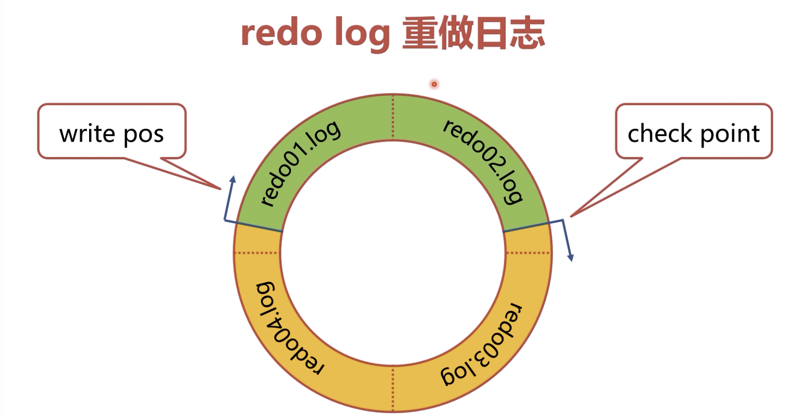

+++
title = 'MySQL日志'
date = 2024-05-04T16:04:56+08:00
draft = true
categories = [ "MySQL" ]
tags = [ "mysql" ]
+++

# 日志数据

这里的日志并非平时开发记录debug等信息的日志，而是MySQL记录数据产生的日志，这里是指产生的日志数据。它主要是在数据库更新时产生，有以下几种日志：

- **binlog**：server 层产生的逻辑日志，它与 InnoDB、MyISAM 等存储引擎没有任何关系。当数据库除了查询外发生的任何增、删、改操作变化时都会记录 binlog，binlog 相当于数据库的更新记录。但是这个日志不是给人看的，它是数据库逻辑上运行所必须一种日志。
- **redo log**：InnoDB 产生的物理日志，其他存储引擎不会产生 redo log。它能保证数据的持久化，事务有ACID特点，其中重要的一个就是持久化（D）
- **undo log**：InnoDB 产生的逻辑日志，它能保证隔离性（A）、原子性(I)。

> redo log、undo log 是 InnoDB 特有的日志，因为Inno有事务这一功能，由于事务才设计redo log和undo log。
> 这些日志都性能都是有影响的，因为数据不止一个人使用，在发生任何变化时都会产生这些日志。数据库运行起来之后不一定是只有自己在用，其他人也在用，这些对性能都会有影响，所以我们查询慢，不一定是自己的SQL语句有问题，也有可能是别人在对数据库做操作。

# 锁

查询SQL慢还可能是客户端之间因为锁而互相影响。

- 客户端执行SQL时，会产生各种行锁，表锁，元数据锁，这些锁会对SQL语句的执行会产生阻碍。
- 一个客户端产生的锁，会干扰其他客户端SQL的执行。
- 两个客户端与之间可能产生死锁。比如我锁了你需要的资源，你锁了我需要的资源，我们两个就会陷入阻塞状态。

# 其他影响

事务造成查询到的数据与磁盘不一致

- 客户端可能暂时看不到已经更新的数据。比如幻读，不可重复读，这些都会影响SQL执行的效果，这执行一次查询，再执行一次查询，两个查询的结果可能不一样。这些都是事务的隔离造成的。
- 事务可能会产生隐式锁，造成性能问题。

# 总结

- 数据库会伴随一系列性能问题。
- 会产生日志、锁、事务等一系列东西，这些东西对性能和功能都会产生一系列影响。
- 目标：需要理解日志、锁、事务的底层原理，才能应对遇到由此引发的性能问题。

# MySQL 日志体系

MySQL 为了满足主从复制、事务等功能，提供了复杂的日志体系，这些日志不是给人看的，而是系统运行所需的必要日志。

- Server 层产生 binlog，用来进行数据复制，与存储引擎无关，用来记录系统数据更新的日志。最大的作用主要是用来进行数据复制，也就是 binlog 传送给从实例备库，备库会用 binlog 来重现主库的数据更新。
- InnoDB 产生的 undo log、redo log，用来实现事务 ACID，也其他存储引擎无关，也和server层无关，是 InnoDB 特有的日志。

**binlog 归档日志**
- binlog 是 server 层产生的逻辑日志，逻辑日志是指记录的数据应该怎么变化，并不是记录数据的物理页怎么变。
- 用来进行数据的复制和数据传送。
- 有些时候还可以进行数据的备份和恢复，因为 binlog 完整记录了数据库每次的数据操作，类似于审计，可作为数据恢复手段。
- Binlog 记录在专门的文件中。

**undo log 回滚日志**
- InnoDB 自身产生的逻辑日志，用于事务回滚和展示旧版本。
- 对任何数据（缓存）的更新，都会先写 undo log
- undo log 位于表空间的 undo segment 中
- undo log 记录数据的相反操作，如原来是 a, 更新为 b，SQL: UPDATE NAME = 'b' -> undo: UPDATE name = 'a'

**redo log 重做日志**
- InnoDB 自身产生的物理日志，记录数据页（B+树的子节点或叶子界面，里面记录的是数据本身）的变化
- InnoDB “日志优于数据”，记录了 redo log 则视为数据已经更新
- 内存中的数据更新后写 redo log，redo log 日志数据被写入硬盘后删除。
- redo log 存储在4个1GB文件中，并且循环写入，1GB是可以配置的
  ○ write pos 是当前日志写入点
  ○ check point 是擦除点，数据被更新到硬盘时擦除
  ○ 当 write pos 追上 check point 时，事务无法提交（无法增删改，但是可以查），需要等待 check point 推进，强制刷 redo log 也是更新的时候数据库性能差的一个原因
  ○ 只要 redo log 不丢，数据就不会丢失，也就是已经落到文件上的 redo log
  ○ 在磁盘上对应的4个文件



# 数据更新流程


1.首先 client 发送一条 update 的 SQL，例如 update t1 set name="jack" where id=1;
2.Server 层首先会查询数据，将数据页（含有查询出数据的叶子节点的数据页）从磁盘读入内存，我们操作系统修改任何东西都是将数据从磁盘读入内存，在内存中修改，修改完再写入磁盘
3.一个页中有很多条数据，从页中遍历取出行数据并解析
4.解析出来给 MySQL Server 修改数据
5.修改完写 undo log
6.接着更新内存中的数据页，别人查的时候就能查到更新后的数据页了
7.再接着 redo log 写入内存（prepare），redo log 是将修改的行数据记录下来，到这里更新的事务就可以准备提交了，因为 redo log 一写入到内存，就意味着事务已经做完最后的准备了
8.此时如果用户不打算提交，打算回滚，就会将记录的 undo log 取出来进行回滚
9.最后如果用户 commit 提交，binlog 则会写入内存，会将前面所有的修改一次性全部写入内存，写完就可以提交事务了

## Binlog

### 作用

binlog 包含数据库的修改语，比如 create table、update table等数据变更语句，不会记录select、show 等不修改数据的语句

### 操作

* 开启 Binlog

不支持动态开启，需要修改配置文件 `/data/msql/conf/my.cnf`，在 [mysqld] 下增加下面内容，值是它的路径和前缀

```
log-bin = /data/mysql/binlog/mysql-bin
```

可以进入到 binlog 目录查看下内容：

```
ls /data/mysql/binlog
```

* 确认 Binlog 是否开启

```sql
show variables like '%log_bin%'
```

## 日志分类

* error log 错误日志，用于排错，比如 /var/log/mysqld.log，该日志默认开启
* binlog 二进制日志，用于备份、增备、DDL、DML、DCL 等操作
* relay log 中继日志，用于复制，比如接收 replication master
* slow log 慢查询日志，用于调优，比如查询时间超过指定值的SQL语句

参考：https://dev.mysql.com/doc/refman/8.0/en/server-logs.html

## 日志的产生

* 数据库更新时，会产生 binlog, redo log, undo log
* binlog: server 层产生的逻辑日志，也就是它与 InnoDB, MyISAM等存储引擎是没有任何关系的。当数据库发生任何的增，删，改操作，除了查询外有任何数据库的变化，都会记录 binlog, binlog相当于数据库的更新记录。但这个日志不是给人看的，它是数据库运行逻辑上所必须的一种日志
* redo log: InngoDB 产生的物理日志，它是保证持久化。事务有ACID特点，其中重要的一个就是持久化（D）
* undo log: InnoDB 产生的逻辑日志，保证ACID中的隔离性（A）、原子性(I)。

## MySQL 日志体系

* MySQL为了满足主从复制、事务等，具有复杂的日志体系，这些日志不是给人看的，而是系统运行所需要的日志
* binlog: server 层产生的逻辑日志，与存储引擎无关，用于数据复制，用来记录系统数据更新的情况的日志。也就是 binlog 传送给从机或者备库，备库会用 binlog 来重现主库的数据更新。

它与 InnoDB, MyISAM等存储引擎是没有任何关系的。当数据库发生任何的增，删，改操作，除了查询外有任何数据库的变化，都会记录 binlog, binlog相当于数据库的更新记录。但这个日志不是给人看的，它是数据库运行逻辑上所必须的一种日志

* InnoDB产生的 undo log，redo log, 用来实现事务 ACID，与其他存储引擎无关，也和server层无关，是 InnoDB 特有的
* MySQL 的日志体系主要不是用来看的，而是运行必要的

### binlog 归档日志

binog 是 server 层产生的逻辑日志。逻辑日志是指记录的数据应该怎么变化，并不是记录数据的物理页具体怎么变（不懂）。

用来进行数据的复制和数据传送；有些时候用来记录数据的备份和数据的闪回，因为 binlog 完整记录了数据库每次的数据操作，可理解为数据库数据的审计，可作为数据闪回手段。
* Binlog 记录在专门的文件中

### undo log 回滚日志

* InnoDB 自身产生的逻辑日志，用于事务回滚和展示旧版本
* 对任何数据（缓存）的更新，都需要先写 undo log
* undo log 位于表空间的 undo segment 中
* undo log 记录数据的相反操作，如原来是 a, 更新为 b
    SQL: UPDATE NAME = 'b' -> undo: UPDATE name = 'a'

### redo log 重做日志

* InnoDB 自身产生的物理日志，记录数据页（B+树的子节点或叶子界面，里面记录的是数据本身）的变化
* InnoDB “日志优于数据”，记录 redo log 视为数据已经更新
* 内存中的数据更新后写 redo log，数据被写入硬盘后删除
* redo log 存储在4个1GB文件中，并且循环写入，1GB是可以配置的
  - write pos 是当前日志写入点
  - check point 是擦除点，数据被更新到硬盘时擦除
  - 当 write pos 追上 check point 时，事务无法提交（无法增删改，但是可以查），需要等待 check point 推进，强制刷 redo log 也是更新的时候数据库性能差的一个原因
  - 只要 redo log 不丢，数据就不会丢失，也就是已经落到文件上的 redo log
  - 在磁盘上对应的4个文件