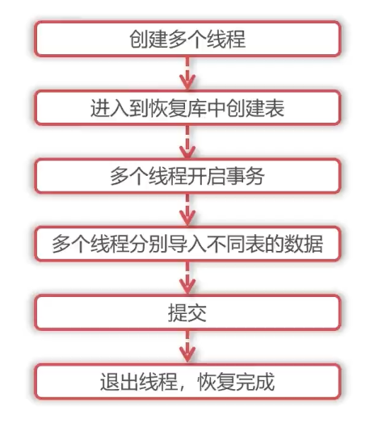

+++
title = 'MySQL逻辑备份工具——mydumper'
date = 2024-09-01T08:07:10
draft = true
categories = [ "MySQL" ]
tags = [ "mysql" ]
+++

# 一、mydumper

## （一）功能

MySQL 备份与恢复。

## （二）环境依赖

由于该工具并非 MySQL 自带，需要额外安装，故需要考虑的点如下：

**操作系统**

几乎支持目前大多数主流操作系统。
el7
el8
el9
ubuntu bionic(18.04 LTS)
ubuntu focal (20.04 LTS)
ubuntu jammy (22.04 LTS)

没有el6的支持


**系统架构**

- aarch64
- amd64
- x86_64

**依赖**

ubuntu: libatomic1
centos: 无

**兼容性**

- MySQL 支持版本，文档未提及。

## （三）优缺点分析

**优点**

- 多线程。可以在备份时开启多个线程，多个线程可以备份不同的表，大大提升备份速度。
- 导出的备份文件，如表结构和数据是分开存放，方便查看和解析。
- 备份过程使用事务，能保证一致性和可靠性。

**缺点**

- 参数较少，灵活性不如 mysqldump 和 mysql shell utilities
- 社区维护、文档并不齐全。
- 需另外安装


### 安装

1、下载

```bash
wget https://github.com/mydumper/mydumper/releases/download/v0.16.6-2/mydumper-0.16.6-2.el7.x86_64.rpm
```

2、安装

```bash
yum install -y mydumper-0.16.6-2.el7.x86_64.rpm
```

3、验证

```bash
# mydumper --version
mydumper v0.16.6-2, built against MySQL 5.7.44-48 with SSL support
```

### 环境准备

1、在 `chaos-1` 上创建备份用户

```sql
create user 'u_mydumper'@'%' identified with mysql_native_password by '123';
```

2、设置备份权限

```sql  
grant create, insert, select, reload, process, lock tables, replication client, replication_slave_admin, show view, trigger, backup_admin, super on *.* to u_mydumper@'%';
```

- create: 恢复数据库需要建表权限
- insert: 恢复数据时是通过Insert 语句回复数据的
- select: 备份时通过select * from 查询表全部数据
- reload: 备份完成后还原数据需要重新mysql配置
- process:备份时会执行 show process list
- lock tables:备份时加全局读锁
- replication client: 记录位点
- replication_slave_admin: 查看复制状态
- show view: 备份视图
- trigger: 备份触发器

3、开启 general_log 

先另开窗口打印 general_log

```bash
set global general_log=on;
tail -f /data/mysql/log/mysql-general.log
```

4、创建备份目录

```bash
mkdir /data/backup/mydumper
cd /data/backup/mydumper
```

5、备份

```bash
[root@chaos-1 mydumper]# ll
total 0
[root@chaos-1 mydumper]# mydumper -u 'u_mydumper' -p '123' -S '/tmp/mysql.sock' -B backup1 -o ./backup1
[root@chaos-1 mydumper]# ll
total 4
drwxr-x--- 2 root root 4096 9月   8 15:19 backup1
[root@chaos-1 mydumper]# ll backup1/
total 32
-rw-r----- 1 root root 405 9月   8 15:19 backup1-schema-create.sql
-rw-r----- 1 root root 292 9月   8 15:19 backup1.t1.00000.sql
-rw-r----- 1 root root 288 9月   8 15:19 backup1.t1.00001.sql
-rw-r----- 1 root root 490 9月   8 15:19 backup1.t1-schema.sql
-rw-r----- 1 root root 292 9月   8 15:19 backup1.t2.00000.sql
-rw-r----- 1 root root 288 9月   8 15:19 backup1.t2.00001.sql
-rw-r----- 1 root root 490 9月   8 15:19 backup1.t2-schema.sql
-rw-r--r-- 1 root root 558 9月   8 15:19 metadata
[root@chaos-1 mydumper]#
```

-S 接socket
-B 备份某个库
-o 后接备份的文件夹

6、查看备份文件

- `backup1-schema-create.sql` 里面是建库语句
- `backup1.t1-schema.sql` 里面是建表语句，同样 `backup1.t2-schema.sql` 也是
- `backup1.t1.00000.sql` 里面是数据文件


7、查看 general_log

```bash
2024-09-08T07:19:46.299224Z	   23 Connect	u_mydumper@localhost on  using Socket
2024-09-08T07:19:46.299476Z	   23 Query	/*!40101 SET NAMES binary*/
2024-09-08T07:19:46.299637Z	   23 Query	SELECT @@version_comment, @@version
2024-09-08T07:19:46.299927Z	   23 Query	SELECT @@SQL_MODE
2024-09-08T07:19:46.300091Z	   23 Query	SET SESSION FOREIGN_KEY_CHECKS = 0
2024-09-08T07:19:46.300151Z	   23 Query	SET SESSION WAIT_TIMEOUT = 2147483
2024-09-08T07:19:46.300194Z	   23 Query	/*!80003 SET SESSION INFORMATION_SCHEMA_STATS_EXPIRY = 0  */
2024-09-08T07:19:46.300233Z	   23 Query	SET SESSION NET_WRITE_TIMEOUT = 2147483
2024-09-08T07:19:46.300274Z	   23 Query	SET SESSION SQL_MODE = 'NO_AUTO_VALUE_ON_ZERO,ONLY_FULL_GROUP_BY,NO_ZERO_IN_DATE,NO_ZERO_DATE,ERROR_FOR_DIVISION_BY_ZERO,NO_ENGINE_SUBSTITUTION'
2024-09-08T07:19:46.300356Z	   23 Query	SELECT FIND_IN_SET('ANSI', @@SQL_MODE) OR FIND_IN_SET('ANSI_QUOTES', @@SQL_MODE)
2024-09-08T07:19:46.300480Z	   23 Query	SET SESSION TRANSACTION ISOLATION LEVEL REPEATABLE READ
2024-09-08T07:19:46.300697Z	   23 Query	SHOW PROCESSLIST
2024-09-08T07:19:46.300967Z	   23 Query	SHOW REPLICA STATUS
2024-09-08T07:19:46.301104Z	   23 Query	LOCK INSTANCE FOR BACKUP
2024-09-08T07:19:46.301160Z	   23 Query	FLUSH NO_WRITE_TO_BINLOG TABLES
2024-09-08T07:19:46.304138Z	   23 Query	FLUSH TABLES WITH READ LOCK
2024-09-08T07:19:46.306118Z	   24 Connect	u_mydumper@localhost on  using Socket
2024-09-08T07:19:46.306224Z	   26 Connect	u_mydumper@localhost on  using Socket
2024-09-08T07:19:46.306229Z	   25 Connect	u_mydumper@localhost on  using Socket
2024-09-08T07:19:46.306324Z	   24 Query	/*!40101 SET NAMES binary*/
2024-09-08T07:19:46.306374Z	   26 Query	/*!40101 SET NAMES binary*/
2024-09-08T07:19:46.306415Z	   27 Connect	u_mydumper@localhost on  using Socket
2024-09-08T07:19:46.306480Z	   25 Query	/*!40101 SET NAMES binary*/
2024-09-08T07:19:46.306515Z	   26 Query	SET SESSION FOREIGN_KEY_CHECKS = 0
2024-09-08T07:19:46.306527Z	   24 Query	SET SESSION FOREIGN_KEY_CHECKS = 0
2024-09-08T07:19:46.306655Z	   26 Query	SET SESSION WAIT_TIMEOUT = 2147483
2024-09-08T07:19:46.306665Z	   27 Query	/*!40101 SET NAMES binary*/
2024-09-08T07:19:46.306672Z	   24 Query	SET SESSION WAIT_TIMEOUT = 2147483
2024-09-08T07:19:46.306709Z	   26 Query	/*!80003 SET SESSION INFORMATION_SCHEMA_STATS_EXPIRY = 0  */
2024-09-08T07:19:46.306696Z	   25 Query	SET SESSION FOREIGN_KEY_CHECKS = 0
2024-09-08T07:19:46.306744Z	   24 Query	/*!80003 SET SESSION INFORMATION_SCHEMA_STATS_EXPIRY = 0  */
2024-09-08T07:19:46.306776Z	   26 Query	SET SESSION NET_WRITE_TIMEOUT = 2147483
2024-09-08T07:19:46.306792Z	   24 Query	SET SESSION NET_WRITE_TIMEOUT = 2147483
2024-09-08T07:19:46.306800Z	   25 Query	SET SESSION WAIT_TIMEOUT = 2147483
2024-09-08T07:19:46.306831Z	   26 Query	SET SESSION SQL_MODE = 'NO_AUTO_VALUE_ON_ZERO,ONLY_FULL_GROUP_BY,NO_ZERO_IN_DATE,NO_ZERO_DATE,ERROR_FOR_DIVISION_BY_ZERO,NO_ENGINE_SUBSTITUTION'
2024-09-08T07:19:46.306842Z	   27 Query	SET SESSION FOREIGN_KEY_CHECKS = 0
2024-09-08T07:19:46.306863Z	   25 Query	/*!80003 SET SESSION INFORMATION_SCHEMA_STATS_EXPIRY = 0  */
2024-09-08T07:19:46.306843Z	   24 Query	SET SESSION SQL_MODE = 'NO_AUTO_VALUE_ON_ZERO,ONLY_FULL_GROUP_BY,NO_ZERO_IN_DATE,NO_ZERO_DATE,ERROR_FOR_DIVISION_BY_ZERO,NO_ENGINE_SUBSTITUTION'
2024-09-08T07:19:46.306894Z	   26 Query	/*!40103 SET TIME_ZONE='+00:00' */
2024-09-08T07:19:46.306919Z	   25 Query	SET SESSION NET_WRITE_TIMEOUT = 2147483
2024-09-08T07:19:46.306942Z	   27 Query	SET SESSION WAIT_TIMEOUT = 2147483
2024-09-08T07:19:46.306959Z	   24 Query	/*!40103 SET TIME_ZONE='+00:00' */
2024-09-08T07:19:46.307003Z	   26 Query	SET SESSION TRANSACTION ISOLATION LEVEL REPEATABLE READ
2024-09-08T07:19:46.307011Z	   25 Query	SET SESSION SQL_MODE = 'NO_AUTO_VALUE_ON_ZERO,ONLY_FULL_GROUP_BY,NO_ZERO_IN_DATE,NO_ZERO_DATE,ERROR_FOR_DIVISION_BY_ZERO,NO_ENGINE_SUBSTITUTION'
2024-09-08T07:19:46.307035Z	   27 Query	/*!80003 SET SESSION INFORMATION_SCHEMA_STATS_EXPIRY = 0  */
2024-09-08T07:19:46.307073Z	   24 Query	SET SESSION TRANSACTION ISOLATION LEVEL REPEATABLE READ
2024-09-08T07:19:46.307073Z	   26 Query	START TRANSACTION /*!40108 WITH CONSISTENT SNAPSHOT */
2024-09-08T07:19:46.307121Z	   25 Query	/*!40103 SET TIME_ZONE='+00:00' */
2024-09-08T07:19:46.307130Z	   27 Query	SET SESSION NET_WRITE_TIMEOUT = 2147483
2024-09-08T07:19:46.307132Z	   24 Query	START TRANSACTION /*!40108 WITH CONSISTENT SNAPSHOT */
2024-09-08T07:19:46.307223Z	   27 Query	SET SESSION SQL_MODE = 'NO_AUTO_VALUE_ON_ZERO,ONLY_FULL_GROUP_BY,NO_ZERO_IN_DATE,NO_ZERO_DATE,ERROR_FOR_DIVISION_BY_ZERO,NO_ENGINE_SUBSTITUTION'
2024-09-08T07:19:46.307225Z	   25 Query	SET SESSION TRANSACTION ISOLATION LEVEL REPEATABLE READ
2024-09-08T07:19:46.307227Z	   26 Query	SHOW STATUS LIKE 'binlog_snapshot_gtid_executed'
2024-09-08T07:19:46.307288Z	   24 Query	SHOW STATUS LIKE 'binlog_snapshot_gtid_executed'
2024-09-08T07:19:46.307328Z	   25 Query	START TRANSACTION /*!40108 WITH CONSISTENT SNAPSHOT */
2024-09-08T07:19:46.307339Z	   27 Query	/*!40103 SET TIME_ZONE='+00:00' */
2024-09-08T07:19:46.307484Z	   27 Query	SET SESSION TRANSACTION ISOLATION LEVEL REPEATABLE READ
2024-09-08T07:19:46.307487Z	   25 Query	SHOW STATUS LIKE 'binlog_snapshot_gtid_executed'
2024-09-08T07:19:46.307562Z	   27 Query	START TRANSACTION /*!40108 WITH CONSISTENT SNAPSHOT */
2024-09-08T07:19:46.307715Z	   27 Query	SHOW STATUS LIKE 'binlog_snapshot_gtid_executed'
2024-09-08T07:19:46.316262Z	   26 Query	SHOW MASTER STATUS
2024-09-08T07:19:46.316316Z	   24 Init DB	backup1
2024-09-08T07:19:46.316478Z	   24 Query	SHOW TABLE STATUS
2024-09-08T07:19:46.319230Z	   24 Query	SELECT CHARACTER_SET_NAME FROM INFORMATION_SCHEMA.COLLATIONS WHERE collation_name='utf8mb4_0900_ai_ci'
2024-09-08T07:19:46.319331Z	   26 Query	SHOW CREATE DATABASE IF NOT EXISTS `backup1`
2024-09-08T07:19:46.320924Z	   24 Query	select COLUMN_NAME from information_schema.COLUMNS where TABLE_SCHEMA='backup1' and TABLE_NAME='t1' and COLUMN_TYPE ='json'
2024-09-08T07:19:46.321115Z	   27 Query	select COLUMN_NAME from information_schema.COLUMNS where TABLE_SCHEMA='backup1' and TABLE_NAME='t2' and COLUMN_TYPE ='json'
2024-09-08T07:19:46.321922Z	   24 Query	SHOW INDEX FROM `backup1`.`t1`
2024-09-08T07:19:46.323250Z	   27 Query	SHOW INDEX FROM `backup1`.`t2`
2024-09-08T07:19:46.323863Z	   24 Query	select COLUMN_NAME from information_schema.COLUMNS where TABLE_SCHEMA='backup1' and TABLE_NAME='t1' and extra like '%GENERATED%' and extra not like '%DEFAULT_GENERATED%'
2024-09-08T07:19:46.324946Z	   24 Query	SHOW CREATE TABLE `backup1`.`t1`
2024-09-08T07:19:46.324970Z	   27 Query	select COLUMN_NAME from information_schema.COLUMNS where TABLE_SCHEMA='backup1' and TABLE_NAME='t2' and extra like '%GENERATED%' and extra not like '%DEFAULT_GENERATED%'
2024-09-08T07:19:46.326130Z	   27 Query	SHOW CREATE TABLE `backup1`.`t2`
2024-09-08T07:19:46.326278Z	   24 Query	EXPLAIN SELECT /*!40001 SQL_NO_CACHE */ * FROM `backup1`.`t2`
2024-09-08T07:19:46.326373Z	   25 Query	EXPLAIN SELECT /*!40001 SQL_NO_CACHE */ * FROM `backup1`.`t1`
2024-09-08T07:19:46.327162Z	   23 Query	UNLOCK TABLES
2024-09-08T07:19:46.327597Z	   24 Query	SELECT /*!40001 SQL_NO_CACHE */ MIN(`id`),MAX(`id`),LEFT(MIN(`id`),1),LEFT(MAX(`id`),1) FROM `backup1`.`t2`
2024-09-08T07:19:46.327622Z	   25 Query	SELECT /*!40001 SQL_NO_CACHE */ MIN(`id`),MAX(`id`),LEFT(MIN(`id`),1),LEFT(MAX(`id`),1) FROM `backup1`.`t1`
2024-09-08T07:19:46.328085Z	   25 Query	SELECT /*!40001 SQL_NO_CACHE */ * FROM `backup1`.`t2`  WHERE (`id` IS NULL OR(`id` = 1))
2024-09-08T07:19:46.328139Z	   24 Query	SELECT /*!40001 SQL_NO_CACHE */ * FROM `backup1`.`t2`  WHERE (`id` = 2)
2024-09-08T07:19:46.328265Z	   27 Query	SELECT /*!40001 SQL_NO_CACHE */ * FROM `backup1`.`t1`  WHERE (`id` IS NULL OR(`id` = 1))
2024-09-08T07:19:46.328343Z	   26 Query	SELECT /*!40001 SQL_NO_CACHE */ * FROM `backup1`.`t1`  WHERE (`id` = 2)
2024-09-08T07:19:46.328568Z	   24 Quit
2024-09-08T07:19:46.328750Z	   25 Quit
2024-09-08T07:19:46.328945Z	   27 Quit
2024-09-08T07:19:46.328959Z	   26 Quit
2024-09-08T07:19:46.329096Z	   23 Query	UNLOCK INSTANCE
2024-09-08T07:19:46.329177Z	   23 Quit
```

首先 `Connect	u_mydumper@localhost on  using Socket`连接到 backup1 库，23 是线程ID，可以看做是主线程；
接着设置会话级别变量；
`LOCK INSTANCE FOR BACKUP`: 给实例加备份锁，在备份期间  可以运行DML，但是不能执行DDL
`FLUSH NO_WRITE_TO_BINLOG TABLES` 将当前打开的表都刷新到磁盘，并且清楚缓存，这样就方便使用 select 语句查询从而备份
`FLUSH TABLES WITH READ LOCK`，给备份中所有表增加全局读锁

又创建了三个线程24、26、25、27
再为每个线程设置会话级别变量
每个线程会将隔离级别设置 repeatable read，比如 `26 Query	SET SESSION TRANSACTION ISOLATION LEVEL REPEATABLE READ`
再开启事务 `26 Query	START TRANSACTION `
再是查询状态的语句，查看库的建库、建表语句
再通过 `select * from ...` 来备份的语句
查看备份信息
查看触发器
解锁
退出备份线程
主线程解锁备份锁
退出线程

对比mysqldump 只开启一个线程


### 备份原理


### 恢复

1. 在 `chaos-1` 上创建恢复库

```sql
create database backup1_recover
```

```bash
[root@chaos-1 mydumper]# ll
total 4
drwxr-x--- 2 root root 4096 9月   8 15:19 backup1
[root@chaos-1 mydumper]# myloader -u 'u_mydumper' -p '123' -S /tmp/mysql.sock -B backup1_recover -d ./backup1

** (myloader:1897): WARNING **: 15:53:28.235: zstd command not found on any static location, use --exec-per-thread for non default locations
```

2、打印general_log

```bash
2024-09-08T07:53:28.231674Z	   29 Connect	u_mydumper@localhost on  using Socket
2024-09-08T07:53:28.231871Z	   29 Query	/*!40101 SET NAMES binary*/
2024-09-08T07:53:28.232043Z	   29 Query	SELECT @@version_comment, @@version
2024-09-08T07:53:28.232313Z	   29 Query	/*!40114 SET SESSION UNIQUE_CHECKS = 0  */
2024-09-08T07:53:28.232454Z	   29 Query	SET SESSION AUTOCOMMIT = 0
2024-09-08T07:53:28.232513Z	   29 Query	SET SESSION WAIT_TIMEOUT = 2147483
2024-09-08T07:53:28.232571Z	   29 Query	SET SESSION NET_WRITE_TIMEOUT = 2147483
2024-09-08T07:53:28.232629Z	   29 Query	/*!40101 SET SESSION SQL_MODE = 'NO_AUTO_VALUE_ON_ZERO'  */
2024-09-08T07:53:28.232702Z	   29 Query	SET SESSION SQL_LOG_BIN = 0
2024-09-08T07:53:28.232769Z	   29 Query	/*!40114 SET SESSION FOREIGN_KEY_CHECKS = 0  */
2024-09-08T07:53:28.233171Z	   29 Query	/*!40114 SET SESSION UNIQUE_CHECKS = 0  */
2024-09-08T07:53:28.233508Z	   29 Query	SET SESSION AUTOCOMMIT = 0
2024-09-08T07:53:28.233633Z	   29 Query	SET SESSION WAIT_TIMEOUT = 2147483
2024-09-08T07:53:28.233724Z	   32 Connect	u_mydumper@localhost on  using Socket
2024-09-08T07:53:28.233733Z	   29 Query	SET SESSION NET_WRITE_TIMEOUT = 2147483
2024-09-08T07:53:28.233735Z	   31 Connect	u_mydumper@localhost on  using Socket
2024-09-08T07:53:28.233741Z	   30 Connect	u_mydumper@localhost on  using Socket
2024-09-08T07:53:28.233892Z	   29 Query	/*!40101 SET SESSION SQL_MODE = 'NO_AUTO_VALUE_ON_ZERO'  */
2024-09-08T07:53:28.233974Z	   31 Query	/*!40101 SET NAMES binary*/
2024-09-08T07:53:28.233913Z	   32 Query	/*!40101 SET NAMES binary*/
2024-09-08T07:53:28.234066Z	   30 Query	/*!40101 SET NAMES binary*/
2024-09-08T07:53:28.234125Z	   31 Query	/*!40114 SET SESSION UNIQUE_CHECKS = 0  */
2024-09-08T07:53:28.234149Z	   32 Query	/*!40114 SET SESSION UNIQUE_CHECKS = 0  */
2024-09-08T07:53:28.234192Z	   31 Query	SET SESSION AUTOCOMMIT = 0
2024-09-08T07:53:28.234206Z	   30 Query	/*!40114 SET SESSION UNIQUE_CHECKS = 0  */
2024-09-08T07:53:28.234230Z	   32 Query	SET SESSION AUTOCOMMIT = 0
2024-09-08T07:53:28.234208Z	   29 Query	SET SESSION SQL_LOG_BIN = 0
2024-09-08T07:53:28.234260Z	   31 Query	SET SESSION WAIT_TIMEOUT = 2147483
2024-09-08T07:53:28.234294Z	   30 Query	SET SESSION AUTOCOMMIT = 0
2024-09-08T07:53:28.234308Z	   32 Query	SET SESSION WAIT_TIMEOUT = 2147483
2024-09-08T07:53:28.234318Z	   31 Query	SET SESSION NET_WRITE_TIMEOUT = 2147483
2024-09-08T07:53:28.234384Z	   30 Query	SET SESSION WAIT_TIMEOUT = 2147483
2024-09-08T07:53:28.234387Z	   32 Query	SET SESSION NET_WRITE_TIMEOUT = 2147483
2024-09-08T07:53:28.234418Z	   31 Query	/*!40101 SET SESSION SQL_MODE = 'NO_AUTO_VALUE_ON_ZERO'  */
2024-09-08T07:53:28.234445Z	   30 Query	SET SESSION NET_WRITE_TIMEOUT = 2147483
2024-09-08T07:53:28.234452Z	   32 Query	/*!40101 SET SESSION SQL_MODE = 'NO_AUTO_VALUE_ON_ZERO'  */
2024-09-08T07:53:28.234478Z	   31 Query	SET SESSION SQL_LOG_BIN = 0
2024-09-08T07:53:28.234512Z	   30 Query	/*!40101 SET SESSION SQL_MODE = 'NO_AUTO_VALUE_ON_ZERO'  */
2024-09-08T07:53:28.234522Z	   29 Query	/*!40114 SET SESSION FOREIGN_KEY_CHECKS = 0  */
2024-09-08T07:53:28.234513Z	   32 Query	SET SESSION SQL_LOG_BIN = 0
2024-09-08T07:53:28.234541Z	   31 Query	/*!40114 SET SESSION FOREIGN_KEY_CHECKS = 0  */
2024-09-08T07:53:28.234572Z	   30 Query	SET SESSION SQL_LOG_BIN = 0
2024-09-08T07:53:28.234613Z	   32 Query	/*!40114 SET SESSION FOREIGN_KEY_CHECKS = 0  */
2024-09-08T07:53:28.234632Z	   30 Query	/*!40114 SET SESSION FOREIGN_KEY_CHECKS = 0  */
2024-09-08T07:53:28.234740Z	   31 Query	CREATE DATABASE IF NOT EXISTS `backup1_recover`
2024-09-08T07:53:28.237166Z	   32 Query	USE `backup1_recover`
2024-09-08T07:53:28.237226Z	   30 Query	USE `backup1_recover`
2024-09-08T07:53:28.237355Z	   32 Query	/*!40101 SET NAMES binary*/
2024-09-08T07:53:28.237375Z	   30 Query	/*!40101 SET NAMES binary*/
2024-09-08T07:53:28.237492Z	   32 Query	/*!40014 SET FOREIGN_KEY_CHECKS=0*/
2024-09-08T07:53:28.237507Z	   30 Query	/*!40014 SET FOREIGN_KEY_CHECKS=0*/
2024-09-08T07:53:28.237570Z	   32 Query	/*!40101 SET SQL_MODE='NO_AUTO_VALUE_ON_ZERO,ONLY_FULL_GROUP_BY,NO_ZERO_IN_DATE,NO_ZERO_DATE,ERROR_FOR_DIVISION_BY_ZERO,NO_ENGINE_SUBSTITUTION'*/
2024-09-08T07:53:28.237592Z	   30 Query	/*!40101 SET SQL_MODE='NO_AUTO_VALUE_ON_ZERO,ONLY_FULL_GROUP_BY,NO_ZERO_IN_DATE,NO_ZERO_DATE,ERROR_FOR_DIVISION_BY_ZERO,NO_ENGINE_SUBSTITUTION'*/
2024-09-08T07:53:28.237655Z	   32 Query	/*!40103 SET TIME_ZONE='+00:00' */
2024-09-08T07:53:28.237682Z	   30 Query	/*!40103 SET TIME_ZONE='+00:00' */
2024-09-08T07:53:28.237802Z	   32 Query	CREATE TABLE `t2` (
  `id` int NOT NULL AUTO_INCREMENT,
  `firstname` varchar(20) DEFAULT NULL,
  `lastname` varchar(20) DEFAULT NULL,
  PRIMARY KEY (`id`)
) ENGINE=InnoDB AUTO_INCREMENT=4 DEFAULT CHARSET=utf8mb4 COLLATE=utf8mb4_0900_ai_ci
2024-09-08T07:53:28.237807Z	   30 Query	CREATE TABLE `t1` (
  `id` int NOT NULL AUTO_INCREMENT,
  `firstname` varchar(20) DEFAULT NULL,
  `lastname` varchar(20) DEFAULT NULL,
  PRIMARY KEY (`id`)
) ENGINE=InnoDB AUTO_INCREMENT=3 DEFAULT CHARSET=utf8mb4 COLLATE=utf8mb4_0900_ai_ci
2024-09-08T07:53:28.251842Z	   29 Query	USE `backup1_recover`
2024-09-08T07:53:28.251861Z	   31 Query	USE `backup1_recover`
2024-09-08T07:53:28.252015Z	   29 Query	START TRANSACTION
2024-09-08T07:53:28.252044Z	   31 Query	START TRANSACTION
2024-09-08T07:53:28.252179Z	   32 Query	START TRANSACTION
2024-09-08T07:53:28.252260Z	   31 Query	/*!40101 SET NAMES binary*/
2024-09-08T07:53:28.252269Z	   30 Query	START TRANSACTION
2024-09-08T07:53:28.252329Z	   32 Query	/*!40101 SET NAMES binary*/
2024-09-08T07:53:28.252445Z	   31 Query	/*!40014 SET FOREIGN_KEY_CHECKS=0*/
2024-09-08T07:53:28.252464Z	   29 Query	/*!40101 SET NAMES binary*/
2024-09-08T07:53:28.252480Z	   30 Query	/*!40101 SET NAMES binary*/
2024-09-08T07:53:28.252515Z	   32 Query	/*!40014 SET FOREIGN_KEY_CHECKS=0*/
2024-09-08T07:53:28.252536Z	   31 Query	/*!40101 SET SQL_MODE='NO_AUTO_VALUE_ON_ZERO,ONLY_FULL_GROUP_BY,NO_ZERO_IN_DATE,NO_ZERO_DATE,ERROR_FOR_DIVISION_BY_ZERO,NO_ENGINE_SUBSTITUTION'*/
2024-09-08T07:53:28.252605Z	   32 Query	/*!40101 SET SQL_MODE='NO_AUTO_VALUE_ON_ZERO,ONLY_FULL_GROUP_BY,NO_ZERO_IN_DATE,NO_ZERO_DATE,ERROR_FOR_DIVISION_BY_ZERO,NO_ENGINE_SUBSTITUTION'*/
2024-09-08T07:53:28.252613Z	   30 Query	/*!40014 SET FOREIGN_KEY_CHECKS=0*/
2024-09-08T07:53:28.252615Z	   31 Query	/*!40103 SET TIME_ZONE='+00:00' */
2024-09-08T07:53:28.252686Z	   32 Query	/*!40103 SET TIME_ZONE='+00:00' */
2024-09-08T07:53:28.252704Z	   29 Query	/*!40014 SET FOREIGN_KEY_CHECKS=0*/
2024-09-08T07:53:28.252719Z	   30 Query	/*!40101 SET SQL_MODE='NO_AUTO_VALUE_ON_ZERO,ONLY_FULL_GROUP_BY,NO_ZERO_IN_DATE,NO_ZERO_DATE,ERROR_FOR_DIVISION_BY_ZERO,NO_ENGINE_SUBSTITUTION'*/
2024-09-08T07:53:28.252746Z	   31 Query	INSERT INTO `t2` VALUES(2,"li","si")
2024-09-08T07:53:28.252788Z	   32 Query	INSERT INTO `t1` VALUES(1,"zhang","san")
2024-09-08T07:53:28.252804Z	   30 Query	/*!40103 SET TIME_ZONE='+00:00' */
2024-09-08T07:53:28.252906Z	   30 Query	INSERT INTO `t1` VALUES(2,"li","si")
2024-09-08T07:53:28.253213Z	   29 Query	/*!40101 SET SQL_MODE='NO_AUTO_VALUE_ON_ZERO,ONLY_FULL_GROUP_BY,NO_ZERO_IN_DATE,NO_ZERO_DATE,ERROR_FOR_DIVISION_BY_ZERO,NO_ENGINE_SUBSTITUTION'*/
2024-09-08T07:53:28.253327Z	   29 Query	/*!40103 SET TIME_ZONE='+00:00' */
2024-09-08T07:53:28.253607Z	   32 Query	COMMIT
2024-09-08T07:53:28.253763Z	   30 Query	COMMIT
2024-09-08T07:53:28.253889Z	   29 Query	INSERT INTO `t2` VALUES(1,"zhang","san")
2024-09-08T07:53:28.254163Z	   31 Query	COMMIT
2024-09-08T07:53:28.254437Z	   29 Query	COMMIT
2024-09-08T07:53:28.255288Z	   32 Quit
```

会先创建连接；
设置会话级别变量；
创建恢复库 `CREATE DATABASE IF NOT EXISTS `；
创建表，不同的表创建在不同的线程中，
不同线程会开启事务，往不同的表中写入数据，再进行提交，最后分别退出几个线程


**恢复原理**





### 使用

**--database**

> 备份某个库，或简写为 `-B`

备份：

```bash
cd /data/backup/mydumper
mydumper -u 'u_mydumper' -p '123' -S /tmp/mysql.sock -B backup1 -o ./backup1
```

注意：重复备份时使用同一目录，目录下不能存在内容，否则会出现下面提示：
```bash
[root@chaos-1 mydumper]# mydumper -u 'u_mydumper' -p '123' -S /tmp/mysql.sock -B backup1 -o ./backup1

** (mydumper:1926): ERROR **: 16:03:44.585: Directory is not empty (use --clear or --dirty): ./backup1

Trace/breakpoint trap (core dumped)
```

恢复：

```bash
myloader -u 'u_mydumper' -p '123' -S /tmp/mysql.sock -B backup1_recover_01 -d  ./backup1
```

如果 `backup1_recover_01` 不存在会自动自动创建


使用建议：

当需要备份或恢复某个数据库时使用才参数，

**--tables-list**

> 备份某一张或多张表，可以简写为 `-T`

Comma delimited table list to dump (does not exclude regex option). Table name must include database name. For instance: test.t1,test.t2

备份：

```bash
[root@chaos-1 mydumper]# mydumper -u 'u_mydumper' -p '123' -S /tmp/mysql.sock -T backup1.t1,backup1.t2 -o ./backup1_t1_t2
[root@chaos-1 mydumper]# ll
total 8
drwxr-x--- 2 root root 4096 9月   8 16:05 backup1
drwxr-x--- 2 root root 4096 9月   8 16:09 backup1_t1_t2
[root@chaos-1 mydumper]#
```

注意：多个表之间使用 `,` 分隔，并且逗号后面不能有空格，否则备份失败：
```bash
** (mydumper:1962): ERROR **: 16:08:37.640: Table name  is not in DATABASE.TABLE format
```

恢复：

现将原来的t1表删除，因为 mydumper备份的数据只有建表语句，没有drop table操作 
```bash
myloader -u 'u_mydumper' -p '123' -S /tmp/mysql.sock -B backup1_recover_02 -d  ./backup1_t1_t2
```

使用建议：

当需要备份指定表时使用该参数。

**备份所有库**

不加任何参数表示备份所有库，包括了所有系统库的数据

备份：
```bash
mydumper -u 'u_mydumper' -p '123' -S /tmp/mysql.sock  -o ./all
``` 

恢复：
```bash
myloader -u 'u_mydumper' -p '123' -S /tmp/mnsql.sock -d ./all
```
**--regex**

1、可以排除不需要的库，比如图 mysql 和 test 库

备份：
```bash
mydumper -u 'u_mydumper' -p '123' -S /tmp/mysql.sock --regex '^(?!(mysql\.|test\.))'  -o ./backup_no_mysql_test
``` 

2、只备份指定库，如mysql和test

```bash
mydumper -u 'u_mydumper' -p '123' -S /tmp/mysql.sock --regex '^(mysql\.|test\.)'  -o ./backup_mysql_test
```

3、不备份以某个关键字'backup'开头的数据库


```bash
mydumper -u 'u_mydumper' -p '123' -S /tmp/mysql.sock --regex '^(?!(backup))'  -o ./no_backup_prefix
```

**--threads**

> 指定线程数备份。默认开启4个线程进行备份，如果不够，可以在备份时指定线程数

开启general_log,并监控日志

指定8个线程:

```bash
mydumper -u 'u_mydumper' -p '123' -S /tmp/mysql.sock -t 8  -o ./backup_8_thread
```

查看 general_log 中可以查看到开启了8个线程

**--compress**

> 压缩备份

```bash
mydumper -u 'u_mydumper' -p '123' -S /tmp/mysql.sock -B backup1 --compress -o ./backup1_compress
```

查看备份内容：

```bash
[root@chaos-1 mydumper]# mydumper -u 'u_mydumper' -p '123' -S /tmp/mysql.sock -B backup1 --compress -o ./backup1_compress
[root@chaos-1 mydumper]# ll
total 76
drwxr-x--- 2 root root 20480 9月   8 16:16 all
drwxr-x--- 2 root root  4096 9月   8 16:05 backup1
drwxr-x--- 2 root root  4096 9月   8 16:26 backup1_compress
drwxr-x--- 2 root root  4096 9月   8 16:09 backup1_t1_t2
drwxr-x--- 2 root root  4096 9月   8 16:20 backup_mysql_test
drwxr-x--- 2 root root 20480 9月   8 16:19 backup_no_mysql_test
drwxr-x--- 2 root root 20480 9月   8 16:21 no_backup_prefix
[root@chaos-1 mydumper]# ll backup1_compress
total 32
-rw-r----- 1 root root 294 9月   8 16:26 backup1-schema-create.sql.gz
-rw-r----- 1 root root 230 9月   8 16:26 backup1.t1.00000.sql.gz
-rw-r----- 1 root root 226 9月   8 16:26 backup1.t1.00001.sql.gz
-rw-r----- 1 root root 330 9月   8 16:26 backup1.t1-schema.sql.gz
-rw-r----- 1 root root 231 9月   8 16:26 backup1.t2.00000.sql.gz
-rw-r----- 1 root root 227 9月   8 16:26 backup1.t2.00001.sql.gz
-rw-r----- 1 root root 330 9月   8 16:26 backup1.t2-schema.sql.gz
-rw-r--r-- 1 root root 558 9月   8 16:26 metadata
[root@chaos-1 mydumper]
```


恢复时可以不用加任何参数，myloader 恢复是可以自动解压:
```bash
myloader -u 'u_mydumper' -p '123' -S /tmp/mysql.sock -B backup1_recover_compress -d ./backup1_compress
```

## mysqlpump

参考文档：https://dev.mysql.com/doc/refman/8.0/en/mysqlpump.html

> 从 MySQL 8.0.34 起，mysqlpump 已被弃用；预计它将在未来的 MySQL 版本中被移除。 故这里仅贴上官方文档地址，而不做记录。

