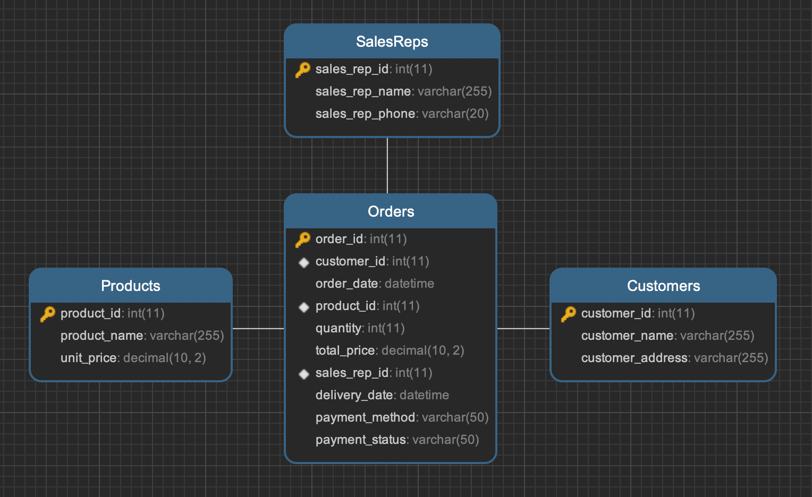

+++
title = '数据库设计范式'
date = 2024-08-28T22:08:43+08:00
draft = true
categories = [ "MySQL" ]
tags = [ "mysql" ]
+++

## 参考
https://xie.infoq.cn/article/e63302aa25e96b6985c295c9a?utm_campaign=geektime_search&utm_content=geektime_search&utm_medium=geektime_search&utm_source=geektime_search&utm_term=geektime_search
https://www.gatlin.io/content/database-normalization
https://dbgroup.cs.tsinghua.edu.cn/ligl/courses/slides03.pdf，https://www.bilibili.com/video/BV15u4y1Q71R/?p=3&vd_source=2558b7e1b8fac6da441bcddd415cbd0d （偏学术性的）
https://highscalability.com/the-mother-of-all-database-normalization-debates-on-coding-h/（范式与非范式的一些观点总结）

## 目标

* 你要试图搞清楚1NF、2NF、3NF的规范含义；
* 你要试图找到一种范式与非范式之间的平衡应用与日常开发。

## 题目
给定以下数据表，参考数据库设计范式进行结构优化，可以输出ER图或者表定义都行

表结构：
```sql
CREATE TABLE Orders (
    order_id INT PRIMARY KEY,                    -- 订单ID
    customer_name VARCHAR(255),                  -- 客户名称
    customer_address VARCHAR(255),               -- 客户地址
    order_date DATETIME,                         -- 订单日期
    product_id INT,                              -- 产品ID
    product_name VARCHAR(255),                   -- 产品名称
    quantity INT,                                -- 数量
    unit_price DECIMAL(10, 2),                   -- 单价
    total_price DECIMAL(10, 2),                  -- 总价
    sales_rep_id INT,                            -- 销售代表ID
    sales_rep_name VARCHAR(255),                 -- 销售代表名称
    sales_rep_phone VARCHAR(20),                 -- 销售代表电话
    delivery_date DATETIME,                      -- 交货日期
    payment_method VARCHAR(50),                  -- 支付方式
    payment_status VARCHAR(50)                   -- 支付状态
);
```

* 第一范式 (1NF)：确保每列都是原子的，不可再分。即数据表中的每个字段都只包含单一值。
* 第二范式 (2NF)：在满足1NF的基础上，所有非主键属性必须完全依赖于主键，而不是部分依赖。
* 第三范式 (3NF)：在满足2NF的基础上，非主键属性之间不能有传递依赖关系。

Orders 表有多个地方违反了第一范式 (1NF)、第二范式 (2NF) 和第三范式 (3NF)。比如：
第一范式要求每个字段都必须是原子的，不可再分。而Orders表中违反范式的表现为：
如果一个订单有多种产品，现在的表结构只能保存一种产品的信息。比如，如果一个客户同时购买了两种不同的产品，必须使用两行来表示，这会导致数据冗余

第二范式要求所有非主键属性必须完全依赖于主键，而不是部分依赖，上表中违反范式的表现为：、
customer_name、customer_address 和 sales_rep_name、sales_rep_phone 依赖于外键而不是订单ID，这些字段跟 order_id 没有直接关系，所以它们存在部分依赖

第三范式 要求非主键字段之间不能有传递依赖上表中违反范式的表现为：
某些字段依赖于其他非主键字段。例如：
sales_rep_name 和 sales_rep_phone 是通过 sales_rep_id 知道的，而 sales_rep_id 又是在 Orders 中。sales_rep_name 和 sales_rep_phone 并不是直接依赖于 order_id，而是经过 sales_rep_id 这个中介字段。他们存在传递依赖

优化后表结构如下：
```sql
-- Customers 表
CREATE TABLE Customers (
    customer_id INT PRIMARY KEY AUTO_INCREMENT,   -- 客户ID
    customer_name VARCHAR(255),                    -- 客户名称
    customer_address VARCHAR(255)                   -- 客户地址
);

-- Products 表
CREATE TABLE Products (
    product_id INT PRIMARY KEY AUTO_INCREMENT,     -- 产品ID
    product_name VARCHAR(255),                      -- 产品名称
    unit_price DECIMAL(10, 2)                       -- 单价
);

-- SalesReps 表
CREATE TABLE SalesReps (
    sales_rep_id INT PRIMARY KEY AUTO_INCREMENT,   -- 销售代表ID
    sales_rep_name VARCHAR(255),                   -- 销售代表名称
    sales_rep_phone VARCHAR(20)                    -- 销售代表电话
);

-- Orders 表
CREATE TABLE Orders (
    order_id INT PRIMARY KEY AUTO_INCREMENT,        -- 订单ID
    customer_id INT,                               -- 客户ID（外键）
    order_date DATETIME,                          -- 订单日期
    product_id INT,                               -- 产品ID（外键）
    quantity INT,                                 -- 数量
    total_price DECIMAL(10, 2),                   -- 总价
    sales_rep_id INT,                             -- 销售代表ID（外键）
    delivery_date DATETIME,                       -- 交货日期
    payment_method VARCHAR(50),                   -- 支付方式
    payment_status VARCHAR(50),                   -- 支付状态
    FOREIGN KEY (customer_id) REFERENCES Customers(customer_id),
    FOREIGN KEY (product_id) REFERENCES Products(product_id),
    FOREIGN KEY (sales_rep_id) REFERENCES SalesReps(sales_rep_id)
);

```



* 一个客户 (Customers) 可以有多个订单 (Orders)。
* 一个产品 (Products) 可以在多个订单 (Orders) 中被购买。
* 一个销售代表 (SalesReps) 可以负责多个订单 (Orders)。