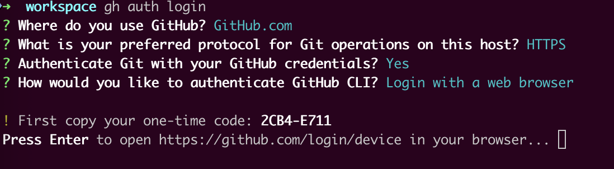
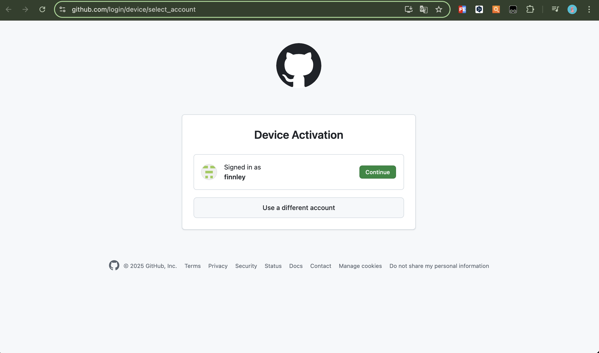
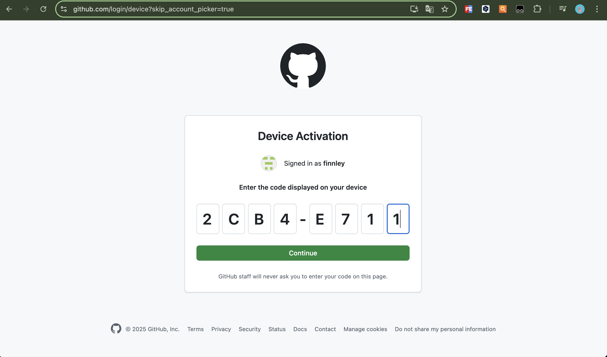
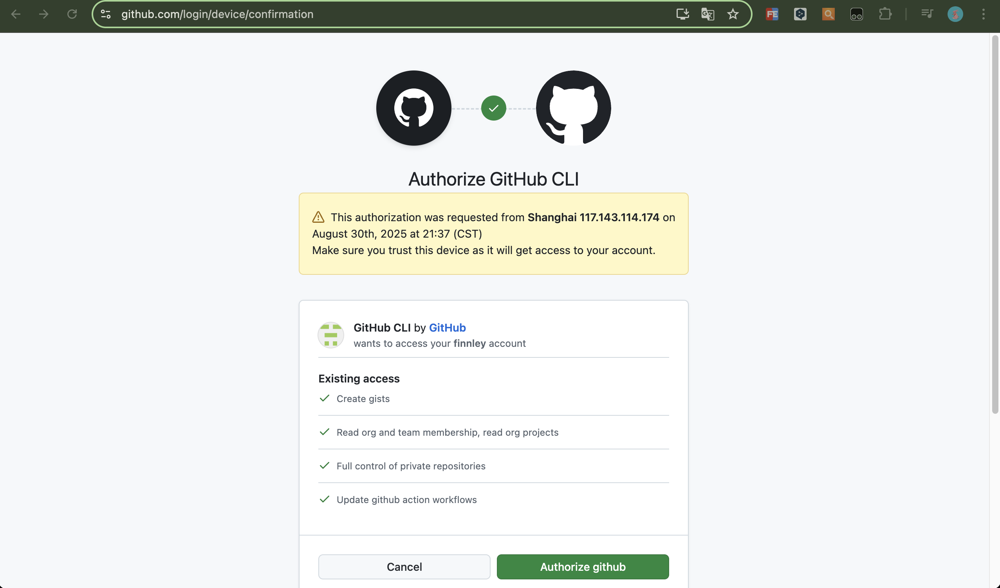
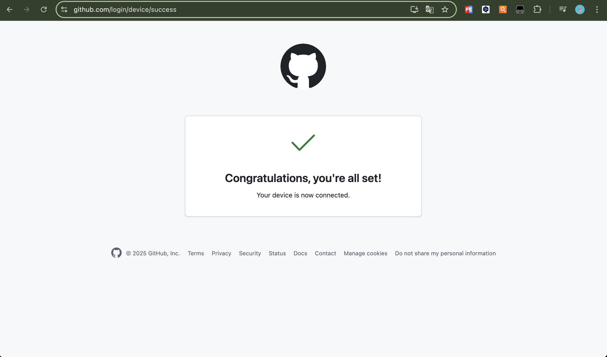
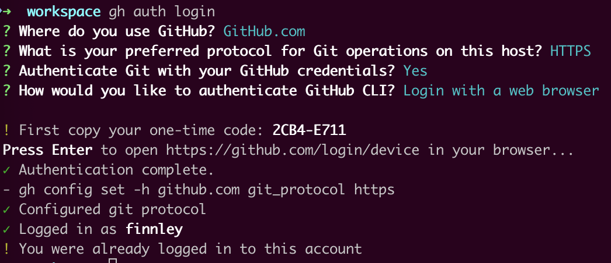
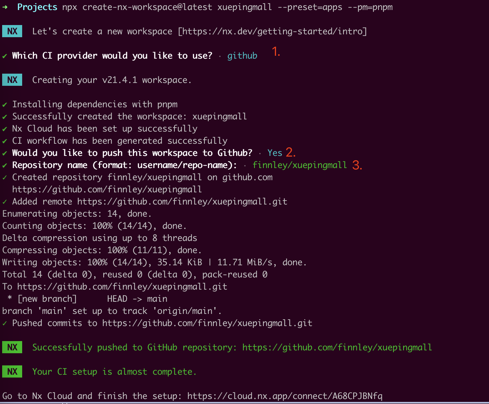
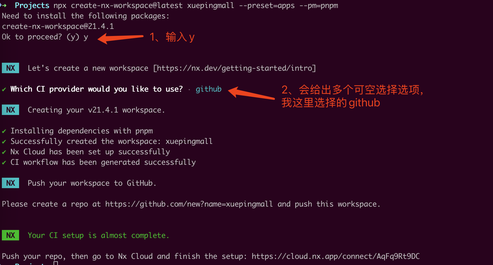

+++
title = '记一次使用Nx+PNPM搭建Monorepo项目'
date = 2025-08-30T18:52:25+08:00
draft = false
categories = [ "PM" ]
tags = [ "pm", "monorepo"]
+++

## 准备

```shell
brew install gh

sudo apt install gh -y
```













---

## 场景介绍

我有一个商城项目，项目包含一个Golang的后端项目、一个安卓项目、一个React的前端项目、未来可能还有微信小程序、公众号、IOS项目等项目。
我不想将所有的项目分别放到独立的仓库中，不方便我管理与查看，我想通过 Monorepo 来对这个商城项目进行管理。

**使用 Monorepo 带来的好处**

1. **统一管理与可见性**：我不再需要在不同的代码仓库之间来回切换。所有的项目都在一个地方，一目了然。这对于个人开发者或小团队来说，极大地降低了心智负担。

2.  **代码共享变得简单**：

      * **前后端代码共享**：我的 Golang 后端和 React 前端可能会共享一些数据结构（DTOs - Data Transfer Objects）或验证逻辑。在 Monorepo 中，我可以创建一个共享库，让前后端项目直接引用，而无需通过发布 npm 包或 Go module 来同步。
      * **跨端代码共享**：如果未来我的小程序和 App (Android/iOS) 需要共享一些业务逻辑、工具函数或 UI 组件（例如使用 React Native 或 Flutter），Monorepo 会让这种共享变得非常自然。

3.  **原子化的提交与重构**：

      * 假设我修改了一个后端 API。在一个提交 (commit) 中，我可以同时修改 Golang 的服务端代码、React 的前端请求代码以及 Android 的网络请求代码。这保证了代码库在任何时刻都是一致和可运行的，避免了因多个仓库更新不同步而导致的“破坏性变更”。
      * 当需要对某个核心功能进行跨项目重构时，我可以在 IDE 中轻松地进行全局搜索和替换，确保所有相关代码都被更新。

4.  **简化的构建与部署流程**：

      * 我可以设置一个统一的 CI/CD 流水线。当某个项目的代码发生变更时，智能的构建工具（如 Nx、Turborepo）可以只构建和部署受影响的部分。
      * 例如，只修改了 React 前端的代码，CI 只会重新构建和部署前端应用，而不会去触碰 Golang 或 Android 项目。

**管理工具的选择**

- Nx
- PNPM

## 安装 Nx

使用 `pnpm` 全局安装 `Nx`，类似于在使用仓库管理前先 安装 Git 一样。

```shell
pnpm add --global nx
```

## 搭建

### 1、创建工作空间

**创建空的 Nx Workspace**

我们将使用 create-nx-workspace 脚手架来初始化项目。这个命令会自动检测到 pnpm 并将其设置为包管理器。

打开终端，运行以下命令：

```shell
# `xuepingmall` 是你的项目名，可以替换
# `--preset=apps` 表示创建一个空的、适合添加多个应用的 workspace
npx create-nx-workspace@latest xuepingmall --preset=apps --pm=pnpm
```



完整过程如下：


创建完进入目录，结构如下：

```shell
➜  xuepingmall git:(main) tree
.
├── node_modules
│   ├── @nx
│   │   ├── js
│   │   └── workspace
│   └── nx
├── nx.json
├── package.json
├── pnpm-lock.yaml
└── README.md
```

网上有些教程说使用上面命令创建后会自动创建 `app` 目录和 `pnpm-workspace.yaml` 文件，但实际上并没有，但也不用担心，因为这些我们可以自己手动创建。

**添加目录**

在根目录 (xuepingmall/) 下，执行以下命令：

```shell
mkdir apps libs
```

- apps/：这个目录将用来存放所有“可独立部署的应用程序”，比如我的 React 前端、Golang 后端、Android App 等。
- libs/：这个目录将用来存放所有“可复用的代码库”，比如共享的工具函数、公共的 UI 组件、前后端通用的类型定义等。


### 2、添加项目

**添加后端统一项目目录**

为后端服务添加一个名为 `backend-core` 的目录，由于后端是微服务架构，所以这个目录下存放的一些微服务项目

```shell
mkdir apps/backend-core
```

**初始化Golang工作区**

```shell
cd apps/backend-core
go work init
```

**初始化第一个Golang微服务项目**

```shell
mkdir user-mgr
cd user-mgr
go mod init xuepingmall.com/user-mgr
```

**user-mgr加入到Go Workspace**
```
cd ../
go work use ./user-mgr 
```

此时会在 backend-core 目录下生成一个 go.work 的文件，内容如下：
```shell
✗ cat go.work
go 1.25.0

use ./user-mgr # 新增的Go服务被包含进来
```

**启动一个简单的Gin服务**

user-mgr/main.go 文件内容如下：

```go
package main

import (
	"net/http"

	"github.com/gin-gonic/gin"
)

func main() {
	r := gin.Default()
	r.GET("/ping", func(c *gin.Context) {
		c.JSON(http.StatusOK, gin.H{
			"message": "pong",
		})
	})
	r.Run(":8081") // listen and serve on 0.0.0.0:8081
}
```

### 3、注册项目至Monorepo

**注册**

在 app/backend-core/user-mgr 项目下新建 project.json 文件：
```json
{
  "name": "user-mgr",
  "$schema": "../../../node_modules/nx/schemas/project-schema.json",
  "root": "apps/backend-core/user-mgr",
  "sourceRoot": "apps/backend-core/user-mgr",
  "projectType": "application",
  "tags": ["scope:backend-core", "lang:go"],
  "targets": {
    "build": {
      "executor": "nx:run-commands",
      "options": {
        "command": "cd {projectRoot} && go build -o ../../dist/user-mgr ."
      },
      "outputs": ["{workspaceRoot}/dist/user-mgr"]
    },
    "serve": {
      "executor": "nx:run-commands",
      "options": {
        "command": "cd {projectRoot} && go run ."
      }
    },
    "test": {
      "executor": "nx:run-commands",
      "options": {
        "command": "cd {projectRoot} && go test ./..."
      }
    }
  }
}

```

这个文件明确地告诉 Nx：

有一个名为 user-mgr 的项目。

它的 build 命令是 go build ...。

它的 serve 命令是 go run .。

**验证**
在你完成了上述操作后，如何确认 Nx 已经成功识别了你的所有项目呢？

运行以下命令：

```shell
➜  xuepingmall git:(main) ✗ nx show projects
user-mgr
➜  xuepingmall git:(main) ✗
```

或者，一个更酷的方式是查看项目依赖图：

```shell
nx graph
```

### 4、启动项目

**检查 pnpm Workspace 配置**

如果没有则在项目根目录下新建 `pnpm-workspace.yaml` 文件，内容如下：
```yaml
packages:
  - 'apps/*'
  - 'libs/*'

```

**启动**

在根目录下执行下面命令：
```shell
nx serve user-mgr
```


进入xuepingmall:
```
git remote add backend_repo_local /Users/finnley/workspace/Projects/AI-Family/Observatory

git subtree add --prefix=apps/backend-core backend_repo_local main

git remote remove backend_repo_local
```

### 5、添加一个前端项目

**手动创建一个 Vite + React 项目**

使用一下命令创建一个名为 `web-frontend` 的前端项目

```shell
cd apps
pnpm create vite@latest
```

执行完后会在 `apps` 目录下出现一个名为 `web-frontend` 目录。


**注册项目至Monorepo**

在 `web-frontend` 目录下新建 project.json 文件：
```json
// apps/web-frontend/project.json
{
  "$schema": "../../node_modules/nx/schemas/project-schema.json",
  "name": "web-frontend",
  "sourceRoot": "apps/web-frontend/src",
  "projectType": "application",
  "tags": ["type:frontend", "framework:react"],
  "targets": {
    "serve": {
      "executor": "nx:run-commands",
      "options": {
        "command": "pnpm dev",
        "cwd": "apps/web-frontend"
      }
    },
    "build": {
      "executor": "nx:run-commands",
      "options": {
        "command": "pnpm build",
        "cwd": "apps/web-frontend"
      },
      "outputs": ["{workspaceRoot}/apps/web-frontend/dist"]
    },
    "preview": {
      "executor": "nx:run-commands",
      "options": {
        "command": "pnpm preview",
        "cwd": "apps/web-frontend"
      }
    },
    "lint": {
      "executor": "nx:run-commands",
      "options": {
        "command": "pnpm lint",
        "cwd": "apps/web-frontend"
      }
    }
  }
}
```


这个配置文件做了什么？

name: 定义了项目的唯一名称，就是 web-frontend。

targets: 定义了一系列可以对这个项目执行的“任务”。我们把您 package.json 里的 scripts 脚本映射到了这里：

serve: 对应 pnpm dev，用于启动开发服务器。

build: 对应 pnpm build，用于生产环境构建。

preview: 对应 pnpm preview，用于预览构建后的产物。

lint: 对应 pnpm lint，用于代码检查。

executor: "nx:run-commands": 告诉 Nx，执行这些任务的方式就是简单地运行一个 shell 命令。

cwd: "apps/web-frontend": 确保命令在正确的项目目录下执行。

outputs: (非常重要) 在 build 任务中，我们告诉 Nx 构建产物会输出到 apps/web-frontend/dist 目录。这使得 Nx 的缓存功能可以生效。当您第二次构建且代码无变化时，Nx 会直接从缓存中读取结果，速度极快。

**在根目录安装依赖**

现在您的 web-frontend 项目有了新的依赖（react, vite 等），我们需要让 pnpm workspaces 来统一管理它们。

回到您 Monorepo 的根目录（xuepingmall/），然后运行安装命令：

```shell
# 确保在 my-org/ 目录下
pnpm install
```

这个命令会：

读取 pnpm-workspace.yaml，发现 apps/web-frontend 是一个新的工作区成员。

读取 apps/web-frontend/package.json 中的 dependencies 和 devDependencies。

将所有依赖项下载并链接到根目录的 node_modules 文件夹中。

更新根目录的 pnpm-lock.yaml 文件。

第三步：使用 Nx 命令运行您的项目
恭喜您，所有配置都已完成！现在您可以像操作 Monorepo 中任何其他项目一样来操作您的新 React 应用了。

在根目录下运行以下命令：

启动开发服务器:

```
nx serve web-frontend
```

（这背后实际执行的是 pnpm dev）

构建项目:

Bash

nx build web-frontend
（这背后实际执行的是 pnpm build）

代码检查:

Bash

nx lint web-frontend
（这背后实际执行的是 pnpm lint）

预览构建产物:

Bash

nx preview web-frontend
（这背后实际执行的是 pnpm preview）

