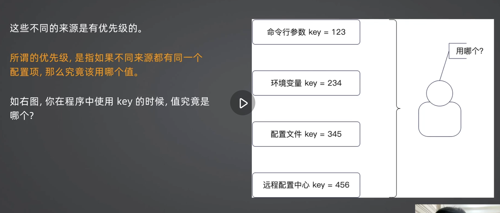

+++
title = '配置模块.md'
date = 2025-09-02T14:09:54+08:00
draft = false
categories = [ "PM" ]
tags = [ "pm"]
+++

## 准备

根据配置来源分类：

- 启动参数：某一次运行的参数。最为典型的是命令行工具，会要求你传入各种参数，例如mockgen中传递的source、destination等参数
- 环境变量：和具体的实力有关参数。比如实力的权重、实例的分组信息等
- 配置文件L一些当下环境中所需要的通用配置，比如我们的数据库连接信息等
- 远程配置中心：它和配置文件可以说是互补，除了启动程序所需的最少配置，剩下的配置都可以放在远程配置中心。

建议：少用启动参数，因为对新人门槛较高；少用环境变量，因为你只有登录上机器才知道参数的值，比较麻烦；优先使用配置文件，大规模微服务集群可以考虑引入远程配置中心。
引入远程配置中心就说明需要投入更多的资源，比如部署、维护，引入了远程配置中心之后，实际上可用性下降了，引用的第三方软件越多，可用性越低。就像引用了redis，可用性也降低了，

像这种就是启动参数，也叫命令行参数，
环境变量：zshrc
远程配置中心一定是要通过网络进行连接哦配置中心才能拿到配置。

## 配置来源的优先级

该使用哪一个呢？

## 远程配置二次加载

## Viper