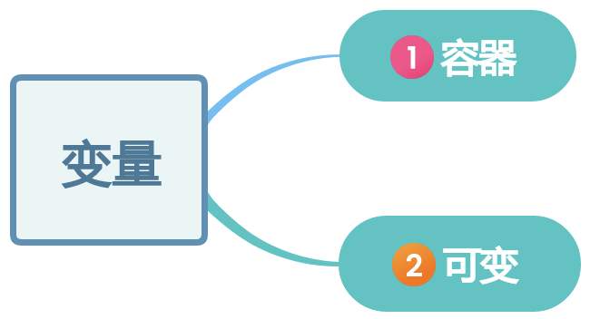

+++
title = '一、编程筑基——变量'
date = 2025-11-13T20:54:57+08:00
draft = true
categories = [ "Programming" ]
tags = [ "programming" ]
+++

找了个编程的书，在那死磕，今天就学到了一个概念，叫“变量”

哇，与它有关的概念有，赋值、读取、访问。幸好才3个，要是多了还要我怎么记住他们呀，他们太专业了，太高大上了，半天都没记住这些词。

看了半天，我是这么理解变量的：

它就是我的我刚办理的建行的银行卡，生活中他有个名字叫银行卡，编程里面它就是变量。

银行卡能做什么呢？
1. 存钱
2. 取钱
3. 利息变动

我们该如何认识一个概念、一个事物、一个东西、一个知识点

# 1 变量

## 1.2 何为变量？

### 1.2.1 容器

编程中，变量充当的是容器的概念。为理解`容器`这一概念，切勿仅限于装水的杯子、盛饭的瓷碗，我们可以将眼界放大一点，思维扩散一点。

如：

- 宰相肚里能撑船，宰相肚肚，容器也。
- 海纳百川，有容乃大，江河湖海，容器也。
- ······

世间万物，凡能容纳外物者皆为容器也。

故在编程中，变量这一容器中可以是名字、邮箱、手机号码等信息，也可以是一个人的综合信息（里面包含了他的照片、手机、身份证、性别、住址等多个单一信息构成的综合信息），总之，只要你能想到的，都可以装进变量中。

### 1.2.2 可变

之前说了，变量是个容器，这里拿一碗盛了米饭的碗做比喻，你的碗可以再吃完一碗后再添一碗，当然你也可能吃不下，划了半碗饭给你的父母。

编程中，变量中的内容是可以变化的，随时可被覆盖的，当你把新值放进去，旧值就彻底消失了，找不回来那种，就像你吃完一碗，有往里面添加了一碗，之前的那一碗饭被吃了，吐不出来了。

### 1.2.3 类型限制

虽说变量是个可以盛放东西的容器，但它却很挑食哦。

就像你的碗是容器，它是盛饭的却不是用来装屎的；你的花花肠子是用来装屎的却不是用来想事的；你的脑子是容器，装的知识不是装的浆糊······

编程中，变量中比如存放的硬币（数字），但你硬要塞纸条（文字），这往往是不允许的。

## 1.2 如何使用？

在现实世界中，你要使用一个工具，首先这个工具得切实存在，它不可能凭空出现，当工具被设计出来，我们还需要为其命名，然后再去使用。变量也是一样，当我们需要使用一个变量时，首先需要为变量取个有意义的名字。

### 1.2.1 声明

要使用一个变量被定义出来，需要为其取个有意义的名字，就像你生下来后你的服务为你取了个有名字一样。

**变量名**：

- 由字母、数字、下划线（_）组成，且只能以字母开头。
- 区分大小写。
- 取名时要见名知意。

# 常量

**常量名**：
- 由字母、数字、下划线（_）组成，且只能以字母开头。
- 区分大小写。
- 取名时要见名知意。

# 数据类型

-----

变量
常量
数据对象
表达式
常量表达式
字符
空字符
字符常量
字符串常量
字符串字面值：用双引号括起来的0个或多个字符组成的字符序列。
字符属性
编译时求值
运行时求值
声明
声明语句：说明变量的名字及类型，也可以指定变量的初值。

# 🔔 第一步：我们来认识“变量”

想象一下，你有一个**带标签的储物盒**。

* 这个盒子是空的。
* 你在盒子上贴了一张标签，写上“**我的零花钱**”。

在编程里，这个“带标签的盒子”就叫做一个**变量**。
* 盒子上的**标签（“我的零花钱”）**，就是**变量的名字 (Variable Name)**。
* 盒子里**装的东西**，就是**变量的值 (Value)**。

# 🚀 第二步：我们来使用这个“盒子”

现在，我们来用这个盒子做点事。

1.  **存东西（赋值）**
    你妈妈给了你 10 块钱，你把这 10 块钱放进了这个叫“我的零花钱”的盒子里。
    * **在编程里，这叫“赋值” (Assignment)**。
    * 现在，“我的零花钱”（变量名）这个盒子里，装的是“10”（值）。

2.  **查看盒子里有（读取）**
    你弟弟问你：“你现在有多少钱？”
    你打开“我的零花钱”这个盒子，看了一眼，告诉他：“我有 10 块。”
    * **在编程里，这叫“读取”或“访问” (Read / Access)**。
    * 你只是**看了一眼**，盒子里的 10 块钱**还在**，没有少。

3.  **换个东西（核心！它为什么叫“变”量）**
    第二天，你表现很好，妈妈又给了你 20 块。你决定把这些钱都存起来。
    你怎么做？
    你打开“我的零花钱”盒子，把里面**原来的 10 块钱拿出来**，然后把**新的 20 块钱放进去**。

    * 现在，盒子的**标签没变**，还是叫“我的零花钱”。
    * 但是，盒子里**装的东西变了**，从 10 变成了 20。

这就是“变量”这个词的由来。**“变”** 的意思是它里面装的**值**是可以**改变**的。

# 🤔 第三步：发现问题并简化（费曼学习法的关键）

用“盒子”来打比方很好，但有一个地方不太准确，我们来修正一下，让理解更清晰。

**刚才的比方有什么问题？**
在第 3 步里，我说“把 10 块钱拿出来，再把 20 块钱放进去”。在真实的电脑里，它更像是在做“**擦掉重写**”。

**一个更好的比喻：带标题的小白板**

想象一下，“变量”不是一个盒子，而是一块**挂在墙上的小白板**。

* 小白板**顶上的标题**（比如“我的零花钱”）就是**变量的名字**。这个标题是永久的，不能改。
* 小白板**正中间写的字**，就是**变量的值**。

我们再来看看刚才的操作：

1.  **存东西（赋值）**
    你在这块叫“我的零花钱”的小白板上，用笔写下了数字“**10**”。

2.  **查看（读取）**
    你弟弟问你多少钱。你俩都抬头看了一眼小白板，看到上面写着“10”。
    （注意：看一眼并不会擦掉上面的字。）

3.  **换东西（重新赋值）**
    妈妈给了你 20 块。你走到小白板前，**拿起板擦，把“10”擦掉了**，然后在同一个地方**重新写上了“20”**。

这个“小白板”的比喻更贴切，因为它解释了：
* 一个变量在**同一时间只能有一个值**（小白板上只能写一个数）。
* 当你存入一个新值时，旧的值就**被覆盖了（被擦掉了）**，永远消失了。

---

### 总结：“变量”到底是什么？

所以，如果现在有人问你什么是“变量”，你可以这样告诉他：

> “变量”就是电脑给一块内存空间起的一个**外号**（就像小白板的标题）。
>
> 我们可以用这个外号，往里面**存一个值**（比如数字 10），这个操作叫“赋值”。
>
> 我们可以随时**查看**它现在存的是什么（读取），也可以**擦掉**旧的值，**换个新值**存进去（重新赋值）。
>
> 它的主要作用，就是**帮我们的程序记住一个会发生变化的信息**，比如游戏里的“得分”，或者网站上的“当前用户名”。

你觉得这个解释够简单易懂吗？

我们可以继续聊聊“变量”的其他方面，比如为什么它需要“类型”（比如有的盒子只能装数字，有的只能装文字），或者你可以再提一个你想学的新概念。

---

好的，我们继续！这次的概念是“**常量**” (Constant)。

---

### 🔔 第一步：从“变量”到“常量”

还记得我们上次聊的“**变量 (Variable)**”吗？我们说它就像一块**小白板**：

* 它有一个标题（变量名）。
* 你可以在上面写一个值（比如 “10”）。
* 最关键的是，你可以**随时擦掉**旧的值，**重写**一个新的值（比如改成 “20”）。

现在，我们来聊聊“**常量 (Constant)**”。这个词听起来就和“变量”相反，对吧？

### 🚀 第二步：认识“常量”的比喻

如果说“变量”是一块可以擦写的小白板，那么“**常量**”就像是……

一块**刻在石头上的字**。

想象一下：

1.  **刻上内容（“一次性”赋值）**
    你拿到一块空白的石碑，上面有个标题，叫“**一周有几天**”。
    你拿起凿子，非常郑重地在上面刻下了数字：“**7**”。

2.  **查看内容（读取）**
    和小白板一样，任何人都可以随时过来“读取”这块石碑。
    “嘿，一周有几天？”
    “石碑上写着呢，是 7。”
    你可以看它一千次、一万次，它永远是 7。

3.  **试图修改（失败！）**
    现在，你突然想：“我能不能把它改成 8 ？”
    你拿着凿子和锤子，想在“7”上面再刻一个“8”。
    * **办不到！** *
    一旦你刻上了“7”，这件事就**定死了**。你无法修改它，无法擦除它，也无法在上面覆盖一个新的数字。它被**“恒定”**下来了。

这就是“**常量**”：
* 它也有一个名字（比如“一周有几天”）。
* 它也有一个值（比如 “7”）。
* 但是，它的值**一旦被设定，就永远不能再改变了**。

### 🤔 第三步：我们为什么需要这块“石头”？（费曼学习法的关键）

你可能会问：“编程不就是为了灵活吗？为什么我非要用一个‘不准改’的东西？这不给自己找麻烦吗？”

这其实**不是麻烦**，而是一种**保护机制**。

想象一下，你正在写一个非常非常大的程序（比如一个游戏），这个程序里有很多地方都需要用到“圆周率 Pi” (π) 这个数字，大约是 3.14159。

**不好的做法（用“变量”）**：
你用了一块“小白板”（变量），在上面写了 `pi = 3.14159`。
你和你的几百个同事都在用这个 `pi` 来计算圆的面积、周长等等。

**危险在哪里？**
万一有个同事（或者三个月后的你自己）在程序的某个角落里，不小心**擦掉了**这个值，把它改成了 `pi = 3`（比如他想取个整数），会发生什么？

**灾难！**

整个游戏里所有的圆都变形了！轮子不再圆了，子弹的弹道也全错了。而且最可怕的是，你都不知道是哪块代码“擦掉”了你的小白板。

**好的做法（用“常量”）**：
你拿来一块“石碑”（常量），在上面刻下 `PI = 3.14159`。
你告诉所有人：“都用这块石碑上的数字！”

现在，如果那个糊涂的同事（或者你自己）试图修改它，程序会立刻**大声报错**：“警告！警告！你正在试图修改一块‘石碑’！这是‘常量’，不准改！”

程序在编译或运行时就会立刻阻止这个错误，你的游戏就安全了。

---

### 总结：“常量”到底是什么？

所以，如果现在有人问你什么是“常量”，你可以这样告诉他：

> “常量”就像一个**只能写一次的“变量”**。
>
> 它也一个有名字和值的“储物盒”。但区别是，你把一个值（比如 3.14159）放进去**并“锁上”**之后，你就**再也打不开这个盒子来换东西了**。
>
> 我们用它来**保护**那些我们**绝对不希望被意外修改**的重要数值，比如圆周率 (PI)、一天的小时数 (24) 、或者游戏里的最大生命值 (100)。这是一种让代码更安全、更清晰的手段。

---

我们已经聊了“小白板”（变量）和“石头雕刻”（常量）。接下来你想聊哪个概念呢？