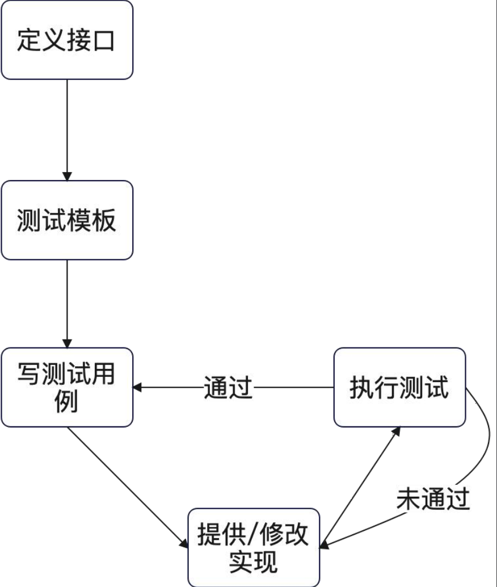

+++
title = 'TDD测试驱动开发'
date = 2025-11-16T22:04:31+08:00
draft = true
categories = [ "Programming" ]
tags = [ "programming", "go" ]
+++

# 测试驱动开发

在掌握了撰写单元测试和集成测试之后，我们现在从

测试开始出发，也就是尝试 TDD。

TDD：测试驱动开发。大明简洁版定义：先写测试、再写实现。
• 通过撰写测试，理清楚接口该如何定义，体会用户使用起来是否合适。
• 通过撰写测试用例，理清楚整个功能要考虑的主流程、异常流程。

TDD 专注于某个功能的实现。
PS：非正统理论，正统理论太难用。