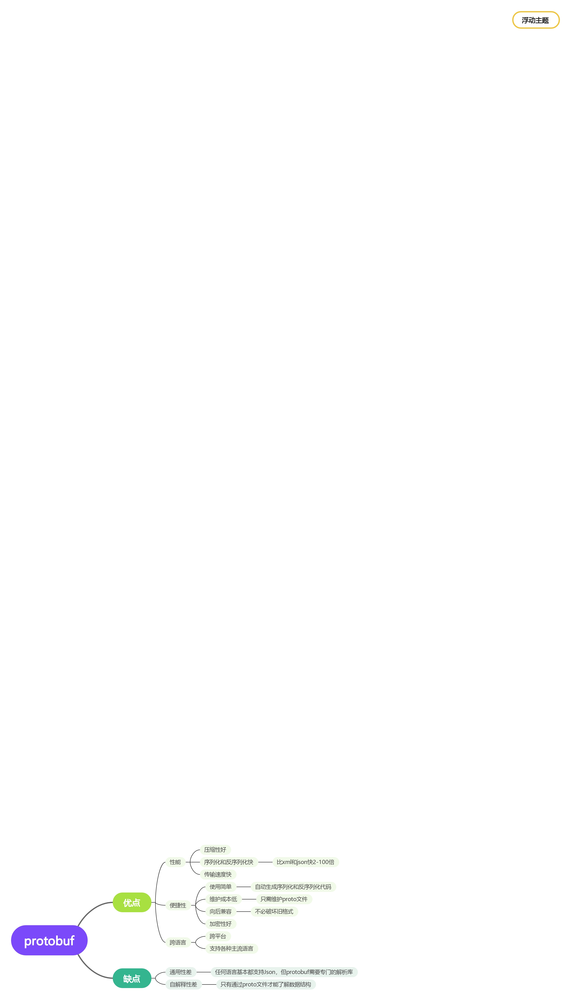

+++
title = '什么是grpc'
date = 2020-09-06T08:23:10+08:00
draft = true
categories = [ "Programming" ]
tags = [ "rpc", "grpc", "go", "python", "programming" ]
+++

# 什么是gRPC

gRPC 是一个高性能、开源和通用的 RPC 框架，面向移动和 HTTP/2 设计。目前提供 C、Java 和 Go 语言版本，分别是：grpc, grpc-java, grpc-go. 其中 C 版本支持 C, C++, Node.js, Python, Ruby, Objective-C, PHP 和 C# 支持。

https://github.com/grpc/grpc

# 什么是Protobuf

java中的dubbo dubbo/rmi/hessian messagepack 如果你懂了协议完全有能力自己去实现一个协议

- 习惯用 Json、XML 数据存储格式的你们，相信大多都没听过Protocol Buffer
- Protocol Buffer 其实 是 Google出品的一种轻量 & 高效的结构化数据存储格式，性能比 Json、XML 真的强！太！多！
- protobuf经历了protobuf2和protobuf3，pb3比pb2简化了很多，目前主流的版本是pb3



# Protobuf 体验

## Python

**安装**

```python
#安装grpc
pip3 install grpcio
#安装grpc tools
pip3 install grpcio-tools
```

**Protobuf3**

protobuf3 是有自己专门的定义格式:
```proto
syntax = "proto3";

message HelloRequest {
  string name = 1;
}
```

服务间通信只能发送 message 类型，所以发送消息之前需要先定义 message。

**生成proto的python文件**

```shell
python3 -m grpc_tools.protoc --python_out=. --grpc_python_out=. --pyi_out=. -I. helloworld.proto
```

- grpc_tools.protoc 表示python 使用的 grpc_tools 工具的 protoc 命令
- python_out 表示生成的proto使用的文件放在哪里，`.` 表示当前目录
- --grpc_python_out 表示生成的 grpc 使用的文件放在哪里，`.` 表示当前目录
- -I. helloworld.proto 表示在哪里去找 helloworld.proto文件，I 表示 input，`.` 表示当前目录

命令执行后会在当前目录下生成两个文件，一个是 `_pb2.py` 结尾的文件，一个是 `_pb2_grpc.py` 结尾的文件

**查看protobuf生成的代码**

```python
from grpc_test import helloworld_pb2

request = helloworld_pb2.HelloRequest()

request.name = "bobby"
req_str = request.SerializeToString()
print(req_str)

request2 = helloworld_pb2.HelloRequest()

request2.ParseFromString(req_str)
print(request2.name)
```

# GRPC 体验

