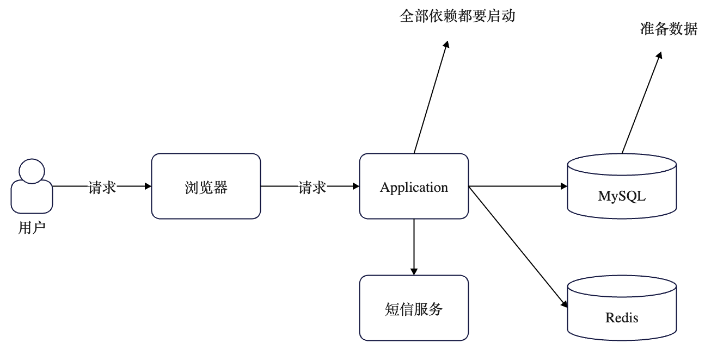
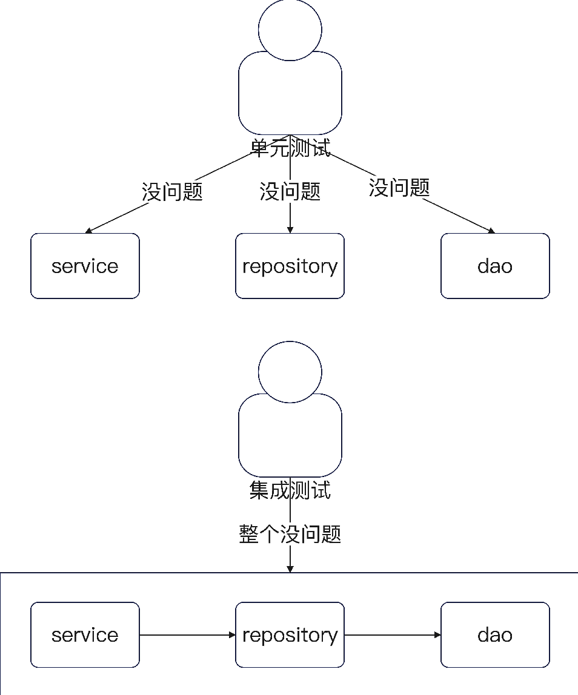
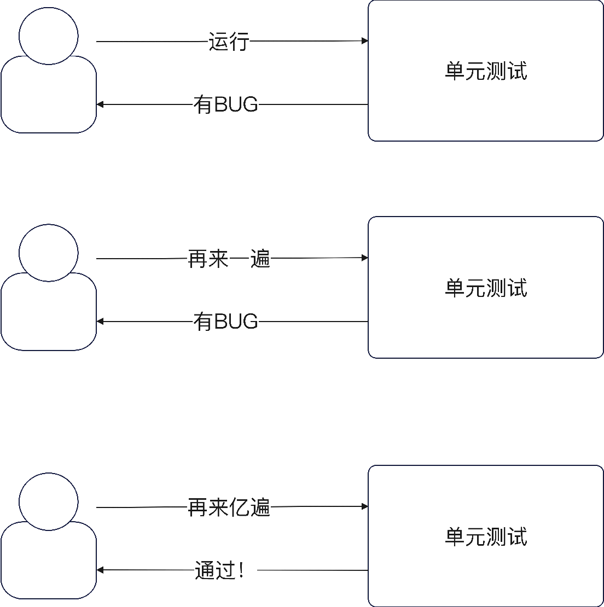
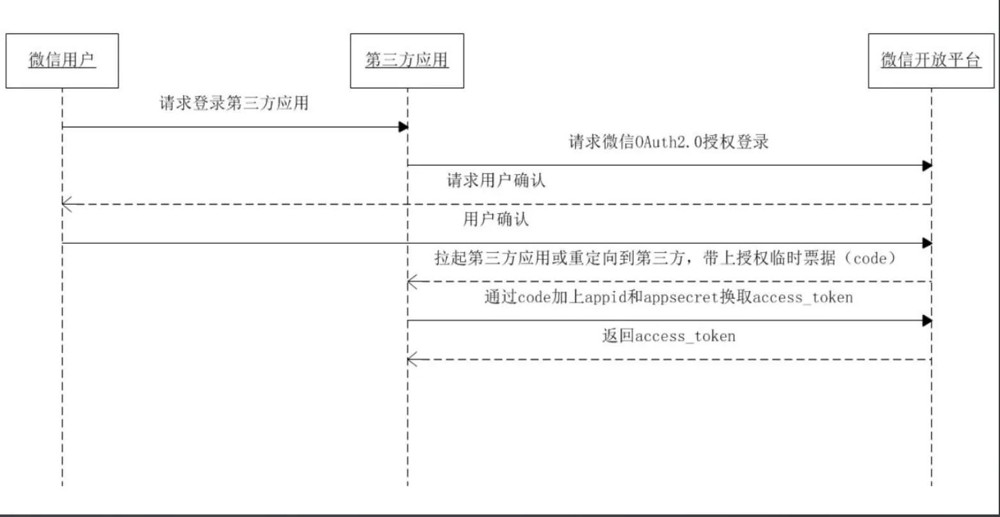
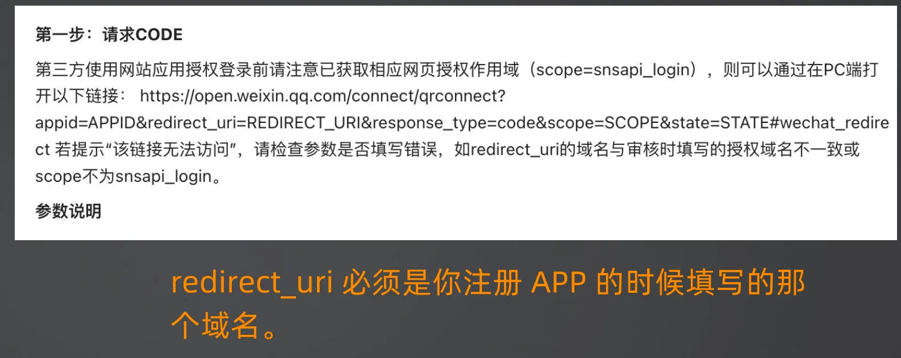
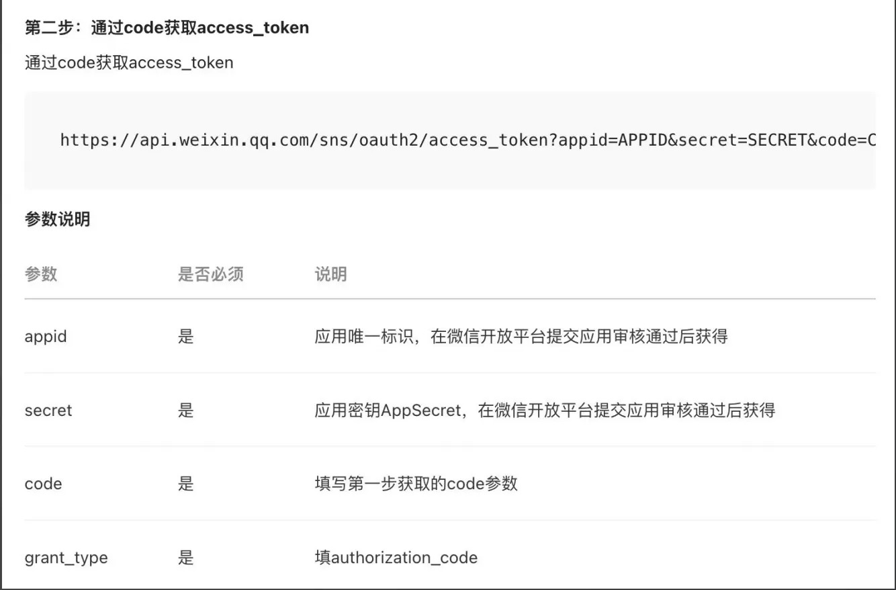
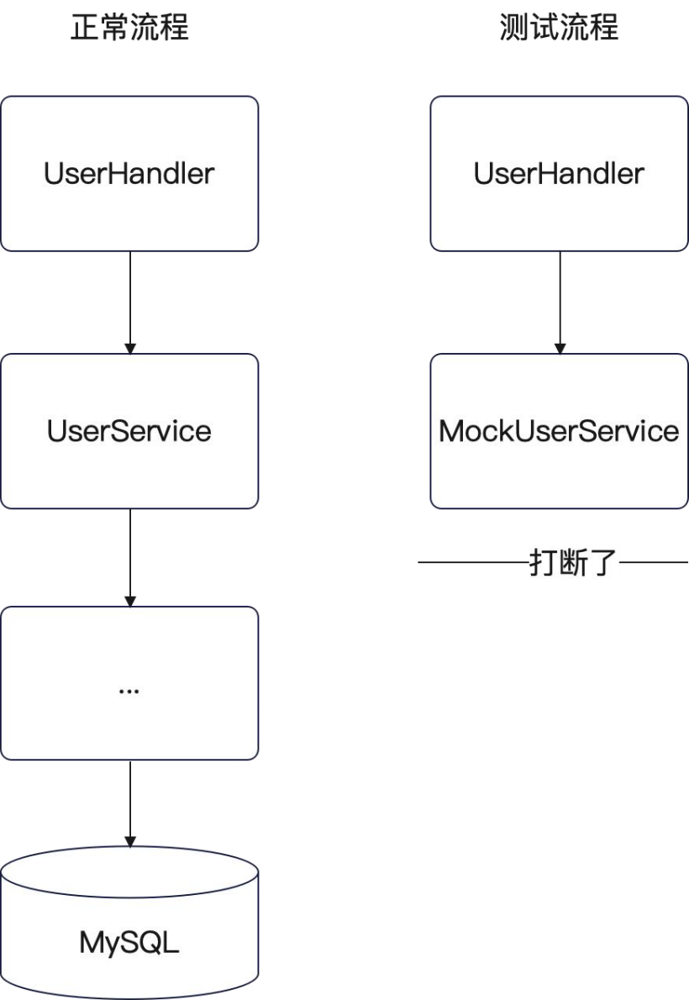

+++
title = '单元测试'
date = 2025-08-29T02:13:50+08:00
draft = true
categories = [ "Programming" ]
tags = [ "programming", "go" ]
+++

# 单元测试

看上去代码很多，不要被吓到，其实它就是一个非常强悍的模板，学习单元测试就是学习如何套用模板。

学习单元测试，不要局限于如何写代码，而是着重学习模板的使用，用例的设计。

# 现状

假设当前应用现状如下：


这种测试非常困难，需要将整个应用启动，还需要启动MySQL、Redis，然后再通过浏览器或Postman来发送请求，通过这种方式来测试非常麻烦，但凡修改一点代码就需要就需要重启应用。

当前图中的应用还比较简单，如果是大型应用，这种方式的测试效率可想而知，非常低下。

**如何解决呢**



正常的业务开发之后的测试流程，都是先单元测试，后集成测试。

- 单元测试：针对每一个方法进行的测试，单独验证每一个方法的正确性。
- 集成测试：多个组件合并在一起的测试，验证各个方法、组件之间配合无误。

所以我们要先搞单元测试，单元测试初步验证之后，再集成测试。单元测试验证了各个方法的基本逻辑之后，集成测试就比较少问题了。

# 单元测试



单元测试讲究的是快速测试、快速修复。

- 测试该环节中的业务问题，比如说在写测试的时候，发现业务流程设计得不合理。
- 测试该环节中的技术问题，比如说 nil 之类的问题。

单元测试，从理论上来说，你不能依赖任何第三方组件。也就是说，你不能使用 MySQL 或者 Redis。如右图，要快速启动测试，快速发现 BUG，快速修复，快速重测。


## 在 Go 中编写单元测试

在 Go 中编写单元测试，很简单：

- 文件名以 _test.go 结尾。
- 测试方法以 Test 为开头。
- 测试方法只接收一个参数： t *testing.T。

可以在 IDE 中直接运行。注意，你同样可以用这个来写集成测试、冒烟测试、回归测试，都可以。

## IDE 直接运行单元测试

如果你的测试方法签名没错的话，就能看到这个绿色图标，点击就能看到很多选项。

最主要的是：
- Run：运行模式，直接运行整个测试。
- Debug：Debug 模式，你可以打断点。
- Run xxx with Coverage：运行并且输出测试覆盖率。
- 其它 Profile 都是性能分析，很少用。
除非你要看测试覆盖率，不然都用 Debug。

# Table Driven 模式
Go 里面，惯常的组织测试的方式，都是用 Table
Driven。
Table Driven 的形式如右图。主要分成三个部分：
• 测试用例的定义：即每一个测试用例需要有什么。
• 具体的测试用例：你设计的每一个测试用例都在这
里。
• 执行测试用例：这里面还包括了对测试结果进行断
言。
注意，你要优先使用 Table Driven，但是不用强求。
你把测试用例定义看做是列名，每一个测试用例就是
一行数据，就能理解 Table Driven 这个含义了。

# 测试用例定义
我总结的测试用例定义，最完整的情况下应该包含：
• 名字：简明扼要说清楚你测试的场景，建议用中文。
• 预期输入：也就是作为你方法的输入。如果测试的是定
义在类型上的方法，那么也可以包含类型实例。
• 预期输出：你的方法执行完毕之后，预期返回的数据。
如果方法是定义在类型上的方法，那么也可以包含执行
之后的实例的状态。
• mock：每一个测试需要使用到的 mock 状态。单元测试
里面常见，集成测试一般没有。
• 数据准备：每一个测试用例需要的数据。集成测试里常
见。
• 数据清理：每一个测试用例在执行完毕之后，需要执行
一些数据清理动作。集成测试里常见。
最完整的意思是：如果你要测试的方法很简单，那么你用
不上全部字段。


# 测试Handler

## HTTP 接口测试

主要记录的事对 Handler 的测试，该测试代码的难点在于：
- 构造 HTTP 请求：Handler 的方法都是处理 HTTP 请求的，所以我们得想办法构造 HTTP 请求
- 验证 HTTP 响应：Handler 的方法返回的响应都是 HTTP 响应，所以我们也需要考虑验证 HTTP 响应

下面是一段关于注册的 Handler 逻辑代码：

```go
func (u *UserHandler) SignUp(ctx *gin.Context) {
	type SignUpReq struct {
		Username string `json:"username"`
		Email    string `json:"email"`
		Password string `json:"password"`
	}

	var req SignUpReq
	// Bind 会根据 Content-Type 来解析数据到 req 里面
	// 如果解析错会直接写会 400 的错误
	if err := ctx.Bind(&req); err != nil {
		return
	}
	fmt.Printf("%v\n", req)

	ok, err := u.emailExp.MatchString(req.Email)
	if err != nil {
		ctx.String(http.StatusOK, "系统错误1")
		return
	}
	if !ok {
		ctx.String(http.StatusOK, "你的邮箱格式不正确")
		return
	}

	ok, err = u.passwordExp.MatchString(req.Password)
	if err != nil { // invalid or unsupported Perl syntax
		// TODO 记录日志
		ctx.String(http.StatusOK, "系统错误2")
		return
	}
	if !ok {
		ctx.String(http.StatusOK, "密码必须大于8位，包含数字、特殊字符")
		return
	}

	// 调用下 service的方法
	{
		err = u.svc.SignUp(ctx, domain.User{
			Username: req.Username,
			Email:    req.Email,
			Password: req.Password,
		})
		if err == service.ErrUserDuplicateEmail {
			ctx.String(http.StatusOK, "邮箱冲突")
			return
		}
		if err != nil {
			ctx.String(http.StatusOK, "系统异常")
			return
		}
	}

	ctx.String(http.StatusOK, "注册成功")
}
```

从上面的代码会发现几个特点：
- 看到存在很多的错误处理分支
- 各种错误码的处理
- 没有返回值，也就无法判断到底是从哪个分支返回的

想一下，没有返回值那该如何判断呢？虽然方法没有返回值无法判断从哪里返回，但是仔细看看会发现每个分支的返回都有写响应。所以测试的时候可以测试方法的响应与我预期的是否一致来判断，比如我想测试下面这个逻辑：
```go
if !ok {
	ctx.String(http.StatusOK, "你的邮箱格式不正确")
	return
}
```
那么我预期的就是返回 “你的邮箱格式不正确” 这样的响应。那么接着要思考的问题就是既然这就是我的预期，那我该如何拿到这些预期响应呢？下面就是解决这样的问题。

## 步骤

首先先搭建一个测试的框架：
```go
func TestUserHandler_SignUp(t *testing.T) {
	testCases := []struct {
		name string
	}{}

	
	for _, tc := range testCases {
		t.Run(tc.name, func(t *testing.T) {
			// TODO 如何拿到响应
		})
	}
}
```

### 构造HTTP请求

需要明确我们要解决的问题是如何拿到响应？

按照我们的代码的实现思路，从 Handler 开始写测试代码。

Handler 测试代码的难点在于：
- 构造 HTTP 请求：Handler 的方法都是处理 HTTP 请求的，也就是我们得想办法构造 HTTP 请求。
- 验证HTTP 响应：Handler 的方法返回的响应都是 HTTP 响应，这就导致我们也需要考虑验证 HTTP 响应。

看下面的代码：
```go
...
if err := ctx.Bind(&req); err != nil {
		return
	}

```
说明我们需要考虑构造请求，也就是输入。

```go
ok, err := u.emailExp.MatchString(req.Email)
	if err != nil {
		ctx.String(http.StatusOK, "系统错误1")
		return
	}
```
这里存在一个响应，也就是这里写会了响应之后，我们要拿回响应，然后判断是否是我们所需要的HTTP响应，


所以方式就是可以先从HTTP测试的开始。构造请求与响应实际对应的就是单元测试的预期输入与输出。预期输入实际上就是我们输入的注册请求，预期输出就是我们希望它注册成功与否的结果，如果不成功，我们希望知道它失败的原因。



这里对应的就是预期输入和输出。

接口测试时还是单元测试，没有必要真的要经过网络发起HTTP请求，而是应该考虑使用编程的手段，来构造HTTP请求。

比如上图，我们可以通过控制HTTP方法、URL和传入的Body，构造出任何一种情况。

```go
func TestUserHandler_SignUp(t *testing.T) {
	testCases := []struct {
		name string
	}{}

	// 1、构造请求
	req, err := http.NewRequest(http.MethodPost, "/users/signup", bytes.NewBuffer([]byte(`
{
	"email": "123@test.com",
	"password": "123456"
}
`)))
	// 上面是我构造的情况，怎么可能有error，所以可写成下面一定没有error，所以我构造的请求要求一定没有error
	require.NoError(t, err)

	for _, tc := range testCases {
		t.Run(tc.name, func(t *testing.T) {
			// 如何拿到响应
		})
	}
}

```

构造请求会返回两个参数，一个是req，一个是err，什么情况下会产生Error呢？参数错误。这时就好奇了，我自己构造的请求怎么会有Error呢，对于这种情况，我们可以通过 `require.NoError(t, err)` 来要求一定没有error，处理完后就可以继续后面的处理了。

至此请求构造完成。


### 获得响应



想象一下我们正常的响应，就是原始的通过网络传输的响应，他是怎么实现的呢？它就好比一根水管，一端往里面注水，经过水管流通，另一端就会立刻出水，网络请求时一端数据一往里写，另一端就可以获取拿到了展示在浏览器上。

现在呢？单元测试中，就像一个罐子，我先将数据往里面写，然后盛放一会（类似端走处理），等到目的地后再从罐子里拿出来。这里响应的过程就是将数据从罐子里拿出来的过程。

这里盛放数据的是什么东西呢？在单元测试中可以看做是 httptest 包里面提供的一个东西，也就是 httptest.Recoder



```go
func TestUserHandler_SignUpLearn(t *testing.T) {
	testCases := []struct {
		name string
	}{}


	// 构造请求
	req, err := http.NewRequest(http.MethodPost, "/users/signup", bytes.NewBuffer([]byte(`
{
	"email": "test@test.com",
	"password": "123456"
}
`)))

	// 上面是我构造的情况，怎么可能有error，所以可写成下面一定没有error
	require.NoError(t, err)

	// 构造响应
	resp := httptest.NewRecorder()


	for _, tc := range testCases {
		t.Run(tc.name, func(t *testing.T) {
			// 如何拿到响应
		})
	}
}
```

在resp的响应里面有HTTP Code 还有 Header、Body 等，我们验证预期输出实际上就是在验证Code 和Body。

### 怎么解决 UserHandler 的初始化问题？


现在还剩下一个问题，就是 UserHandler 在初始化的时候，是需要传入 UserService 和 CodeService 的，怎么办？
如果单元测试也要构造这两个 Service，岂不是得一路构造到 DAO，然后就需要在数据库中准备数据？不，解决思路是，使用 mock 工具来生成测试用的模拟UserService 和 CodeService。

### 启动服务

现在已经构造了请求，也就是类似客户端已经准备好调用指定接口的准备工作了，就差服务端了，在单元测试中如何启动服务端的HTTP服务呢？如何将接口的路由注册到服务中呢？

在正常代码中需要先先执行 NewUserHandler ，然后再之上注册路由。于是写下下面内容

```go
func TestUserHandler_SignUpLearn(t *testing.T) {
	testCases := []struct {
		name string
	}{}

	// 1、构造server
	server := gin.Default()
	// 这里用不到codeSvc
	h := NewUserHandler(nil, nil)
	h.RegisterRoutes(server)

	// 2、构造请求
	req, err := http.NewRequest(http.MethodPost, "/users/signup", bytes.NewBuffer([]byte(`
{
	"email": "test@test.com",
	"password": "123456"
}
`)))
	req = req
	// 上面是我构造的情况，怎么可能有error，所以可写成下面一定没有error
	require.NoError(t, err)

	// 3、构造响应
	resp := httptest.NewRecorder()
	resp = resp


	for _, tc := range testCases {
		t.Run(tc.name, func(t *testing.T) {
			// 如何拿到响应
		})
	}
}
```

NewUserHandler需要两个参数，这里暂时使用两个nil填充，但显然是不可以传入nil的，否则在执行时出现panic，那该如何处理呢？

显然也不能去NewService，因为NewService 也需要参数，也不能传入nil，这又是出现同样的问题，然后可能又在于NewRepository，NewDao，初始化DB，就这样为了解决nil的问题就这样陷入了死循环。

此时就会使用到一个叫 mock 的工具

```shell
go install go.uber.org/mock/mockgen@latest
```

所以现在可以这样写：
```go
func TestUserHandler_SignUpLearn(t *testing.T) {
	testCases := []struct {
		name string
	}{}

	// 1、构造server
	server := gin.Default()
	// 这里用不到codeSvc
	h := NewUserHandler(nil, nil)
	h.RegisterRoutes(server)

	// 2、构造请求
	req, err := http.NewRequest(http.MethodPost, "/users/signup", bytes.NewBuffer([]byte(`
{
	"email": "test@test.com",
	"password": "123456"
}
`)))
	req = req
	// 上面是我构造的情况，怎么可能有error，所以可写成下面一定没有error
	require.NoError(t, err)

	// 3、构造响应
	resp := httptest.NewRecorder()
	resp = resp

	// 4、启动服务
	// 这就是HTTP请求GIN框架的入口，这里GIN会处理这个请求，响应会写会resp
	server.ServeHTTP(resp, req)

	assert.Equal(t, http.StatusOK, resp.Code)
	assert.Equal(t, "注册成功", resp.Body.String())

	for _, tc := range testCases {
		t.Run(tc.name, func(t *testing.T) {
			// 如何拿到响应
		})
	}
}

```

由于存在不同的测试场景，所以需要改写如下，把上面逻辑放入到for中：
```go
func TestUserHandler_SignUp(t *testing.T) {
	testCases := []struct {
		name     string
		mock     func(ctrl *gomock.Controller) service.UserService
		reqBody  string
		wantCode int
		wantBody Result
	}{
		
	}

	for _, tc := range testCases {
		t.Run(tc.name, func(t *testing.T) {
			ctrl := gomock.NewController(t)
			defer ctrl.Finish()

			// 如何拿到响应?
			// 1、构造server
			server := gin.Default()
			// 提取到 匿名结构体切片中
			//userSvc := svcmocks.NewMockUserService(ctrl)
			//codeSvc := svcmocks.NewMockCodeService(ctrl)
			// 这里用不到codeSvc
			h := NewUserHandler(tc.mock(ctrl), nil)
			h.RegisterRoutes(server)

			// 2、构造请求
			req, err := http.NewRequest(http.MethodPost, "/users/signup", bytes.NewBuffer([]byte(tc.reqBody)))
			// 上面是我构造的情况，怎么可能有error，所以可写成下面一定没有error
			require.NoError(t, err)
			req.Header.Set("Content-Type", "application/json")

			// 3、构造响应
			resp := httptest.NewRecorder()

			// 4、启动服务
			// 这就是HTTP请求GIN框架的入口，这里GIN会处理这个请求，响应会写会resp
			server.ServeHTTP(resp, req)
			assert.Equal(t, tc.wantCode, resp.Code)
			assert.Equal(t, tc.wantBody, resp.Body.String())
		})
	}
}

```

对于每一个测试用例就构造一个请求和响应，从而进行测试。