+++
title = '发帖功能'
date = 2025-11-16T20:04:31+08:00
draft = true
categories = [ "Programming" ]
tags = [ "programming", "go" ]
+++

# 需求分析

有些公司，或者有些产品会使用用例(use case）来展示某个需求的具体场景。下图是整个发帖子的用例图。

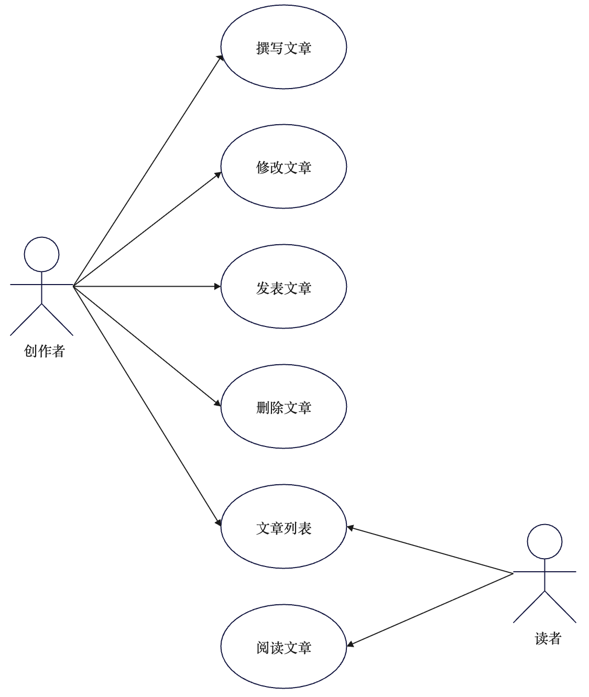

对于创作者来说，差不多可以总结为增删改查。对于读者来说，就只有一个查。将来还会扩展一些功能，但是目前来说我们不需要考虑。

# 需求分析：内容对读者的可见性

接下里你要想清楚一个问题：创作者创作了一篇文章之后，什么情况下，其它读者能够看到？很显然，你会觉得当然得“发表”之后才对读者可见。

也就是说，创作者在创作的时候，不管如何修改，只要没发表，读者就看不到。

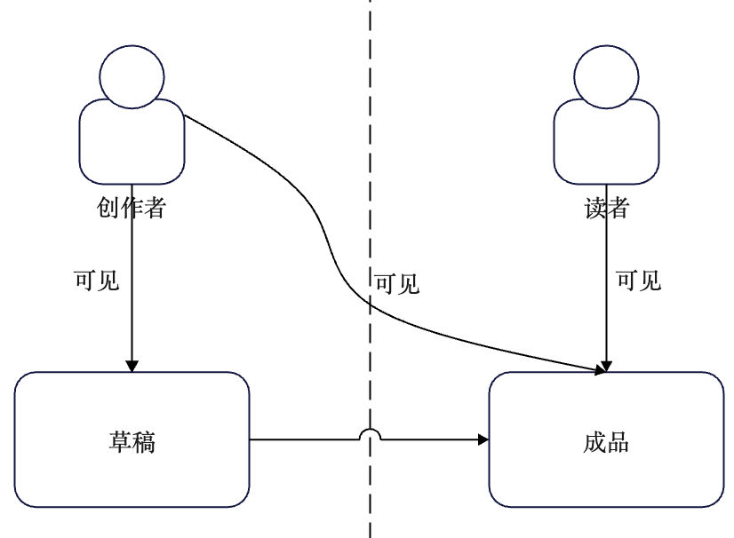

# 需求分析：帖子状态分析

在你意识到了有发表这一个动作之后，你就意识到，帖子自身应该存在一个“是否已经发表”的状态。更进一步，你会意识到，这里需要分析一下整个帖子的状态。
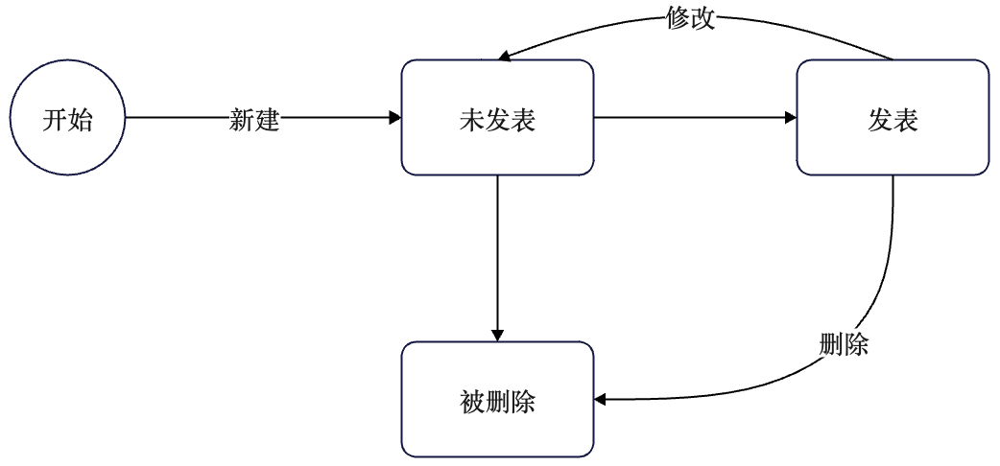

# 需求分析：一边修改一边可查看怎么办？

紧接着，你需要考虑：
- 从状态图上来看，一个已经发表过的帖子，还能修改。
- 在修改的时候，读者还能不能看到上一个发表的版本？
- 如果能，怎么做到读者一边查看，创作者一边修改，

两不干扰的？

很显然，当下的内容生产平台，都可以做到允许创作者修改，但在创作者发布之前，这些修改对读者都是不可见的。

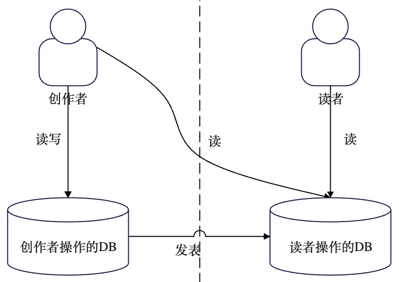

# 需求分析：删除是真删除还是假删除？

而后，剩下一个问题，是否允许创作者删除某篇文章？
- 创作者会不会想让已发表的某篇帖子某个时刻对外不可见，仅自己可见？
- 创作者会不会想真的彻底删除某个帖子？

这里我就直接两个功能都提供。

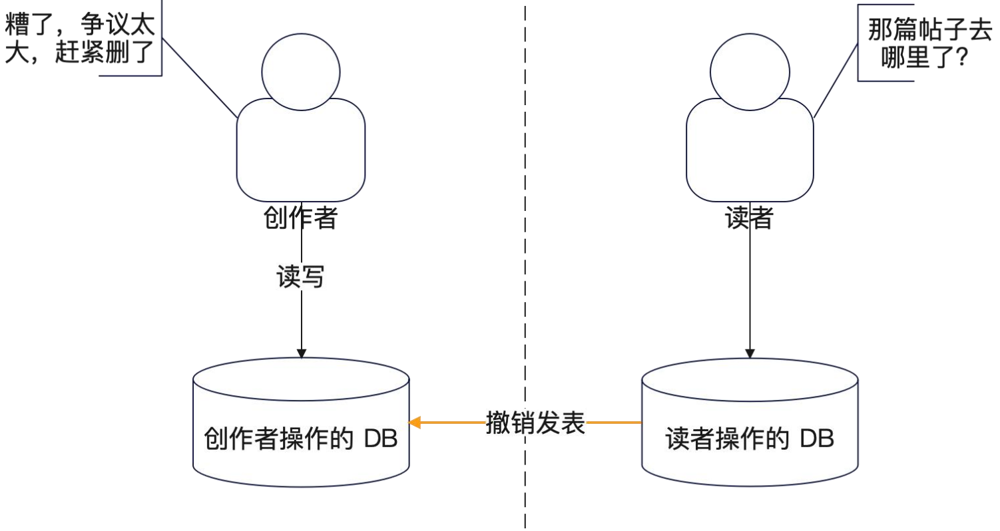

# 状态图
整理前面的内容，可以大致上画出来右图
这种状态图。
PS：没有严格遵循 UML 规范。

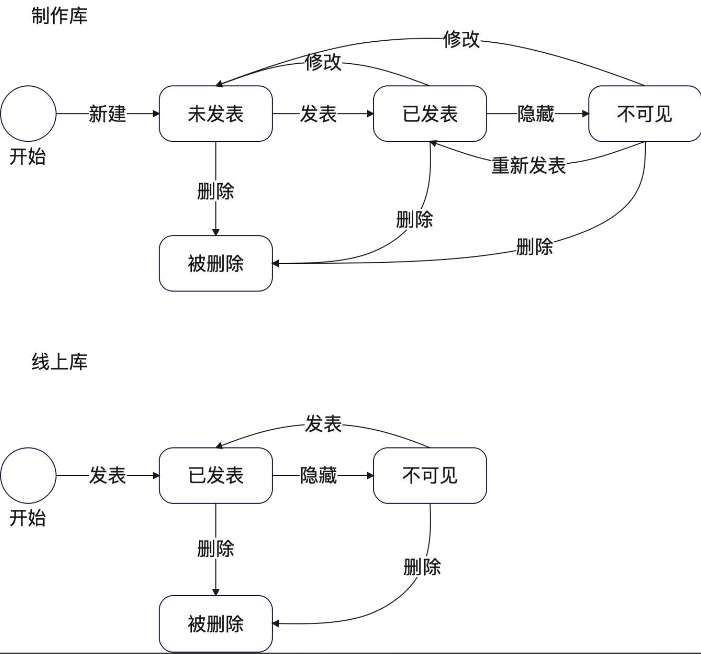

# 流程：创作者新建一个帖子

创作者新建一个帖子是最简单的流程。

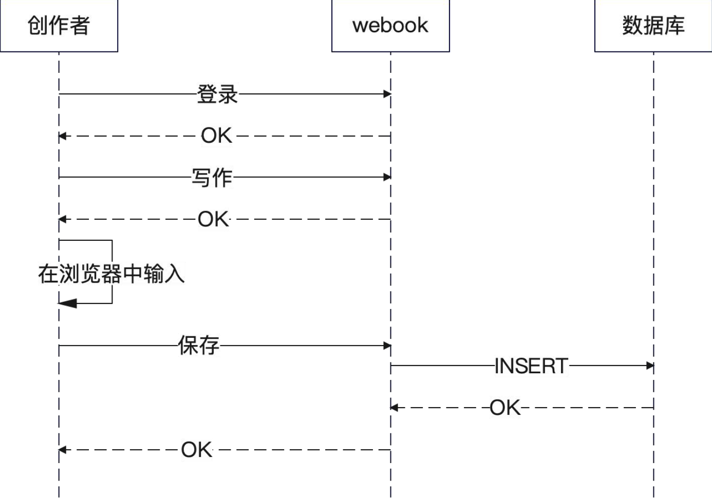

# 流程：创作者修改并且保存
这个流程和上一个流程差不多，最为关键的一步都是保存。

因此我们就要考虑：
- 新建一个文章之后保存。
- 已有的文章修改之后保存。
是否要共用一个接口？如果共用，怎么区别是新建还是更新？

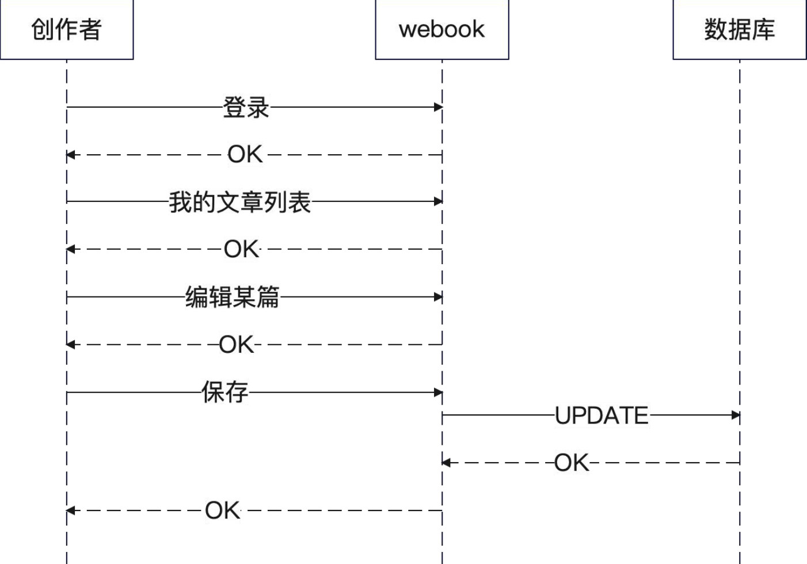

# 流程：创作者发表文章 情况1
创作者发表文章的核心：
- 先保存到制作库。
- 同步数据到线上库。
右图是完全新建，直接发表。
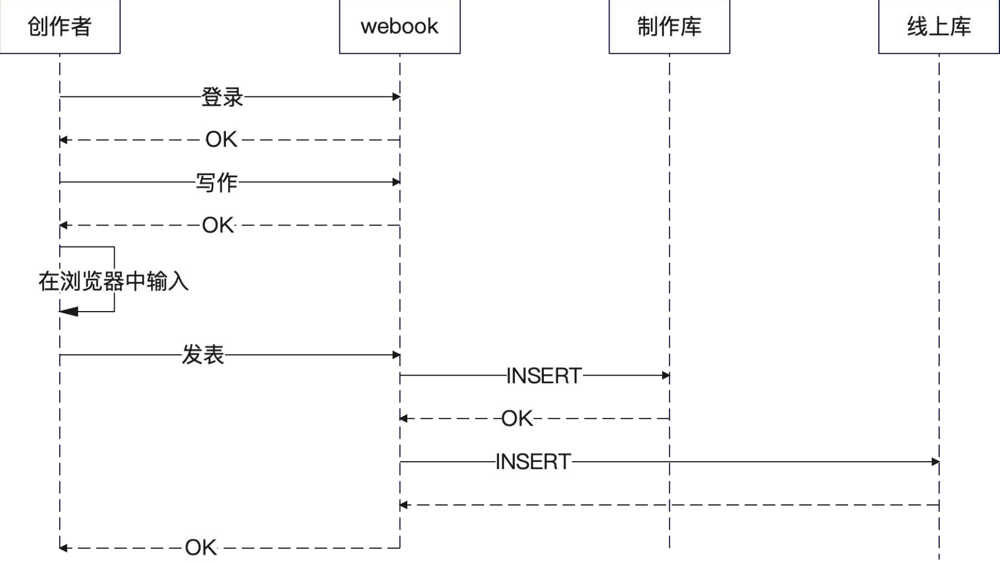

# 流程：创作者发表文章 情况2
下图是更新某篇文章之后，发表。这是第一次发表。

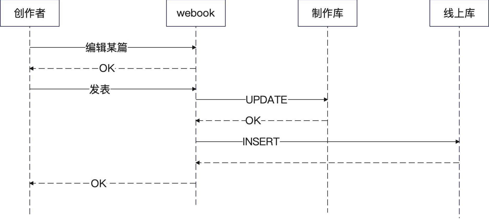

# 流程：创作者发表文章 情况3
下图是修改已发表的文章之后，再次发表。

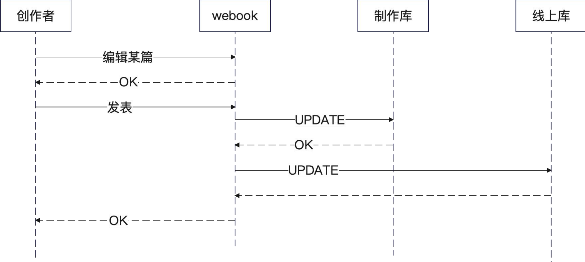