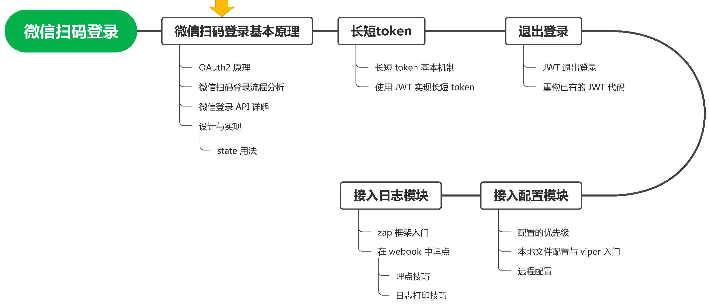
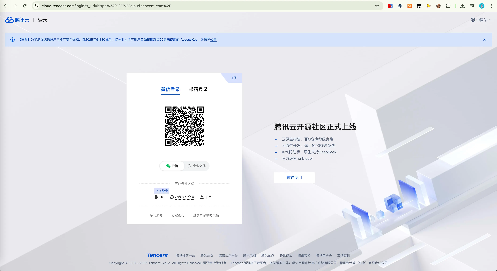
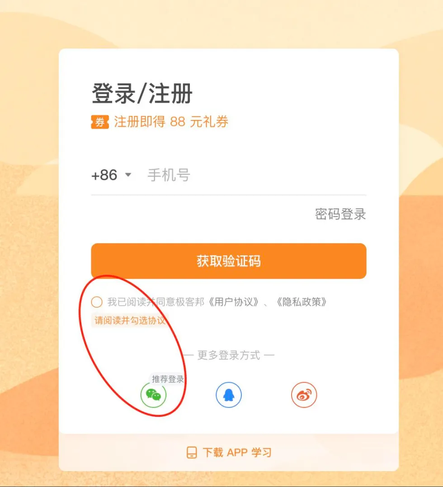
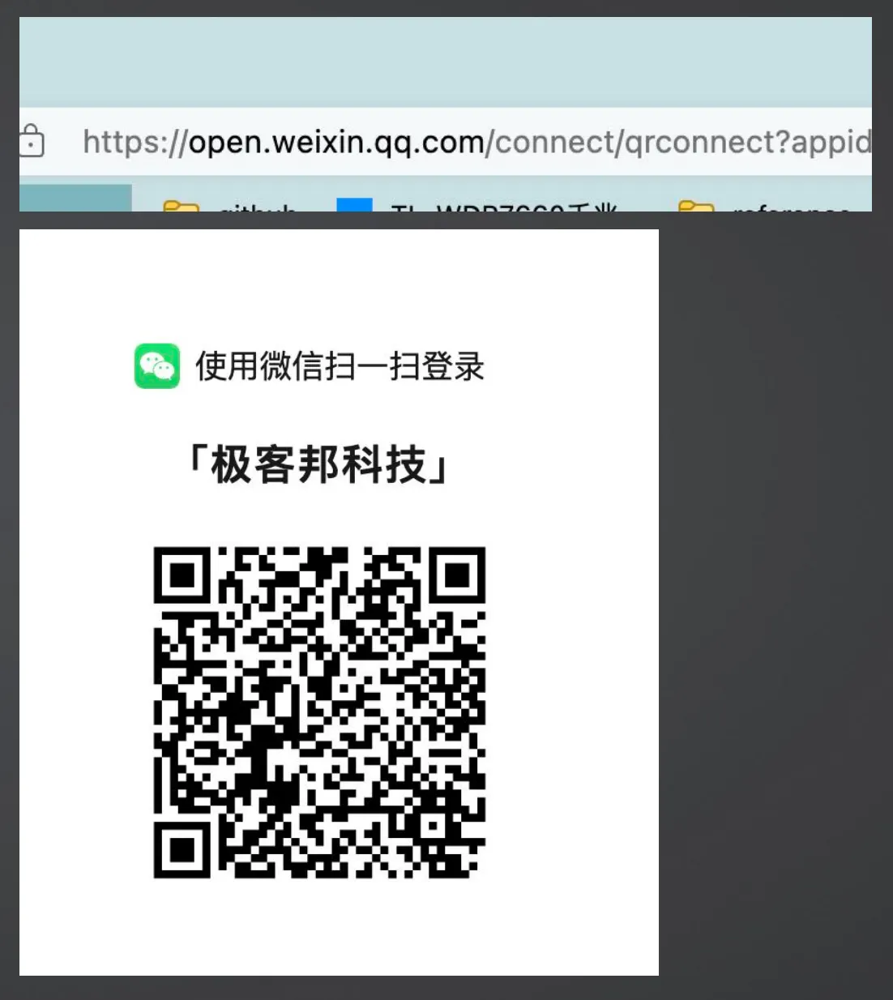
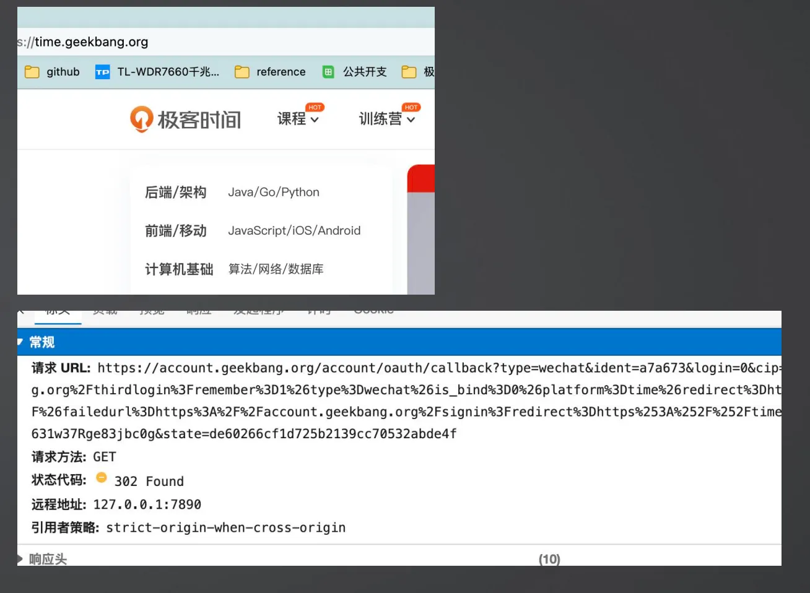
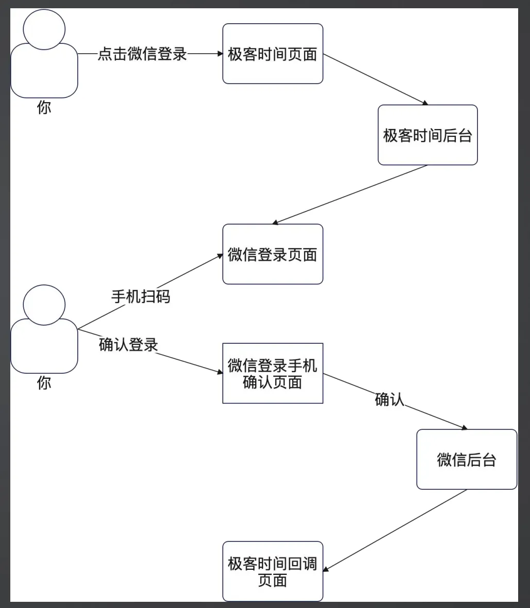
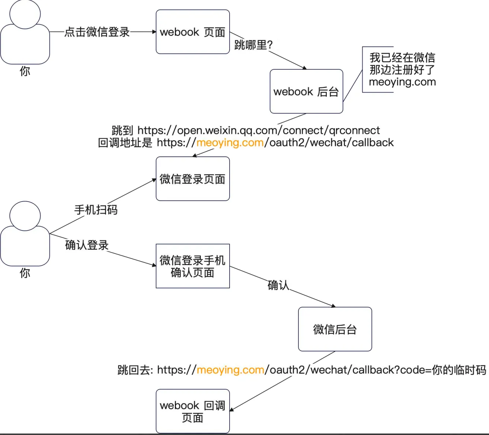
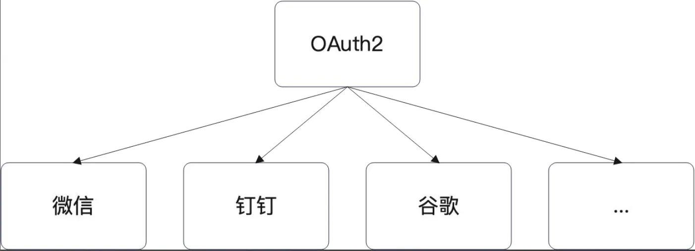
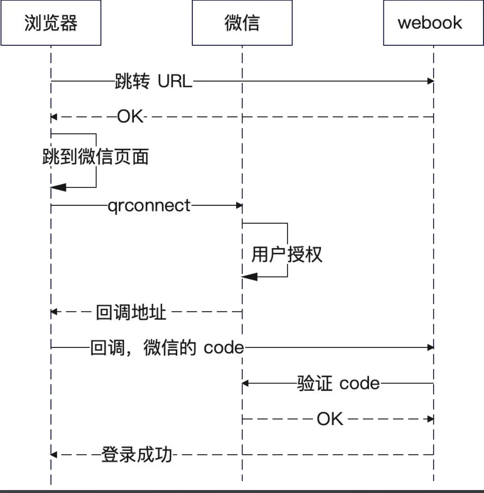
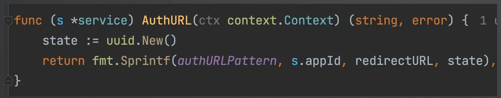

+++
title = '微信扫码登录.md'
date = 2025-11-13T20:54:57+08:00
draft = true
categories = [ "Programming" ]
tags = [ "programming" ]
+++

见 Notion 【微信扫码登录】

微信扫码登录实际上用的是 OAuth2 的原理，算不上是SSO。OAuth2会了也就会了SSO，因为SSO算是一种简化版的 OAuth2，可以理解 SSO 是只有登录权限的 OAuth2。

## 微信扫码登录流程

你也可以把这个部分理解为参考竞品。这里以极客时间为例。右边是极客时间的登录页面。其中的关键点是你需要点击同意用户协议和隐私政策。

### 扫码登录页面

而后你跳转到了这个页面。注意，这个页面是微信的页面，而不是极客时间的页面。
也就是说，扫码这个动作，是在微信下完成的。

浏览器地址栏中的地址为 https://open.weixin.qq.com  ，这就可以确定已经到了微信那边，是在微信那边扫码的。归根结底我们扫的码是微信生成的，而且扫码、登录这一整套流程都是在微信这边完成的，这个过程实际上已经离开了应用方，跑到微信这边了。

### 扫码之后跳转

当你扫码点击确认之后，跳转回了极客时间。当然，从网络你能够看到，其实是先跳到了极客时间的一个地址，再跳到了它的首页。
右下图就是第一跳的地址。

扫码之后又如何从微信回到应用网站的呢？

在我们扫码后微信点击确认后又跳回来了。

### 极客时间流程

总体上就是三步：
- 点击微信登录，跳转到微信页面。问题是：跳转过去的 URL 是什么？
- 微信扫码登录，确认登录。
- 微信跳转回来。问题是：跳转回来的 URL是什么？
这些问题，都要从微信 API 里面去寻找答案

## 微信扫码登录 API

再来看看微信扫码登录 API，看看官方是怎么说的。

这一步就有点像短信登录那里，你要先去了解一下短信 API 是怎么用的。

微信扫码登录其实是一个 OAuth2 授权过程。简单来说，就是你作为用户授权第三方应用获得了对应的 access_token，第三方应用就认为你登录了。

在大多数场景下，第一次登录的时候还会尝试获取你的用户信息。

1、请求登录第三方应用，第三方应用指的是谁？比如这里指的就是极客时间。

2、请求微信 OAuth2.0 授权登录，这个过程就是在点击扫码按钮后跳转到微信的二维码页面的过程。

3、请求用户确认，这是是用户扫码这个动作这一确认过程

4、用户确认，这是扫完码之后用户在手机上点击确认这一过程

5、拉起······，这一过程是我们在确认完之后，电脑浏览器页面跳转回第三方应用的过程。 这一过程会带上授权的临时票据

6、接着第三方应用汇拿着临时票据去请求微信开放平台换区token

7、微信开放平台给我们token后返回，说明我们登录成功了。

我们如何理解这一过程呢？重点是抓住两次跳转。一次是调换到微信平台扫码，另一个是再从微信平台跳转回来。调回来是会携带临时授权码。所以最关键的一切就是要成功那会临时授权码。拿到授权码后再去微信换去token。

这一过程就像是去问微信开放平台，我能不能向你拿一点信息，能就表示登录成功，不能就表示登录失败。

### 跳转过去的微信 URL

这第一步就是对应从极客时间跳转过去的那一步。
可以从右图中看到，你需要构造一个 URL，里面带上这些参数：
- appid：你在微信开放平台上注册的 ID。
- redirect_uri：不出所料，这个就是微信跳回来的地址。
- response_type：固定为 code。
- scope：OAuth2 中声明你要什么权限，这里是要登录权限，固定为 snsapi_login。
- state：一个随机数，后面我们再讨论。

https://developers.weixin.qq.com/doc/oplatform/Website_App/WeChat_Login/Wechat_Login.html

### 处理微信跳回来的请求

微信跳回来的时候，会带上一个 code，你要用这个 code 去微信里面换一个 access_token。

基本上也就是发起一个调用，这里就需要传入appid + secret，即“人码合一”。

### 流程要点总结

两次跳转：
- 点击微信登录，跳转到微信页面。跳转过去的地址，是微信的地址，根据要求拼接上回调地址redirect_uri、appId 和 state 三个关键属性。
- 微信扫码登录，确认登录，微信跳转回来。跳转回来的地址就是 redirect_uri 的地址。微信此时会带上临时授权码 code。
- 后台处理 redirect_uri 中带过来的 code，找微信换取真正的长时间有效的授权码。

### 需求扩展点

• 将来有没有可能使用别的扫码登录方式？
• 有可能，比如说钉钉扫码。
• 将来有没有别的并不是扫码的第三方授权登录？
• 有可能，比如说 Gmail 授权登录。那么，这一次的需求，要做到哪一步呢？

答案是：我们只需要考虑微信，后续等新的需求来了再说。

## **设计与实现**

### 我们的流程

根据前面的分析，我们应该可以明确，要提供两个接口：
- 第一个接口，用于构造跳到微信那边的 URL。
- 第二个接口，处理微信跳转回来的请求。
这里我们定义了一个新的 OAuth2WechatHandler 来处理和微信 OAuth2 有关的事情

### 构造 URL

显然，构造 URL 本身就是一个拼接字符串的事情，所以这里整个逻辑都很简单。定义一个新的 wechat.Service，并且提供实现。

下图中，我们简单拼接了 URL 之后就直接返回了。在这个实现中，用 uuid 来生成了 state。暂时你还不知道 state 有什么用，就先不用管。

