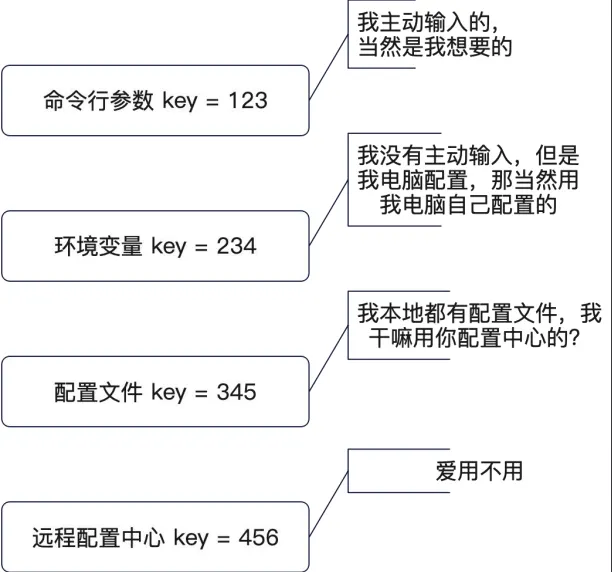

+++
title = '配置模块'
date = 2025-11-14T20:04:31+08:00
draft = true
categories = [ "Programming" ]
tags = [ "programming", "go" ]
+++

# 引入

配置与日志模块都涉及一个共同点，就是如何与第三方打交道的问题。
在如何使用这点上，这里不会像与短信等第三方服务一样抽象出接口，而是选择直接使用第三方依赖的方式，如果第三方依赖直接抽象除了接口，那我们就直接使用它封装好的接口。

日志模块，我会有自己的接口，也只使用我自己封装的接口，之后如果更换第三方日志，自由切换，比如更换zap到其他日志库，也不会有太大的影响。

# 小型项目配置模块推荐

**config/dev.go**
```go
//go:build !k8s

package config

var Config = config{
	DB: DBConfig{
		DSN: "root:123456@tcp(127.0.0.1:3306)/testdb",
	},
	Redis: RedisConfig{
		Addr: "localhost:6379",
	},
}

```

**config/k8s.go**
```go
//go:build k8s

package config

var Config = config{
	DB: DBConfig{
		DSN: "localhost:3306",
	},
	Redis: RedisConfig{
		Addr: "localhost:6379",
	},
}

```

上面的这种配置针对小型项目，非常方便，也很推荐，它直接将配置编写在代码中，而后通过编译标签来控制不同的环境。
如果没有传 `k8s` 则是使用上面的配置，如果是 `k8s` 则是另一套配置环境。

小型项目中如果不寻求可以动态加载配置，监听配置变更，都推荐使用上面的这种方式，真的非常好用，比操作配置文件好用得多。


# 配置的通用理论

## 来源

在深入学习使用配置模块之前，我们先来学习一些和配置有关的基本概念。

配置如果从来源上来说，可以分成：

- 启动参数：某一次运行的参数，也叫命令行参数。最为典型的就是命令行工具执行时会要求你传入各种参数，例如在 mockgen 中传递的 source、destination。
- 环境变量：和具体的实例有关的参数都放在这里。比如安装 Java JDK 时配置的JAVA_HOME、PATH、CLASSPATH等环境变量。
- 配置文件：一些当下环境中所需要的通用的配置，比如说我们的数据库连接信息等。
- 远程配置中心：它和配置文件可以说是互相补充的，除了启动程序所需的最少配置，剩下的配置都可以放在远程配置中心，一定需要通过网络连接上远程配置中心才能拿到配置信息。

个人建议：

- 少用启动参数，因为对于新人来说，门槛比较高；
- 少用环境变量，因为环境变量与机器相关，你只有登录上机器才知道参数的值，比较麻烦，但也有些特例确实需要使用到环境变量；
- 优先使用配置文件，无论是小型、中型、大型应用都可以使用配置文件；
- 大规模微服务集群可以考虑引入远程配置中心，小型应用则不建议。小型公司不建议使用远程配置中心，因为引入远程配置中心就意味着需要投入资源去部署维护，虽然成本不高，比如搭建个etcd、nacos之类的，但那也是需要维护的；另外引入远程配置中心后，系统的可用性也就下降了。这里有个点，引用的第三方软件越多，可用性就越低。

小结：

谨慎引入远程配置中心，优先使用配置文件，直到配置文件无法满足要求再考虑引入配置中心。

## 优先级

不同的配置来源，优先级也不同。所谓优先级，指的是如果不同来源都有同一个配置项，那么究竟该用哪一个值。


比如：应用中在不同的配置来源中使用配置了不同值但同一名称的配置，那最终生效的是哪一个呢？

配置值来源的选择取决于你认为哪个更加”权威“。

下面是一种实践参考：

1. 命令行最权威，因为是我主动在启动的时候输入的，所以一切配置中，它的优先级最高。
2. 环境变量次之，因为这是我自己在电脑中设置的，所以它的优先级也比较高。
3. 配置文件再次之，因为配置文件可能是同事写的，我只是通过 Git 同步下来了，但这可能并不是我想要的配置。
4. 远程配置中心优先级最低。



不同公司、不同的人可能有不同的偏好，比如有些公司的配置文件优先级比环境变量高。

## 两次加载

在使用远程配置中心的时候，一般会有两次加载配置的过程：

**第一次加载最基本的配置：**

- 远程配置的连接信息，二次加载的时候需要先连上配置中心。
- 日志相关配置，确保日志模块初始化成功，后续可以输出日志。

**第二次完全加载**

- 读取系统所需要的全部依赖，并且用于初始化各种第三方，例如连接数据库。
- 如果在第一次加载中的配置，在远程配置中心里也能找到，那么就会被覆盖，并且再次初始化使用这些配置的组件，比如再次初始化日志组件来连接日志分析平台等。

**过程：**

第一次先从配置文件读取出配置中心的基本配置，第二次根据基本配置去连接配置中心。

第一次和第二次加载时都有可能出错，出错时就需要打印出错误信息便于排查，所以日志模块的初始化就显得优先级比较高，这里就形成了一个鸡生蛋、蛋生鸡的过程：

- 读配置失败了要打印日志
- 打印日志就需要初始化日志模块
- 要初始化日志模块就要先读取配置

为了解决这个现象，就有了二次加载的操作。

第一次加载基本配置，拿基本的配置去初始化最简单的日志模块，这不一定是线上真实使用的日志模块，这可以是一个极简的日志模块，使用这个极简的日志模块来记录初始化过程、配置加载过程产生的日志。

第二次连接上配置中心时就可以完全加载各个模块，第一次加载中的配置，在远程配置中心里也能找到，那么就会被覆盖，并且再次初始化使用这些配置的组件，比如再次初始化日志组件来连接日志分析平台等。

## Viper

使用viper 读取本地配置文件。

```go
go get github.com/spf13/viper
```

# 远程配置中心-etcd

## 安装 etcdctl

有些人为 etcd 提供了管理界面，比如 etcdkeeper，但有人觉得并不好用。所以这里使用的是原生的 etcdctl 命令行工具。

- GitHub 下载 etcd 源码
- 切换到某个 tag 下。正常来说，正式版本都有一个 tag，所以这一步就是为了切换到某个正式版本下。
- 运行 `go install` 。这一步会把 etcdctl 安装户到 GOPATH/bin 目录下

上面这个技巧是所有 Go 工具都可以使用的技巧。

安装示例：

```go
git clone https://github.com/etcd-io/etcd.git
cd etcd
git checkout v3.5.18
cd etcdctl
go1.23.3 install .
```

## 监听配置变更

- WatchConfig: 监听文件变更，可以结合 OnConfigChange 一起使用。注意，WatchConfig 要在所有的 SetConfigFile、AddConfigPath 这一类调用之后再调用。
- WatchRemoteConfig: 监听远程配置中心变更。