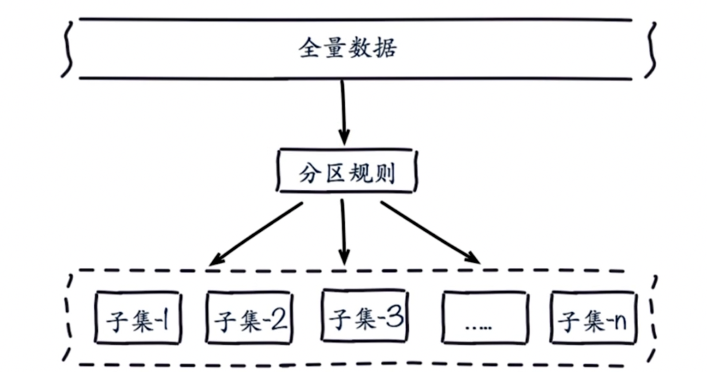

+++
title = 'Redis Cluster'
date = 2018-03-10T15:11:15+08:00
draft = false
categories = [ "Redis" ]
tags = [ "redis" ]
+++

## 为什么需要集群

### 发现问题

**1、并发量**

Redis 官方的提供的性能并发量10万/每秒。如果有些业务随着范围、体量越来越大，需要更多的QPS呢？比如需要100万/每秒呢？

**2、数据量**

常见的机器内存大约在 16 ~ 256G。如果有业务需要500G的数据内存诉求呢？

**3、网络流量**

比如常见的千兆网卡。如果业务流量已经超过了千兆网卡的需求呢？

### 解决问题

可以配置更“强悍”的机器，比如超大的内存，更牛逼的CPU、网卡等。但这种方式如果需要更更强悍的机器呢？是否还能有保障。

就像一辆马车，一辆马拉不动，就考虑更换更强壮的动物来拉，比如换头大象。如果大象也拉不动了，就要考虑更多的大象来拉了。

**正确的解决方案**

分布式：简单的理解就是加机器。 

### 小结

集群的需求其实就是规模化的需求，高并发量，大数据量

## 数据分布

为什么要做数据分布？

比如有一份全量数据，单机无法满足需求。所以需要对数据进行分区，比如有100分数据，按照一定的规则将数据分布在若干子集中。

分区是有一定规则的，常见的两种分区方式

**顺序分区**

比如有100分数据，有三个节点，顺序讲究的均衡，1~33 在第一个节点，33 ~66 在第二个节点，67 ~100 在第三个节点。

**哈希分布（节点取模）**

比如有100分数据，有三个节点，将100进行取模 hash(key) % 3，然后放到不同的节点上。

哈希分布有三种方式：

- 节点取余分区
- 一致性哈希分区
- 虚拟槽分区

### 节点取余分区

* 客户端分片： 哈希+取余
* 节点扩缩容：数据节点关系变化，导致数据迁移。
* 迁移数量和添加节点数量有关L建议翻倍扩容

hash(key) % nodes

存在问题：原来有3个节点，现在需要扩容到4个节点。添加节点后数据会发生偏移。

针对这个问题，建议多倍扩容，来避免出现数据发生偏移。比如原来的 hash(key) % 3，现在将节点扩展为6个节点，hash(key)%6

### 一致性哈希

* 客户端分片： 哈希+顺时针（优化取余）
* 节点伸缩：只影响临近节点，但还有数据迁移
* 翻倍伸缩：保证最小迁移数据和负载均衡

## 虚拟槽分区

* 预设虚拟槽：每个槽映射一个数据子集，一般比节点数大
* 服务端管理节点、槽、数据

可将槽理解为一个数字，它有一定的范围，比如 0~ 16383，每个槽对应你一个数据的子集，比如现有10万的数据，有一个16384的槽，按照哈希的规则，对每个数据做哈希计算

## 集群架构

## 相关概念

**槽**

图中猪猪们吃食用的食具就叫“槽”，它是畜兽饮食的器具。

在Redis Cluster 中也有叫“槽”的东西，它用来放数据。在 Cluster 模式下，Redis将所有的数据分散在多个节点上，每个节点负责一部分数据，这被称为槽位。

Redis Cluster 将数据分为 `16384` 个槽位，每个节点负责管理一部分槽位。当客户端向 Redis Cluster 发送请求时，Cluster 会根据键的哈希值将请求路由到相应的节点。具体来说，Redis Cluster使用CRC16算法计算键的哈希值，然后对16384取模，得到槽位编号。

**CRC16**

Redis Cluster 使用 CRC16算法计算哈希值。

**作用**

Redis Cluster 通过将数据分片和分布式存储，实现负载均衡和高可用。