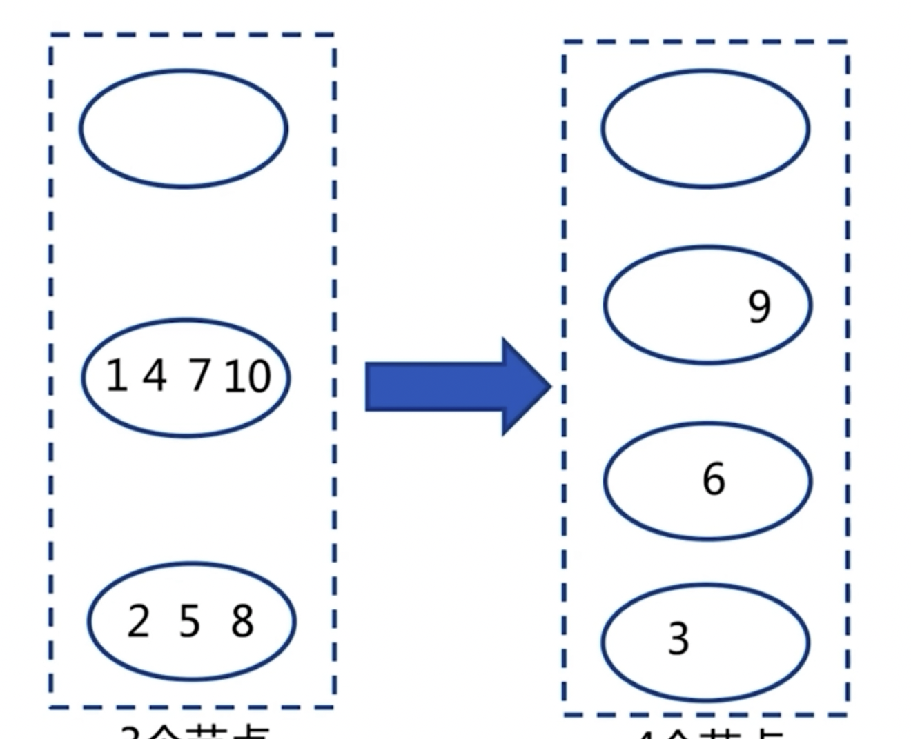
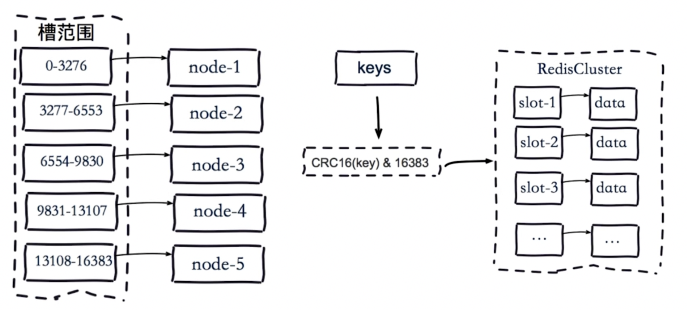

+++
title = 'Redis Sentinel'
date = 2024-06-11T08:20:42+08:00
draft = false
categories = [ "Redis" ]
tags = [ "redis", "DBA" ]
+++

## 背景

**主从复制的两个作用：**

1. 从为主提供数据备份，当主挂掉的时候，从节点中有完整的数据可供恢复； 
2. 主从读写分离功能实现节点分流，将读操作放到从节点上执行，减轻主节点压力。

**主从复制架构的痛点：**

1. 手动故障转移

    主从架构中如果主节点出现了问题，故障转移就需要手工完成，或者通过编写脚本来实现故障转移。

    实现思路：当 master 故障后需要选出一个新的 slave 节点作为新的 master。

2. 写、存储能力受限

    写能力和存储能力只能实现在主这一个节点上， 因为其他节点作为从节点都是主节点的副本。

    解决方法：主从+分布式

### 手动故障迁移

**主从复制-Master宕掉**


上图模拟了一主两从。


假如主节点故障，那么从节点的复制也必然出现故障，连接 Master 的客户端读写势必也会出现问题。右侧从节点的读功能可能正常，但是数据的更新会受到影响。

**Master故障后如何故障转移？**


首先选择一个 Slave 作为新的 Master，在这个新的Master上执行 `slaveof no one`，让它成为一个 Master ，然后在其他的 Slave 执行 `slaveof new master`，也就是让其余节点去找新的 Master，这样就完成新建主从复制的过程，同时客户端也会去读写新的 Master。

上述过程也完全可以通过脚本来实现。需要让脚本监控master节点是否有问题，如果有问题就做节点下线操作，然后重新选择一个新的master，让其他slave都去复制这个新的master，最后去迁移客户端。

脚本的难点在于：

1. 如何判断master节点有问题
2. 迁移
3. 怎么去通知客户端
4. 整个过程如何去保证事务

纯脚本实现可能需要严谨的考虑，故Redis为我们提供了一个解决方案 — `Redis Sentinel 高可用实现`。

## Redis Sentinel 架构 


仍然是主从结构。另外还有多个 `Redis Sentinel` 节点，可以理解为多个Redis进程，但是这些进程不会去存储数据，它的作用是对Redis做故障判断和故障转移以及会通知客户端的过程。

**为何需要多个 Sentinel 节点？**因为这样可以保证对节点的判断是否故障具有公平性，另外还可以保证 Sentinel 节点的高可用，即使一个 Sentinel 挂了，也可以保证 Sentinel 的机制是完整的。

对于客户端来说它不会直接去从 Redis 来获取信息，也就是客户端不会直接记录 Redis 后端地址，比如某个IP和端口，而是记录Redis Sentinel 的地址。因为 Redis Sentinel 负责对所有 Redis 节点的监控，无论是master还是slave节点，Sentinel 知道谁是master，谁是slave，如果 Redis 节点故障 master改变了，Sentinel 是感知到的，客户端无需知道谁是master，而是由Sentinel来通知客户端。

所以客户端是不需要谁是真的master和slave，客户端只关心由sentinel来告诉客户端就行了。这样客户端知道后再去连接就可以了。

### Redis Sentinel 的故障转移

1、redis 主节点故障之后，多个 Sentinel 发现并确认 master 有问题
2、然后 Sentinel 内部会进行选举，选出一个 sentinel 作为领导，因为重新选择master是要在一个节点上执行 slaveof no one，这个命令是在客户端执行的，让一个 sentinel 作为领导，可以理解为这个这个sentinel节点作为客户端，它会完成这样的功能。
3、接着选择一个slave 作为新的 master



4、然后通知其余salve称为新的master的slave。让新的slave去复制新的master


5、通知客户端主从变化。并且会通知客户端新的master是谁，让客户端不去连接老的故障master

6、如果期间等到老的master复活，则将其成为新的master的slave


7、另外sentinel还可以监控多套redis主从节点。这样可以有效节省资源。


每套redis主从节点会有个一个master-name的配置作为标识

## Redis Sentinel 安装配置

**1、配置开启主从节点**

**2、配置开启sentinel监控主节点（sentinel是特殊的redis节点）**

特殊在于sentinel本身不存储数据，它支持的命令有限，它的作用主要是监控、故障转移和通知客户端

**3、实际多台机器，这里在一台机器上通过端口区分**

**4、节点配置**

结构如下：


### 主节点配置


配置文件均放在 config 配置目录下。

定义 redis-7000.conf 配置文件
```bash
# pwd
/opt/soft/redis/config
redis-7000.conf
```

配置如下:
```bash
port 7000
daemonize yes
pidfile /var/run/redis-7000.pid
logfile "7000.log"
dir "/opt/redis/data/"
```


### 从节点配置


```bash
# pwd
/opt/soft/redis/config
sed "s/7000/7001/g" redis-7000.conf > redis-7001.conf
sed "s/7000/7002/g" redis-7000.conf > redis-7002.conf
```

```bash
echo "slaveof 127.0.0.1 7000" >> redis-7001.conf
echo "slaveof 127.0.0.1 7000" >> redis-7002.conf
```

### 启动

```bash
# pwd
/opt/soft/redis/config
# redis-server redis-7000.conf
# redis-cli -p 7000 ping
PONG
#
```

```bash
# redis-server redis-7001.conf
# redis-server redis-7002.conf
# ps -ef | grep redis-server | grep 700
root      1600     1  2 08:13 ?        00:00:02 redis-server *:7000
root      1607     1  2 08:14 ?        00:00:00 redis-server *:7001
root      1612     1  3 08:14 ?        00:00:00 redis-server *:7002
```

查看主从复制关系：
```bash
# redis-cli -p 7000 info replication
# Replication
role:master
connected_slaves:2
slave0:ip=127.0.0.1,port=7001,state=online,offset=71,lag=0
slave1:ip=127.0.0.1,port=7002,state=online,offset=71,lag=0
master_repl_offset:71
repl_backlog_active:1
repl_backlog_size:1048576
repl_backlog_first_byte_offset:2
repl_backlog_histlen:70
```

### sentinel 主要配置


```bash
# pwd
/opt/soft/redis/config
# cp ../sentinel.conf ./
# cat sentinel.conf | grep -v "#" | grep -v "^$"
port 26379
dir /tmp
sentinel monitor mymaster 127.0.0.1 6379 2
sentinel down-after-milliseconds mymaster 30000
sentinel parallel-syncs mymaster 1
sentinel failover-timeout mymaster 180000
# cat sentinel.conf | grep -v "#" | grep -v "^$" > redis-sentinel-26379.conf
# vim redis-sentinel-26379.conf
```

配置修改如下：
```bash
port 26379
daemonize yes
dir /opt/soft/redis/data
logfile "26379.log"
sentinel monitor mymaster 127.0.0.1 7000 2
sentinel down-after-milliseconds mymaster 30000
sentinel parallel-syncs mymaster 1
sentinel failover-timeout mymaster 180000
```

启动：
```bash
# redis-sentinel redis-sentinel-26379.conf
# ps -ef | grep redis-sentinel
root      1652     1  5 08:27 ?        00:00:00 redis-sentinel *:26379 [sentinel]
root      1656  1556  0 08:27 pts/0    00:00:00 grep --color=auto redis-sentinel
#
```

连接sentinel:
```bash
# redis-cli -p 26379
127.0.0.1:26379> set hello world
(error) ERR unknown command 'set'
127.0.0.1:26379> ping
PONG
127.0.0.1:26379> info
# Server
redis_version:3.0.7
redis_git_sha1:00000000
redis_git_dirty:0
redis_build_id:196c6142377859a0
redis_mode:sentinel
os:Linux 3.10.0-1160.el7.x86_64 x86_64
arch_bits:64
multiplexing_api:epoll
gcc_version:4.8.5
process_id:1652
run_id:474751fcf93ad1302d5fec61a5764e2e888b280e
tcp_port:26379
uptime_in_seconds:72
uptime_in_days:0
hz:14
lru_clock:6962474
config_file:/opt/soft/redis-3.0.7/config/redis-sentinel-26379.conf

# Sentinel
sentinel_masters:1
sentinel_tilt:0
sentinel_running_scripts:0
sentinel_scripts_queue_length:0
master0:name=mymaster,status=ok,address=127.0.0.1:7000,slaves=2,sentinels=1
127.0.0.1:26379> exit
```

从这句话“master0:name=mymaster,status=ok,address=127.0.0.1:7000,slaves=2,sentinels=1” 可以看到该sentinel监控到一个master，该master有两个从节点。

再次查看 redis-sentinel-26379.conf 配置：
```bash
# cat redis-sentinel-26379.conf
port 26379
daemonize yes
dir "/opt/soft/redis-3.0.7/data"
logfile "26379.log"
sentinel monitor mymaster 127.0.0.1 7000 2
sentinel config-epoch mymaster 0
sentinel leader-epoch mymaster 0
sentinel known-slave mymaster 127.0.0.1 7002
# Generated by CONFIG REWRITE
sentinel known-slave mymaster 127.0.0.1 7001
sentinel current-epoch 0
```

发现配置最后多了一些内容，这是配置重写产生的，它发现了mymaster有两个slave，一个是7002，一个是7001，另外它将 “sentinel down-after-milliseconds mymaster 30000” 等最初的配置去掉了。

其余sentinel节点配置：
```bash
sed "s/26379/26380/g" redis-sentinel-26379.conf > redis-sentinel-26380.conf
sed "s/26379/26381/g" redis-sentinel-26379.conf > redis-sentinel-26381.conf
```

启动：
```bash
# redis-sentinel redis-sentinel-26380.conf
# redis-sentinel redis-sentinel-26381.conf
# ps -ef | grep redis-sentinel | grep -v grep
root      1652     1  4 08:27 ?        00:00:26 redis-sentinel *:26379 [sentinel]
root      1696     1  5 08:35 ?        00:00:01 redis-sentinel *:26380 [sentinel]
root      1700     1  5 08:35 ?        00:00:01 redis-sentinel *:26381 [sentinel]
```

连接新启动的sentinel节点：
```bash
# redis-cli -p 26381
127.0.0.1:26381> info
# Server
redis_version:3.0.7
redis_git_sha1:00000000
redis_git_dirty:0
redis_build_id:196c6142377859a0
redis_mode:sentinel
os:Linux 3.10.0-1160.el7.x86_64 x86_64
arch_bits:64
multiplexing_api:epoll
gcc_version:4.8.5
process_id:1700
run_id:875718eefbfae06b495be5e041033885321e9d5d
tcp_port:26381
uptime_in_seconds:209
uptime_in_days:0
hz:14
lru_clock:6963119
config_file:/opt/soft/redis-3.0.7/config/redis-sentinel-26381.conf

# Sentinel
sentinel_masters:1
sentinel_tilt:0
sentinel_running_scripts:0
sentinel_scripts_queue_length:0
master0:name=mymaster,status=ok,address=127.0.0.1:7000,slaves=2,sentinels=3
```

sentinels=3 表示发现了3个sentinel，sentinel 节点之间是可以感知到的，比如在看下 26380 节点的info:
```bash
127.0.0.1:26381> exit
[root@localhost config]# redis-cli -p 26380
127.0.0.1:26380> info
# Server
redis_version:3.0.7
redis_git_sha1:00000000
redis_git_dirty:0
redis_build_id:196c6142377859a0
redis_mode:sentinel
os:Linux 3.10.0-1160.el7.x86_64 x86_64
arch_bits:64
multiplexing_api:epoll
gcc_version:4.8.5
process_id:1696
run_id:18af496186a7cf64e6cb30a1c3e4d97f3c9438ee
tcp_port:26380
uptime_in_seconds:292
uptime_in_days:0
hz:11
lru_clock:6963199
config_file:/opt/soft/redis-3.0.7/config/redis-sentinel-26380.conf

# Sentinel
sentinel_masters:1
sentinel_tilt:0
sentinel_running_scripts:0
sentinel_scripts_queue_length:0
master0:name=mymaster,status=ok,address=127.0.0.1:7000,slaves=2,sentinels=3
127.0.0.1:26380>
```

## 故障转移演练

**1、客户端高可用观察**
**2、服务端日志分析：数据节点和sentinel节点**