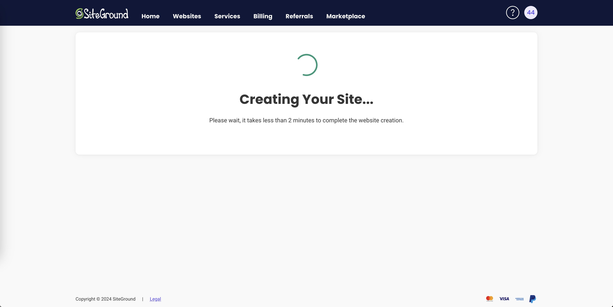
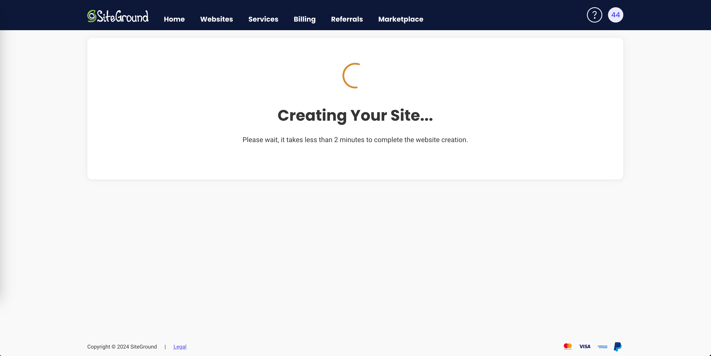
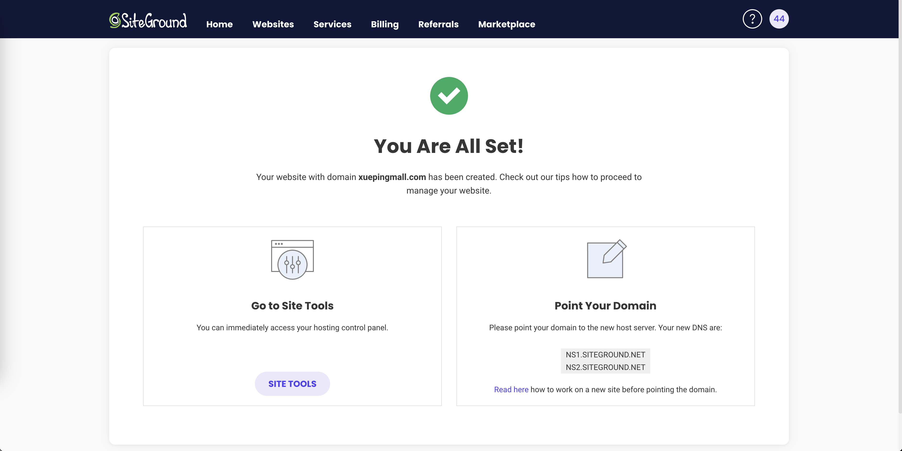

+++
title = '网站搭建基础'
date = 2023-08-13T10:59:52+08:00
draft = false
categories = [ "WordPress" ]
+++

## 选择服务器

我选择的是国外的托管网站：SiteGround

注册并登录 [SiteGround](https://my.siteground.com/)

## 添加站点

1、进入首页选择【Websites】并进入👇🏻页面

点击右上角【NEW WEBSITE】进入👇🏻页面

2、我使用我自己的域名，所以我选择第二个【Existing Domain】选项的【SELECT】，然后输入自己的域名，最后点击【CONTINUE】

### CREATE EMPTY SITE

3、我选择的【SKIP & CREATE EMPTY SITE】，因为这里我用于测试，就没有根据向导设置

接着点击【FINISH】

4、点击【SITE TOOLS】设置站点

### Start New Website

当然也可以选择下面是选择的是【Start New Website】

5、添加域名

选择菜单栏【Domain】-> 【Subdomains】，在【Create New Subdomain】下的 Name 输入框中输入子域名，然后点击【CREATE】按钮

6、开启子域名管理

7、安装应用

账号username：wp
密码：4343a3434
邮箱：97441358@qq.com

最后点击【INSTALL】按钮安装

8、安装完成，但现在还无法跳转

## 域名解析

到自己购买域名的服务商域名解析里面添加一条自己添加的子域名的解析记录，然后等待生效，如下图所示：

## 开启HTTPS

### 阿里云

可以在云服务厂商购买免费的ssl证书，然后下载

解压

### 腾讯云

[免费 SSL 证书申请流程](https://cloud.tencent.com/document/product/400/6814)

申请免费 ssl 证书

打开站点ssl配置页面，选择【IMPORT】

将证书 xxx.crt 内容复制粘贴到 【Certificate (CRT)】中

将证书 xxx.key 内容复制粘贴到 【Private Key (KEY)】中

最后点击【IMPORT】

导入之后启用https，选择开发站点，点击右边三个小点，点击【Enforce HTTPS】

访问站点就会强制携带 https

