+++
title = 'HTML之旅'
date = 2025-01-13T18:14:38+08:00
draft = false
categories = [ "HTML5" ]
tags = [ "html", "html5" ]
+++

## 认识网页

刚接触HTML，我想尽可能将其与我认识的东西联系在一起，这样我就可以通过熟悉的事物来关联HTML中那些陌生的概念。

我想象了这样一个场景，，我该怎么教小朋友认识家里的家具？我会告诉他：
- 有4只脚和一个木板，我们把屁股放在上面坐着的东西叫凳子；
- 有4只脚，也有一个木板，我们把碗放在上面吃饭的地方叫桌子；
- 有一个大大的面包形状的东西，我们晚上在上面睡觉的地方叫床；
- ...

为了方便小朋友认识这些家具，我们在一张便利贴在上写些东西，然后贴在家具上，方便小朋友认识新的事物，我们称这些便利贴叫标签，这些标签是怎么来描述家具的呢？使用“点、横、竖、撇、捺、折、提、钩”构成的汉字。

我在学网页的时候，感觉也差不多，比如网页上有看到文字、图片、视频、填写手机号码的框框等，我们也可以在网页页面上贴上个各种标签，这些标签用什么描述呢？就是使用HTML编程语言的标记。汉字是横竖撇捺折，那HTML是什么？它使用是类似`<>...</>`这样的标签对，在每个尖括号<>里写上对应的标记，比如：
- 文字：<p>我是文字</p>
- 图片：<image />
- 视频：<video />
- 音频：<audio />
- ...


## 编写网页-认识网页结构

先看下面的一张图片。

从上到下，分别是头，身体，腿，最后是脚，就这样构成了一个人的骨架。

我们把页面看成是人，人有骨架，那它也有骨架，它的骨架是什么呢？就是HTML。
```html
<!DOCTYPE html>
<html lang="en">
<head>
    <meta charset="UTF-8">
    <title>Title</title>
</head>
<body>

</body>
</html>
```

## 标签

### 文本段落


---

- 网页的底层结构
- 一个网页的组成部分
    1. 文本内容
        纯文字
    2. 对其他文件的引用
        图像、音频、视频、样式表（控制展示效果）、JS文件（控制行为效果）、其他页面和资源
    3. 标记
        对文本内容进行描述的标记

归根接地，网页的成分都是文本。

说到网页作为普通人的你能想到什么？

“页”我能想到书本一页一页的，每页写了不同的内容。网页呢也想书

HTML页面，

什么是页面，


这就是类似人的骨架一样，现在啥都没有。


## 基本的HTML页面

- 标签
- 顶部和头部

先来认识一个人，


## html文件

**纯文本**
- 虽然网页花花绿绿，但html文件本身是纯文本，图片、音频、视频也都是通过文本对它们的引用

## 骨架
```html
<!DOCTYPE html>
<html lang="en">
<head>
    <meta charset="UTF-8">
    <title>Title</title>
</head>
<body>

</body>
</html>
```
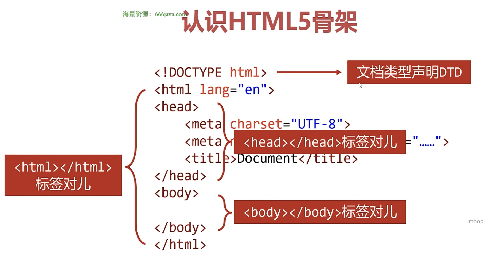

**文档类型声明DTD**

- HTML文件第一行必须是DTD(Document Type Definition，文档类型声明)
- 不写可能会引发浏览器的兼容问题


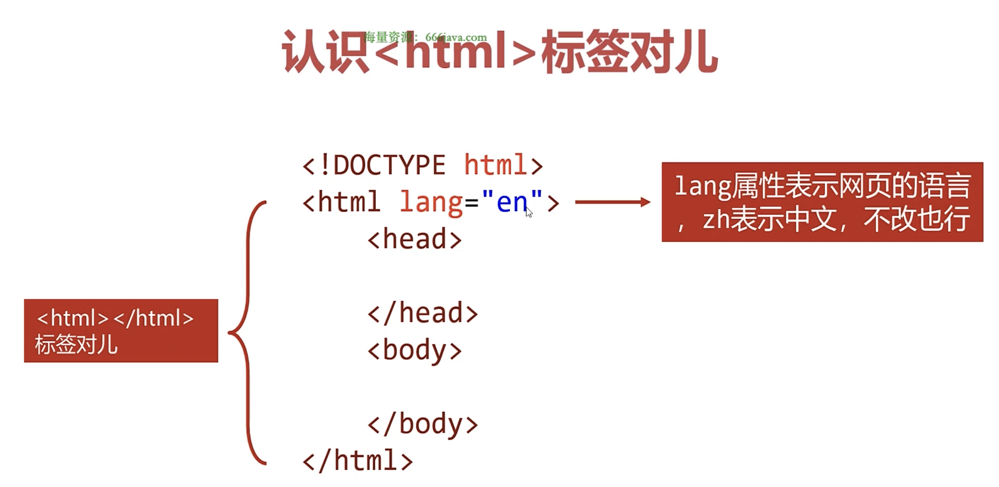
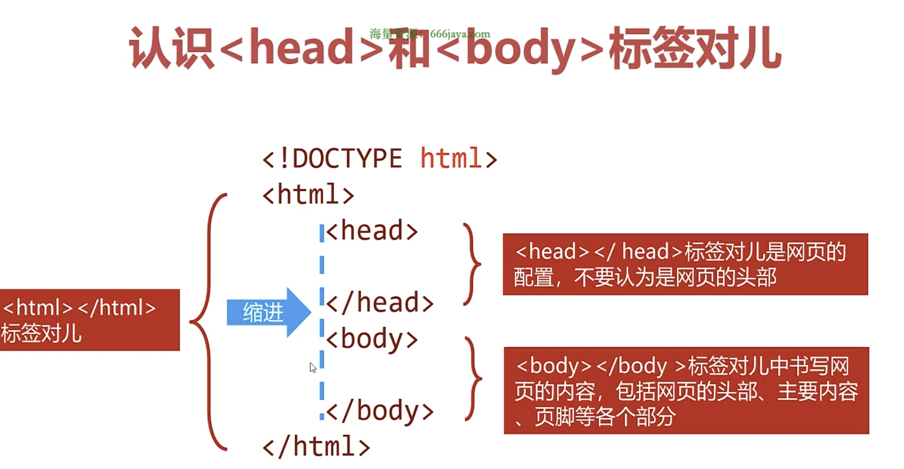

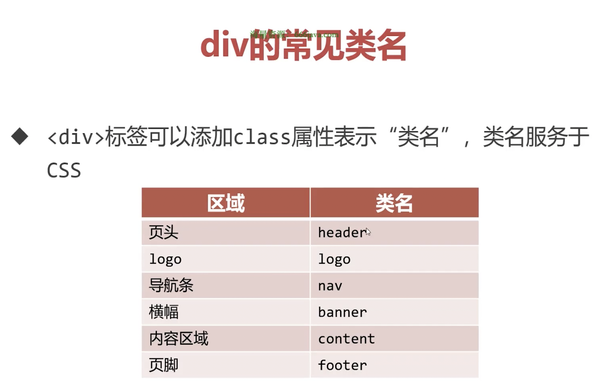

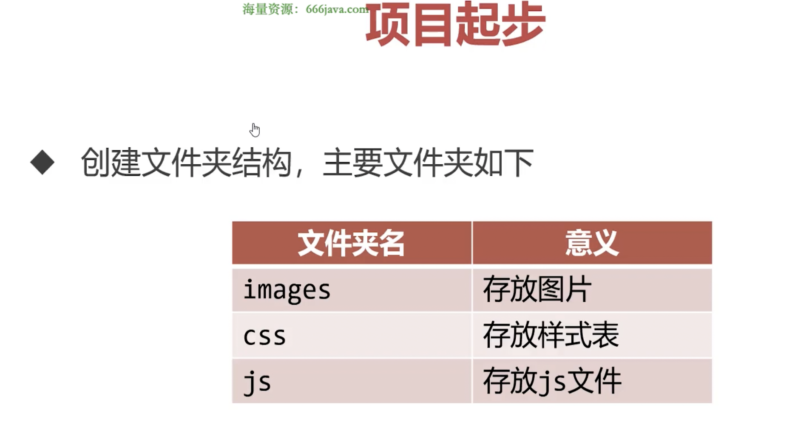

## 标签

HTML叫超文本标记语言，超文本标记就是标签

这些标签都有不同的功能。

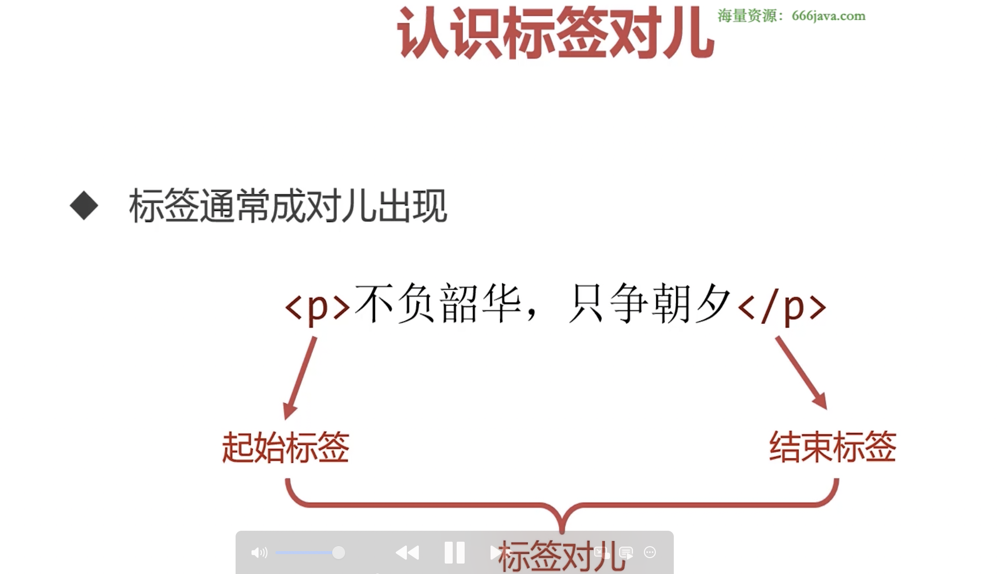
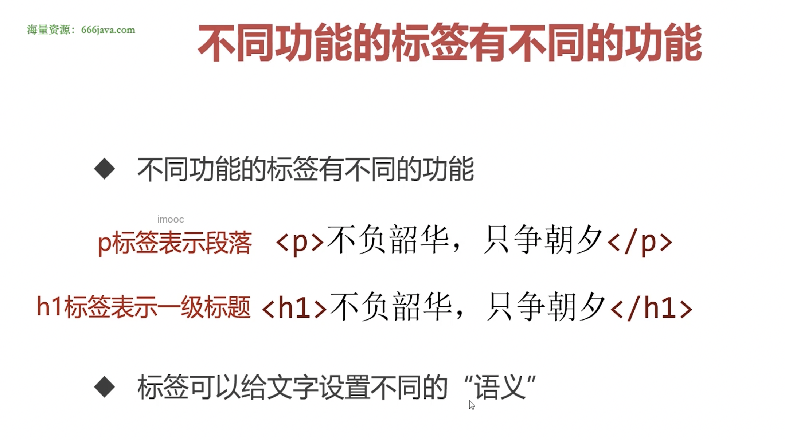
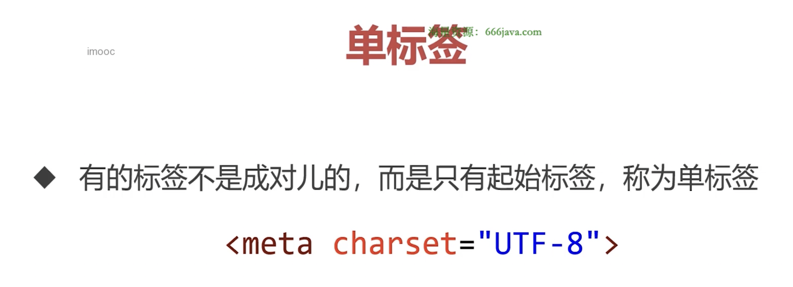
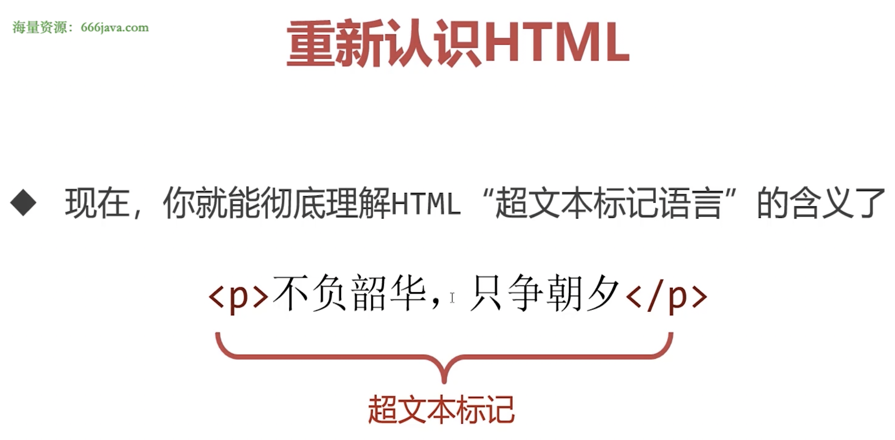

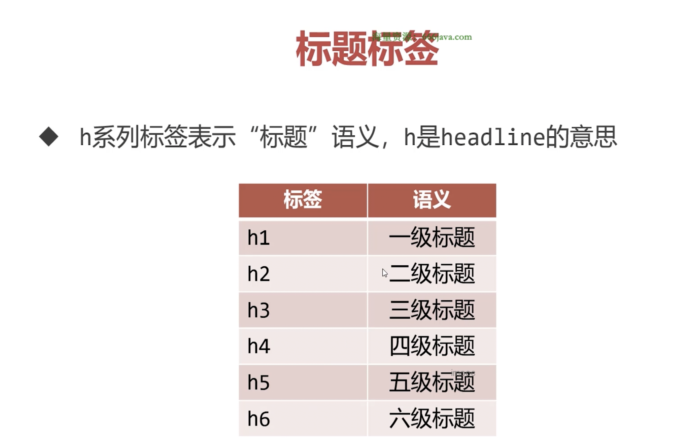
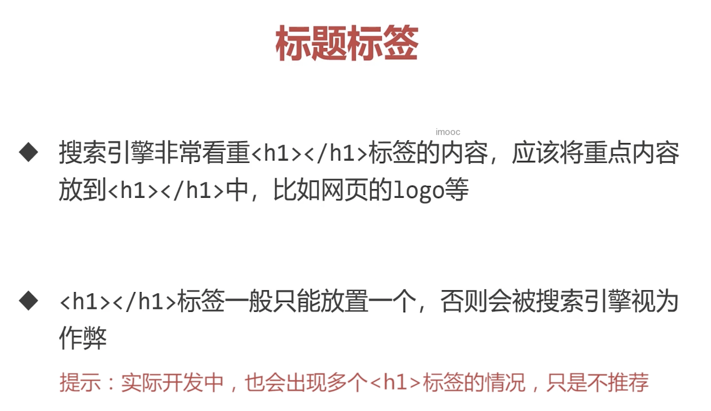
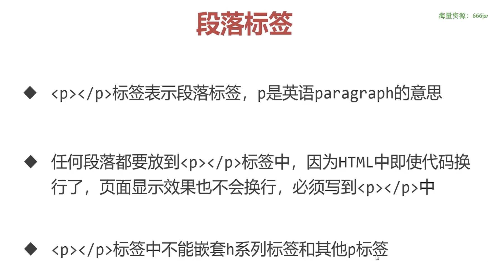

### 标题

### 段落

### div
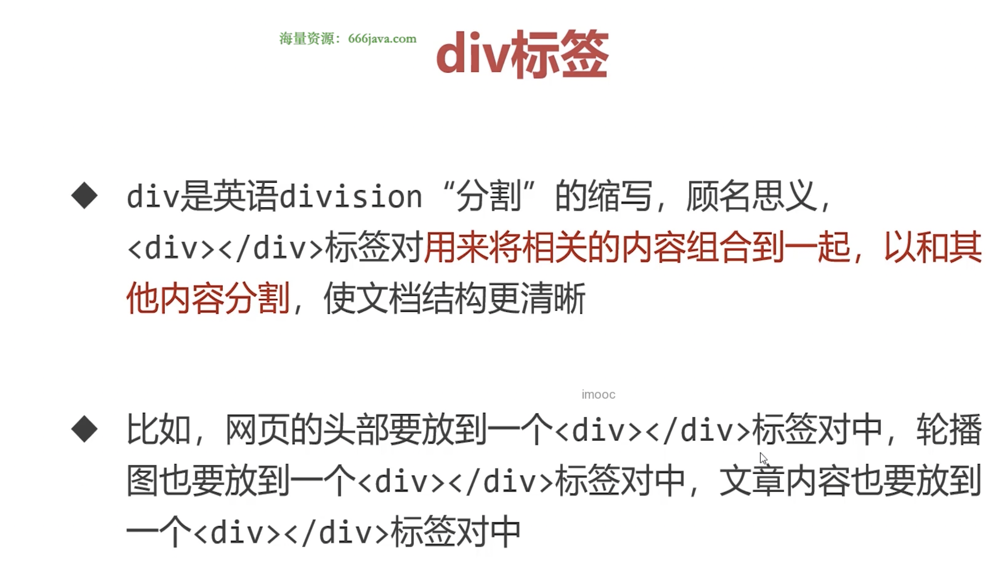
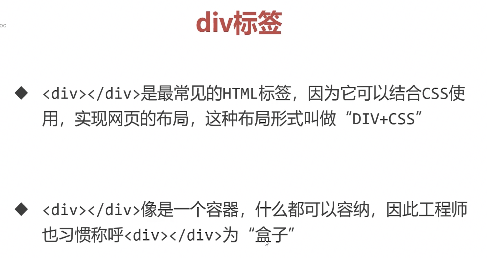

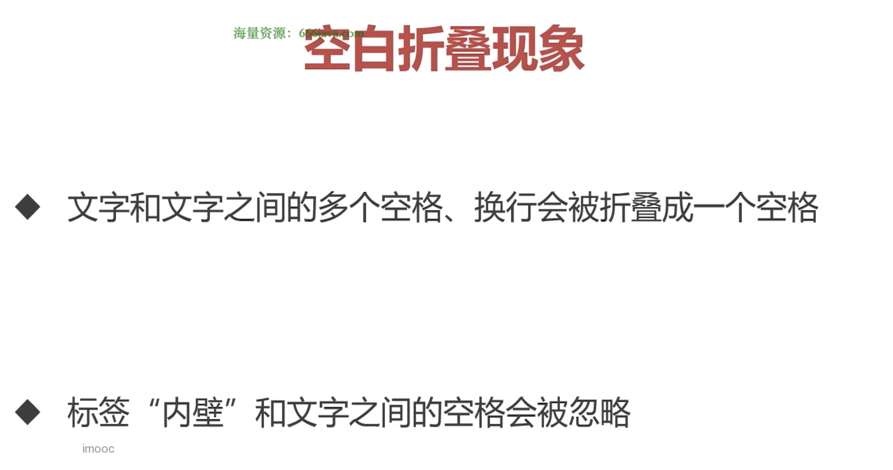
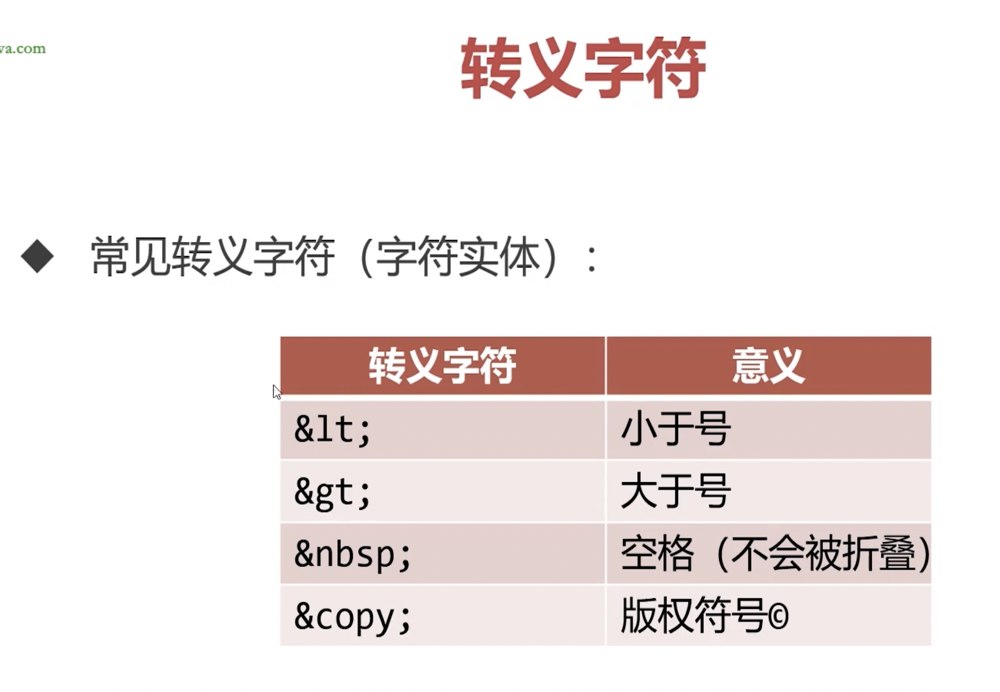
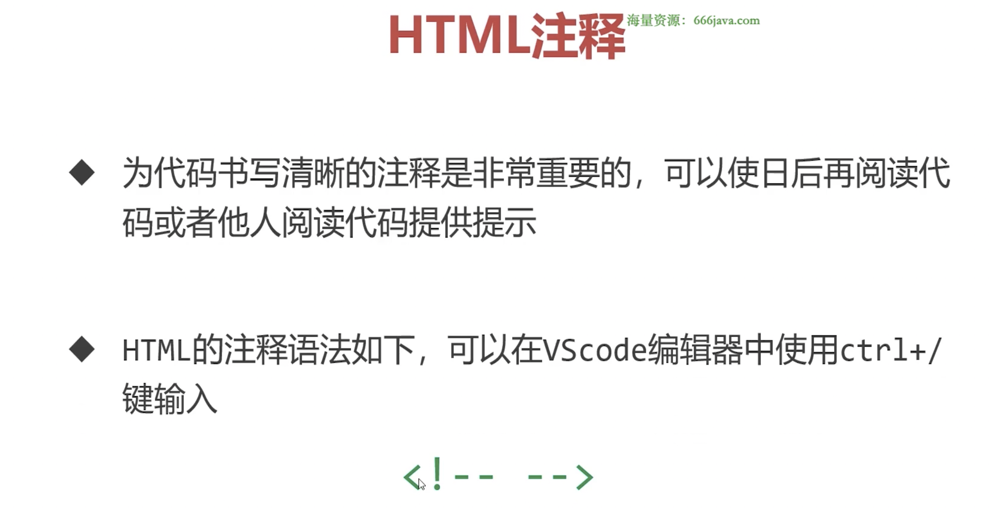

## 