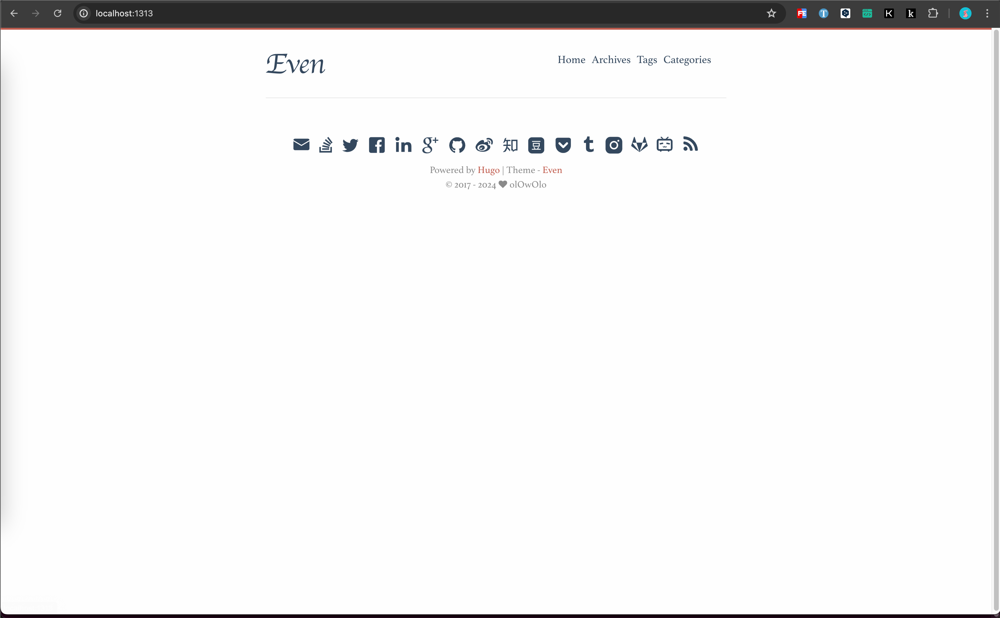

+++
title = 'hugo-theme-even主题站点配置'
date = 2024-01-13T18:14:38+08:00
draft = true
categories = [ "建站" ]
tags = [ "hugo" ]
+++

1、加载主题

```shell
git clone https://github.com/olOwOlo/hugo-theme-even themes/even
git submodule add https://github.com/olOwOlo/hugo-theme-even/ themes/even
```

2、备份默认站点配置文件

```shell
mv hugo.toml hugo.toml.backup
```

3、将主题样例配置文件复制到站点目录下

```shell
cp themes/even/exampleSite/config.toml ./
```

* 注意提供的样例配置文件格式是 `toml` 。

4、执行 `hugo server`，预览效果

```shell
hugo server
```

预览：



5、复制 `exampleSite/content/post` 到站点 `content` 目录下，然后再刷新页面预览效果。


## 6 部署

1、站点目录新建 `.github/workflows/hugo.yaml` 文件

```
cd hugo
mkdir -p .github/workflows
vim .github/workflows/hugo.yaml
```

2、访问下面链接，复制提供的样例内容到 `.github/workflows/hugo.yaml`

[hosting-on-github](https://gohugo.io/hosting-and-deployment/hosting-on-github/)

3、修改 `branches` 中的 `main` 为 `hugo`，如果在 【上传至 Github】 中没有新开分支，就可以不用修改

4、推送至 Github，并按照 [hosting-on-github](https://gohugo.io/hosting-and-deployment/hosting-on-github/) 操作即可实现 Github 部署


hugo new content moments.md
hugo new content bookmarks.md
hugo new content videos.md
hugo new content photos.md
hugo new content about.md


---
## 5 上传至Github

```shell
cd hugo
git init
git remote add origin git@github.com:finnley/finnley.github.io.git  # 替换为自己的 Github 仓库地址
git add .
git commit -m "first commit"
git push -u origin main
```


## 6 部署

1、站点目录新建 `.github/workflows/hugo.yaml` 文件

```
cd hugo
mkdir -p .github/workflows
vim .github/workflows/hugo.yaml
```

2、访问下面链接，复制提供的样例内容到 `.github/workflows/hugo.yaml`

参考：[hosting-on-github](https://gohugo.io/hosting-and-deployment/hosting-on-github/)

3、修改`branches`中的`main`为`hugo`，如果在上一步骤【上传至 Github】中没有新开分支，就可以不用修改

4、推送至 Github，并按照 [hosting-on-github](https://gohugo.io/hosting-and-deployment/hosting-on-github/) 操作即可实现 Github 部署。
