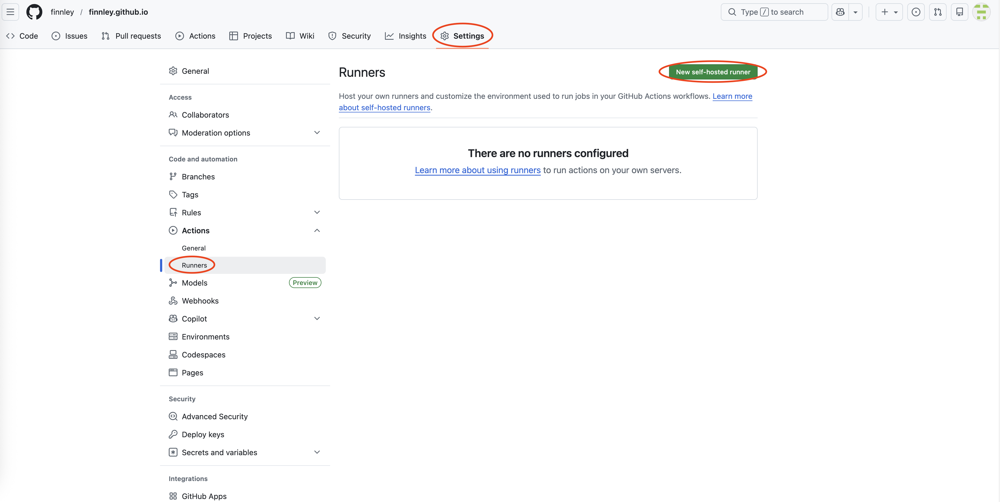
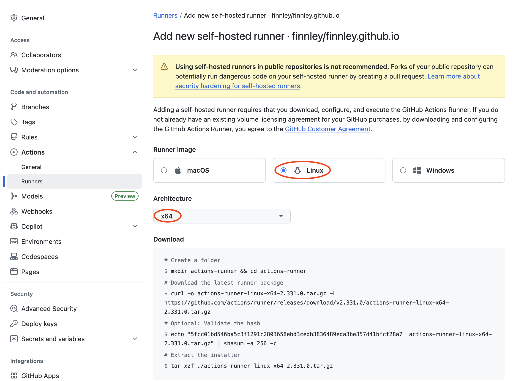

+++
title = '双线部署与智能DNS'
date = 2026-02-05T22:01:30+08:00
draft = false
categories = [ "站点" ]
tags = [ "hugo" ]
+++

我使用hugo搭建了了一个静态站点作为个人网站独立站，我想同一个站点服务既可以国内访问也可以国外访问，国外挂到国外的服务器上接谷歌的广告，这种可能国内访问比较慢还要解决国内访问慢的问题。
使用同一个域名，目前我有自己的域名，我还有一个国内的服务器和已经备案的域名，我该怎么做。

我的想法：站点推送至github，github action 自动构建推送到我的服务器。但这种方法由于是国外github访问国内服务器，存在被墙的情况，另外其他服务器访问我的自己服务器，哪怕是分配了专属账号，我也认为不安全，既存在网络问题又存在安全问题。

于是想到了是否可以把github自动构建完后同时推送到github和gitee的另外的仓库，然后服务器定时主动去检查，然后拉取下来部署。

或者请你针对我的场景提供更主流推荐方案





```
$ ./config.sh --url https://github.com/finnley/finnley.github.io --token APTFIEOTWEUCNJEVZCKEYFLJQW2FQ

--------------------------------------------------------------------------------
|        ____ _ _   _   _       _          _        _   _                      |
|       / ___(_) |_| | | |_   _| |__      / \   ___| |_(_) ___  _ __  ___      |
|      | |  _| | __| |_| | | | | '_ \    / _ \ / __| __| |/ _ \| '_ \/ __|     |
|      | |_| | | |_|  _  | |_| | |_) |  / ___ \ (__| |_| | (_) | | | \__ \     |
|       \____|_|\__|_| |_|\__,_|_.__/  /_/   \_\___|\__|_|\___/|_| |_|___/     |
|                                                                              |
|                       Self-hosted runner registration                        |
|                                                                              |
--------------------------------------------------------------------------------

# Authentication


√ Connected to GitHub

# Runner Registration

Enter the name of the runner group to add this runner to: [press Enter for Default] 

Enter the name of runner: [press Enter for VM-0-2-ubuntu] tc-111-shanghai

This runner will have the following labels: 'self-hosted', 'Linux', 'X64' 
Enter any additional labels (ex. label-1,label-2): [press Enter to skip] 

√ Runner successfully added

# Runner settings

Enter name of work folder: [press Enter for _work] 

√ Settings Saved.

$ exit
```


## 1 目标

1. **国外访问**：走 Vercel 自动构建（带广告）。
2. **国内访问**：走 GitHub Actions 自动推送到你的 Ubuntu 服务器（无广告）。
3. **安全性**：使用专用的低权限账号 `github-deploy`，杜绝 root 权限泄露风险。

## 2 GitHub推送站点文件至服务器

为了安全起见，**绝对应该**创建一个权限受限的专用账户。使用 `root` 账户进行自动化部署是非常危险的，一旦私钥泄露，整个服务器的控制权就丢了。

以下是在 Ubuntu 系统上创建“最小权限部署用户”的完整操作指南。

### 2.1 核心思路

1. **创建用户：** 创建一个名为 `github-deploy` 的用户。
2. **配置 SSH：** 只允许该用户通过密钥登录（禁止密码登录）。
3. **配置目录权限：** 只给予该用户对“网站目录”的读写权限，不给 `sudo` 权限，无法修改系统文件。


### 2.2 第一阶段：本地准备（生成“钥匙”和“锁”）

**📍 操作地点：你的本地电脑 (Windows/Mac)**
**⚠️ 注意：不要在服务器上运行这一步，要在你平时写代码的电脑上运行。**

1. 打开你的终端（CMD, PowerShell 或 Terminal）。
2. 输入以下命令生成密钥对：
```bash
ssh-keygen -t rsa -b 4096 -C "github-deploy-key" -f id_rsa_deploy
# 不要设置密码 (Passphrase)，直接回车，否则自动化脚本无法运行
ssh-keygen -t rsa -b 4096 -C "github-actions-to-gitee" -f gitee_auth -N ""
```

* *提示输入密码时：* 直接按回车（不设置密码），否则 GitHub Actions 无法自动登录。

3. 执行完后，你当前目录下会出现两个文件：

- `id_rsa_deploy` (无后缀，私钥/钥匙)：这是**私钥**。
    - 🔑 **给谁：** 给 GitHub (填入 Secrets)。
    - ⚠️ **注意：** 就像你家门的钥匙，绝对不能给别人，**严禁泄露**，也不能发给服务器，稍后填入 GitHub。

- `id_rsa_deploy.pub` (有 `.pub` 后缀，公钥/锁芯)：这是**公钥**。
    - 🔒 **给谁：** 给服务器 (填入 `authorized_keys`)。
    - ⚠️ **注意：** 就像你家门的锁芯，你需要把它装到服务器上，这样拿钥匙（私钥）的人才能开门，稍后放入服务器。


### 2.3 第二阶段：服务器配置（安装“锁”和创建“看门人”）

**📍 操作地点：你的国内 Ubuntu 服务器 (使用 root 或 sudo 账号登录)**

1、创建专用部署用户

登录到你的服务器（使用目前的 root 或 sudo 账号），执行以下命令：

```bash
# 1. 创建用户 (名称随意，这里用 github-deploy)
sudo adduser github-deploy

# 系统会提示设置密码，随便设置一个复杂的即可（后面我们会禁止用密码登录，只用密钥）
# 其他信息（如 Full Name）直接回车跳过
```

2、安装公钥配置 SSH 免密登录（把锁装上）

我们需要把你之前生成的**公钥**（`id_rsa_deploy.pub`）放到这个新用户的“白名单”里。

```bash
# 1. 切换到新用户
sudo su - github-deploy

# 2. 创建 .ssh 目录
mkdir .ssh
chmod 700 .ssh

# 3. 创建 authorized_keys 授权文件并编辑
nano .ssh/authorized_keys
```

* **操作：** 打开你本地电脑上的 `id_rsa_deploy.pub` 文件，复制里面的所有内容，**粘贴**到这个编辑器里。
* **保存：** 按 `Ctrl + O` -> 回车 -> `Ctrl + X` 退出。

```bash
# 设置权限（关键！）
chmod 600 .ssh/authorized_keys

# 退出 github-deploy 用户，切回 root
exit
```

3、配置网站目录权限（给看门人钥匙）

假设你的网站根目录在 `/www/wwwroot/mysite`（请替换为你实际的目录）。
目前这个目录的所有者通常是 `root` 或 `www-data`，新用户 `github-deploy` 默认是无法写入的。

我们需要把这个目录的控制权交给 `github-deploy`，同时保证 Nginx（通常运行为 `www-data` 用户）依然能读取文件。

```bash
# 1. 将网站目录的所有者改为 github-deploy，组改为 www-data
# 这样 github-deploy 可以写入，Nginx (www-data) 可以读取
sudo chown -R github-deploy:www-data /www/wwwroot/mysite
sudo chown -R github-deploy:www-data /opt/hugo-site-notes

# 2. 设置目录权限：所有者(rwx) 组(rx) 其他人(rx)
# 755 是标准权限，确保 Nginx 能读取，github-deploy 能写入
sudo chmod -R 755 /www/wwwroot/mysite
```

4、(可选但推荐) 安全加固，禁用该用户密码登录

为了防止有人尝试暴力破解这个用户的密码，建议禁止这个用户通过密码登录 SSH。

在服务器上（使用 root/sudo 账号）：

```bash
sudo vim /etc/ssh/sshd_config
```

在文件末尾添加（或修改）以下配置：

```ssh
# 针对 github-deploy 用户，禁止密码登录，只允许密钥
Match User github-deploy
    PasswordAuthentication no
    PermitRootLogin no
    AllowTcpForwarding no
    X11Forwarding no

```

保存并重启 SSH 服务：

```bash
sudo service ssh restart
```

### 2.4 第三阶段：GitHub 配置（把“钥匙”交给机器人）

**📍 操作地点：GitHub 网页端**

1. 打开你的博客仓库 -> **Settings** -> **Secrets and variables** -> **Actions**。
2. 点击 **New repository secret**，添加以下三个变量：

| Secret Name | Secret Value (填什么) |
| --- | --- |
| **REMOTE_HOST** | 你的国内服务器公网 IP |
| **REMOTE_USER** | `github-deploy` |
| **SERVER_SSH_KEY** | 打开本地的 **`id_rsa_deploy` (私钥)**，复制**全部**内容粘贴进去 |


### 2.5 第四阶段：代码配置（设置“分流”逻辑）

**📍 操作地点：你的本地代码编辑器**

1、确认 `hugo.toml` 配置

确保文件末尾有国内环境的定义（根据之前的讨论）：

```toml
[params]
  google_adsense = "ca-pub-xxxxxxxx" # 默认有广告

[environments]
  [environments.china]
    [environments.china.params]
      google_adsense = "" # 国内无广告

```

2、确认 `baseof.html` 逻辑

确保广告代码被判断语句包裹：

```html
{{ if .Site.Params.google_adsense }}
  <script ...></script>
{{ end }}

```

-----
