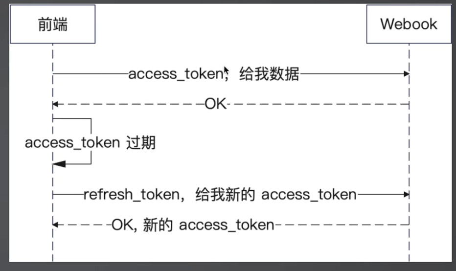
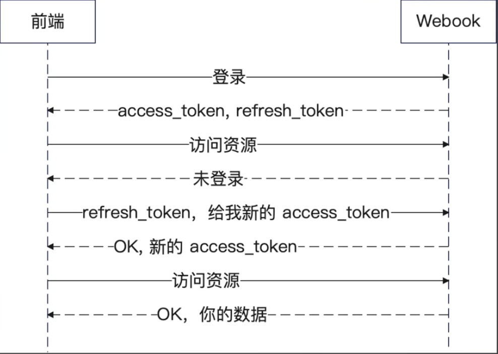

+++
title = '第六章 登录功能实现'
date = 2024-12-14T07:38:56+08:00
draft = true
categories = [ "Programming" ]
tags = [ "go" ]
+++

## 1 登录介绍

我们遇到的大多数网站的资源，都是要求你必须登录才能访问的。比如，商家发布的信息都必须登录之后才能访问。


它就像你回家时掏出钥匙开门进入或者密码锁解锁进门的过程：
- 掏出钥匙开锁
- 钥匙和锁是否匹配

所以登录功能本身其实也分成两件事：
- 实现登录功能：对应你钥匙开锁
- 登录态校验：对应你钥匙和锁是否匹配

## 2 接口实现

我们先来看登录功能，登录请求被发到`/users/login` 上。

```go
// web/user.go
func (u *UserHandler) RegisterRoutes(server *gin.Engine) {
	ug := server.Group("/users")
	{
		ug.POST("/signup", u.SignUp)
		ug.POST("/login", u.Login)
		ug.POST("/edit", u.Edit)
		ug.GET("/profile", u.Profile)
	}
}
```

在这里，你就能看出 service 和 repository 之间的分界线了。service 会调用 repository 查找邮箱所对应的用户。

而后 service 会匹配输入的密码和数据库中保存的是否一致。不管是用户没找到，还是密码错误，我们都返回同一个 error。

```go
// service/user.go
var (
	ErrUserDuplicateEmail    = repository.ErrUserDuplicateEmail
	ErrInvalidUserOrPassword = errors.New("邮箱或密码有误")
)

...


// 用户登录
func (svc *UserService) Login(ctx context.Context, email, password string) (domain.User, error) {
	// 1.先找用户
	u, err := svc.repo.FindByEmail(ctx, email)
	if err == repository.ErrUserNotFound {
		return domain.User{}, ErrInvalidUserOrPassword
	}
	if err != nil {
		return domain.User{}, err
	}

	// 2.再比较密码
	if err = bcrypt.CompareHashAndPassword([]byte(u.Password), []byte(password)); err != nil {
		// TODO 记录日志
		return domain.User{}, ErrInvalidUserOrPassword
	}
	return u, nil
}
```

## 2 登录校验

登录成功之后，我要去 /users/profile 的时候，我怎么知道用户登录没登录？之前的代码虽然登录成功，但是并没有维持登录态，进入到 profile 页面仍然不知道用户是否已经登录。

登录校验实际就是要做两件事：
- 登录后维持好登录态
- 校验时如何拿到登录态

现实中，我们开锁进入家门后可以在家里做任何想做的事情，然而网站并不像现实的家那样存在可见可摸墙壁并在墙壁上开上一扇门，在网站上我们可以就需要遵守心中的那扇隐形的墙壁，急就是在墙壁上开的那扇门就是登录，我们所做的任何事情都是基于成功打开那扇门之后才能去做。

网络上如何表示我们已经登录过了呢，就像现实你怎么才能表示你已经进入到了家里呢？这就需要我们在登录成功之后设置一个状态，然后操作其他页面时通过先检查这个状态来判断是否登录，如果没有登录就不能操作其他页面，如果登录过了，就可以像在家中一样可以做自己任何想做的事情了。

如果不做状态，就无法知道是否已经给您登录过了。

## 3 无状态的HTTP协议


什么叫做 HTTP 是无状态的？

是指，你连续发两次请求，HTTP 并不知道这两个都是你发的。也就是，它没办法将上一次请求和这一次请求关联起来。

所以我们需要有一种机制，记录一下这个状态。于是就有两个东西：Cookie 和 Session。

所以如果我们没有做一些记录，服务器是不知道用户登录，所以需要我们需要在登录之后记录下

## 4 Cookie

览器存储一些数据到本地，这些数据就是Cookie。简单理解，就是存储在你电脑上的键值对。也正因为 Cookie 是放在浏览器本地的，所以很不安全。


为什么说不安全呢？因为它可以被篡改。比如用户的登录态、基本信息都是可以放在cookie中，一旦篡改就存在风险，攻击者甚至都不需要篡改，只要拿到cookie的值就能伪装成用户。

### 4.1 组成


### 4.2 Cookie关键配置

在使用 Cookie 的时候，要注意“安全使用”。

- Domain: 也就是 Cookie 可以用在什么域名下，按照最小化原则来设定。
- Path：Cookie 可以用在什么路径下，同样按照最小化原则来设定。
- Max-Age 和 Expires：过期时间，只保留必要时间。
- Http-Only：设置为 true 的话，那么浏览器上的 JS 代码将无法使用这个 Cookie。永远设置为 true。
- Secure：只能用于 HTTPS 协议，生产环境永远设置为 true。
- SameSite：是否允许跨站发送 Cookie，尽量避免。

## 5 Session


因为 Cookie 本身不安全的特性，所以大部分时候，我们都只在 Cookie 里面放一些不太关键的数据。

关键数据我们希望放在后端服务器，这个存储的东西就叫做 Session。因此在登录里面，我们就可以通过 Session 来记录登录状态。

### 5.1 Session 用于登录

服务器会给浏览器一个 sess_id，也就是 Session 的ID。后续每一次请求都带上这个 Session ID，服务端就知道你是谁了。

每个人都将数据保存到Session中，那如何区分谁是谁的呢？它们是通过Session ID来进行区分的，Session ID 仍然保存在 Cookie 中，只是session中保存的数据存放在服务端。就像一个小区呢，小区中的每个家庭都是存在数据的Session，它们都有各自的钥匙。

### 5.2 Session 认 ID 不认人

后端服务器是认 ID 不认人的。也就是说，如果攻击者拿到了你的 ID，那么服务器就会把攻击者当成你。在下图
中，攻击者窃取到了 sess_id，就冒充是你了。


### 5.3 如何让客户端携带 sess_id


因为 sess_id 是标识你身份的东西，所以你需要在每一次访问系统的时候都带上。
- 最佳方式就是用 Cookie，也就是 sess_id 放到 Cookie里面。sess_id 自身没有任何敏感信息，所以放 Cookie也可以。
- 也可以考虑放 Header，比如说在 Header 里面带一个sess_id。这就需要前端的研发记得在 Header 里面带上。
- 还可以考虑放查询参数，也就是 ?sess_id = xxx。

理论上来说还可以放 body，但是基本没人这么干。在一些禁用了 Cookie 功能的浏览器上，只能考虑后两者。

## 6 使用Gin的Session插件实现登录功能

遇事不决找插件，基本上热门的功能 Gin 都是有插件的，这里我们使用 Gin 的 Session 插件来实现登录功能。

[gin-contrib/sessions](https://github.com/gin-contrib/sessions)

插件用起来分成两部分：
- 一个是在 middleware 里面接入，它会帮你从 Cookie 里面找到 sess_id，再根据 sess_id 找到对应的 Session。
- 另外一部分就是你拿到这个 Session 之后，就可以为所欲为了，例如这里用来校验是否登录。

### 6.1 Gin Session存储的实现

上面代码实现登录维持登录态实际上是基于 Cookie 来实现的。使用的是基于 Cookie 的实现来保存 Session 数据。但 Cookie 本身是不安全的，那么还可以考虑怎么办呢？

答案是 Gin 本身提供了很多的实现，包括:
- cookie：基于Cookie的实现（基本上仅作为学习使用，不会用于生产，因为不安全）
- gorm：基于 GORM 的实现
- memcached：基于 Memcached 的实现
- memstore：基于内存的实现
- mongo：基于 MongoDB 的实现
- postgres：基于 PostgreSQL 的实现
- redis：基于 Redis 的实现
- tester：用于测试的实现

注意不要搞错的一点，就是 sess_id 肯定是放在 cookie里面的，但是 Session 里面的数据，比如说我们代码里面的 user_id 才是 store 存储的。

也就是说，你可以根据自己的需要来选择。一般来说，单机单实例部署，你可以考虑 memstore 实现。
多实例部署，你应该选择 redis 实现。其它实现都比较少使用。平时无脑选 redis 的实现。


## 7 基于Cookie的Store存储实现

### 7.1 登录设置session

这是为了在下次登录后服务器能够判断用户是否登录过，所以需要设置一个状态用户判断。

1、接入Session，决定使用何种方式存储
```go
"github.com/gin-contrib/sessions"
"github.com/gin-contrib/sessions/cookie"

func initWebServer() *gin.Engine {
	server := gin.Default()

	...

	store := cookie.NewStore([]byte("secret"))
	server.Use(sessions.Sessions("mysession", store))

	return server
}
``` 

`store := cookie.NewStore([]byte("secret"))` : 设置存储于sesison中
`server.Use(sessions.Sessions("mysession", store))`: 设置 cookie的名以及对应的值，值为存储数据的地方，也就是store

2、登录后设置session
```go
func (u *UserHandler) Login(ctx *gin.Context) {
	type LoginReq struct {
		Email    string `json:"email"`
		Password string `json:"password"`
	}

	var req LoginReq
	if err := ctx.Bind(&req); err != nil {
		return
	}

	user, err := u.svc.Login(ctx, req.Email, req.Password)
	if err == service.ErrInvalidUserOrPassword {
		ctx.String(http.StatusOK, "用户名或密码错误")
		return
	}
	if err != nil {
		ctx.String(http.StatusOK, "系统错误")
		return
	}

	// 设置session
	sess := sessions.Default(ctx)
	// 设置放在 session 里面的值
	sess.Set("userId", user.Id)
	sess.Save()

	ctx.String(http.StatusOK, "登录成功")
}
```

登录成功之后设置session，设置哪些内容呢（就是要放在session里面哪些值）？这里简单设置一个 userId，设置完后一定要进行保存。

### 7.2 校验session

校验是为了判断之前是否登录过。

1、登录校验，就是登录后看下是有存在userId
```go
func initWebServer() *gin.Engine {
	server := gin.Default()

	...	

	// 1.接入Session
	store := cookie.NewStore([]byte("secret"))
	server.Use(sessions.Sessions("mysession", store))

	// 3.登录校验
	server.Use(func(ctx *gin.Context) {
		sess := sessions.Default(ctx)
		id := sess.Get("userId")
		if id == nil {
			ctx.AbortWithStatus(http.StatusUnauthorized)
			return
		}
	})

	return server
}
```

2、排除特殊校验接口，有些接口是不需要校验的，比如登录注册。
```go
func initWebServer() *gin.Engine {
	server := gin.Default()

	...	

	// 1.接入Session
	store := cookie.NewStore([]byte("secret"))
	server.Use(sessions.Sessions("mysession", store))

	// 3.登录校验
	server.Use(func(ctx *gin.Context) {、
		// 排除不需要校验的接口
		if ctx.Request.Url.path == "/user/login" || ctx.Request.Url.path == "/user/signup" {
			return
		}

		sess := sessions.Default(ctx)
		id := sess.Get("userId")
		if id == nil {
			ctx.AbortWithStatus(http.StatusUnauthorized)
			return
		}
	})

	return server
}

```

**优化**

对于不需要登录校验的接口写法可以使用Builder模式进行优化，可以有效避免接口过多的问题，方便扩展。


## 8 基于Memory的Store存储实现

单实例部署可以考虑这种实现方式，多实例则不建议，因为数据保留在实例所在机器的内存中，数据在多实例之间并不互通。

```go
func initWebServer() *gin.Engine {
	server := gin.Default()

	...

	// 基于 Memory 的 Session 实现
	store := memstore.NewStore([]byte("1fe25c@IMmjjK28WFEeC2jrkpE^p6MiP"), []byte("VG@HrixB%pEKBc1bZQUOhXjC5GEvXmG#"))
	server.Use(sessions.Sessions("mysession", store))

	server.Use(middleware.NewLoginMiddlewareBuilder().
		IgnorePaths("/users/login").
		IgnorePaths("/users/signup").
		Build())

	return server
}
```

## 9 多实例部署Session问题

在分布式环境下（包括单例应用多实例部署）都需要确保， Session 在每一个实例上都可以访问到。


假如在【实例1】上登录了，在【实例1】上请求profile接口的时候肯定能拿到数据，因为它能判定已经登录了。但如果请求落在了【实例2】上，【实例2】就会让你进行登录，但实际上你已经在【实例1】的机器上登录过了。这就是多实例，即同一份应用在多个机器上部署。所以使用基于内存的实现是没用的，一旦你的请求转发到其他机器上就会出现问题。

Web 开发有个重要的点就是 HTTP 协议本身是无状态的，如果部署了多个实例，你的请求可能在实例1，也可能在实例2，也可能在实例3，这就是分布式环境的特点，包括在发起微服务调用也是一样，你不确定请求会落在哪台机器上的，除非你使用了一些负载均衡策略，否是你无法判断。

所以在多实例部署的情况下，基于内存实现的session存储是不行的，需要更换解决方案，即不管在哪台机器上登录，其他机器也能识别出已经登录了。

### 9.1 基于Redis存储的Session实现

```go
...
"github.com/gin-contrib/sessions/redis"
...

func initWebServer() *gin.Engine {
	server := gin.Default()

	...
	// 基于 Redis 的 Session 实现
	/**
	1. 第一个参数是最大空闲连接数量，是指连接已建立，但一段时间内没有人用，为什么需要有空闲连接？是为了将来需要使用，预留的准备，就不需要在使用时现场创建，这种方式提高了效率
	   空闲连接过大会造成浪费，过小会导致性能问题
	2. 第二个参数是 tcp
	3. 第三、四、五个参数是连接信息
	4. 第六、七个参数是两个key，用于身份认证和数据加密
	*/
	store, err := redis.NewStore(16, "tcp", "localhost:6379", "", "",
		[]byte("1fe25c@IMmjjK28WFEeC2jrkpE^p6MiP"), []byte("VG@HrixB%pEKBc1bZQUOhXjC5GEvXmG#"))
	if err != nil {
		panic(err)
	}
	server.Use(sessions.Sessions("mysession", store))

	server.Use(middleware.NewLoginMiddlewareBuilder().
		IgnorePaths("/users/login").
		IgnorePaths("/users/signup").
		Build())

	return server
}

```

注意我在图里标注的各个字段的含义。这里你应该注意到，在 cookie、memstore 和 redis三个实现中，都需要传入这两个 key。

- Authentication：是指身份认证。
- Encryption：是指数据加密。

这两者再加上授权（权限控制），就是信息安全的三个核心概念。

## 10 刷新Session过期时间

Gin 的 Session 有很多参数，你可以通过 Options 方法来传入 Option。

```go
func (u *UserHandler) Login(ctx *gin.Context) {
	...

	sess := sessions.Default(ctx)
	// 设置放在 session 里面的值
	sess.Set("userId", user.Id)
	sess.Options(sessions.Options{
		// 生产环境建议设置上这两个值
		//Secure: true,
		//HttpOnly: true,
		MaxAge: 30 * 60, // 30min过期，为了维持登录态，需要定时刷新
	})
	sess.Save()

	ctx.String(http.StatusOK, "登录成功")
}
```

实际上Option 控制的是 Cookie。

除了 MaxAge 有多层含义，其它参数就
是你在 Cookie 中学到的那个含义。
或者你可以理解为，Gin 的 Session 用这些选项来初始
化 Cookie。
MaxAge 则不同，它一方面用来控制 Cookie，而有一
些实现，也用它来控制 Session 中的 key、value 的过
期时间。
比如 Redis，它会用这个来控制你的数据的过期时间。


### 10.1 刷新登录状态

这里有一个登录状态很经常遇到的问题，就是我们这 Session id 所在的 Cookie，过期时间是固定的。

举个例子：假如你设置为10分钟，用户登录后在9:59秒时还能访问网站，结果过了两秒，他就被要求重新登录，也就是你需要在用户持续使用网站的时候，刷新过期时间。


### 10.2 如何刷新

**方案一**

用户每次访问时进行刷新。这虽然简单，但缺点很明显，会造成性能问题，如果是Redis存储Session，就会影响的Redis的性能，尽管Redis能支持百万QPS，但想想如果是阿里那种体量，几十个Redis也不行。

**方案二**

即将快要过期的时候海信，比如10分钟过期，当用户第9分钟访问的时候进行刷新。

这种方案也存在问题，万一用户第9分钟没有访问呢？

**方案三 —— 固定间隔时间刷新**

固定时间间隔刷新，比如每分钟内第一次访问时刷新。这种方案可以。

前端定时刷新请求，比如30分钟的有效期，那么前端每隔1分钟请求刷新一次。

在用户访问的时候刷新下过期时间，只要是访问，每次访问刷新下时间。

**方案四 —— 长短token**

该方案也可以，这种方案比较高级。有两个token，当短token过期时看下长token，如果长token还在，就刷刷新下重新生成个短token，这就相当于刷新了过期时间。长token过期就重新的登录，一般长token会设置几个星期或一个月。


### 10.3 在哪里刷新

一个简单的道理，就是你肯定不想在所有的 HTTP 接口里面都手动刷新过期时间。而刷新过期时间显然也是一个大部分业务都要完成的，因此最适合的地方肯定是在middleware里面。
于是你想到，我们有一个登录校验的 middleware，显然可以在登录校验之后顺手刷新一下。

```go
func (l *LoginMiddlewareBuilder) Build() gin.HandlerFunc {
	// 用go的方式编码解码为二进制
	// 这里的作用是提前解析time里面有哪些字段元数据，它要准备好这些元数据，之后在编解码时就能知道有哪些元数据，就会很快
	gob.Register(time.Now())

	return func(ctx *gin.Context) {
		...

		// 刷新登录态，如果每分钟刷新，我如何知道1分钟已经过去了
		// 可以考虑记录下上一次刷新的时间
		// 需要放在后面的原因是要先登录才能刷新
		{
			// 比如要1分钟刷新一次，我怎么知道1分钟已经过去了?
			// 刷新的时候设置个时间进去，下一次刷新的时候获取上一次刷新的时间，
			// 注意，不需要第一次登录成功后也需要设置，因为这么做侵入了业务，这里就只需要改这里一处，另外刷新操作不应该是登录范围内的，而应该是session 管理范围内的，所以放在登录成功后设置时间不是很合适

			// 1、先从session中拿到上一次的刷新（更新）的时间：
			updateTime := sess.Get("update_time")
			// 重新设置userId和Option，与 LoginWithSession 中设置保持一致
			sess.Set("userId", id)
			sess.Options(sessions.Options{
				MaxAge: 30, // prod: 30 * 60, dev: 30 30s过期
			})

			//now := time.Now().UnixMilli()
			now := time.Now()
			// 2、紧接着看下 updateTime 为 nil 表示还没有刷新过，因为第一次登录时还没有设置 update_time
			if updateTime == nil {
				sess.Set("update_time", now)
				sess.Save()
				return
			}

			// update_time 存在
			//updateTimeVal, ok := updateTime.(int64)
			//if !ok {
			//	ctx.AbortWithStatus(http.StatusInternalServerError)
			//	return
			//}
			updateTimeVal, _ := updateTime.(time.Time)
			// 不是 int64说明有人在搞事情，但这个判断多余，可以不做判断

			//if now-updateTimeVal > 60*1000 {
			//if now.Sub(updateTimeVal) > time.Minute {
			if now.Sub(updateTimeVal) > time.Second*10 { // 为了演示效果，可以调小些 cookie 30秒过期，session 每10秒刷新
				sess.Set("update_time", now)
				sess.Save()
			}
		}
	}
}

```

### 10.4 长短Token

- 短token：用于访问资源，一般也叫 access_token。
- 长token：在短token过期后生成一个新的短token，一般也叫refresh_token。



为什么叫长短token，是因为access_token的过期时间很短，如十几、几十分钟、几个小时不等，refresh_token过期时间则较长，按周、月算。

### 设计与实现

- 在用户登录成功的时候，后端颁发两个token：
	- 一个就是常见的普通的 JWT Token充当access_token。
	- 另一个token就是refresh_token。
- 前端发现access_token过期之后，发送一个刷新token的请求的到新的access_token
- 前端使用新的access_token请求资源


