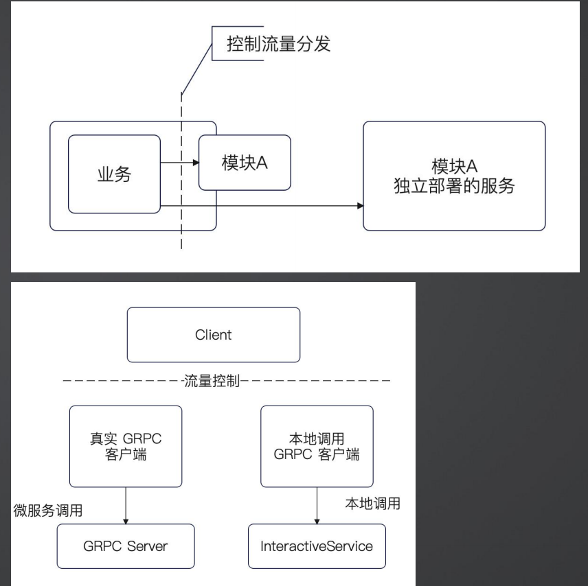

+++
title = '本地调用与gRPC调用并行方案.md'
date = 2026-01-15T07:30:27+08:00
draft = true
categories = [ "gRPC" ]
tags = [ "gRPC", "go", "programming" ]
+++

在微服务的项目改造过程中，为保证梳理从本地调用迁移至gRPc调用，还要保证可以回滚，请求可以是本地调用，也可以是gRPC调用，即本地调用与gRPC调用并行。

由于微服务本身很复杂，很容易出错，出错就需要能够回滚，实际上回滚到上一个版本可能来不及，从回滚开始到回滚完成都需要好几分钟。一种解决方案是通过一些标记位来控制流量从而实现控制回滚。

比如默认情况下是进程间调用，通过控制流量分发来让业务有一小部分流量都到独立部署的模块A。即默认是本地服务调用，然后有一小部分是调用grpc服务。

有点类似灰度，但它不是控制部署实例来控制的灰度，而是通过手动控制流量体例来做的灰度，一般比如通过网关、标记位、链路标记位等来控制。

但这个过程我们可以进一步控制流量。

为了达成这个目的，综合使用适配器和装饰器模式：
• 适配服务，构成一个本质上是本地调用的 gRPC 客户端。
• 将真实的 gRPC 和本地调用的 gRPC 客户端装饰在一起，并且接入流量控制机制。

通过适配器或装饰器来综合使用它，明面上看它是个grpc Client，但是这个Client是个装饰器，它装饰了一个真实的gRPC客户端，还有一个本地调用的gRPC客户端，这一个不是真实的gRPC服务，而是一个本地的进程调用，只是伪装成了gRPC调用，它们使用统一的出口进行封装。

## 伪装成gRPC客户端的适配器

