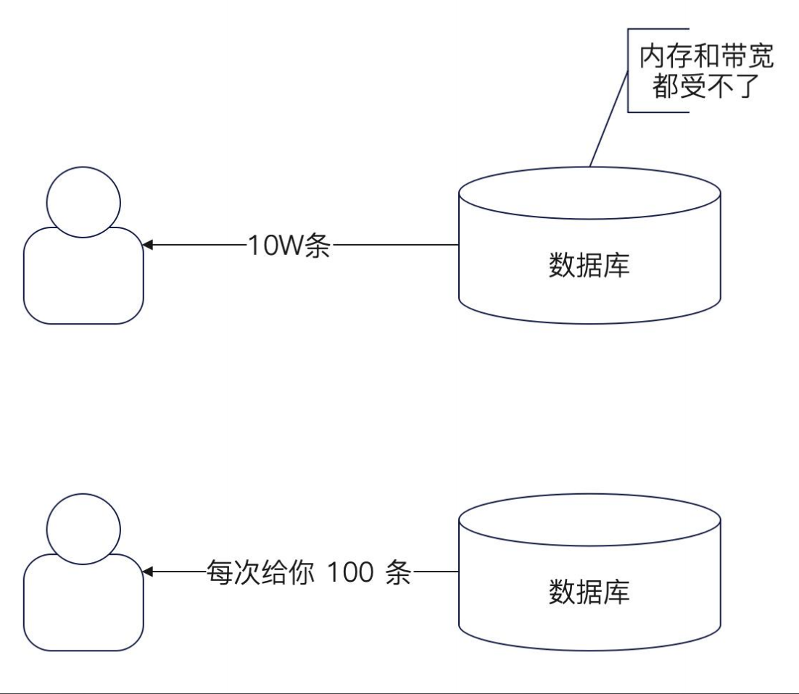
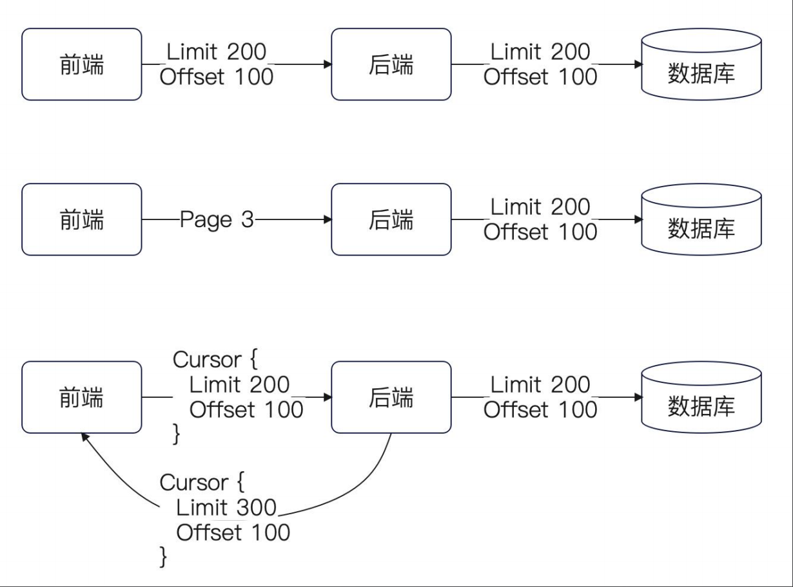
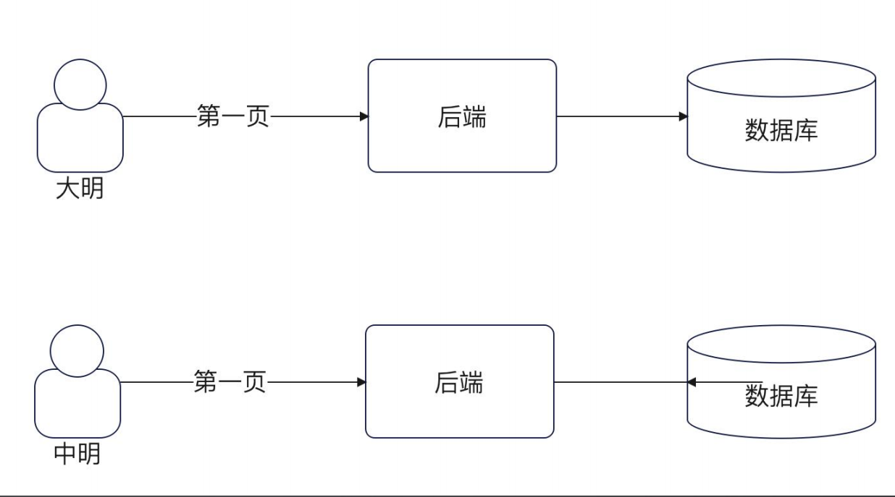
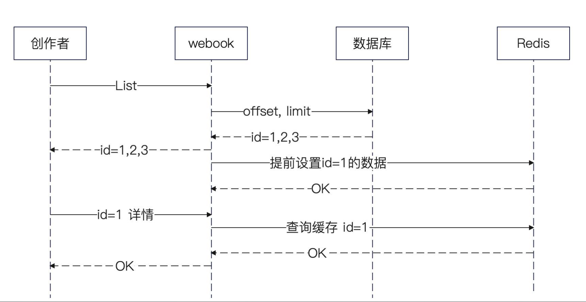

+++
title = '查询与缓存'
date = 2025-09-14T11:54:29+08:00
draft = true
categories = [ "Programming" ]
tags = [ "go", "programming"]
+++

# 查询接口

就发帖为例：

**作者的查询接口**

- 列表接口：在自己的创作中心能够看到的自己发表的所有文章，这是一个分页接口。
- 详情接口：当作者在选中了某篇文章的时候，能看到文章的全部内容。

**读者的查询接口**

- 搜索接口
- 推荐接口：当读者打开首页的时候，系统可以针对用户的喜好来推荐一些文章。
- 阅读文章接口：当选中某篇文章的时候，可以看到文章的全部内容。


## 创作者的列表接口

创作者的雷彪接口需要设计为分页接口。

**分页**：每次查询一部分数据。一般的分页都包含两个参数：
- 偏移量：Offset
- 数据量：Limit

比如，Offset = 20 Limit = 10 就是指从第21条开始，往后的10条数据。第21条数据的下标就是20。

**MySQL**分页写法：
```sql
select * from articles limit 20, 10;
select * from articles limit 10 offset 20 ;
```
上面两条SQL是等价的，上面是MySQL语法，下面是标准语法，MySQL也支持。

**为什么需要分页？**
使用分页的核心目标是：避免一次操作太多数据，引发性能问题；并且列表在展示的时候，也不需要展示整个内容。
比如你的SQL命中10W条数据，这10W条数据一次性加载出来，数据库将所有结果返回给你将非常可怕，首先它需要将数据从磁盘读出来，然后通过网络传输给你，然后你要装好10W条结果，内存也会消耗巨大。10W条记录的数据不管是对应用还是机器都是压力非常大的。

面对这种情况，我们会想我们一次也看不了那么多数据，我们干嘛要查询出10W条，于是就像数据库每次给我100条记录就行了，100条记录用户看完了，看下一页的时候在继续给我下一个100条记录就行了。

提示：只要我们不确定命中多少条记录时都要考虑分页，除非你确定只返回一条记录。



## 分页的形态



分页接口一般有三种定义形式：

• 直接定义 Offset 和 Limit 两个字段：例如 Offset = 200, Limit = 100，这是前端计算的。
• 直接定义一个 Page 字段：当 Page = 3，并且约定每页是100 条的时候，就意味着 Offset = 200，Limit = 100，这是后端计算的。
• 直接定义一个 Cursor 字段：Cursor 本质上也是包含了 Offset 和 Limit 的，所不同的是，前端不直接计算，而是让后端返回。

第三种灵活性最强，一般用在比较复杂的系统中。大多数时候，我是建议使用第一种的。

# 缓存设计

大部分情况下，没什么人会缓存分页的结果，因为数据的筛选条件、排序条件、分页的偏移量和数据量中的任何一个发生了变化，缓存就很难使用了。
但是有一些缓存方案是可以考虑使用的。也就是`只缓存第一页`，这个方案简单而且效果非常好。在大多数的使用场景中，用户都是只看列表页的第一页，很少会往后翻页。所以，缓存住第一页之后就可以了。



## 缓存第一页

缓存第一页写起来也很简单。核心逻辑就是传统的先查缓存，再查数据库。

注意：在判定要不要走缓存的时候，我用了一个很严格的做法，也就是只有在偏移量是 0 并且每一页大小是 100 的时候才会使用缓存。这个地方是可以优化的，比如说当 Limit <= 100 都可以。

# 缓存方案

从实践上来说，针对创作者设计的缓存性价比其实都很低，因为只有这个创作者用得上。不过这个场景适合用来演示一种新奇的缓存方案：业务相关的缓存预加载。

简单来说，就是认为在拿到列表之后，创作者有更大的概率会访问第一条数据。这种方案在高并发场景下会非常有用。

## 业务相关的缓存预加载

如下图，在返回列表查询的数据之后，就可以提前把部分数据放进缓存里面。
而且，因为这是一个预测性质的，所以过期时间设置得很短，这样可以有效规避预测失败带来的内存开销。



## 业务相关的缓存预加载实现

实现很简单。
- 在实践中，比较好的做法是让调用者来决定是否异步，而不是自己偷偷摸摸地异步。
- 过期时间设置得很短。
这样就相当于给了调用者选择权。
可读性和可维护性都要更强。

## 改进：不缓存大文档
这里还可以考虑在 Redis 内存消耗和缓存性能之间做一个权衡。
也就是，并不是所有的都值得缓存。有一些很长的文章就犯不着缓存了，浪费内存效果也很有限。

你在后续设计和缓存有关的机制时都要考虑这种问题。如果为了节省缓存的内存消耗，那么可以不缓存大对象。
注意！！！不是说所有情况下都不要缓存大对象，而是说，你要权衡性能和内存开销。